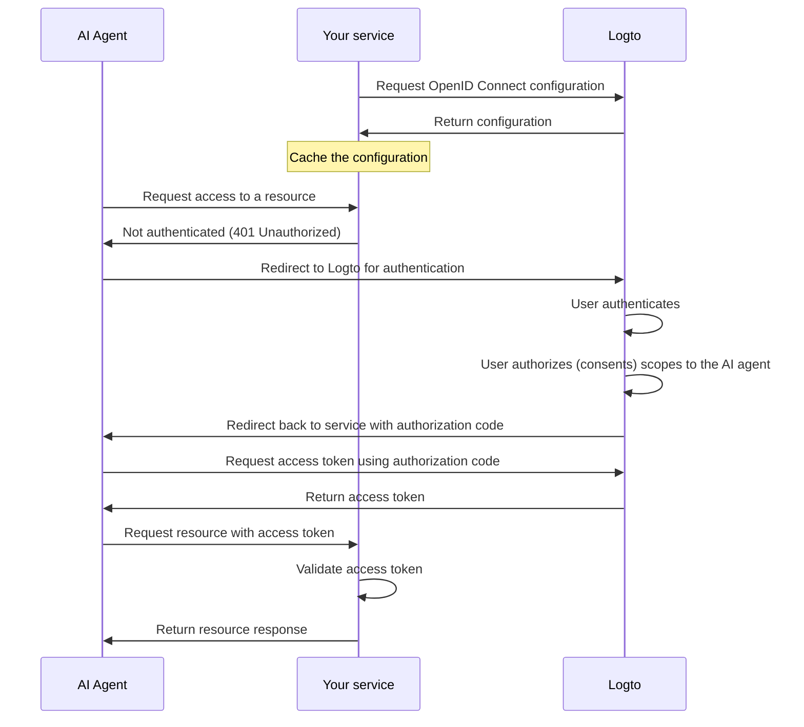

import ConfigureThirdPartyAiAgent from './fragments/_configure-third-party-ai-agent.mdx';

# Enable third-party AI agent access to your app

This guide walks you through integrating Logto with your service and enabling AI agents to access it.

You'll learn how to:

- Configure Logto as the authorization server for your service.
- Obtain an access token for the AI agent to access your service.
- Test the flow with an AI agent.

## Difference between third-party AI agent and your own AI agent (or app) \{#difference-between-third-party-ai-agent-and-your-own-ai-agent-or-app}

Let's take a look at an example. Imagine you’re a developer running a service that provides weather data.

**Official weather app (Your own AI agent / app)**

- You provide an official weather app for users to check the weather.
- How it works: The official weather app connects to your service using Logto to authenticate users. When Alice signs in, she automatically gets access to the weather data, no extra permission screens needed, since it’s your trusted app.

**Third-party AI agent**

- You’re building an ecosystem around your service, so another developer creates "WeatherBot" (an AI assistant that can provide weather updates and forecasts) integrating it as a third-party AI agent.
- How it works: WeatherBot (third-party AI agent) wants to access user weather data via your service. When Alice signs in to WeatherBot using her account:
  - She’s shown a consent screen, asking permission for WeatherBot to access her weather data.
  - Alice can allow or deny this access.
  - Only the data she consents to is shared with WeatherBot, and WeatherBot cannot access any additional data without explicit re-consent.

This access (permission) control ensures user data safety, even though your service manages all the data, third-party AI agents like WeatherBot can only access what the user has explicitly allowed. They cannot bypass this process, as it's enforced by your access control implementation in the service.

**Summary**

| Client type          | Example              | Consent required? | Who controls it?    |
| -------------------- | -------------------- | ----------------- | ------------------- |
| Official weather app | Your own weather app | No                | You (the developer) |
| Third-party AI agent | WeatherBot assistant | Yes               | Another developer   |

:::note
If you want to integrate your service with your own AI agent or app, please refer to our [quick start guides](/quick-starts) for more information.
:::

## Prerequisites \{#prerequisites}

- A [Logto Cloud](https://cloud.logto.io) (or self-hosted) tenant
- A service that exposes API endpoints to be accessed by the AI agent

### Understanding the flow \{#understanding-the-flow}

- **Service**: The service you want to expose to the AI agent.
- **AI agent**: The AI agent that will access your service.
- **Logto**: Serves as the OpenID Connect provider (authorization server) and manages user identities.

A non-normative sequence diagram illustrates the overall flow of the process:

## Set up third-party AI agent \{#set-up-third-party-ai-agent}

To set up a third-party AI agent to access your service, you need to follow these steps:

1. **Register the AI agent in Logto**: Create an application in Logto to represent the AI agent.
2. **Configure the AI agent**: Ensure the AI agent can make requests to your service and handle the 401 Unauthorized response.
3. **Implement the authorization flow**: The AI agent should be able to handle the OAuth 2.0 authorization flow to obtain an access token from Logto.
4. **Test the integration**: Use the AI agent to access your service and verify that it can successfully authenticate and authorize requests.

<ConfigureThirdPartyAiAgent />

## Set up authorization in your service \{#set-up-authorization-in-your-service}

To enable access control in your service, you need to implement the following:

1. **Define API resources in Logto**: Create API resources in Logto that represent the endpoints your AI agent will access.
2. **Implement access control logic**: In your service, implement logic to validate the access token received from the AI agent and check if the user has the necessary permissions to access the requested resource.
3. **Respond to the AI agent**: If the access token is valid and the user has permission, return the requested resource. If not, return a 401 Unauthorized response.

To learn more about how to implement access control in your service, refer to our [Authorization guide](/authorization).

## Test the integration \{#test-the-integration}

1. Start your service.
2. Start the AI agent.
3. In the AI agent, invoke the API endpoint to access your service.
4. The AI agent should handle the 401 Unauthorized response and redirect the user to Logto for authentication.
5. After successful authentication, the AI agent should receive an access token and use it to make requests to your service.
6. The AI agent should be able to retrieve the resource from your service using the access token.
