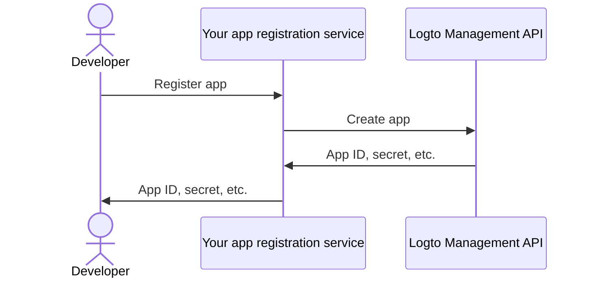

import QuickStartsReference from '../../../quick-starts/third-party/oidc/_quick-starts-reference.md';

## Configure third-party AI agent in Logto \{#configure-third-party-ai-agent-in-logto}

To enable the third-party AI agent to access your {props.serviceName ?? 'your service'}, you need to set up a **third-party app** in Logto. This app will be used to represent the AI agent and obtain the necessary credentials for authentication and authorization.

### Allow developers to create third-party apps in Logto \{#allow-developers-to-create-third-party-apps-in-logto}

If you are building a marketplace or want to allow developers to create third-party apps in Logto, you can leverage [Logto Management API](/integrate-logto/interact-with-management-api) to create third-party apps programmatically. This allows developers to register their applications and obtain the necessary credentials for authentication.

You'll need to host your own service to handle the client registration process. This service will interact with the Logto Management API to create third-party apps on behalf of developers.

Alternatively, you can manually create third-party apps in Logto Console to get familiar with the process.

### Manually create a third-party app in Logto \{#manually-create-a-third-party-app-in-logto}

You can manually create a third-party app in Logto Console for testing purposes or ad-hoc integrations. This is useful when you want to quickly test the integration without implementing a full client-registration flow.

1. Sign in to your Logto Console.
2. Go <CloudLink to="/applications">**Applications**</CloudLink> → **Create application** → **Third-party app** -> **OIDC**.
3. Fill in the app name and other required fields, then click **Create application**.
4. Click **Permissions** tab, in the **User** section, click "Add".
5. In the opened dialog -> **User data** -> select **`profile`**, **`email`** permissions, then click **Save**.
6. In the third-party app, configure scopes to request `openid profile email` permissions (scopes).

   **Note**: `openid` is required for OIDC, and `profile` and `email` are the permissions you added in the previous step.

7. Configure the **redirect URI** of your third-party application accordingly. Remember to update the redirect URI in Logto as well.

---

<QuickStartsReference />
