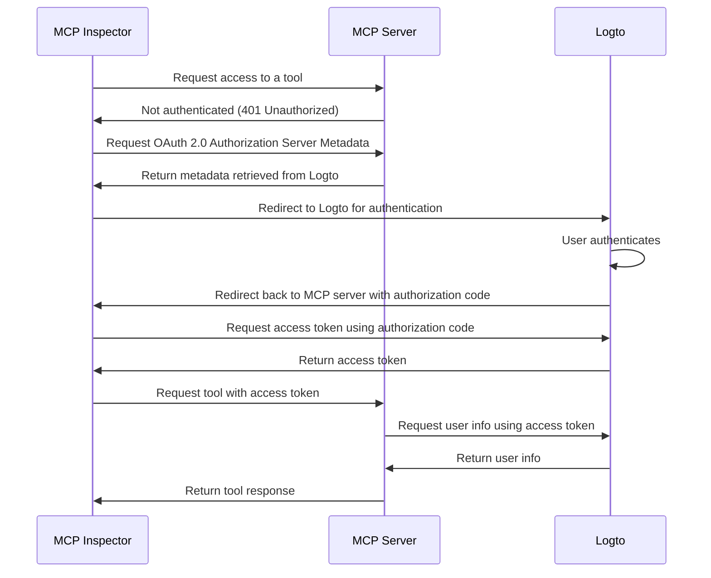

## Prerequisites

- A [Logto Cloud](https://cloud.logto.io) (or self-hosted) tenant
- Node.js or Python environment

### Understanding the architecture

- **MCP server**: The server that exposes tools and resources to MCP clients.
- **MCP Inspector**: A MCP client used to initiate the authentication flow and test the integration.
- **Logto**: Serves as the OpenID Connect provider (authorization server) and manages user identities.

A non-normative sequence diagram illustrates the overall flow of the process:

:::note
Due to MCP is quickly evolving, the above diagram may not be fully up to date. Please refer to the [mcp-auth](https://mcp-auth.dev) documentation for the latest information.
:::
