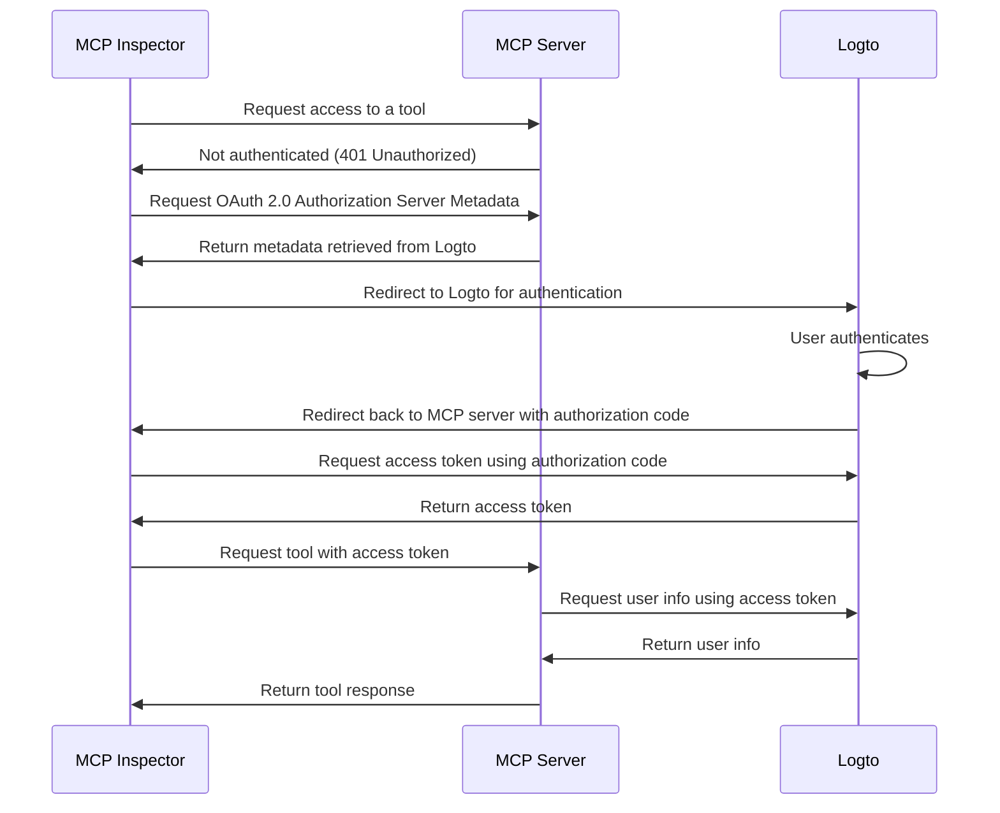

import TabItem from '@theme/TabItem';
import Tabs from '@theme/Tabs';

# Enable auth for your MCP-powered apps with Logto

This guide walks you through integrating Logto with your MCP server using [mcp-auth](https://mcp-auth.dev), allowing you to authenticate users and securely retrieve their identity information using the standard OpenID Connect flow.

You'll learn how to:

- Configure Logto as the authorization server for your MCP server.
- Set up a “whoami” tool to return the current user's identity claims.
- Test the flow with the MCP Inspector.

After this tutorial, your MCP server will:

- Authenticate users in your Logto tenant.
- Return identity claims (`sub`, `username`, `name`, `email`, etc.) for the "whoami" tool invocation.

Once the integration is complete, you can replace the MCP Inspector with your own MCP client, such as a web app, to access the tools and resources exposed by your MCP server.

## Prerequisites

- A [Logto Cloud](https://cloud.logto.io) (or self-hosted) tenant
- Node.js or Python environment

## Understanding the architecture

- **MCP server**: The server that exposes tools and resources to MCP clients.
- **MCP Inspector**: A MCP client used to initiate the authentication flow and test the integration.
- **Logto**: Serves as the OpenID Connect provider (authorization server) and manages user identities.

A non-normative sequence diagram illustrates the overall flow of the process:



:::note
Due to MCP is quickly evolving, the above diagram may not be fully up to date. Please refer to the [mcp-auth](https://mcp-auth.dev) documentation for the latest information.
:::

## Set up app in Logto

1. Sign in to your Logto Console.
2. Go <CloudLink to="/applications">**Applications**</CloudLink> → **Create application** → **Create app without framework**.
3. Choose type: Single-page app.
4. Fill in the app name and other required fields, then click **Create application**.
5. Save and copy the **App ID** and **Issuer endpoint**.

## Set up the MCP server

### Create project and install dependencies

<Tabs groupId="sdk">
<TabItem value="python" label="Python">

```bash
mkdir mcp-server
cd mcp-server
uv init # Or use your own project structure
uv add "mcp[cli]" starlette uvicorn mcpauth # Or use any preferred package manager
```

</TabItem>
<TabItem value="node" label="Node.js">

```bash
mkdir mcp-server
cd mcp-server
npm init -y
npm install @modelcontextprotocol/sdk express mcp-auth # Or use any preferred package manager
```

</TabItem>
</Tabs>

### Configure MCP auth with Logto

Remember to replace `<your-logto-issuer-endpoint>` with the issuer endpoint you copied earlier.

<Tabs groupId="sdk">
<TabItem value="python" label="Python">

**In `whoami.py`:**

```python
from mcpauth import MCPAuth
from mcpauth.config import AuthServerType
from mcpauth.utils import fetch_server_config

auth_issuer = '<your-logto-issuer-endpoint>'
auth_server_config = fetch_server_config(auth_issuer, type=AuthServerType.OIDC)
mcp_auth = MCPAuth(server=auth_server_config)
```

</TabItem>
<TabItem value="node" label="Node.js">

**In `whoami.js`:**

```js
import { MCPAuth, fetchServerConfig } from 'mcp-auth';

const authIssuer = '<your-logto-issuer-endpoint>';
const mcpAuth = new MCPAuth({
  server: await fetchServerConfig(authIssuer, { type: 'oidc' }),
});
```

</TabItem>
</Tabs>

### Implement token verification

Since we're going to verify the access token and retrieve user info, we need to implement the access token verification as follows:

<Tabs groupId="sdk">
<TabItem value="python" label="Python">

```python
import requests
from mcpauth.types import AuthInfo

def verify_access_token(token: str) -> AuthInfo:
    endpoint = auth_server_config.metadata.userinfo_endpoint
    response = requests.get(
        endpoint,
        headers={"Authorization": f"Bearer {token}"},
    )
    response.raise_for_status()
    data = response.json()
    return AuthInfo(
        token=token,
        subject=data.get("sub"),
        issuer=auth_server_config.metadata.issuer,
        claims=data,
    )
```

</TabItem>
<TabItem value="node" label="Node.js">

```js
const verifyToken = async (token) => {
  const { userinfoEndpoint, issuer } = mcpAuth.config.server.metadata;
  const response = await fetch(userinfoEndpoint, {
    headers: { Authorization: `Bearer ${token}` },
  });
  if (!response.ok) throw new Error('Token verification failed');
  const userInfo = await response.json();
  return {
    token,
    issuer,
    subject: userInfo.sub,
    claims: userInfo,
  };
};
```

</TabItem>
</Tabs>

### Implement the "whoami" tool

Now, let's implement the "whoami" tool that returns the current user's identity claims requesting the userinfo endpoint with the access token sent by the client.

:::note
We are using the SSE transport for the example due to the lack of official support for the Streamable HTTP transport in the current version of the SDK. Theoretically, you can use any HTTP-compatible transport.
:::

<Tabs groupId="sdk">
<TabItem value="python" label="Python">

```python
from mcp.server.fastmcp import FastMCP
from starlette.applications import Starlette
from starlette.routing import Mount
from starlette.middleware import Middleware

mcp = FastMCP("WhoAmI")

@mcp.tool()
def whoami() -> dict:
    """
    Returns the current user's identity information.
    """
    return (
        mcp_auth.auth_info.claims
        if mcp_auth.auth_info
        else {"error": "Not authenticated"}
    )

bearer_auth = Middleware(mcp_auth.bearer_auth_middleware(verify_access_token))
app = Starlette(
    routes=[
        mcp_auth.metadata_route(),  # Serves OIDC metadata for discovery
        Mount('/', app=mcp.sse_app(), middleware=[bearer_auth]),
    ],
)
```

Run the server with:

```bash
uvicorn whoami:app --host 0.0.0.0 --port 3001
```

</TabItem>
<TabItem value="node" label="Node.js">

```js
import { McpServer } from '@modelcontextprotocol/sdk/server/mcp.js';
import express from 'express';

// Create MCP server and register the whoami tool
const server = new McpServer({ name: 'WhoAmI', version: '0.0.0' });
server.tool('whoami', ({ authInfo }) => ({
  content: [
    { type: 'text', text: JSON.stringify(authInfo?.claims ?? { error: 'Not authenticated' }) },
  ],
}));

// Express app & MCP Auth middleware
const app = express();
app.use(mcpAuth.delegatedRouter());
app.use(mcpAuth.bearerAuth(verifyToken));

// SSE transport (as in SDK docs)
const transports = {};
app.get('/sse', async (_req, res) => {
  const transport = new SSEServerTransport('/messages', res);
  transports[transport.sessionId] = transport;
  res.on('close', () => delete transports[transport.sessionId]);
  await server.connect(transport);
});
app.post('/messages', async (req, res) => {
  const sessionId = String(req.query.sessionId);
  const transport = transports[sessionId];
  if (transport) await transport.handlePostMessage(req, res, req.body);
  else res.status(400).send('No transport found for sessionId');
});

app.listen(3001);
```

</TabItem>
</Tabs>

## Test the integration

1. Start the MCP server (`uvicorn whoami:app ...` or `node whoami.js`).
2. Start the MCP Inspector.

    Due to the limit of the current MCP Inspector implementation, we need to use the forked version from mcp-auth:

    ```bash
    git clone https://github.com/mcp-auth/inspector.git
    cd inspector
    npm install
    npm run dev
    ```

    Then, open the URL shown in the terminal.

3. In the MCP Inspector:

    - **Transport Type**: `SSE`
    - **URL**: `http://localhost:3001/sse`
    - **OAuth Client ID**: Paste your Logto App ID
    - **Auth Params**: `{"scope": "openid profile email"}`
    - **Redirect URI**: This URL should be auto-populated. Copy it.

4. Find the application you created earlier in the Logto Console, open the details page, and paste the redirect URI into the **Settings** / **Redirect URIs** section. Save the changes.
5. Back in the MCP Inspector, click **Connect**. This should redirect you to the Logto sign-in experience.
6. After signing in, you should be redirected back to the MCP Inspector. Go to **Tools** -> **List Tools** -> **whoami** -> **Run Tool**.

    You should see user claims, such as:

    ```json
    {
      "sub": "user_XXXX",
      "username": "alice",
      "name": "Alice Smith",
      "email": "alice@example.com"
    }
    ```
