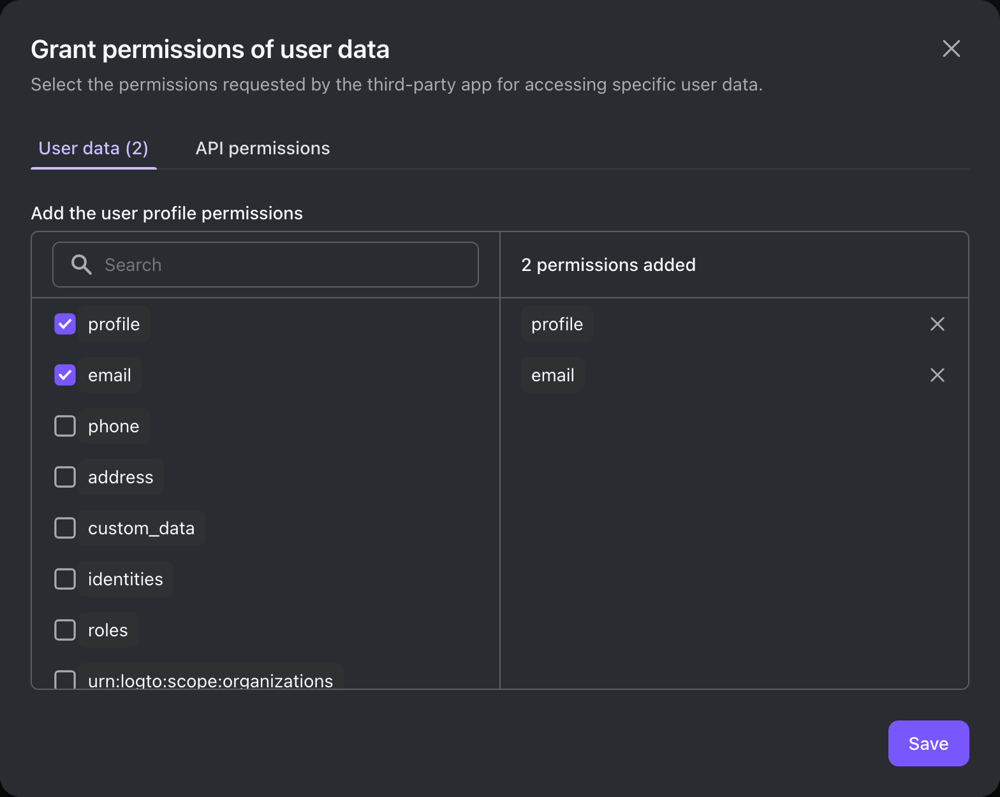

import Introduction from './fragments/_mcp-introduction.mdx';
import Prerequisites from './fragments/_mcp-prerequisites.mdx';
import SampleCode from './fragments/_mcp-sample-code.mdx';
import SetUpServer from './fragments/_mcp-set-up-server.mdx';
import TestIntegration from './fragments/_mcp-test-integration.mdx';

# Enable AI agent and third-party app access to your MCP server

:::note
The main difference between this guide and the previous one is that this guide will treat the MCP Inspector as a third-party app in Logto. If you want to integrate your MCP server with your own app, please refer to the [Enable auth for your MCP-powered apps with Logto](./mcp-server-add-auth) guide.
:::

<Introduction isThirdPartyApp />

<Prerequisites />

## Set up app in Logto

1. Sign in to your Logto Console.
2. Go <CloudLink to="/applications">**Applications**</CloudLink> → **Create application** → **Third-party app** -> **OIDC**.
3. Fill in the app name and other required fields, then click **Create application**.
4. Click **Permissions** tab, in the **User** section, click "Add".
5. In the opened dialog -> **User data** -> select **`profile`**, **`email`** permissions, then click **Save**.
6. Go to **Settings** tab, save and copy the **App ID** and **Issuer endpoint**.

<SetUpServer />

<TestIntegration isThirdPartyApp />

<SampleCode />
