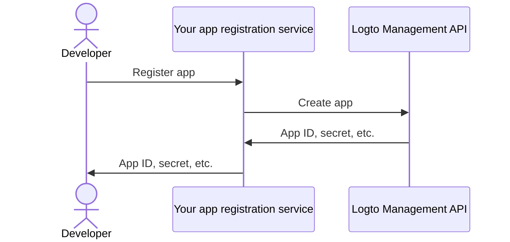

import QuickStartsReference from '../../quick-starts/third-party/oidc/_quick-starts-reference.md';

import thirdPartyAppPermissions from './assets/third-party-app-permissions.png';
import Prerequisites from './fragments/_mcp-prerequisites.mdx';
import SampleCode from './fragments/_mcp-sample-code.mdx';
import SetUpServer from './fragments/_mcp-set-up-server.mdx';

# Enable third-party AI agent access to your MCP server

This guide walks you through integrating Logto with your MCP server using [mcp-auth](https://mcp-auth.dev), allowing you to authenticate users and securely retrieve their identity information using the standard OpenID Connect flow.

You'll learn how to:

- Configure Logto as the authorization server for your MCP server.
- Set up a “whoami” tool in your MCP server to return the current user's identity claims.
- Test the flow with a third-party AI agent (MCP client).

After this tutorial, your MCP server will:

- Authenticate users in your Logto tenant.
- Return identity claims (`sub`, `username`, `name`, `email`, etc.) for the "whoami" tool invocation.

## Difference between third-party AI agent (MCP client) and your own MCP client

Let's take a look at an example. Imagine you’re a developer running an MCP server to manage email access and automation.

**Official email app (Your own MCP client)**

- You provide an official email app for users to read and manage their emails.
- How it works: The official email app connects to your MCP server using Logto to authenticate users. When Alice signs in, she automatically gets access to her emails, no extra permission screens needed, since it’s your trusted app.

**Third-party AI agent (Third-party MCP client)**

- You’re building an ecosystem around your MCP server, so another developer creates “SmartMail AI” (an AI assistant that can summarize emails and schedule meetings automatically) integrating it as a third-party client.
- How it works: SmartMail AI (third-party MCP client) wants to access user emails via your MCP server. When Alice signs in to SmartMail AI using her account:
  - She’s shown a consent screen, asking permission for SmartMail AI to read her emails and calendar.
  - Alice can allow or deny this access.
  - Only the data she consents to is shared with SmartMail AI, and SmartMail AI cannot access any additional data without explicit re-consent.

This access (permission) control ensures user data safety, even though your MCP server manages all the data, third-party apps like SmartMail AI can only access what the user has explicitly allowed. They cannot bypass this process, as it's enforced by your access control implementation in the MCP server.

**Summary**

| Client type          | Example                    | Consent required? | Who controls it?    |
| -------------------- | -------------------------- | ----------------- | ------------------- |
| Official email app   | Your own email application | No                | You (the developer) |
| Third-party AI agent | SmartMail AI assistant     | Yes               | Another developer   |

:::note
If you want to integrate your MCP server with your own AI agent or app, please refer to the [Enable auth for your MCP-powered apps with Logto](./mcp-server-add-auth) guide.
:::

<Prerequisites isThirdParty />

## Set up third-party AI agent

To enable the third-party AI agent to access your MCP server, you need to set up the following:

1. The client should be able to make MCP requests to invoke the tools exposed by the MCP server.
2. The client should be able to handle the 401 Unauthorized response. See [Authorization Flow Steps](https://modelcontextprotocol.io/specification/2025-03-26/basic/authorization#2-5-authorization-flow-steps) for more details.
3. After successful authentication, the client should be able to make requests to the MCP server with the access token obtained from Logto.

## Set up AI agent in Logto

To enable the third-party AI agent to access your MCP server, you need to set up a **third-party app** in Logto. This app will be used to represent the AI agent and obtain the necessary credentials for authentication and authorization.

### Allow developers to create third-party apps in Logto

If you are building a marketplace or want to allow developers to create third-party apps in Logto, you can leverage [Logto Management API](/integrate-logto/interact-with-management-api) to create third-party apps programmatically. This allows developers to register their applications and obtain the necessary credentials for authentication.

You'll need to host your own service to handle the client registration process. This service will interact with the Logto Management API to create third-party apps on behalf of developers.

Alternatively, you can manually create third-party apps in Logto Console to get familiar with the process.

### Manually create a third-party app in Logto

You can manually create a third-party app in Logto Console for testing purposes or ad-hoc integrations. This is useful when you want to quickly test the integration without implementing a full client-registration flow.

1. Sign in to your Logto Console.
2. Go <CloudLink to="/applications">**Applications**</CloudLink> → **Create application** → **Third-party app** -> **OIDC**.
3. Fill in the app name and other required fields, then click **Create application**.
4. Click **Permissions** tab, in the **User** section, click "Add".
5. In the opened dialog -> **User data** -> select **`profile`**, **`email`** permissions, then click **Save**.
6. In the third-party app, configure scopes to request `openid profile email` permissions.
7. Configure the **redirect URI** of your third-party application accordingly. Remember to update the redirect URI in Logto as well.

---

<QuickStartsReference />

<SetUpServer />

## Test the integration

1. Start the MCP server.
2. Start the AI agent.
3. In the client, invoke the `whoami` tool to retrieve the current user's identity claims.
4. The client should handle the 401 Unauthorized response and redirect the user to Logto for authentication.
5. After successful authentication, the client should receive an access token and use it to make requests to the MCP server.
6. The client should be able to retrieve the identity claims from the MCP server using the access token.

<SampleCode />
