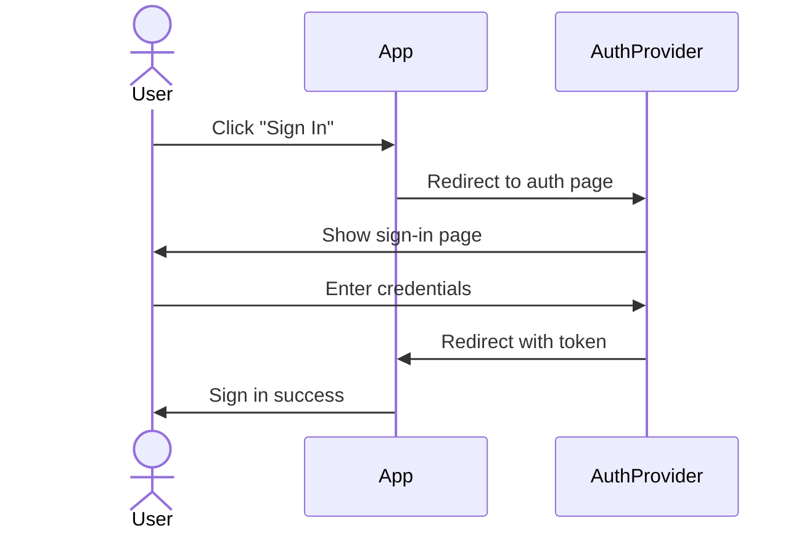
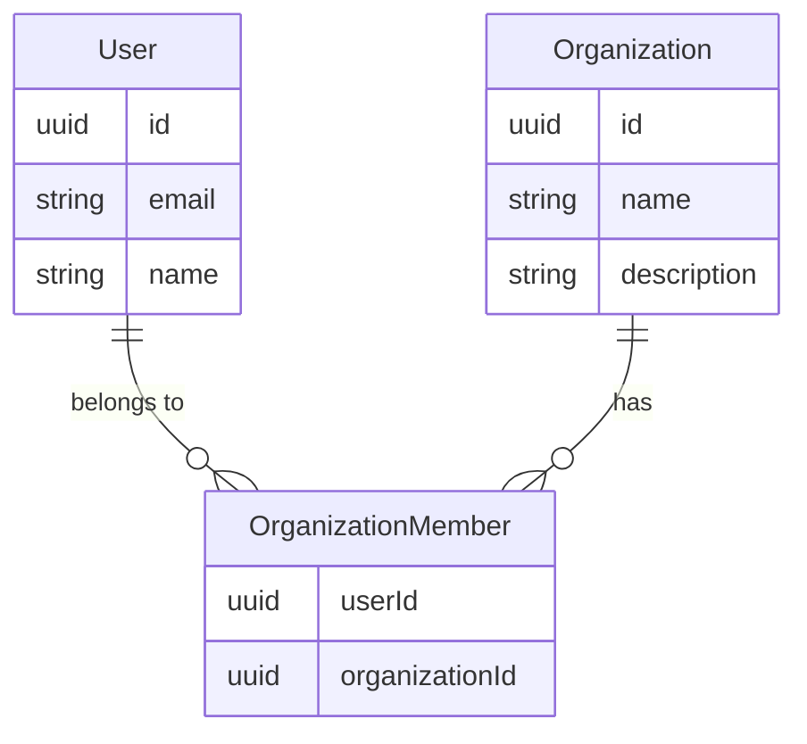
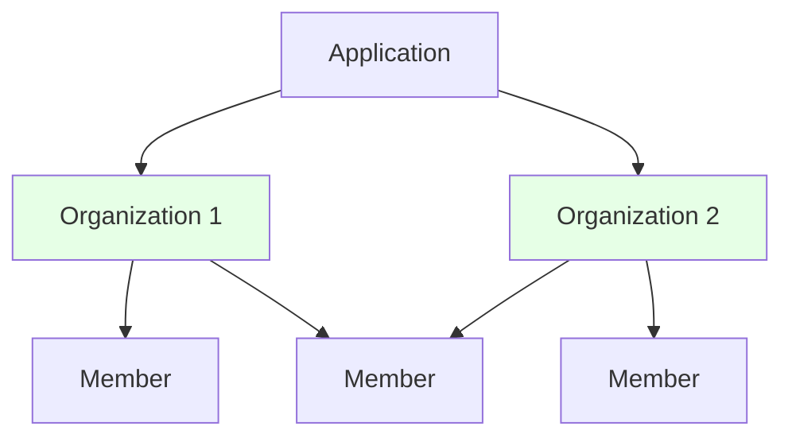
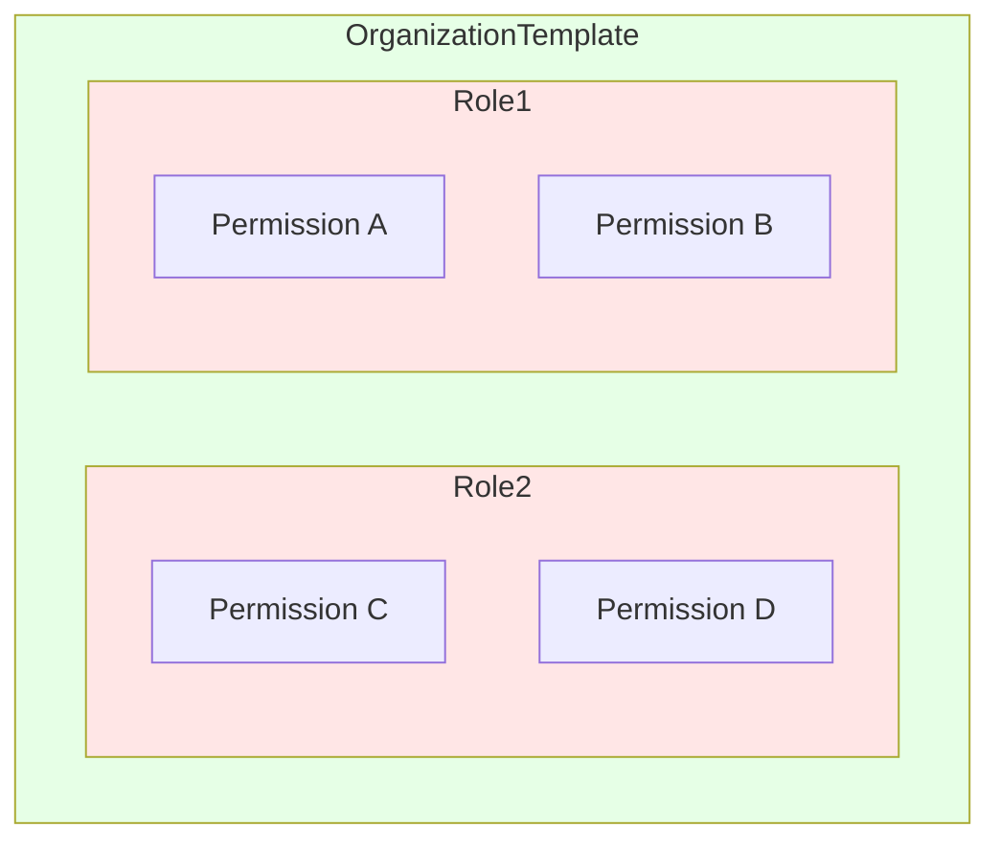
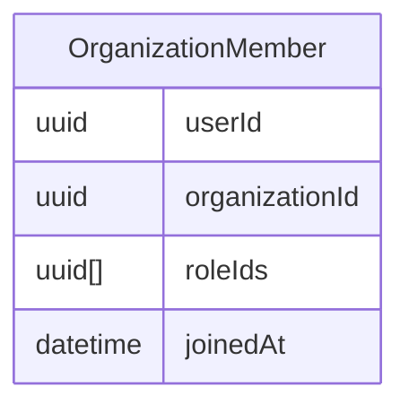
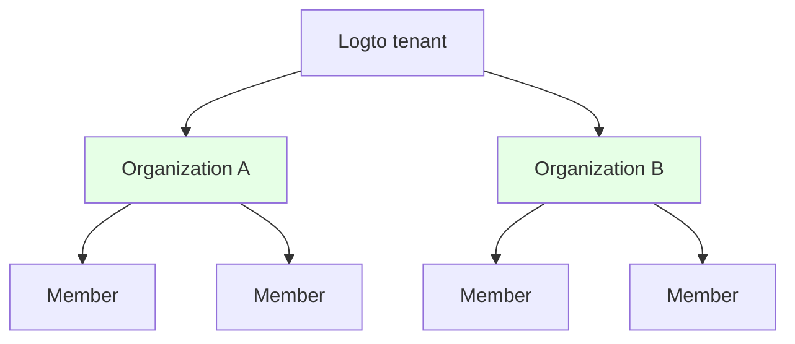
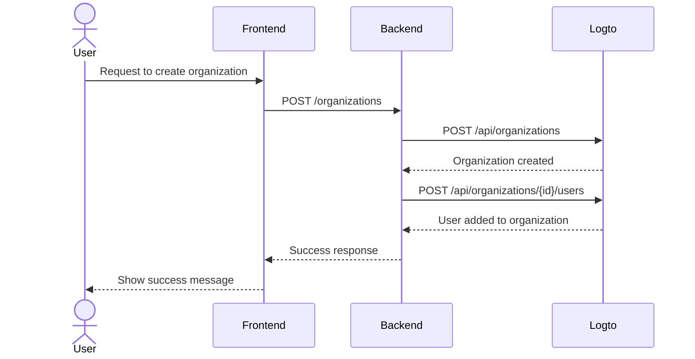

<head>
  <link rel="canonical" href="https://blog.logto.io/build-multi-tenant-saas-application" />
</head>

<style>
  {`
    .twoColumn {
      display: grid;
      grid-template-columns: 1fr 1fr;
      gap: 24px;
    }
    .twoColumn + .twoColumn {
      margin-top: 24px;
    }
  `}
</style>

# Build a multi-tenant SaaS application: A complete guide from design to implementation

How are apps like Notion, Slack, or Figma built? These multi-tenant SaaS applications look simple to use, but building one yourself? That's a different story.

When I first thought about building such a complex beast, my mind exploded:

- Users need multiple sign-in options (email, Google, GitHub)
- Each user can create and belong to multiple organizations
- Different permission levels within each organization
- Enterprise organizations requiring auto-join for specific email domains
- MFA requirements for sensitive operations
- And more...

"Boss, let's talk about product design in two weeks. I'm stuck in the mud right now."

But when I actually started working on it, **I find that it's not as daunting as it seems.**

I just **built a system with all these features with surprisingly little effort!**


<div className="twoColumn">
  
  
</div>

I'll show you exactly how to design and implement such a system from the ground up - and you'll be amazed at how simple it really is in 2025 with modern tools and the right architectural approach.

> **The complete source code is available in this [Github Repo](https://github.com/logto-io/multi-tenant-saas-sample). Let's dive in!**

We'll start with an AI documentation SaaS product called DocuMind.

DocuMind is an AI documentation SaaS product designed with a multi-tenant model to support individual users, small businesses, and enterprises.

The platform provides powerful AI capabilities for document management, including automatic summary generation, key point extraction, and intelligent content recommendations within organizations.

## What features are required for SaaS authentication and authorization? \{#what-features-are-required-for-saas-authentication-and-authorization}

First, let’s review the necessary requirements. What features do you need?

### Multi-tenant architecture \{#multi-tenant-architecture}

To enable a multi-tenant architecture, you’ll need an entity layer called **organization**. Imagine having a single pool of users who can access multiple workspaces. Each organization represents a workspace, and users maintain a single identity while accessing different workspaces (organizations) based on their assigned roles.


It’s a widely used feature in authentication providers. An organization in an identity management system corresponds to your SaaS app’s workspace, project, or tenant.


### Membership \{#membership}

A member is a temporary concept used to indicate an identity’s membership status within an organization.

For example, Sarah signs up for your app using her email, **sarah@gmail.com**. She can belong to different workspaces. If Sarah is part of **Workspace A** but not **Workspace B**, she is considered a member of **Workspace A** but not **Workspace B**.

### Role and permission design \{#role-and-permission-design}

In a multi-tenant architecture, users need **roles** with specific **permissions** to access their tenant resources.
Permissions are detailed access controls that define specific actions, such as `read: order` or `write: order`. They determine what actions can be performed on particular resources.

Roles are a set of permissions assigned to members in a multi-tenant environment.

You’ll need to define these roles and permissions, then assign roles to users, and sometimes it may include automated processes. For example:

1. Users who join an organization automatically get the **member** role.
2. The first user to create a workspace is automatically assigned the **admin** role.

### Sign-up and login flow \{#sign-up-and-login-flow}

Ensure a user-friendly and secure registration and authentication process, including basic sign-in and sign-up options:

1. **Email and password sign-in**: Traditional login method with email and password.
2. **Passwordless sign-in**: Use email verification codes for easy and secure access.
3. **Account management**: An account center where users can update their email, password, and other details.
4. **Social sign-in**: Options like Google and GitHub for quick login.
5. **Multi-Factor Authentication (MFA)**: Enhance security by allowing login via authenticator apps like Duo.

### Tenant creation and invitation \{#tenant-creation-and-invitation}

In a multi-tenant SaaS app, a key difference in the user flow is the need to support tenant creation and member invitations. This process requires careful planning and execution as it plays a key role in product activation and growth.

Here are a few typical use flows you need to consider:

| User type                                        | Entry point                                                |
| ------------------------------------------------ | ---------------------------------------------------------- |
| New account                                      | Enter from sign in and sign up page to create a new tenant |
| Existing account                                 | Create another tenant inside the product                   |
| The existing account got a new tenant invitation | Enter from sign in and sign up page                        |
| The existing account got a new tenant invitation | Enter from the invitation email                            |
| The new account got a new tenant invitation      | Enter from sign in and sign up page                        |
| The new account got a new tenant invitation      | Enter from the invitation email                            |

Here are some common scenarios found in almost every SaaS app. Use these as a reference to inspire your product and design team, and feel free to create your own flows as needed.

<div className="twoColumn">
  
  
</div>

<div className="twoColumn">
  
  
</div>

<div className="twoColumn">
  
  
</div>

## Technical architecture and system design \{#technical-architecture-and-system-design}

Once we understand all the product requirements, let’s move on to the implementation.

### Define authentication strategy \{#define-authentication-strategy}

Authentication looks scary. Users need:

- Email & password sign-up/login
- One-click sign-in with Google/Github
- Password reset when they forget
- Team-wide login for enterprise customers
- ...

Implementing just these basic features could take weeks of development.

But now, **we don't need to build ANY of this ourselves!**

Modern auth providers (I will choose [Logto](https://logto.io/) this time) have packaged all these features for us. The authentication flow is straightforward:



**From weeks of development to 15 minutes of setup**, Logto handles all the complex flows for us! We'll cover the integration steps in the implementation section later. Now we can focus on building DocuMind core features!

### Establish multi-tenant architecture \{#establish-multi-tenant-architecture}

The organization system enables users to create and join multiple organizations. Let's understand the core relationships:



In this system, each user can belong to multiple organizations, and each organization can have multiple members.



### Enable access control in multi-tenant app \{#enable-access-control-in-multi-tenant-app}

Role-Based Access Control (RBAC) is important for ensuring security and scalability in multi-tenant SaaS applications.

In a multi-tenant app, the design of permissions and roles is usually consistent, as it stems from the product design. For example, in multiple workspaces, there’s typically an admin role and a member role. Logto as an auth provider has the following organization-level role-based access control design:

1. **Unified permission definitions**: Permissions are defined at the system level and apply consistently across all organizations, ensuring maintainable and consistent permission management
2. **Organization templates**: Pre-defined role and permission combinations through organization templates, simplifying organization initialization

The permission relationship looks like this:



Since each user needs their own role(s) within each organization, the relationship between roles and organizations must reflect the roles assigned to each user:



We've designed the organization system and access control system, and now we can start building our product!

## Tech stack \{#tech-stack}

I chose a beginner-friendly, portable stack:

1. **Frontend**: React (easily transferable to Vue/Angular/Svelte)
2. **Backend**: Express (simple, intuitive API)

Why separate frontend and backend?Because it has a clear architecture, easy to learn and simple to switch stacks. And for auth providers, I use Logto as an example.

And for the following guides, **its patterns here work with: Any frontend, any backend and any auth system.**

## Add basic authentication flow to your app \{#add-basic-authentication-flow-to-your-app}

This is the easiest step. We just need to integrate Logto into our project. Then we can configure user login/registration methods in the Logto Console based on our needs.

### Install Logto to your app \{#install-logto-to-your-app}

First, log into [Logto Cloud](https://cloud.logto.io/). You can sign up for a free account if you don't have one. Create a Development Tenant for testing.

In the Tenant Console, click the "Application" button on the left. Then select React to start building our application.

Follow the guide on the page. You can complete the Logto integration in about 5 minutes!

Here's my integration code:

```jsx
const config: LogtoConfig = {
  endpoint: "<YOUR_LOGTO_ENDPOINT>",
  appId: "<YOUR_LOGTO_APP_ID>",
};

function App() {
  return (
    <LogtoProvider config={config}>
      <div className="min-h-screen bg-gradient-to-b from-gray-50 to-gray-100">
        <Routes>
          {/* This callback handles the user login redirect from Logto */}
          <Route path="/callback" element={<Callback />} />
          <Route path="/*" element={<AppContent />} />
        </Routes>
      </div>
    </LogtoProvider>
  );
}

function AppContent() {
  const { isAuthenticated } = useLogto();

  if (!isAuthenticated) {
    // Show landing page for unauthenticated users
    return <Landing />;
  }

  // Show main app for authenticated users
  return (
    <Routes>
      {/* Dashboard shows all available organizations */}
      <Route path="/" element={<Dashboard />} />

      {/* Organization page after clicking an organization in Dashboard */}
      <Route path="/:orgId" element={<Organization />} />
    </Routes>
  );
}
```


Here's a useful trick: Our login page has both Sign in and Register buttons. The Register button leads directly to Logto's registration page. This works through Logto's [first screen](/end-user-flows/authentication-parameters/first-screen) feature. It determines which step of the auth flow users see first.

You can default to the registration page when your product expects many new users.

```jsx
function LandingPage() {
  const { signIn } = useLogto();

  return (
    <div className="landing-container">
      <div className="auth-buttons">
        <button
          className="sign-in-button"
          onClick={() => {
            signIn({
              redirectUri: '<YOUR_APP_CALLBACK_URL>',
            });
          }}
        >
          Sign In
        </button>

        <button
          className="register-button"
          onClick={() => {
            signIn({
              redirectUri: '<YOUR_APP_CALLBACK_URL>',
              firstScreen: 'register',
            });
          }}
        >
          Register
        </button>
      </div>
    </div>
  );
}
```

After clicking login, you'll go to the Logto login page. Upon successful login (or registration), congratulations! Your app has its first user (you)!

And call the `signOut` function from the `useLogto` hook to sign out the user when you want to.

```jsx
function SignOutButton() {
  const { signOut } = useLogto();

  return <button onClick={() => signOut('<YOUR_POST_LOGOUT_REDIRECT_URL>')}>Sign Out</button>;
}
```

### Customize sign in and sign up methods \{#customize-sign-in-and-sign-up-methods}

In the Logto Console, click "Sign-in Experience" on the left menu. Then click the "Sign-up and sign-in" tab.
On this page, follow the instructions to configure Logto's login/registration methods.


And the sign-in flow will look like this:


### Enable multi-factor authentication \{#enable-multi-factor-authentication}

With Logto, enabling MFA is simple. Just click the "Multi-factor auth" button in the Logto Console. Then enable it on the Multi-factor authentication page.


And the MFA flow will look like this:

<div className="twoColumn">
  
  
</div>

Everything is so simple! We've set up a complex user authentication system in just a few minutes!

## Adding multi-tenant organization experience \{#adding-multi-tenant-organization-experience}

Now have our first user! However, this user doesn't belong to any organization yet, and we haven't created any organizations.

Logto provides built-in support for multi-tenancy. You can create any number of organizations in Logto. Each organization can have multiple members.



Each user can get their organization information from Logto. This enables multi-tenancy support

### Get a user's organization information \{#get-a-user-s-organization-information}

To get a user's organization information from Logto, follow these two steps:

Declare organization information access in the Logto Config. This is done by setting the appropriate `scopes` and `resources`.

```jsx
import { UserScope, ReservedResource } from "@logto/react";
const config: LogtoConfig = {
  endpoint: "<YOUR_LOGTO_ENDPOINT>",
  appId: "<YOUR_LOGTO_APP_ID>",
  scopes: [UserScope.Organizations], // Value: "urn:logto:scope:organizations"
  resources: [ReservedResource.Organization], // Value: "urn:logto:resource:organizations"
};

```

Use Logto's `fetchUserInfo` method to get user information, including organization data.

```jsx
function Dashboard() {
  // Get user info
  const { fetchUserInfo } = useLogto();
  const [organizations, setOrganizations] = useState<OrganizationData[]>([]);
  const [loading, setLoading] = useState(false);

  useEffect(() => {
    const loadOrganizations = async () => {
      try {
        setLoading(true);
        // Get user info
        const userInfo = await fetchUserInfo();
        // Get user's organization info
        const organizationData = userInfo?.organization_data || [];
        setOrganizations(organizationData);
      } catch (error) {
        console.error('Failed to fetch organizations:', error);
      } finally {
        setLoading(false);
      }
    };

    loadOrganizations();
  }, [fetchUserInfo]);

  if (loading) {
    return <div>Loading...</div>;
  }

  if (organizations.length === 0) {
    return <div>You are not a member of any organization yet</div>;
  }

  return <div>Organizations: {organizations.map(org => org.name).join(', ')}</div>;
}

```

After completing these steps, you need to sign out and sign in again. This is necessary because we modified the requested scope and resource.

Right now, you haven't created any organizations. The user hasn't joined any organizations either. The dashboard will show "You don’t have any organization yet".


Next, we’ll create an organization for our users and add them to it.

Thanks to Logto, we don't need to build complex organization relationships. We just need to create an organization in Logto and add users to it. Logto handles all the complexity for us. There are two ways to create Organizations:

1. Manually create organizations through the Logto Console
2. Use the Logto Management API to create organizations, especially when designing a SaaS flow that lets users create their own organizations (workspaces).

### Create organization in Logto console \{#create-organization-in-logto-console}

Click the "Organizations" menu button on the left side of the Logto Console. Create an organization.

Now you have your first organization.


Next, let's add the user to this organization.

Go to the organization details page. Switch to the Members tab. Click the "+ Add member" button. Select your login user from the left list. Click the "Add members" button in the bottom right. Now you've successfully added the user to this organization.


Refresh your APP page. You'll see the user now belongs to an organization!


## Implement self-serve organization creation experience \{#implement-self-serve-organization-creation-experience}

Creating an organization in the console is not enough. Your SaaS app needs a flow that allows end users to easily create and manage their own workspaces. To implement this functionality, use the Logto Management API.

For guidance, check out the [Interact with Management API](/integrate-logto/interact-with-management-api) documentation to set up API communication with Logto.

### Understand organization auth interaction flow \{#understand-organization-auth-interaction-flow}

Let’s take organization creation flow as an example. Here's how the organization creation process works:



This flow has two key authentication requirements:

1. **Protecting backend service API**:
   - Frontend access to our Backend Service API requires authentication
   - API endpoints are protected by validating user's Logto Access Token
   - Ensures only authenticated users can access our services
2. **Accessing Logto Management API**:
   - Backend Service needs to securely call Logto Management API
   - Follow the [Interact with Management API](/integrate-logto/interact-with-management-api) guide for setup
   - Use Machine-to-Machine authentication to obtain access credentials

### Protect your backend API \{#protect-your-backend-api}

First, let's create an API endpoint in our backend service for creating organizations.

```jsx
app.post('/organizations', async (req, res) => {
  // Implementation using Logto Management API
  // ...
});
```

Our backend service API only allows authenticated users. We need to use Logto to protect our API. We also need to know the current user's information (like user ID).

In Logto's concept (and OAuth 2.0), our backend service acts as a resource server. Users access DocuMind resource server with an Access token from the frontend. The resource server verifies this token. If valid, it returns the requested resources.

Let's create an API Resource to represent our backend service.

Go to the Logto Console.

1. Click the "API resources" button on the right.
2. Click "Create API resource". Select Express in the popup.
3. Fill in "DocuMind API" as the API name. Use "[https://api.documind.com](https://api.documind.com/)" as the API identifier.
4. Click create.

Don't worry about this API identifier URL. It's just a unique identifier for your API in Logto. It's not related to your actual backend service URL.

You'll see a tutorial for using the API resource. You can follow that tutorial or our steps below.

Let's create a requireAuth middleware to protect our POST /organizations endpoint.

```jsx
const { createRemoteJWKSet, jwtVerify } = require('jose');

const getTokenFromHeader = (headers) => {
  const { authorization } = headers;
  const bearerTokenIdentifier = 'Bearer';

  if (!authorization) {
    throw new Error('Authorization header missing');
  }

  if (!authorization.startsWith(bearerTokenIdentifier)) {
    throw new Error('Authorization token type not supported');
  }

  return authorization.slice(bearerTokenIdentifier.length + 1);
};

const requireAuth = (resource) => {
  if (!resource) {
    throw new Error('Resource parameter is required for authentication');
  }

  return async (req, res, next) => {
    try {
      // Extract the token
      const token = getTokenFromHeader(req.headers);

      const { payload } = await jwtVerify(
        token,
        createRemoteJWKSet(new URL(process.env.LOGTO_JWKS_URL)),
        {
          issuer: process.env.LOGTO_ISSUER,
          audience: resource,
        }
      );

      // Add user info to request
      req.user = {
        id: payload.sub,
      };

      next();
    } catch (error) {
      console.error('Auth error:', error);
      res.status(401).json({ error: 'Unauthorized' });
    }
  };
};

module.exports = {
  requireAuth,
};
```

To use this middleware, we need these environment variables:

- LOGTO_JWKS_URL
- LOGTO_ISSUER

Get these variables from your Logto tenant's OpenID Configuration endpoint. Visit `https://<your-tenant-id>.logto.app/oidc/.well-known/openid-configuration`. You'll find the needed information in the returned JSON:

```json
{
  "jwks_uri": "<https://tenant-id.logto.app/oidc/jwks>",
  "issuer": "<https://tenant-id.logto.app/oidc>"
}
```

Now use the requireAuth middleware in our POST /organizations endpoint.

```jsx
app.post('/organizations', requireAuth('<https://api.documind.com>'), async (req, res) => {
  // Handle organization creation logic
  // ...
});
```

This protects our POST /organizations endpoint. Only users with valid Logto access tokens can access it.

We can now get the token from Logto in our frontend. Users can create organizations through our backend service with this token. The middleware also gives us the user ID. This helps when adding users to organizations.

In the frontend code, declare this API resource in the Logto config. Add its identifier to the resources array.

```jsx
const config: LogtoConfig = {
  endpoint: "<YOUR_LOGTO_ENDPOINT>",
  appId: "<YOUR_LOGTO_APP_ID>",
  scopes: [UserScope.Organizations],
  resources: [ReservedResource.Organization, "<https://api.documind.com>"], // Newly created API resource identifier
};

```

Like before, users need to log in again after we update the Logto config.

In the Dashboard, get the Logto Access Token when creating an organization. Use this token to access our backend service API.

```jsx
// Get access token for "DocuMind API"
const token = await getAccessToken('<https://api.documind.com>');

// Access our backend service API with the token
const response = await fetch('<http://localhost:3000/organizations>', {
  method: 'POST',
  headers: {
    'Content-Type': 'application/json',
    Authorization: `Bearer ${token}`,
  },
  body: JSON.stringify({
    name: 'Organization A',
    description: 'Organization A description',
  }),
});
```

Now we can properly access DocuMind backend service API.

### Calling Logto Management API \{#calling-logto-management-api}

Let's implement organization creation using the Logto Management API.

Like frontend requests to backend service, backend service requests to Logto need Access tokens.

In Logto, we use Machine-to-Machine authentication for access tokens. See [Interact with Management API](/integrate-logto/interact-with-management-api).

Go to the applications page in Logto Console. Create a Machine-to-Machine application. Assign the "Logto Management API access" role. Copy the Token endpoint, App ID, and App Secret. We'll use these for access tokens.


Now we can get Logto Management API access tokens through this M2M application.

```jsx
async function fetchLogtoManagementApiAccessToken() {
  const response = await fetch(process.env.LOGTO_MANAGEMENT_API_TOKEN_ENDPOINT, {
    method: 'POST',
    headers: {
      'Content-Type': 'application/x-www-form-urlencoded',
      Authorization: `Basic ${Buffer.from(
        `${process.env.LOGTO_MANAGEMENT_API_APPLICATION_ID}:${process.env.LOGTO_MANAGEMENT_API_APPLICATION_SECRET}`
      ).toString('base64')}`,
    },
    body: new URLSearchParams({
      grant_type: 'client_credentials',
      resource: process.env.LOGTO_MANAGEMENT_API_RESOURCE,
      scope: 'all',
    }).toString(),
  });
  const data = await response.json();
  return data.access_token;
}
```

Use this access token to call Logto Management API.

We'll use these Management APIs:

- `POST /api/organizations`: Create organization (see: [Create organization API reference](https://openapi.logto.io/operation/operation-createorganization))
- `POST /api/organizations/{id}/users`: Add users to organization (see: [Add users to organization API reference](https://openapi.logto.io/operation/operation-addusers))

```jsx
app.post('/organizations', requireAuth('<https://api.documind.com>'), async (req, res) => {
  const accessToken = await fetchLogtoManagementApiAccessToken();
  // Create organization in Logto, and add user to it
  const response = await fetch(`${process.env.LOGTO_ENDPOINT}/api/organizations`, {
    method: 'POST',
    headers: {
      'Content-Type': 'application/json',
      Authorization: `Bearer ${accessToken}`,
    },
    body: JSON.stringify({
      name: req.body.name,
      description: req.body.description,
    }),
  });

  const createdOrganization = await response.json();

  await fetch(`${process.env.LOGTO_ENDPOINT}/api/organizations/${createdOrganization.id}/users`, {
    method: 'POST',
    headers: {
      'Content-Type': 'application/json',
      Authorization: `Bearer ${accessToken}`,
    },
    body: JSON.stringify({
      userIds: [req.user.id],
    }),
  });

  res.json({ data: createdOrganization });
});
```

We've now implemented organization creation through Logto Management API. We can also add users to organizations.

Let's test this feature in the Dashboard.


and click “Create Organization”


Creation successful!

The next step would be inviting users to an organization. We won't implement this feature in our tutorial yet. You already know how to use the Management API. You can refer this [**Tenant creation and invitation**](https://blog.logto.io/build-multi-tenant-saas-application#tenant-creation-and-invitation) as product design reference and easily implement this feature by following this blog post: [How we implement user collaboration within a multi-tenant app](https://blog.logto.io/implement-user-collaboration-in-your-app).

## Implement access control to your multi-tenant app \{#implement-access-control-to-your-multi-tenant-app}

Now let's move on to organization access control.

We want to achieve:

- Users can only access resources belonging to their own organizations: This can be done through Logto's `organization token`
- Users have specific roles within organizations (containing different permissions) to perform authorized actions: This can be implemented through Logto's organization template feature

Let's see how to implement these features.

### Using Logto organization token \{#using-logto-organization-token}

Similar to the Logto access token we mentioned earlier, Logto issues an access token corresponding to a specific resource, and users use this token to access protected resources in the backend service. Correspondingly, Logto issues an organization token corresponding to a specific organization, and users use this token to access protected organization resources in the backend service.

In the frontend application, we can use Logto's `getOrganizationToken` method to obtain a token for accessing a specific organization.

```jsx
const { getOrganizationToken } = useLogto();
const organizationToken = await getOrganizationToken(organizationId);
```

Here, `organizationId` is the id of the organization to which the user belongs.

Before using `getOrganization` or any organization features, we need to ensure that `urn:logto:scope:organizations` scope and `urn:logto:resource:organization` resource are included in the Logto config. Since we've already declared these earlier, we won't repeat it.

In our organization page, we use the organization token to fetch documents within the organization.

```jsx
function OrganizationPage() {
  const { organizationId } = useParams();
  const navigate = useNavigate();
  const { signOut, getOrganizationToken } = useLogto();
  const [error, setError] = useState<Error | null>(null);
  const [documents, setDocuments] = useState([]);

  const fetchDocuments = useCallback(async () => {
    if (!organizationId) return;

    try {
      const organizationToken = await getOrganizationToken(organizationId);
      const response = await fetch(`http://localhost:3000/documents`, {
          headers: {
          'Content-Type': 'application/json',
          Authorization: `Bearer ${organizationToken}`,
        },
      });
      const documents = await response.json();
      setDocuments(documents);
    } catch (error: unknown) {
      if (error instanceof Error) {
        setError(error);
      } else {
        setError(new Error(String(error)));
      }
    }
  },[getOrganizationToken, organizationId]);

  useEffect(() => {
    void fetchDocuments();
  }, [fetchDocuments]);

  if (error) {
    return <div>Error: {error.message}</div>;
  }

  return <div>
    <h1>Organization Documents</h1>
    <ul>
      {documents.map((document) => (
        <li key={document.id}>{document.name}</li>
      ))}
    </ul>
  </div>
}

```

There are two important points to note in this implementation:

1. If the `organizationId` passed to `getOrganizationToken` is not an organization id that belongs to the current user, this method won't be able to get a token, thus ensuring users can only access their own organizations.
2. When requesting organization resources, we use the organization token instead of the access token because for resources belonging to an organization, we want to use organization permission control rather than user permission control (you'll better understand this when we implement the `GET /documents` API later).

Next, we create a `GET /documents` API in our backend service. Similar to how we use API resource to protect the `POST /organizations` API, we use organization-specific resource indicators to protect the `GET /documents` API.

First, let's create a `requireOrganizationAccess` middleware to protect Organization resources.

```jsx
const getTokenFromHeader = (headers) => {
  const { authorization } = headers;
  const bearerTokenIdentifier = 'Bearer';

  if (!authorization) {
    throw new Error('Authorization header missing');
  }

  if (!authorization.startsWith(bearerTokenIdentifier)) {
    throw new Error('Authorization token type not supported');
  }

  return authorization.slice(bearerTokenIdentifier.length + 1);
};

const extractOrganizationId = (aud) => {
  if (!aud || typeof aud !== 'string' || !aud.startsWith('urn:logto:organization:')) {
    throw new Error('Invalid organization token');
  }
  return aud.replace('urn:logto:organization:', '');
};

const decodeJwtPayload = (token) => {
  try {
    const [, payloadBase64] = token.split('.');
    if (!payloadBase64) {
      throw new Error('Invalid token format');
    }
    const payloadJson = Buffer.from(payloadBase64, 'base64').toString('utf-8');
    return JSON.parse(payloadJson);
  } catch (error) {
    throw new Error('Failed to decode token payload');
  }
};

const requireOrganizationAccess = () => {
  return async (req, res, next) => {
    try {
      // Extract the token
      const token = getTokenFromHeader(req.headers);

      // Dynamically get the audience from the token
      const { aud } = decodeJwtPayload(token);
      if (!aud) {
        throw new Error('Missing audience in token');
      }

      // Verify the token with the audience
      const { payload } = await jwtVerify(
        token,
        createRemoteJWKSet(new URL(process.env.LOGTO_JWKS_URL)),
        {
          issuer: process.env.LOGTO_ISSUER,
          audience: aud,
        }
      );

      // Extract organization ID from the audience claim
      const organizationId = extractOrganizationId(payload.aud);

      // Add organization info to request
      req.user = {
        id: payload.sub,
        organizationId,
      };

      next();
    } catch (error) {
      console.error('Organization auth error:', error);
      res.status(401).json({ error: 'Unauthorized - Invalid organization access' });
    }
  };
};
```

Then we use the `requireOrganizationAccess` middleware to protect the `GET /documents` API.

```jsx
app.get('/documents', requireOrganizationAccess(), async (req, res) => {
  // You can get the current user's id and organizationId through req.user
  console.log('userId', req.user.id);
  console.log('organizationId', req.user.organizationId);

  // Get documents from the database by organizationId
  // ....
  const documents = await getDocumentsByOrganizationId(req.user.organizationId);

  res.json(documents);
});
```

This way, we've implemented using organization tokens to access organization resources. In the backend service, you can retrieve corresponding resources from the database based on the organization id.

Some software requires data isolation between organizations. For further discussion and implementation, you can refer to the blog post: [Multi-tenancy implementation with PostgreSQL: Learn through a simple real-world example](https://blog.logto.io/implement-multi-tenancy).

### Implement organization-level role-based access control design \{#implement-organization-level-role-based-access-control-design}

We've implemented using organization tokens to access organization resources. Next, we'll implement user permission control within organizations using RBAC.

Let's assume DocuMind has two roles: Admin and Collaborator.

Admins can create and access documents, while Collaborators can only access documents.

Therefore, our Organization needs to have these two roles: Admin and Collaborator.

Admin has both `read:documents` and `create:documents` permissions, while Collaborator has only the `read:documents` permission.

- Admin
  - `read:documents`
  - `create:documents`
- Collaborator
  - `read:documents`

This is where Logto's organization template feature comes in.

An organization template is a blueprint of the access control model for every organization: it defines the roles and permissions that apply to all organizations.

> Why organization template?
>
> Because scalability is one of the most important requirements for SaaS products. In other words, what works for one client should work for all clients.

Let's go to Logto Console > Organization Templates > Organization permissions and create two permissions: `read:documents` and `create:documents`.


Then go to the organization roles tab to create two user roles: Admin and Collaborator, and assign corresponding permissions to these roles.


This way, we've created an RBAC permission model for each organization.

Next, we go to our Organization details page to assign appropriate roles to our members.


Now our organization users have roles!
You can achieve these steps via Logto Management API:

```jsx
// Assign 'Admin' role to the organization creator
app.post('/organizations', requireAuth('https://api.documind.com'), async (req, res) => {
  const accessToken = await fetchLogtoManagementApiAccessToken();
  // Create organization in Logto
  // existing codes...

  // Add user to organization in Logto
  await fetch(`${process.env.LOGTO_ENDPOINT}/api/organizations/${createdOrganization.id}/users`, {
    method: 'POST',
    headers: {
      'Content-Type': 'application/json',
      Authorization: `Bearer ${accessToken}`,
    },
    body: JSON.stringify({
      userIds: [req.user.id],
    }),
  });

  // Assign `Admin` role to the first user.
  const rolesResponse = await fetch(`${process.env.LOGTO_ENDPOINT}/api/organization-roles`, {
    method: 'GET',
    headers: {
      'Content-Type': 'application/json',
      Authorization: `Bearer ${accessToken}`,
    },
  });

  const roles = await rolesResponse.json();

  // Find the `Admin` role
  const adminRole = roles.find((role) => role.name === 'Admin');

  // Assign `Admin` role to the first user.
  await fetch(
    `${process.env.LOGTO_ENDPOINT}/api/organizations/${createdOrganization.id}/users/${req.user.id}/roles`,
    {
      method: 'POST',
      headers: {
        'Content-Type': 'application/json',
        Authorization: `Bearer ${accessToken}`,
      },
      body: JSON.stringify({
        organizationRoleIds: [adminRole.id],
      }),
    }
  );

  // existing codes...
});
```

Now we can implement user permission control by checking their permissions.

In our code, we need to make the user's organization token carry permission information, and then verify these permissions in the backend.

In the frontend code's Logto config, we need to declare the permissions users need to request within the organization. Let's add `read:documents` and `create:documents` permissions to the `scopes`.

```jsx
const config: LogtoConfig = {
  endpoint: "<YOUR_LOGTO_ENDPOINT>",
  appId: "<YOUR_LOGTO_APP_ID>",
  scopes: [UserScope.Organizations, "read:documents", "create:documents"],
  resources: [ReservedResource.Organization, "<https://api.documind.com>"], // Newly created API resource identifier
};

```

As usual, log in again with your user to make these configurations take effect.

Then in the backend's `requireOrganizationAccess` middleware, we add verification for user permissions.

```jsx
const hasRequiredScopes = (tokenScopes, requiredScopes) => {
  if (!requiredScopes || requiredScopes.length === 0) {
    return true;
  }
  const scopeSet = new Set(tokenScopes);
  return requiredScopes.every((scope) => scopeSet.has(scope));
};

const requireOrganizationAccess = ({ requiredScopes = [] } = {}) => {
  return async (req, res, next) => {
    try {
      //...

      // Verify the token with the audience
      const { payload } = await jwtVerify(
        token,
        createRemoteJWKSet(new URL(process.env.LOGTO_JWKS_URL)),
        {
          issuer: process.env.LOGTO_ISSUER,
          audience: aud,
        }
      );

      //...

      // Get scopes from the token
      const scopes = payload.scope?.split(' ') || [];

      // Verify required scopes
      if (!hasRequiredScopes(scopes, requiredScopes)) {
        throw new Error('Insufficient permissions');
      }

      //...

      next();
    } catch (error) {
      //...
    }
  };
};
```

Then create a POST /documents API, and use the `requireOrganizationAccess` middleware with requiredScopes configuration to protect this API and the previous `GET /documents` API.

```jsx
// API for creating documents
app.post(
  '/documents',
  requireOrganizationAccess({ requiredScopes: ['create:documents'] }),
  async (req, res) => {
    //...
  }
);

// API for getting documents
app.get(
  '/documents',
  requireOrganizationAccess({ requiredScopes: ['read:documents'] }),
  async (req, res) => {
    //...
  }
);
```

This way, we've implemented user permission control by checking user permissions.

In the frontend, you can get user permission information by decoding the organization token or calling Logto's `getOrganizationTokenClaims` method.

```jsx
const [scopes, setScopes] = useState([]);
const { getOrganizationTokenClaims } = useLogto();

const loadScopes = async () => {
  const claims = await getOrganizationTokenClaims(organizationId);
  setScopes(claims.scope.split(' '));
};

// ...
```

Control page elements based on user permissions by checking the scopes in the claims.

## Add more multi-tenant app features \{#add-more-multi-tenant-app-features}

So far, we've implemented the basic user and organization features in a multi-tenant SaaS system! However, there are still some features we haven't covered, such as customizing login page branding for each Organization, automatically adding users with specific domain emails to certain organizations, and integrating enterprise-level SSO functionality.

These are all out-of-the-box features, and you can find more information about these features in the Logto documentation:

- [Enterprise SSO Integration](/end-user-flows/enterprise-sso)
- [Just-in-Time (JIT) Provisioning](/organizations/just-in-time-provisioning)
- [Organization-Level Branding](/customization/match-your-brand#organization-specific-branding)
- [Organization-Level Multi-Factor Authentication (MFA)](/organizations/organization-management#require-mfa-for-organization-members)
- [Organization-Level Management](/end-user-flows/organization-experience/organization-management)

## Summary \{#summary}

Remember how overwhelming it felt at the beginning? Users, organizations, permissions, enterprise features... it seemed like an endless mountain to climb.

But look at what we've accomplished:

- A complete authentication system with multiple sign-in options and MFA support
- A flexible organization system that supports multiple memberships
- Role-based access control within organizations

And the best part? We didn't have to reinvent the wheel. By leveraging modern tools like Logto, we transformed what could have been months of development into a matter of minutes.

The complete source code for this tutorial is available at: [Multi-tenant SaaS Sample](https://github.com/logto-io/multi-tenant-saas-sample).

This is the power of modern development in 2025 - we can focus on building unique product features instead of wrestling with infrastructure. Now it's your turn to build something amazing!

Explore all of Logto’s features, from Logto Cloud to Logto OSS, on the [Logto website](https://logto.io/) or sign up [Logto cloud](https://cloud.logto.io/?sign_up) today.
