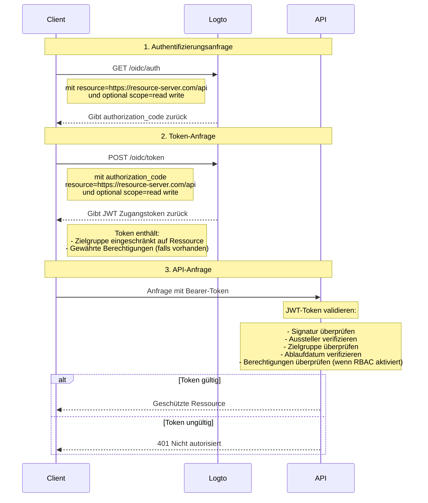

# Schütze deine API

Wenn du keine flexiblen, feingranularen Zugangskontrollrichtlinien benötigst, kannst du einfach deine API direkt schützen. Wir führen dich durch ein Sequenzdiagramm und die notwendigen Schritte, um die Zugangskontrolle in deine App zu integrieren.



In diesem Tutorial

- Logto-Endpunkt: `https://tenant-id.logto.app`
- Client-Anwendung: `https://client.example.org`
- API-Ressourcenserver: `https://resource-server.com/api`

Du solltest diese durch deine tatsächlichen Endpunkte ersetzen, wenn du implementierst.

## Authentifizierungsanfrage \{#authentication-request}

Stelle eine Liste von Ressourcenindikator-Parametern in einer [Authentifizierungsanfrage](https://openid.net/specs/openid-connect-core-1_0.html#AuthRequest) bereit. Dies wird alle geschützten Ressourcen anzeigen, die der Benutzer möglicherweise anfordert.

```bash
GET https://tenant-id.logto.app/oidc/auth?response_type=code
    &client_id=s6BhdRkqt3
    &state=tNwzQ87pC6llebpmac_IDeeq-mCR2wLDYljHUZUAWuI
    &redirect_uri=https%3A%2F%2Fclient.example.org%2Fcb
    &resource=https%3A%2F%2Fresource-server.com%2Fapi
    &scope=read%20write
```

Logto wird diese Ressourcenindikatoren validieren und speichern. Ein `authorization_code` wird gewährt und mit Berechtigungen zurückgegeben, die auf diese angegebenen Ressourcen beschränkt sind.

Beispielkonfiguration des Logto SDK:

```tsx
const config: LogtoConfig = {
  // ...andere Konfigurationen
  resources: ['https://resource-server.com/api'],
  scopes: ['read', 'write'],
};
```

## Token-Anfrage \{#token-request}

Wenn der Ressourcenparameter bei einer [Token-Anfrage](https://openid.net/specs/openid-connect-core-1_0.html#TokenRequest) zusammen mit dem oben gewährten `authorization_code` vorhanden ist, wird die Ziel-API-Ressourcenzielgruppe des Zugangstokens spezifiziert.

```bash
POST https://tenant-id.logto.app/oidc/token HTTP/1.1
Content-Type: application/x-www-form-urlencoded

grant_type=authorization_code&redirect_uri=https%3A%2F%2Fclient.example.org%2Fcb&code=10esc29BWC2qZB0acc9v8zAv9ltc2pko105tQauZ&resource=https%3A%2F%2Fresource-server.com%2Fapi
```

Ein verschlüsseltes Zugangstoken mit der Zielgruppe, die auf diese angeforderte Ressource beschränkt ist, wird von Logto gewährt. Das Token enthält alle Daten, die du benötigst, um den Autorisierungsstatus der Anfrage darzustellen, z. B. die Identität und Rolle des anfragenden Benutzers, die Zielgruppe und die Ablaufzeit des Tokens.

Beispielcode des Logto SDK:

```tsx
const accessToken = await logtoClient.getAccessToken('https://resource-server.com/api');
```

Der Payload des accessToken wird enthalten:

```tsx
{
  iss: '<your-logto-endpoint>/oidc',
  aud: 'https://resource-server.com/api',
  scope: 'read write'
}
```

## Anfrage an die API-Ressource \{#request-to-the-api-resource}

Der Client-Benutzer sendet eine Anfrage an die API-Ressource, indem er das gegebene `access_token` im Authorization-Header präsentiert.

```bash
GET https://resource-server.com/api/users
Authorization: Bearer eyJhbGciOiJIUz...
```

Logto folgt dem standardmäßigen tokenbasierten Autorisierungsprotokoll, um deine API-Ressourcen zu schützen. Um mehr über OAuth 2.0 zu erfahren, siehe bitte das [offizielle Dokument](https://datatracker.ietf.org/doc/html/rfc6749#section-1.3.1) von OAuth 2.0.

## Autorisierungstoken für API-Anfragen validieren \{#validate-authorization-tokens-for-api-requests}

Logto stellt ein standardmäßiges [JWT](https://datatracker.ietf.org/doc/html/rfc7519)-Format Autorisierungstoken für jede autorisierte API-Anfrage aus. Das Token ist verschlüsselt und als [JWS](https://datatracker.ietf.org/doc/html/rfc7515)-Token signiert.

#### Verständnis des JWS-Tokens \{#understanding-jws-token}

Ein kodiertes [JWS](https://datatracker.ietf.org/doc/html/rfc7515)-Token wird aus drei Teilen konstruiert:

- JOSE Header: Deklariert den Code-Typ und den Kodierungsalgorithmus
- JWS Payload: Beinhaltet alle Ansprüche des Tokens
- JWS Signature: Signatur, signiert mit [JWK](https://datatracker.ietf.org/doc/html/rfc7517)

Ein Standardschema des von Logto ausgestellten JWS-Payloads: (Ansprüche können je nach deiner benutzerdefinierten OIDC-Konfiguration variieren)

| Schlüssel | Beschreibung                                  |
| --------- | --------------------------------------------- |
| jti       | eindeutige JWT-ID                             |
| sub       | Subjekt, normalerweise Benutzer-ID            |
| iat       | Zeitstempel, wann das Token ausgestellt wurde |
| exp       | Zeitstempel, wann das Token abläuft           |
| client_id | Anwendungs-ID                                 |
| iss       | Identität des Token-Ausstellers               |
| aud       | Zielgruppe des Tokens                         |
| scope     | Berechtigungen des Tokens                     |

:::note

Für die Entwicklung, um ein JWT-Token visuell zu inspizieren, könntest du ein [JWT Decoder Tool](https://www.jstoolset.com/jwt) besuchen, um die empfangenen Tokens zu dekodieren und zu überprüfen. Sei vorsichtig oder verwende niemals Tokens aus einer Produktionsumgebung. Da dies ein von Dritten bereitgestellter öffentlicher Online-Dienst ist, könnte dein Token exponiert werden.

:::

#### Das Autorisierungstoken validieren \{#validate-the-authorization-token}

1. [Ein JWT validieren](https://datatracker.ietf.org/doc/html/rfc7519#section-7.2)
2. [Die JWS-Signatur validieren](https://datatracker.ietf.org/doc/html/rfc7515#section-5.2)
3. Der Aussteller des Tokens ist `https://<your-logto-domain>/oidc` (ausgestellt von deinem Logto-Auth-Server)
4. Die Zielgruppe des Tokens entspricht dem aktuellen Ressourcenindikator des Empfängers, der in der Logto Admin Console registriert ist
5. Das Token befindet sich innerhalb seiner Ablaufzeit
6. (Nur [RBAC](/authorization/role-based-access-control/protect-api-resources-with-rbac)) Das Token hat die gewünschte `scope`

Es gibt verschiedene Open-Source-Bibliotheken und -Pakete, die dir helfen können, ein JWT-Token einfach zu validieren und zu dekodieren. Du kannst eine auswählen und in deine Backend-Anwendung integrieren, basierend auf der Sprache und dem Framework, das du verwendest. Bitte überprüfe einige der Beispiele, die wir haben:

- [Node (Express)](/authorization/api-resources/node-express)
- [Spring Boot](/authorization/api-resources/spring-boot)
- [Python](/authorization/api-resources/python)

## Referenz \{#reference}

Logto verwendet das codebasierte OAuth 2.0 Autorisierungsprotokoll, um deine API-Anfrage sicher zu machen. Wenn du an der dahinterstehenden Strategie interessiert bist, sieh dir die [Spezifikation](https://datatracker.ietf.org/doc/html/rfc6749#section-1.3.1) von OAuth 2.0 für weitere Details an.
