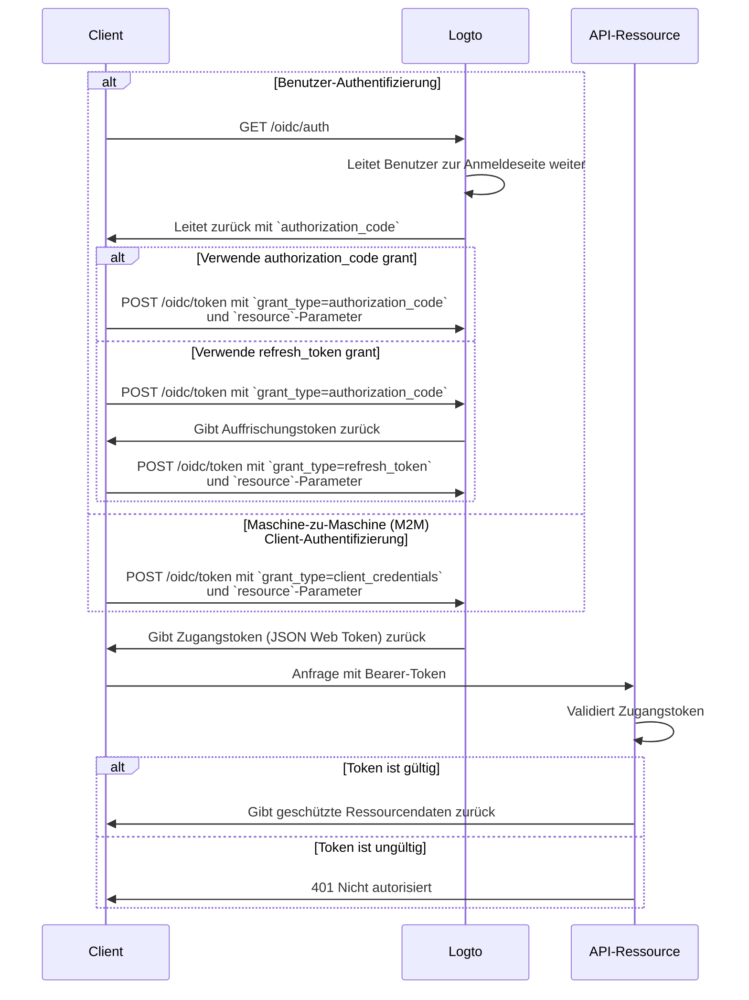

import TabItem from '@theme/TabItem';
import Tabs from '@theme/Tabs';

import illustration from '@site/docs/authorization/assets/rbac-global-api-resources.png';
import AuthorizationRequestExample from '@site/docs/authorization/fragments/AuthorizationRequestExample';
import ClientCredentialsRequestExample from '@site/docs/authorization/fragments/ClientCredentialsRequestExample';
import TokenRequestExample from '@site/docs/authorization/fragments/TokenRequestExample';

Globale API-Ressourcen schützen

export const resource = 'https://api.your-app.com';

Schütze produktweite APIs mit rollenbasierter Zugangskontrolle (RBAC) in Logto. Weise globale Rollen und Berechtigungen zu, um den Zugriff für alle Benutzer und Clients in deiner Anwendung zu steuern.

## Was sind globale API-Ressourcen? \{#what-are-global-api-resources}

Globale API-Ressourcen sind Endpunkte oder Dienste in deiner Anwendung, die für alle Benutzer zugänglich sind, unabhängig von Organisation oder Mandant. Dies sind typischerweise öffentlich zugängliche APIs, zentrale Produktdienste oder jeder Endpunkt, der nicht auf eine bestimmte Organisation beschränkt ist.

**Anwendungsfälle umfassen**

- Öffentliche APIs oder Endpunkte, die von deiner gesamten Benutzerbasis geteilt werden.
- Microservices, die nicht an Multi-Tenancy gebunden sind.
- Zentrale Anwendungs-APIs (z. B. `/api/users`, `/api/products`), die von allen Kunden genutzt werden.

Logto ermöglicht es dir, diese APIs mit OAuth 2.1 in Kombination mit flexibler, rollenbasierter Zugangskontrolle abzusichern.

## So funktioniert es in Logto \{#how-it-works-in-logto}

- **API-Ressourcen und Berechtigungen werden global registriert:** Jede API, die du schützen möchtest, wird mit einem eindeutigen Ressourcenindikator (URI) und einem Satz von Berechtigungen (Scopes) definiert, die den Zugriff steuern.
- **Der Zugriff wird durch globale Rollen gesteuert:** Du kannst Berechtigungen Rollen zuweisen, die dann Benutzern oder Clients zugewiesen werden.
- **Getrennt von organisationsbezogenen Berechtigungen:** Globale API-Ressourcen haben keinen Organisationskontext. Sie können jedoch in Verbindung mit Organisationsrollen verwendet werden, um bei Bedarf eine zusätzliche Kontextebene bereitzustellen. Um organisationsbezogene APIs zu schützen, siehe [Organisationsbezogene API-Ressourcen schützen](/authorization/organization-level-api-resources).

### Überblick über die Implementierung \{#implementation-overview}

1. **Registriere deine API-Ressource** und definiere deren Berechtigungen in Logto.
2. **Definiere Rollen** mit den notwendigen Berechtigungen für den Zugriff auf die API.
3. **Weise Rollen** Benutzern oder Clients zu.
4. **Nutze OAuth 2.0 Autorisierungsflüsse**, um Zugangstokens für die API zu erhalten (der resource-Parameter muss mit dem registrierten API-Identifier übereinstimmen).
5. **Validiere Zugangstokens** in deiner API, um Berechtigungen durchzusetzen.

### Ressourcenindikatoren verstehen \{#understanding-resource-indicators}

Logto modelliert API-Ressourcen gemäß [RFC 8707: Resource Indicators for OAuth 2.0](https://www.rfc-editor.org/rfc/rfc8707.html). Ein **Ressourcenindikator** ist eine URI, die die angeforderte Ziel-API oder den Dienst eindeutig identifiziert.

**Wichtige Punkte**

- Ressourcenindikatoren müssen absolute URIs sein (z. B. `https://api.example.com`)
- Kein Fragmentbestandteil; vermeide nach Möglichkeit die Verwendung von Query-Strings.
- Ressourcenindikatoren ermöglichen zielgruppenbeschränkte Tokens und unterstützen Multi-API-Architekturen.

**Beispiel**

- Management API: `https://my-tenant.logto.app/api`
- Benutzerdefinierte globale API: `https://api.yourapp.com`

### Autorisierungsfluss: Authentifizierung und Absicherung deiner API \{#authorization-flow-authenticating-and-securing-your-api}

Der folgende Ablauf gilt sowohl für interaktive Benutzer-Authentifizierung (Browser / App) als auch für Backend-Maschine-zu-Maschine (M2M)-Szenarien.

Bitte beachte, dass der Ablauf keine vollständigen Details zu den erforderlichen Parametern oder Headern enthält, sondern sich auf die wichtigsten Schritte konzentriert. Lies weiter, um zu sehen, wie der Ablauf in der Praxis funktioniert.

_Benutzer-Authentifizierung = Browser / App. M2M = Backend-Dienst oder Skript mit Client-Credentials._

:::note
Der `resource`-Parameter muss exakt mit dem API-Identifier (Ressourcenindikator) übereinstimmen, den du in Logto registriert hast.
:::

## Umsetzungsschritte \{#implementation-steps}

### Registriere deine API-Ressourcen \{#register-your-api-resources}

1. Gehe zu <CloudLink to="/api-resources">Konsole → API-Ressourcen</CloudLink>.
2. Erstelle eine neue API-Ressource (z. B. `https://api.yourapp.com/org`) und definiere deren Berechtigungen (Scopes).

Für vollständige Konfigurationsschritte siehe [API-Ressourcen mit Berechtigungen definieren](/authorization/role-based-access-control#define-api-resources-with-permissions).

### Richte globale Rollen ein \{#set-up-global-roles}

1. Gehe zu <CloudLink to="/roles">Konsole → Rollen</CloudLink>.
2. Erstelle Rollen, die deinen API-Berechtigungen entsprechen (z. B. `read:products`, `write:products`).
3. Weise diese Rollen Benutzern oder Clients zu, die Zugriff auf die API benötigen.

Für vollständige Konfigurationsschritte siehe [Globale Rollen verwenden](/authorization/role-based-access-control#configure-global-roles).

### Zugangstokens für globale API-Ressourcen erhalten \{#obtain-access-tokens-for-global-api-resources}

Bevor du auf eine globale API-Ressource zugreifst, muss dein Client ein Zugangstoken erhalten. Logto stellt [JSON Web Tokens (JWTs)](https://auth.wiki/jwt) als Zugangstokens für globale API-Ressourcen aus. Dies geschieht typischerweise über den [OAuth 2.0 Authorization Code Flow](https://auth.wiki/authorization-code-flow), [Auffrischungstoken-Flow](https://auth.wiki/refresh-token) oder den [Client-Credentials-Flow](https://auth.wiki/client-credentials-flow).

#### Authorization Code oder Auffrischungstoken-Flow \{#authorization-code-or-refresh-token-flow}

Alle offiziellen Logto SDKs unterstützen das Abrufen von Zugangstokens für globale API-Ressourcen mit dem Auffrischungstoken-Flow direkt. Eine Standard-OAuth 2.0 / OIDC-Clientbibliothek kann ebenfalls verwendet werden, um diesen Flow zu implementieren.

<Tabs groupId="user-client">
<TabItem value="logto-sdk" label="Logto SDK">

Beim Initialisieren des Logto-Clients füge den Ressourcenindikator zum `resources`-Parameter (Array) hinzu und die gewünschten Berechtigungen (Scopes) zum `scopes`-Parameter.

Sobald der Benutzer authentifiziert ist, übergib den Ressourcenindikator im `resource`-Parameter oder einem ähnlich benannten Parameter, wenn du das Zugangstoken anforderst (z. B. beim Aufruf von `getAccessToken()`).

Details zu jedem SDK findest du in den [Quick Starts](/quick-starts).

</TabItem>
<TabItem value="oauth-client" label="OAuth 2.0 / OIDC client library">

Beim Konfigurieren deines OAuth 2.0-Clients oder beim Initialisieren des Authorization Code Flows stelle sicher, dass du den `resource`-Parameter und die gewünschten Scopes in der Autorisierungsanfrage einschließt.

Einige Bibliotheken unterstützen den `resource`-Parameter nicht nativ, erlauben aber in der Regel das Hinzufügen zusätzlicher Parameter in der Autorisierungsanfrage. Prüfe die Dokumentation deiner Bibliothek für Details.

Hier ist ein nicht-normatives Beispiel für die Autorisierungsanfrage mit den Parametern `resource` und `scope`:

<AuthorizationRequestExample resource={resource} scope="read:products write:products" />

Sobald der Benutzer authentifiziert ist, erhältst du einen Authorization Code. Tausche diesen Code gegen ein Zugangstoken aus, indem du eine POST-Anfrage an Logtos `/oidc/token`-Endpunkt stellst und den `resource`-Parameter im Anfragekörper einschließt.

Hier ist ein nicht-normatives Beispiel für die Token-Anfrage mit dem Authorization Code Grant Type:

<TokenRequestExample grantType="authorization_code" resource={resource} />

Du kannst auch den Grant Type `refresh_token` verwenden, um ein neues Zugangstoken ohne Benutzerinteraktion zu erhalten, solange der `resource`-Parameter in der Anfrage enthalten ist.

Hier ist ein nicht-normatives Beispiel für die Token-Anfrage mit dem Refresh Token Grant Type:

<TokenRequestExample grantType="refresh_token" resource={resource} />

</TabItem>
</Tabs>

#### Client-Credentials-Flow \{#client-credentials-flow}

Für Maschine-zu-Maschine (M2M)-Szenarien kannst du den Client-Credentials-Flow verwenden, um ein Zugangstoken für deine globale API-Ressource zu erhalten. Durch eine POST-Anfrage an Logtos `/oidc/token`-Endpunkt kannst du ein Zugangstoken mit deiner Client-ID und deinem Secret anfordern.

Es gibt zwei wichtige Parameter, die in der Anfrage enthalten sein müssen:

- `resource`: Die Ressourcenindikator-URI der API, auf die du zugreifen möchtest (z. B. `https://api.yourapp.com`).
- `scope`: Die Berechtigungen, die du für die API anfordern möchtest (z. B. `read:products write:products`).

Hier ist ein nicht-normatives Beispiel für die Token-Anfrage mit dem Client Credentials Grant Type:

<ClientCredentialsRequestExample
  resource="https://api.yourapp.com"
  scope="read:products write:products"
/>

### JWT-Zugangstokens in deiner API validieren \{#validating-jwt-access-tokens-in-your-api}

Von Logto ausgestellte JWTs enthalten Ansprüche, die deine API zur Durchsetzung der Autorisierung verwenden kann.

Wenn deine API eine Anfrage mit einem von Logto ausgestellten Zugangstoken erhält, solltest du:

- Die Token-Signatur überprüfen (mit Logtos JWKs).
- Bestätigen, dass das Token nicht abgelaufen ist (`exp`-Anspruch).
- Prüfen, dass der `iss` (Aussteller) mit deinem Logto-Endpunkt übereinstimmt.
- Sicherstellen, dass der `aud` (Zielgruppe) mit dem registrierten API-Ressourcenindikator übereinstimmt (z. B. `https://api.yourapp.com`).
- Den `scope`-Anspruch (durch Leerzeichen getrennt) aufteilen und auf erforderliche Berechtigungen prüfen.

Für Schritt-für-Schritt- und sprachspezifische Anleitungen siehe [Wie man Zugangstokens validiert](/authorization/validate-access-tokens).

### Optional: Benutzerberechtigungsänderung behandeln \{#optional-handle-user-permission-change}

:::info
👷 In Arbeit. 🚧
:::

## Best Practices und Sicherheitstipps \{#best-practices-and-security-tips}

- **Halte Berechtigungen geschäftsorientiert:** Verwende klare Namen, die echten Aktionen entsprechen.
- **Halte die Token-Gültigkeit kurz:** Reduziert das Risiko bei einem Token-Leak.
- **Beschränke gewährte Scopes:** Gib Tokens nur die Berechtigungen, die sie tatsächlich benötigen.
- **Verwende Zielgruppenbeschränkung:** Überprüfe immer den `aud`-Anspruch, um Missbrauch zu verhindern.

## FAQs \{#faqs}

### Was, wenn mein Client den resource-Parameter nicht unterstützt? \{#what-if-my-client-doesn-t-support-the-resource-parameter}

Setze eine Standard-API-Ressource in der Logto-Konsole. Tokens verwenden diese Zielgruppe, wenn im Token-Request kein resource-Parameter angegeben ist.

### Warum erhalte ich 401 Nicht autorisiert von meiner API? \{#why-do-i-get-401-unauthorized-from-my-api}

Überprüfe die folgenden häufigen Probleme:

- **Token-Signatur**: Stelle sicher, dass dein Backend die richtigen JWKs von Logto abruft
- **Token-Gültigkeit**: Stelle sicher, dass das Token nicht abgelaufen ist (`exp`-Anspruch)
- **Zielgruppe**: Prüfe, dass der `aud`-Anspruch mit deinem registrierten API-Ressourcenindikator übereinstimmt
- **Erforderliche Scopes**: Stelle sicher, dass das Token die notwendigen Berechtigungen im `scope`-Anspruch enthält

### Wie kann ich ohne vollständigen Client testen? \{#how-do-i-test-without-a-full-client}

Verwende ein [Personal Access Token](/user-management/personal-access-token), um authentifizierte Aufrufe zu simulieren. So kannst du deine API-Endpunkte testen, ohne einen vollständigen OAuth-Flow in deiner Client-Anwendung zu implementieren.

## Weiterführende Literatur \{#further-reading}

<Url href="/authorization/validate-access-tokens">Wie man Zugangstokens validiert</Url>
<Url href="/use-cases/authorization/rbac-in-practice">
  RBAC in der Praxis: Sichere Autorisierung für deine Anwendung implementieren
</Url>
<Url href="/developers/custom-token-claims">Token-Ansprüche anpassen</Url>
<Url href="https://www.rfc-editor.org/rfc/rfc8707.html">RFC 8707: Ressourcenindikatoren</Url>
