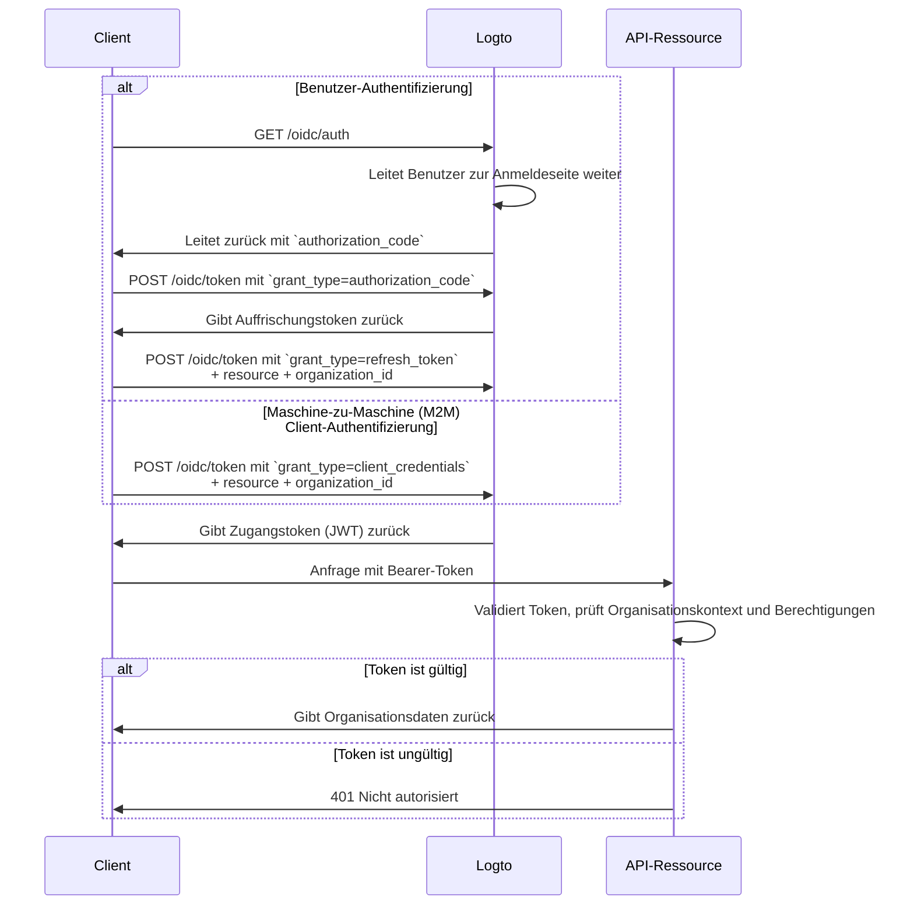

import TabItem from '@theme/TabItem';
import Tabs from '@theme/Tabs';

import illustration from '@site/docs/authorization/assets/rbac-organization-level-api-resources.png';
import AuthorizationRequestExample from '@site/docs/authorization/fragments/AuthorizationRequestExample';
import ClientCredentialsRequestExample from '@site/docs/authorization/fragments/ClientCredentialsRequestExample';
import TokenRequestExample from '@site/docs/authorization/fragments/TokenRequestExample';
import InspectOrganizationClaim from './fragments/_inspect-organization-claim.md';
import OrganizationTokenWarning from './fragments/_organization-token-warning.md';

# Organisationsebene API-Ressourcen schützen

export const resource = 'https://api.your-app.com/organizations';

Kombiniere API-Ressourcen mit der Organisationstemplate, um den Zugriff auf APIs und Daten innerhalb jeder Organisation zu beschränken und so eine Mandantenisolation in deinem SaaS sicherzustellen.

## Was sind API-Ressourcen auf Organisationsebene? \{#what-are-organization-level-api-resources}

API-Ressourcen auf Organisationsebene sind Endpunkte oder Dienste in deiner Anwendung, die **auf eine bestimmte Organisation beschränkt** sind. Diese APIs erzwingen Autorisierung und Zugriff basierend auf dem Organisationskontext – so wird sichergestellt, dass Benutzer oder Clients nur auf Daten und Aktionen zugreifen, die für ihre Organisation relevant sind.

**Anwendungsfälle umfassen**

- APIs zur Verwaltung von Organisationsmitgliedern, Rollen oder Einstellungen (z. B. `/organizations/{organizationId}/members`)
- Organisationsbezogene Dashboards, Analysen oder Berichte
- Abrechnungs-, Abonnement- oder Audit-Endpunkte, die an eine Organisation gebunden sind
- Jede API, bei der Aktionen und Daten pro Mandant isoliert sind

Logto ermöglicht es dir, diese Organisations-APIs mit OAuth 2.1 und rollenbasierter Zugangskontrolle (RBAC) abzusichern und unterstützt dabei Multi-Tenant-SaaS-Architekturen.

Diese Berechtigungen werden über **Organisationsrollen** verwaltet, die in der [Organisationstemplate](/authorization/organization-template) definiert sind. Jede Organisation verwendet die gleiche Vorlage, was ein konsistentes Berechtigungsmodell über alle Organisationen hinweg gewährleistet.

## So funktioniert es in Logto \{#how-it-works-in-logto}

- **API-Ressourcen und Berechtigungen werden global registriert:** Jede API-Ressource wird mit einem eindeutigen Ressourcenindikator (URI) und einem Satz von Berechtigungen (Scopes) in Logto definiert.
- **Rollen auf Organisationsebene:** Organisationsrollen werden in der Organisationstemplate definiert. API-Ressourcenberechtigungen (Scopes) werden den Organisationsrollen zugewiesen, die dann Benutzern oder Clients **innerhalb jeder Organisation** zugewiesen werden.
- **Kontextbewusste Autorisierung:** Wenn ein Client ein Zugangstoken mit sowohl einer API-Ressource als auch einer `organization_id` anfordert, stellt Logto ein Token aus, das sowohl den Organisationskontext als auch die API-Zielgruppe enthält. Die Berechtigungen (Scopes) des Tokens werden durch die Organisationsrollen des Benutzers für die angegebene Organisation bestimmt.
- **Trennung von globalen Ressourcen:** API-Ressourcen können mit oder ohne Organisationskontext aufgerufen werden. Organisation RBAC wird nur angewendet, wenn eine `organization_id` in der Anfrage enthalten ist. Für APIs, die für alle Benutzer freigegeben sind, siehe [Globale API-Ressourcen schützen](/authorization/global-api-resources).

### Überblick über die Implementierung \{#implementation-overview}

1. **Registriere deine API-Ressource** und definiere deren Berechtigungen (Scopes) in Logto.
2. **Definiere Organisationsrollen** in der Organisationstemplate und weise relevante API-Berechtigungen zu.
3. **Weise Rollen** Benutzern oder Clients innerhalb jeder Organisation zu.
4. **Fordere ein Zugangstoken** für die API mit einer `organization_id` an, um den Organisationskontext einzubeziehen.
5. **Validiere Zugangstokens** in deiner API und erzwinge sowohl Organisationskontext als auch Berechtigungen.

### Wie Logto Organisation RBAC anwendet \{#how-logto-applies-organization-rbac}

- Wenn du ein Zugangstoken **ohne** eine `organization_id` anforderst, werden nur globale Rollen / Berechtigungen berücksichtigt.
- Wenn du ein Zugangstoken **mit** einer `organization_id` anforderst, bewertet Logto die Organisationsrollen des Benutzers und deren zugehörige Berechtigungen für diese Organisation.
- Das resultierende JWT enthält sowohl die API-Zielgruppe (`aud` Anspruch) als auch den Organisationskontext (`organization_id` Anspruch), wobei die Scopes auf diejenigen gefiltert werden, die durch die Organisationsrollen des Benutzers gewährt werden.

### Autorisierungsablauf: Authentifizierung und Absicherung von APIs mit Organisationskontext \{#authorization-flow-authenticating-and-securing-apis-with-organization-context}

Der folgende Ablauf zeigt, wie ein Client (Web, Mobile oder Backend) Organisationstokens erhält und verwendet, um auf API-Ressourcen auf Organisationsebene zuzugreifen.

Beachte, dass der Ablauf keine vollständigen Details zu den erforderlichen Parametern oder Headern enthält, sondern sich auf die wichtigsten Schritte konzentriert. Lies weiter, um zu sehen, wie der Ablauf in der Praxis funktioniert.

_Benutzer-Authentifizierung = Browser / App. M2M = Backend-Service oder Skript mit Client-Credentials + Organisationskontext._

## Implementierungsschritte \{#implementation-steps}

### Registriere deine API-Ressource \{#register-your-api-resource}

1. Gehe zu <CloudLink to="/api-resources">Konsole → API-Ressourcen</CloudLink>.
2. Erstelle eine neue API-Ressource (z. B. `https://api.yourapp.com/org`) und definiere deren Berechtigungen (Scopes).

Für vollständige Konfigurationsschritte siehe [API-Ressourcen mit Berechtigungen definieren](/authorization/role-based-access-control#define-api-resources-with-permissions).

### Organisationsrollen einrichten \{#set-up-organization-roles}

1. Gehe zu <CloudLink to="/organization-template/organization-roles">Konsole → Organisationstemplate → Organisationsrollen</CloudLink>.
2. Erstelle Organisationsrollen (z. B. `admin`, `member`) und weise jeder Rolle API-Berechtigungen zu.
3. Weise Rollen Benutzern oder Clients innerhalb jeder Organisation zu. Falls sie noch keine Mitglieder sind, lade sie zuerst ein oder füge sie hinzu.

Für vollständige Konfigurationsschritte siehe [Organisationsrollen verwenden](/authorization/role-based-access-control#configure-organization-roles).

### Organisationstokens für API-Ressourcen erhalten \{#obtain-organization-tokens-for-api-resources}

Dein Client / deine App sollte ein Token mit sowohl `resource` als auch `organization_id` anfordern, um auf APIs auf Organisationsebene zuzugreifen. Logto stellt Organisationstokens als [JSON Web Tokens (JWTs)](https://auth.wiki/jwt) aus. Du kannst diese entweder über den [Auffrischungstoken-Flow](https://auth.wiki/refresh-token) oder den [Client-Credentials-Flow](https://auth.wiki/client-credentials-flow) erhalten.

#### Auffrischungstoken-Flow \{#refresh-token-flow}

Fast alle offiziellen Logto SDKs unterstützen das Abrufen von Organisationstokens über den Auffrischungstoken-Flow direkt. Eine Standard-OAuth 2.0 / OIDC-Clientbibliothek kann ebenfalls verwendet werden, um diesen Flow zu implementieren.

<Tabs groupId="user-client">
<TabItem value="logto-sdk" label="Logto SDK">

Beim Initialisieren des Logto SDK füge `urn:logto:scope:organizations` und die gewünschten Organisationsberechtigungen (Scopes) zum `scopes`-Parameter hinzu.

Einige Logto SDKs haben einen vordefinierten Scope für Organisationen, wie z. B. `UserScope.Organizations` in JavaScript SDKs.

<InspectOrganizationClaim />

Beim Aufruf von `getAccessToken()` gib sowohl die API-Ressource (`resource`) als auch die Organisations-ID (`organizationId`) an, um ein Organisationstoken zu erhalten.

Für Details zu jedem SDK siehe [Quick starts](/quick-starts).

</TabItem>
<TabItem value="oauth-client" label="OAuth 2.0 / OIDC Client-Bibliothek">

Beim Konfigurieren deines OAuth 2.0 Clients oder beim Initialisieren des Authorization-Code-Flows stelle sicher, dass du folgende Parameter einschließt:

- `resource`: Setze dies auf den in Logto registrierten API-Ressourcenbezeichner (z. B. `https://api.your-app.com/organizations`).
- `scope`: Füge den vordefinierten Organisationsscope (`urn:logto:scope:organizations`), `offline_access` (um Auffrischungstokens zu erhalten) und alle spezifischen API-Berechtigungen hinzu, die du benötigst (z. B. `manage:members view:analytics`).

Einige Bibliotheken unterstützen den `resource`-Parameter nicht nativ, erlauben aber in der Regel das Übergeben zusätzlicher Parameter in der Autorisierungsanfrage. Prüfe die Dokumentation deiner Bibliothek für Details.

Hier ist ein nicht-normatives Beispiel, wie die Autorisierungsanfrage aussehen könnte:

<AuthorizationRequestExample
  resource={resource}
  scope="urn:logto:scope:organizations invite:member manage:billing"
/>

Sobald der Benutzer authentifiziert ist, erhältst du einen Authorization-Code. Verwende diesen Code, indem du eine POST-Anfrage an Logtos `/oidc/token`-Endpunkt stellst.

Hier ist ein nicht-normatives Beispiel für die Token-Anfrage:

<TokenRequestExample grantType="authorization_code" />

<OrganizationTokenWarning />

Du erhältst ein Auffrischungstoken, das verwendet werden kann, um Organisationstokens zu erhalten.

<InspectOrganizationClaim />

Verwende schließlich das Auffrischungstoken, um ein Organisationstoken zu erhalten, indem du eine POST-Anfrage an Logtos `/oidc/token`-Endpunkt stellst. Denke daran, Folgendes einzuschließen:

- Den `resource`-Parameter, gesetzt auf den API-Ressourcenbezeichner (z. B. `https://api.yourapp.com/org`).
- Den `organization_id`-Parameter, gesetzt auf die gewünschte Organisations-ID.
- (Optional) Den `scope`-Parameter, um die benötigten Berechtigungen weiter einzuschränken (z. B. `manage:members view:reports`).

Hier ist ein nicht-normatives Beispiel, wie die Token-Anfrage aussehen könnte:

<TokenRequestExample
  grantType="refresh_token"
  resource={resource}
  organizationId="your-organization-id"
/>

</TabItem>
</Tabs>

#### Client-Credentials-Flow \{#client-credentials-flow}

Für Maschine-zu-Maschine (M2M)-Szenarien kannst du den Client-Credentials-Flow verwenden, um ein Zugangstoken für API-Ressourcenberechtigungen auf Organisationsebene zu erhalten. Durch eine POST-Anfrage an Logtos `/oidc/token`-Endpunkt mit Organisationsparametern kannst du ein Organisationstoken mit deiner Client-ID und deinem Secret anfordern.

Hier sind die wichtigsten Parameter, die in der Anfrage enthalten sein sollten:

- `resource`: Der API-Ressourcenbezeichner (z. B. `https://api.yourapp.com/org`).
- `organization_id`: Die ID der Organisation, für die du das Token möchtest.
- `scope`: Die API-Ressourcenberechtigungen auf Organisationsebene, die du anfordern möchtest (z. B. `invite:member`, `manage:billing`).

Hier ist ein nicht-normatives Beispiel für die Token-Anfrage mit dem Client-Credentials-Grant-Typ:

<ClientCredentialsRequestExample
  resource="https://api.yourapp.com/org"
  organizationId="your-organization-id"
  scope="invite:member manage:billing"
/>

### Organisationstokens validieren \{#validate-organization-tokens}

Von Logto ausgestellte Organisationstokens (JWTs) enthalten Ansprüche, die deine API zur Durchsetzung der Zugangskontrolle auf Organisationsebene verwenden kann.

Wenn deine App ein Organisationstoken erhält, solltest du:

- Die Signatur des Tokens überprüfen (mit Logtos JWKs).
- Bestätigen, dass das Token nicht abgelaufen ist (`exp` Anspruch).
- Prüfen, dass der `iss` (Aussteller) mit deinem Logto-Endpunkt übereinstimmt.
- Sicherstellen, dass der `aud` (Zielgruppe) mit dem registrierten API-Ressourcenbezeichner übereinstimmt (z. B. `https://api.yourapp.com/org`).
- Den `organization_id`-Anspruch validieren, um sicherzustellen, dass das Token auf die richtige Organisation beschränkt ist.
- Den `scope`-Anspruch (durch Leerzeichen getrennt) aufteilen und auf erforderliche Berechtigungen prüfen.
- Wenn dein API-Pfad die Organisations-ID enthält (z. B. `/organizations/{organizationId}/members`), stelle sicher, dass der `organization_id`-Anspruch mit dem Pfadparameter übereinstimmt.

Für Schritt-für-Schritt- und sprachspezifische Anleitungen siehe [Wie man Zugangstokens validiert](/authorization/validate-access-tokens).

## Best Practices und Sicherheitstipps \{#best-practices-and-security-tips}

- **Validiere immer den Organisationskontext:** Vertraue nicht nur dem Token; prüfe den `organization_id`-Anspruch bei jedem organisationsbezogenen API-Aufruf.
- **Verwende Zielgruppenbeschränkungen:** Prüfe immer den `aud`-Anspruch, um sicherzustellen, dass das Token für die beabsichtigte Organisation bestimmt ist.
- **Halte Berechtigungen geschäftsgetrieben:** Verwende klare Namen, die echten Aktionen entsprechen; gewähre nur das, was für jede Organisationsrolle benötigt wird.
- **Trenne API- und Nicht-API-Berechtigungen**, wo möglich (aber beide können in einer Rolle enthalten sein).
- **Halte Token-Lebensdauern kurz:** Reduziert das Risiko, falls ein Token kompromittiert wird.
- **Überprüfe regelmäßig deine Organisationstemplate:** Aktualisiere Rollen und Berechtigungen, während sich dein Produkt weiterentwickelt.

## FAQs \{#faqs}

### Was passiert, wenn ich `organization_id` nicht in meiner Token-Anfrage angebe? \{#what-if-i-don-t-include-organization-id-in-my-token-request}

Es werden nur globale Rollen / Berechtigungen ausgewertet. Organisation RBAC wird nicht angewendet.

### Kann ich Organisations- und Nicht-Organisationsberechtigungen in einer Rolle mischen? \{#can-i-mix-organization-and-non-organization-permissions-in-a-single-role}

Nein, Organisationsberechtigungen (einschließlich API-Berechtigungen auf Organisationsebene) werden durch die Organisationstemplate definiert und können nicht mit globalen API-Berechtigungen gemischt werden. Du kannst jedoch Rollen erstellen, die sowohl Organisationsberechtigungen als auch API-Berechtigungen auf Organisationsebene enthalten.

## Weiterführende Literatur \{#further-reading}

<Url href="/authorization/validate-access-tokens">Wie man Zugangstokens validiert</Url>
<Url href="/developers/custom-token-claims">Token-Ansprüche anpassen</Url>
<Url href="/use-cases/multi-tenancy/build-multi-tenant-saas-application">
  Anwendungsfall: Multi-Tenant-SaaS-Anwendung bauen
</Url>
<Url href="https://www.rfc-editor.org/rfc/rfc8707.html">RFC 8707: Ressourcenindikatoren</Url>
