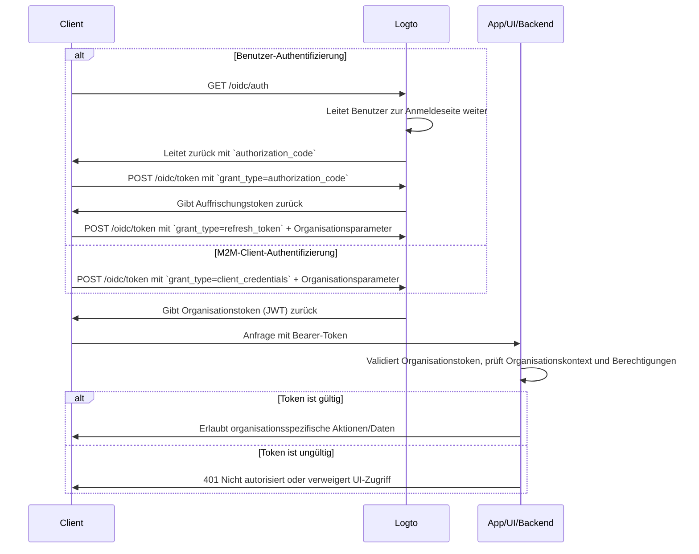

import illustration from '@site/docs/authorization/assets/rbac-organization-permissions.png';
import AuthorizationRequestExample from '@site/docs/authorization/fragments/AuthorizationRequestExample';
import ClientCredentialsRequestExample from '@site/docs/authorization/fragments/ClientCredentialsRequestExample';
import TokenRequestExample from '@site/docs/authorization/fragments/TokenRequestExample';
import TabItem from '@theme/TabItem';
import Tabs from '@theme/Tabs';

import InspectOrganizationClaim from './fragments/_inspect-organization-claim.md';
import OrganizationTokenWarning from './fragments/_organization-token-warning.md';

# Organisation (Nicht-API) Berechtigungen schützen

Verwende die Organisation-Vorlage, um organisationsweite Rollen und Berechtigungen in Logto zu verwalten und durchzusetzen. So steuerst du den Zugriff auf In-App-Funktionen und Workflows im Kontext einer Organisation.

## Was sind Organisation (Nicht-API) Berechtigungen? \{#what-are-organization-non-api-permissions}

Organisationsberechtigungen (Nicht-API) steuern, was Benutzer **im Kontext einer Organisation** tun können, werden aber **nicht auf API-Ebene durchgesetzt**. Stattdessen regeln sie den Zugriff auf App-Funktionen, UI-Elemente, Workflows oder Geschäftsaktionen und nicht auf Backend-APIs.

**Anwendungsfälle sind unter anderem**

- Mitglieder innerhalb einer Organisation einladen oder verwalten
- Organisationsrollen zuweisen oder ändern
- Abrechnung, Einstellungen oder administrative Funktionen für eine Organisation verwalten
- Zugriff auf Dashboards, Analysen oder interne Tools, die keine API-Endpunkte haben

Logto ermöglicht es dir, diese Organisationsberechtigungen mit OAuth 2.1 und rollenbasierter Zugangskontrolle (RBAC) abzusichern und unterstützt dabei Multi-Tenant-SaaS-Architekturen.

Diese Berechtigungen werden über **Organisationsrollen** verwaltet, die in der [Organisation-Vorlage](/authorization/organization-template) definiert sind. Jede Organisation verwendet die gleiche Vorlage, was ein konsistentes Berechtigungsmodell über alle Organisationen hinweg sicherstellt.

## So funktioniert es in Logto \{#how-it-works-in-logto}

- **Organisationsebene RBAC:** Rollen und Berechtigungen werden in der Organisation-Vorlage definiert. Wenn ein Benutzer einer Organisation beitritt, werden ihm eine oder mehrere Rollen zugewiesen, die bestimmte Berechtigungen gewähren.
- **Nicht-API-Durchsetzung:** Berechtigungen werden in der UI deiner App, im Workflow oder in der Backend-Logik geprüft und durchgesetzt, nicht zwingend durch ein API-Gateway.
- **Trennung vom API-Schutz:** Organisation (Nicht-API) Berechtigungen sind von API-Ressourcenberechtigungen getrennt. Du kannst beide für fortgeschrittene Szenarien kombinieren.

  

### Überblick zur Implementierung \{#implementation-overview}

1. **Definiere Organisationsberechtigungen** in Logto unter der Organisation-Vorlage.
2. **Erstelle Organisationsrollen**, die die notwendigen Berechtigungen für deine organisationsspezifischen Aktionen bündeln.
3. **Weise Rollen** Benutzern oder Clients innerhalb jeder Organisation zu.
4. **Erhalte ein Organisationstoken (JWT)** für die aktuelle Organisation entweder über das Auffrischungstoken oder den Client-Credentials-Flow.
5. **Validiere Zugangstokens** in der UI oder im Backend deiner App, um Organisationsberechtigungen durchzusetzen.

### Autorisierungsablauf: Authentifizierung und Absicherung von Organisationsberechtigungen \{#authorization-flow-authenticating-and-securing-organization-permissions}

Der folgende Ablauf zeigt, wie ein Client (Web, Mobile oder Backend) Organisationstokens für die Durchsetzung von Nicht-API-Berechtigungen erhält und verwendet.

Beachte, dass der Ablauf keine vollständigen Details zu den erforderlichen Parametern oder Headern enthält, sondern sich auf die wichtigsten Schritte konzentriert. Lies weiter, um zu sehen, wie der Ablauf in der Praxis funktioniert.

_Benutzer-Authentifizierung = Browser/App. M2M = Backend-Service oder Skript mit Client-Credentials + Organisationskontext._

## Implementierungsschritte \{#implementation-steps}

### Organisationsberechtigungen registrieren \{#register-organization-permissions}

1. Gehe zu <CloudLink to="/organization-template/organization-permissions">Konsole → Organisation-Vorlage → Organisationsberechtigungen</CloudLink>.
2. Definiere die benötigten Organisationsberechtigungen (z. B. `invite:member`, `manage:billing`, `view:analytics`).

Für vollständige Konfigurationsschritte siehe [Organisationsberechtigungen definieren](/authorization/role-based-access-control#define-organization-permissions).

### Organisationsrollen einrichten \{#set-up-organization-roles}

1. Gehe zu <CloudLink to="/organization-template/organization-roles">Konsole → Organisation-Vorlage → Organisationsrollen</CloudLink>.
2. Erstelle Rollen, die die zuvor definierten Organisationsberechtigungen bündeln (z. B. `admin`, `member`, `billing`).
3. Weise diese Rollen Benutzern oder Clients innerhalb jeder Organisation zu.

Für vollständige Konfigurationsschritte siehe [Organisationsrollen verwenden](/authorization/role-based-access-control#configure-organization-roles).

### Organisationstokens (Nicht-API) erhalten \{#obtain-organization-tokens-non-api}

Dein Client/App sollte ein Organisationstoken (Nicht-API) erhalten, um auf Organisationsberechtigungen zuzugreifen. Logto stellt Organisationstokens als [JSON Web Tokens (JWTs)](https://auth.wiki/jwt) aus. Du kannst diese entweder über den [Auffrischungstoken-Flow](https://auth.wiki/refresh-token) oder den [Client-Credentials-Flow](https://auth.wiki/client-credentials-flow) erhalten.

#### Auffrischungstoken-Flow \{#refresh-token-flow}

Fast alle offiziellen Logto SDKs unterstützen das Abrufen von Organisationstokens über den Auffrischungstoken-Flow direkt. Eine Standard-OAuth 2.0 / OIDC-Client-Bibliothek kann ebenfalls verwendet werden, um diesen Flow zu implementieren.

<Tabs groupId="user-client">
<TabItem value="logto-sdk" label="Logto SDK">

Beim Initialisieren des Logto SDK füge `urn:logto:scope:organizations` und die gewünschten Organisationsberechtigungen (Berechtigungen) zum `scopes`-Parameter hinzu.

Einige Logto SDKs haben einen vordefinierten Scope für Organisationen, wie `UserScope.Organizations` in JavaScript SDKs.

<InspectOrganizationClaim />

Verwende `getOrganizationToken` oder eine ähnliche Methode (wie `getAccessToken` mit einer Organisations-ID), um ein Organisationstoken für eine bestimmte Organisation anzufordern.

Für Details zu jedem SDK siehe [Quick starts](/quick-starts).

</TabItem>
<TabItem value="oauth-client" label="OAuth 2.0 / OIDC client library">

Beim Konfigurieren deines OAuth 2.0 Clients oder beim Initialisieren des Authorization-Code-Flows stelle sicher, dass du folgende Parameter einfügst:

- `resource`: Setze auf `urn:logto:resource:organizations`, um anzugeben, dass du ein Organisationstoken möchtest.
- `scope`: Füge den vordefinierten Organisation-Scope (`urn:logto:scope:organizations`), `offline_access` (um Auffrischungstokens zu erhalten) und alle spezifischen Organisationsberechtigungen hinzu, die du benötigst (z. B. `invite:member`, `manage:billing`).

Einige Bibliotheken unterstützen den `resource`-Parameter nicht nativ, erlauben aber in der Regel das Übergeben zusätzlicher Parameter in der Autorisierungsanfrage. Prüfe die Dokumentation deiner Bibliothek für Details.

Hier ist ein nicht-normatives Beispiel, wie die Autorisierungsanfrage aussehen könnte:

<AuthorizationRequestExample
  scope="urn:logto:scope:organizations invite:member manage:billing"
  resource="urn:logto:resource:organizations"
/>

Sobald der Benutzer authentifiziert ist, erhältst du einen Authorization-Code. Verwende diesen Code, indem du eine POST-Anfrage an Logtos `/oidc/token`-Endpunkt stellst.

Hier ist ein nicht-normatives Beispiel für die Token-Anfrage:

<TokenRequestExample grantType="authorization_code" />

<OrganizationTokenWarning />

Du erhältst ein Auffrischungstoken, das verwendet werden kann, um Organisationstokens zu erhalten.

<InspectOrganizationClaim />

Verwende schließlich das Auffrischungstoken, um ein Organisationstoken zu erhalten, indem du eine POST-Anfrage an Logtos `/oidc/token`-Endpunkt stellst. Denke daran, Folgendes einzuschließen:

- Den `organization_id`-Parameter, gesetzt auf die gewünschte Organisations-ID.
- (Optional) Den `scope`-Parameter, um die benötigten Berechtigungen weiter einzuschränken (z. B. `manage:members view:reports`).

Hier ist ein nicht-normatives Beispiel, wie die Token-Anfrage aussehen könnte:

<TokenRequestExample grantType="refresh_token" organizationId="your-organization-id" />

</TabItem>
</Tabs>

#### Client-Credentials-Flow \{#client-credentials-flow}

Für Maschine-zu-Maschine (M2M)-Szenarien kannst du den Client-Credentials-Flow verwenden, um ein Zugangstoken für Organisationsberechtigungen zu erhalten. Durch eine POST-Anfrage an Logtos `/oidc/token`-Endpunkt mit Organisationsparametern kannst du ein Organisationstoken mit deiner Client-ID und deinem Secret anfordern.

Hier sind die wichtigsten Parameter, die in der Anfrage enthalten sein sollten:

- `organization_id`: Die ID der Organisation, für die du das Token möchtest.
- `scope`: Die Organisationsberechtigungen, die du anfordern möchtest (z. B. `invite:member`, `manage:billing`).

Hier ist ein nicht-normatives Beispiel für die Token-Anfrage mit dem Client-Credentials-Grant-Typ:

<ClientCredentialsRequestExample
  organizationId="your-organization-id"
  scope="invite:member manage:billing"
/>

### Organisationstokens validieren \{#validate-organization-tokens}

Von Logto ausgestellte Organisationstokens (JWTs) enthalten Ansprüche, die deine App/UI/Backend zur Durchsetzung des organisationsweiten Zugriffs verwenden kann.

Wenn deine App ein Organisationstoken erhält, solltest du:

- Die Token-Signatur überprüfen (mit Logtos JWKs).
- Prüfen, dass das Token nicht abgelaufen ist (`exp`-Anspruch).
- Sicherstellen, dass der `iss` (Aussteller) mit deinem Logto-Endpunkt übereinstimmt.
- Sicherstellen, dass der `aud` (Zielgruppe) mit dem formatierten Organisationsbezeichner übereinstimmt (z. B. `urn:logto:organization:{organization_id}`).
- Den `scope`-Anspruch (durch Leerzeichen getrennt) auf erforderliche Berechtigungen prüfen.

Für Schritt-für-Schritt- und sprachspezifische Anleitungen siehe [Wie man Zugangstokens validiert](/authorization/validate-access-tokens).

## Best Practices und Sicherheitstipps \{#best-practices-and-security-tips}

- **Verlasse dich niemals ausschließlich auf die UI-Durchsetzung:** Prüfe Berechtigungen für kritische Aktionen immer auch im Backend.
- **Verwende Zielgruppenbeschränkungen:** Prüfe immer den `aud`-Anspruch, um sicherzustellen, dass das Token für die beabsichtigte Organisation ist.
- **Halte Berechtigungen geschäftsgetrieben:** Verwende klare Namen, die echten Aktionen entsprechen; gewähre nur das, was für jede Organisationsrolle benötigt wird.
- **Trenne API- und Nicht-API-Berechtigungen**, wo möglich (beide können aber in einer Rolle enthalten sein).
- **Überprüfe die Organisation-Vorlage regelmäßig**, während sich dein Produkt weiterentwickelt.

## FAQs \{#faqs}

### Kann ich Organisations- und Nicht-Organisationsberechtigungen in einer Rolle mischen? \{#can-i-mix-organization-and-non-organization-permissions-in-a-single-role}

Nein, Organisationsberechtigungen (einschließlich organisationsbezogener API-Berechtigungen) werden durch die Organisation-Vorlage definiert und können nicht mit globalen API-Berechtigungen gemischt werden. Du kannst jedoch Rollen erstellen, die sowohl Organisationsberechtigungen als auch organisationsbezogene API-Berechtigungen enthalten.

### Wo sollte ich Nicht-API-Berechtigungen durchsetzen? \{#where-should-i-enforce-non-api-permissions}

Prüfe Nicht-API-Berechtigungen sowohl in der UI (für Feature-Gating) als auch in deiner serverseitigen Logik für sensible Aktionen.

## Weiterführende Literatur \{#further-reading}

<Url href="/authorization/validate-access-tokens">Wie man Zugangstokens validiert</Url>
<Url href="/developers/custom-token-claims">Token-Ansprüche anpassen</Url>
<Url href="/use-cases/multi-tenancy/build-multi-tenant-saas-application">
  Anwendungsfall: Multi-Tenant-SaaS-Anwendung bauen
</Url>
