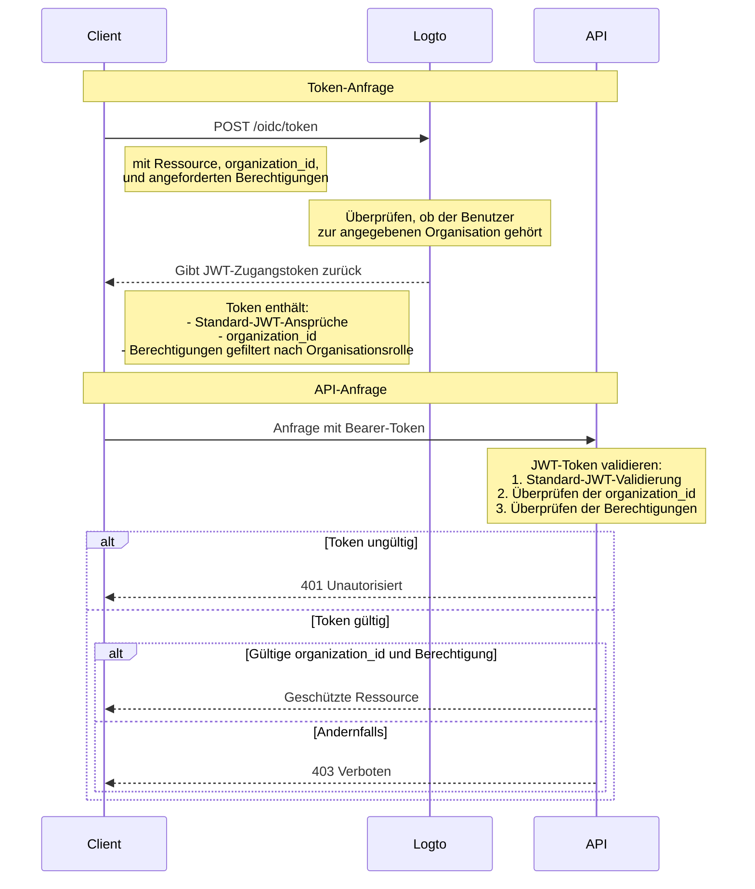

# API-Ressource mit Organisationstemplate schützen

Zusätzlich zu [Schütze deine API](/authorization/api-resources/protect-your-api), das Ressourcen sichert, indem es sicherstellt, dass ein gültiges JWT vorhanden ist, können auch Organisationsrollen angewendet werden, um die Berechtigungen zu filtern. In diesem Artikel konzentrieren wir uns darauf, wie die Organisationsrolle die Berechtigungsdelegation und -validierung in deinem Authentifizierungsablauf beeinflusst.



## Der zusätzliche `organization_id` Parameter

Zusätzlich zur normalen Zugangstoken-Anfrage fügen wir im Diagramm einen zusätzlichen `organization_id` Parameter hinzu. Dieser teilt Logto mit, die Berechtigungen auf die Rollen einer bestimmten Organisation einzugrenzen.

## Client-Einrichtung

Wenn du das SDK von Logto verwendest, kannst du `organization_id` als zweiten Parameter der `getAccessToken` Methode hinzufügen.

```tsx
const accessToken = await logto.getAccessToken('https://my-resource.com/api', 'org_1');

// Oder Ansprüche direkt abrufen
const accessTokenClaims = await logto.getAccessTokenClaims('https://my-resource.com/api', 'org_1');
console.log(accessTokenClaims.organization_id); // 'org_1'
console.log(accessTokenClaims.aud); // 'https://my-resource.com/api'
```

Dann werden nur die Berechtigungen, die von den Rollen dieser Organisation geerbt werden, im Zugangstoken enthalten sein, sowie ein zusätzlicher Anspruch `organization_id`.

## API-Server-Validierung

Zusätzlich zur normalen JWT-Zugangstoken-Validierung musst du eine zusätzliche Ebene hinzufügen, um zu überprüfen, ob `organization_id` vorhanden und gültig ist.
