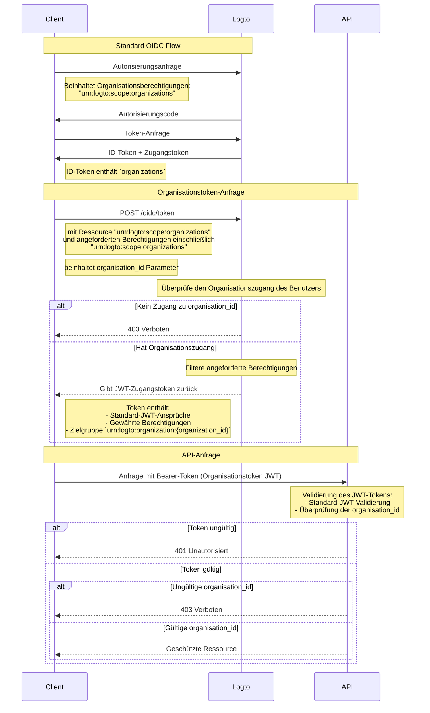

import TabItem from '@theme/TabItem';
import Tabs from '@theme/Tabs';

# Organisationsressourcen schützen

Zusätzlich zu [Schütze deine API](/authorization/api-resources/protect-your-api), bei der die API als Ressource dient, kann auch die Organisation eine Ressource sein und deine Organisationsressource auf die gleiche Weise schützen. In diesem Artikel konzentrieren wir uns darauf, wie du deine Organisationsressource auf ähnliche Weise schützen kannst.



## Schritt 1: Organisation-IDs aus dem OIDC-Flow erhalten \{#step-1-get-organization-ids-from-oidc-flow}

Logto erweitert das Standardprotokoll [OpenID Connect](https://openid.net/specs/openid-connect-core-1_0.html), um deiner App zu ermöglichen, die Organisationsinformationen vom Benutzer zu erhalten. Es gibt zwei Möglichkeiten, dies zu tun:

- Wenn du ein Logto SDK mit Organisationsunterstützung verwendest, kannst du den `urn:logto:scope:organizations` Scope zum `scopes` Parameter des Konfigurationsobjekts hinzufügen. Normalerweise hat das SDK ein Enum für diesen Scope, z.B. `UserScope.Organizations` in [Logto JS SDKs](https://github.com/logto-io/js).

<Tabs groupId="sdk">

  <TabItem value="js" label="JavaScript">

```ts
import { LogtoClient, UserScope } from '@logto/browser'; // oder @logto/node, @logto/client

const logto = new LogtoClient({
  // ...
  scopes: [UserScope.Organizations],
});
```

  </TabItem>
  <TabItem value="react" label="React">

```tsx
import { LogtoProvider, UserScope } from '@logto/react';

const App = () => (
  <LogtoProvider
    config={{
      // ...
      scopes: [UserScope.Organizations],
    }}
  >
    {/* ... */}
  </LogtoProvider>
);
```

  </TabItem>
  <TabItem value="python" label="Python">

```python
from logto import UserInfoScope

client = LogtoClient(
    LogtoConfig(
        # ...
        scopes=[UserInfoScope.organizations],
    )
)
```

  </TabItem>
  <TabItem value="php" label="PHP">

```php
use Logto\Sdk\Constants\UserScope;

$client = new LogtoClient(
  new LogtoConfig(
    // ...
    scopes: [UserScope::organizations],
  )
);
```

  </TabItem>
  <TabItem value="swift" label="Swift">

```swift
import Logto
import LogtoClient

let config = try? LogtoConfig(
    // ...
    scopes: [
        UserScope.organizations.rawValue,
    ],
    // ...
)
let client = LogtoClient(useConfig: config)
```

  </TabItem>
  <TabItem value="others" label="Andere">

```ts
const config = {
  // ...
  scope: 'openid offline_access urn:logto:scope:organizations',
};
```

  </TabItem>

</Tabs>
    
- Für andere Fälle musst du den `urn:logto:scope:organizations` Scope zum `scope` Parameter der SDK-Konfiguration (oder Auth-Anfrage) hinzufügen.

Sobald der Benutzer den Authentifizierungsprozess abgeschlossen hat, kannst du die Organisationsinformationen aus dem `idToken` erhalten:

```tsx
// Verwende JavaScript als Beispiel
const idToken = await logto.getIdTokenClaims();

console.log(idToken.organizations); // Ein String-Array von Organisations-IDs
```

Das `organizations` Feld (Anspruch) wird auch in der Antwort vom [UserInfo-Endpunkt](https://openid.net/specs/openid-connect-core-1_0.html#UserInfo) enthalten sein.

### Optional: Organisationsrollen erhalten \{#optional-get-organization-roles}

Wenn du noch keine Organisationsrollen eingerichtet hast, siehe [diesen Abschnitt](/authorization/organization-template/configure-organization-template/#create-organization-role).

Um alle Organisationsrollen des aktuellen Benutzers zu erhalten:

- Wenn du ein Logto SDK mit Organisationsunterstützung verwendest, kannst du den `urn:logto:scope:organization_roles` Scope zum `scopes` Parameter des Konfigurationsobjekts hinzufügen. Normalerweise hat das SDK ein Enum für diesen Scope, z.B. `UserScope.OrganizationRoles` in [Logto JS SDKs](https://github.com/logto-io/js).
- Für andere Fälle musst du den `urn:logto:scope:organization_roles` Scope zum `scope` Parameter der SDK-Konfiguration (oder Auth-Anfrage) hinzufügen.

Dann kannst du die Organisationsrollen aus dem `idToken` erhalten:

```tsx
// Verwende JavaScript als Beispiel
const idToken = await logto.getIdTokenClaims();

console.log(idToken.organization_roles); // Ein String-Array von Organisationsrollen
```

Jeder String im Array hat das Format `organization_id:role_id`, z.B. `org_123:admin` bedeutet, dass der Benutzer die `admin` Rolle in der Organisation mit der ID `org_123` hat.

Das `organization_roles` Feld (Anspruch) wird auch in der Antwort vom [UserInfo-Endpunkt](https://openid.net/specs/openid-connect-core-1_0.html#UserInfo) enthalten sein.

## Schritt 2. Organisationstoken abrufen \{#step-2-fetch-organization-token}

Um Aktionen im Kontext einer Organisation durchzuführen, muss dem Benutzer ein Zugangstoken für diese Organisation (Organisationstoken) gewährt werden. Das Organisationstoken ist ein JWT-Token, das die Organisations-ID und die Berechtigungen (Scopes) des Benutzers in der Organisation enthält.

### Parameter zur Authentifizierungsanfrage hinzufügen \{#add-parameters-to-the-authentication-request}

- Wenn du ein Logto SDK mit Organisationsunterstützung verwendest, kannst du den `urn:logto:scope:organizations` Scope zum `scopes` Parameter des Konfigurationsobjekts hinzufügen, auf die gleiche Weise wie [Organisation-IDs des aktuellen Benutzers erhalten](/authorization/organization-template/protect-organization-resources/#step-1-get-organization-ids-from-oidc-flow).
  - Logto SDK mit Organisationsunterstützung wird den Rest der Konfiguration automatisch handhaben.
- Für andere Fälle musst du die `offline_access` und `urn:logto:scope:organizations` Scopes zum `scope` Parameter und die `urn:logto:resource:organizations` Ressource zum `resource` Parameter der SDK-Konfiguration (oder Auth-Anfrage) hinzufügen.
  - Hinweis: `offline_access` ist erforderlich, um das `refresh_token` zu erhalten, das verwendet werden kann, um Organisationstokens abzurufen.

```tsx
// Nur für andere Fälle. Für Logto SDKs, siehe oben.
const config = {
  // ...
  scope: 'openid offline_access urn:logto:scope:organizations',
  resource: 'urn:logto:resource:organizations',
};
```

:::note

Die `urn:logto:resource:organizations` Ressource ist eine spezielle Ressource, die die Organisationstemplate darstellt.

:::

### Organisationstoken abrufen \{#fetch-the-organization-token}

Logto erweitert den Standard `refresh_token` Grant-Typ, um deiner App zu ermöglichen, Organisationstokens abzurufen.

- Wenn du ein Logto SDK mit Organisationsunterstützung verwendest, kannst du die `getOrganizationToken()` Methode (oder `getOrganizationTokenClaims()` Methode) des SDKs aufrufen.
- Für andere Fälle musst du den Token-Endpunkt mit den folgenden Parametern aufrufen:
  - `grant_type`: `refresh_token`.
  - `client_id`: Die App-ID, die der Benutzer zur Authentifizierung verwendet hat.
  - `refresh_token`: Das `refresh_token`, das du aus dem Authentifizierungsprozess erhalten hast.
  - `organization_id`: Die ID der Organisation, für die du das Token erhalten möchtest.
  - `scope` (optional): Die Berechtigungen, die du dem Benutzer in der Organisation gewähren möchtest. Wenn nicht angegeben, wird der Autorisierungsserver versuchen, die gleichen Berechtigungen wie im Authentifizierungsprozess zu gewähren.

<Tabs groupId="sdk">

  <TabItem value="js" label="JavaScript">

```ts
const token = await logto.getOrganizationToken('<organization-id>');
```

  </TabItem>
  <TabItem value="react" label="React">

```tsx
const App = () => {
  const { getOrganizationToken } = useLogto();

  const getToken = async () => {
    const token = await getOrganizationToken('<organization-id>');
  };

  return <button onClick={getToken}>Organisationstoken abrufen</button>;
};
```

  </TabItem>
  <TabItem value="python" label="Python">

```python
token = await client.getOrganizationToken("<organization-id>")
# oder
claims = await client.getOrganizationTokenClaims("<organization-id>")
```

  </TabItem>
  <TabItem value="php" label="PHP">

```php
$token = $client->getOrganizationToken('<organization-id>');
// oder
$claims = $client->getOrganizationTokenClaims('<organization-id>');
```

  </TabItem>
  <TabItem value="swift" label="Swift">

```swift
let token = try await client.getOrganizationToken(forId: "<organization-id>")
```

  </TabItem>
  <TabItem value="others" label="Andere">

```ts
// Verwende JavaScript als Beispiel

const params = new URLSearchParams();

params.append('grant_type', 'refresh_token');
params.append('client_id', 'YOUR_CLIENT_ID');
params.append('refresh_token', 'REFRESH_TOKEN');
params.append('organization_id', 'org_123');

const response = await fetch('https://YOUR_LOGTO_ENDPOINT/oidc/token', {
  method: 'POST',
  headers: {
    'Content-Type': 'application/x-www-form-urlencoded',
  },
  body: params,
});
```

  </TabItem>

</Tabs>

Die Antwort wird im gleichen Format wie der [Standard-Token-Endpunkt](https://openid.net/specs/openid-connect-core-1_0.html#TokenEndpoint) sein, und das `access_token` ist das Organisationstoken im JWT-Format.

Neben den regulären Ansprüchen eines Zugangstokens enthält das Organisationstoken auch die folgenden Ansprüche:

- `aud`: Die Zielgruppe des Organisationstokens ist `urn:logto:organization:{organization_id}`.
- `scope`: Die dem Benutzer in der Organisation gewährten Berechtigungen mit Leerzeichen als Trennzeichen.

### Beispiel \{#example}

Ein gutes Beispiel kann mehr als tausend Worte sagen. Angenommen, unser Organisationstemplate hat die folgende Einrichtung:

- Berechtigungen: `read:logs`, `write:logs`, `read:users`, `write:users`.
- Rollen: `admin`, `member`.
  - Die `admin` Rolle hat alle Berechtigungen.
  - Die `member` Rolle hat `read:logs` und `read:users` Berechtigungen.

Und der Benutzer hat die folgende Einrichtung:

- Organisations-IDs: `org_1`, `org_2`.
- Organisationsrollen: `org_1:admin`, `org_2:member`.

In der Logto SDK-Konfiguration (oder Auth-Anfrage) haben wir andere Dinge richtig eingerichtet und die folgenden Scopes hinzugefügt:

- `urn:logto:scope:organizations`
- `openid`
- `offline_access`
- `read:logs`
- `write:logs`

Jetzt, wenn der Benutzer den Authentifizierungsprozess abgeschlossen hat, können wir die Organisations-IDs aus dem `idToken` erhalten:

```tsx
// Verwende JavaScript als Beispiel
const idToken = await logto.getIdTokenClaims();

console.log(idToken.organizations); // ['org_1', 'org_2']
```

Wenn wir die Organisationstokens erhalten möchten:

```tsx
// Verwende JavaScript als Beispiel
const org1Token = await logto.getOrganizationTokenClaims('org_1');
const org2Token = await logto.getOrganizationTokenClaims('org_2');

console.log(org1Token.aud); // 'urn:logto:organization:org_1'
console.log(org1Token.scope); // 'read:logs write:logs'
console.log(org2Token.aud); // 'urn:logto:organization:org_2'
console.log(org2Token.scope); // 'read:logs'

const org3Token = await logto.getOrganizationTokenClaims('org_3'); // Fehler: Benutzer ist kein Mitglied der Organisation
```

Erklärung:

- Für `org_1` hat der Benutzer die `admin` Rolle, daher sollte das Organisationstoken alle verfügbaren Berechtigungen (Scopes) haben.
- Für `org_2` hat der Benutzer die `member` Rolle, daher sollte das Organisationstoken `read:logs` und `read:users` Berechtigungen (Scopes) haben.

Da wir im Authentifizierungsprozess nur `read:logs` und `write:logs` Scopes angefordert haben, wurden die Organisationstokens entsprechend "heruntergestuft", was zur Schnittmenge der angeforderten Scopes und der verfügbaren Scopes führt.

### Organisationstoken für eine Maschine-zu-Maschine-Anwendung abrufen \{#fetch-organization-token-for-a-machine-to-machine-application}

Ähnlich wie beim Abrufen von Organisationstokens für Benutzer kannst du auch Organisationstokens für Maschine-zu-Maschine-Anwendungen abrufen. Der einzige Unterschied besteht darin, dass du den `client_credentials` Grant-Typ anstelle des `refresh_token` Grant-Typs verwenden musst.

Um mehr über Maschine-zu-Maschine-Anwendungen zu erfahren, siehe [Maschine-zu-Maschine: Auth mit Logto](/quick-starts/m2m/).

## Schritt 3. Organisationstokens verifizieren \{#step-3-verify-organization-tokens}

Sobald die App ein Organisationstoken erhält, kann sie das Token auf die gleiche Weise wie ein reguläres Zugangstoken verwenden, z.B. die APIs mit dem Token im `Authorization` Header im Format `Bearer {token}` aufrufen.

In deiner API ist die Art und Weise, wie du das Organisationstoken verifizierst, ziemlich ähnlich zu [Schütze deine API](/authorization/api-resources/protect-your-api/#validate-authorization-tokens-for-api-requests). Hauptunterschiede:

- Im Gegensatz zu Zugangstokens für API-Ressourcen kann ein Benutzer KEIN Organisationstoken erhalten, wenn er kein Mitglied der Organisation ist.
- Die Zielgruppe des Organisationstokens ist `urn:logto:organization:{organization_id}`.
- Für bestimmte Berechtigungen (Scopes) musst du den `scope` Anspruch des Organisationstokens überprüfen, indem du den String mit Leerzeichen als Trennzeichen aufteilst.
