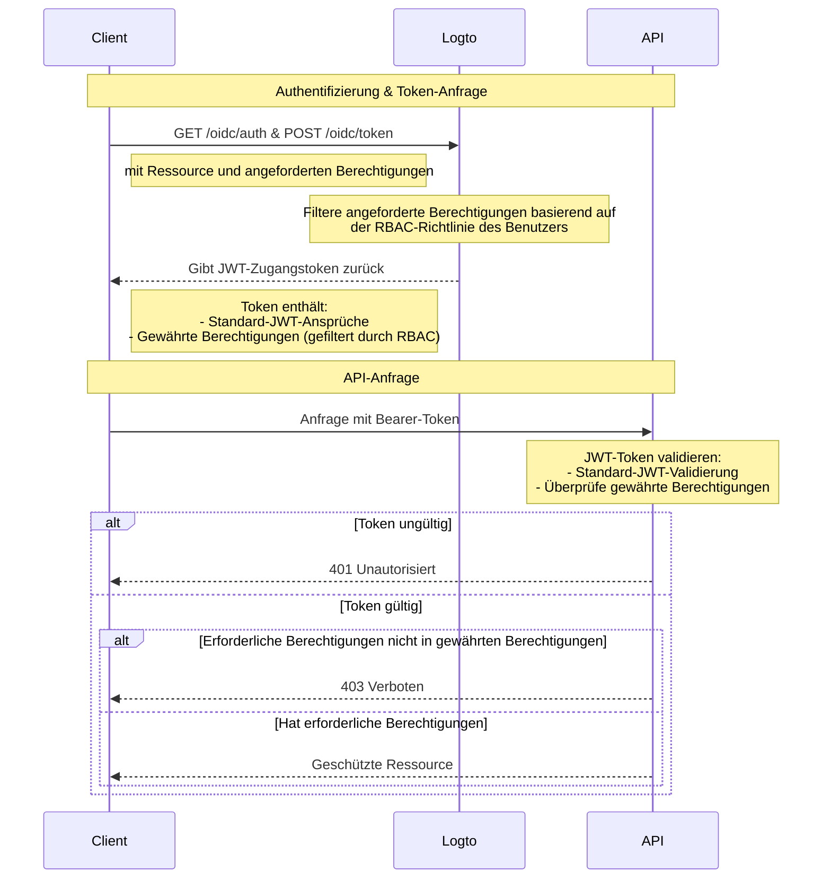

# API-Ressourcen mit RBAC schützen

Zusätzlich zu [Schütze deine API](/authorization/api-resources/protect-your-api), das Ressourcen sichert, indem es sicherstellt, dass ein gültiges JWT vorhanden ist, kann auch die rollenbasierte Zugangskontrolle (RBAC) angewendet werden.

In diesem Artikel konzentrieren wir uns darauf, wie RBAC die Berechtigungsdelegation und -validierung in deinem Authentifizierungsfluss beeinflusst.

## Autorisierungsflussdiagramm



Wie du im Diagramm sehen kannst, besteht der Hauptunterschied zum grundlegenden API-Schutz in der Handhabung der Berechtigungen. Anstatt alle angeforderten Berechtigungen direkt zu gewähren, filtert Logto sie nun basierend auf der RBAC-Richtlinie des Benutzers. Das JWT-Token enthält nur Berechtigungen, die dem Benutzer durch seine Rollen gewährt wurden. Auf der API-Seite gibt es nach der Überprüfung der Authentizität des Tokens eine zusätzliche Überprüfung, um sicherzustellen, dass das Token die erforderlichen Berechtigungen für die angeforderte Ressource enthält.

## Optional: Umgang mit Änderungen der Benutzerberechtigungen

Benutzerberechtigungen können während einer Sitzung geändert werden - zum Beispiel können ihnen neue Rollen zugewiesen oder bestehende Rollenberechtigungen geändert werden. In diesen Szenarien kann es notwendig sein, diese Änderungen zu erkennen und die Benutzeroberfläche der Anwendung zu aktualisieren.

Was passiert, wenn sich die Berechtigungen eines Benutzers ändern? Es gibt zwei Fälle.

### Keine neuen Berechtigungen im System eingeführt

Aktuelle Zugangstokens bleiben gültig, bis sie ablaufen, selbst nachdem die Berechtigungen eines Benutzers geändert wurden. Neue Berechtigungen werden jedoch in nachfolgenden Zugangstokens reflektiert, und alle widerrufenen Berechtigungen werden weggelassen.

Hier sind einige **empfohlene Maßnahmen**:

**Option 1: Verwende kurze Ablaufzeiten für Zugangstokens**

Kurzlebige Zugangstokens sorgen für häufigere Updates der Benutzerberechtigungen. Konfiguriere die Token-Ablaufeinstellungen in den [API-Ressourcen](/authorization/api-resources/#logto-api-resource-schema) Einstellungen der Konsole. Der Nachteil ist, dass dies deinen Tokenverbrauch erhöhen wird.

**Option 2: Berechtigungen dynamisch überprüfen**

Rufe regelmäßig (z. B. SWR) Endpunkte der [Logto Management API](/integrate-logto/interact-with-management-api) auf oder verwende Techniken wie WebSocket, um langlebige Verbindungen zu implementieren, um Benutzerberechtigungen dynamisch abzurufen. Bei Erkennung von Änderungen lösche das bestehende Zugangstoken, und neu ausgestellte Tokens werden automatisch Berechtigungsänderungen widerspiegeln. - API: Benutzer-Rolle - API: Rollenberechtigung

    Wenn Berechtigungsänderungen erkannt werden, lösche zuerst das Zugangstoken aus dem Speicher und rufe dann die SDK-Methode `getAccessToken()` auf, um ein neues zu erhalten. Das neu ausgestellte Zugangstoken sollte Berechtigungsänderungen widerspiegeln.

### Neue Berechtigung wird im System eingeführt und einem Benutzer zugewiesen

Dies geschieht, wenn neue Berechtigungen in dein System eingeführt werden. In diesem Fall musst du zuerst die neu eingeführten Berechtigungsbereiche beim Initialisieren des Logto-Clients einbeziehen. Zum Beispiel:

```tsx
new LogtoClient({
  appId: 'your-app-id',
  redirectUrl: 'your-redirect-url',
  resources: ['your-api-resource'],
  scopes: [
    // ... deine bestehenden Berechtigungsbereiche,
    'new-scope',
  ],
});
```

Zweitens muss jede deiner Client-Anwendungen die Benutzer erneut um Zustimmung bitten oder sie erneut anmelden, um die neue Berechtigungsänderung zu erhalten. Dann wird der neue Berechtigungsbereich in neuen Zugangstokens reflektiert.

Codebeispiel für erneute Zustimmung:

```tsx
signIn({ redirectUrl: 'your-redirect-url', prompt: 'consent' });
```
