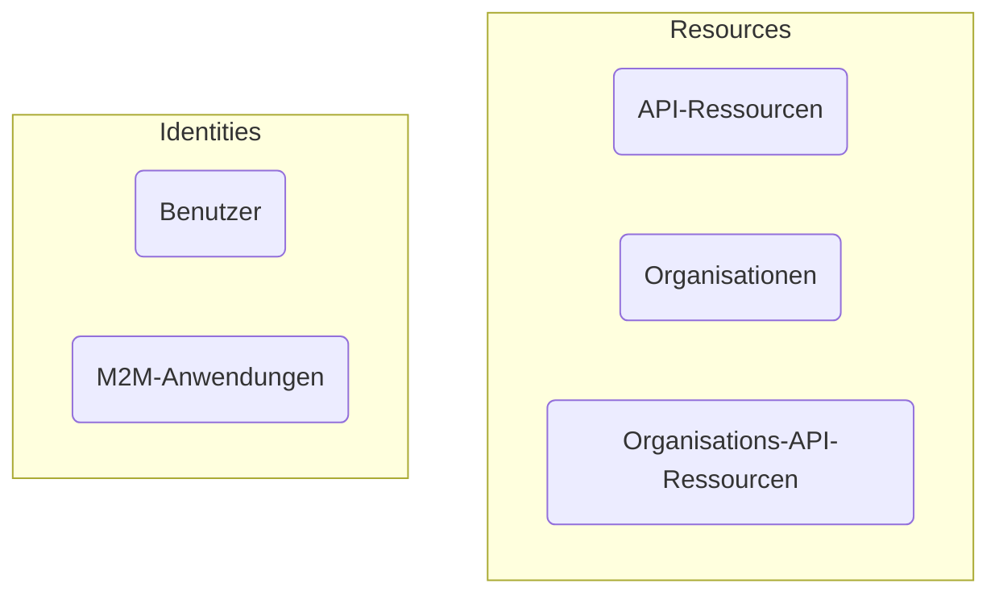

# Authentifizierung vs. Autorisierung

Der Unterschied zwischen **Authentifizierung** und **Autorisierung** lässt sich wie folgt zusammenfassen:

- **Authentifizierung (Authentication)** beantwortet die Frage „Welche Identität besitzt du?“
- **Autorisierung (Authorization)** beantwortet die Frage „Was kannst du tun?“

Für eine vollständige Einführung in das Customer Identity and Access Management (CIAM) kannst du auf unsere CIAM-Serie verweisen:

- [CIAM 101: Authentication, Identity, SSO](https://blog.logto.io/ciam-101-intro-authn-sso/)
- [CIAM 102: Authorization & Role-based Access Control](https://blog.logto.io/ciam-102-authz-and-rbac/)

## Authentifizierung \{#authentication}

Logto unterstützt verschiedene interaktive und nicht-interaktive Authentifizierungsmethoden, zum Beispiel:

- **Anmeldeerfahrung**: Der Authentifizierungsprozess für Endbenutzer.
- **Maschine-zu-Maschine (M2M) Authentifizierung**: Der Authentifizierungsprozess für Dienste oder Anwendungen.

Das ultimative Ziel der Authentifizierung ist denkbar einfach: die Überprüfung und das Erhalten des eindeutigen Identifikators der Entität (in Logto, ein Benutzer oder eine Anwendung).

## Autorisierung \{#authorization}

In Logto erfolgt die Autorisierung durch rollenbasierte Zugangskontrolle (RBAC). Sie gibt dir die vollständige Kontrolle über die Verwaltung des Zugangs deiner Benutzer oder M2M-Anwendungen zu den folgenden:

- **API-Ressourcen**: Eine globale Entität, die durch eine absolute URI dargestellt wird.
- **Organisationen**: Eine Gruppe von Benutzern oder Anwendungen.
- **Organisations-API-Ressourcen**: Eine API-Ressource, die zu einer Organisation gehört.

Um mehr über diese Konzepte zu erfahren, kannst du auf die folgenden Ressourcen verweisen:

- [Rollenbasierte Zugangskontrolle (RBAC)](/authorization/role-based-access-control)
- [Organisationen (Multi-Tenancy)](/organizations)

Hier ist eine visuelle Darstellung der Beziehung zwischen diesen Konzepten:

Kurz gesagt, bei der Autorisierung geht es darum, die Regeln festzulegen, die bestimmen, welche Entitäten in der Gruppe "Identitäten" auf die Entitäten in der Gruppe "Ressourcen" zugreifen können.

## Häufig gestellte Fragen \{#frequently-asked-questions}

### Ich muss angeben, welche Benutzer sich bei einer Anwendung anmelden können \{#i-need-to-specify-which-users-can-sign-in-to-an-application}

Aufgrund der Natur von Single Sign-On (SSO) unterstützt Logto derzeit nicht die Verwendung von Anwendungen als Ressourcen. Stattdessen kannst du API-Ressourcen und Berechtigungen definieren, um den Zugriff auf deine Ressourcen zu steuern.

### Ich benötige, dass sich meine Benutzer bei einer Organisation anmelden \{#i-need-my-users-to-sign-in-to-an-organization}

Wie bereits erwähnt, beinhaltet die Authentifizierung die Überprüfung der Identität einer Entität, während die Zugangskontrolle durch Autorisierung gehandhabt wird. Daher:

- Die Bestimmung, zu welcher(n) Organisation(en) ein Benutzer gehört, ist ein Autorisierungsanliegen.
- Der Anmeldeprozess ist ein Authentifizierungsanliegen.

Das bedeutet, dass es in Logto kein Konzept des "Anmeldens bei einer Organisation" gibt. Sobald ein Benutzer authentifiziert ist, kann er basierend auf den definierten Berechtigungen autorisiert werden, auf alle Ressourcen (einschließlich Organisationsressourcen) zuzugreifen.

Dieses Modell ist effizient und klar, da es die Anliegen der Authentifizierung und Autorisierung trennt. Alle modernen SaaS-Anwendungen, wie GitHub und Notion, folgen diesem Modell.

Es gibt jedoch einige Fälle, in denen du 1-1-Zuordnungen zwischen Benutzerquellen und Organisationen herstellen musst. In diesem Fall können [Enterprise SSO](/end-user-flows/enterprise-sso) und [Organisation Just-in-Time (JIT) Bereitstellung](/organizations/just-in-time-provisioning) hilfreich sein.

### Unsere Kunden benötigen ein individuelles Branding für ihre Anmeldeseiten \{#our-customers-need-custom-branding-for-their-sign-in-pages}

Bitte schaue dir [App-spezifisches Branding](/customization/match-your-brand/#app-specific-branding) und [Organisationsspezifisches Branding](/customization/match-your-brand/#organization-specific-branding) für verwandte Konfigurationen an.
