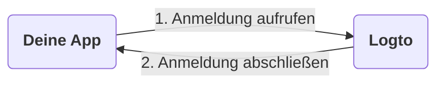
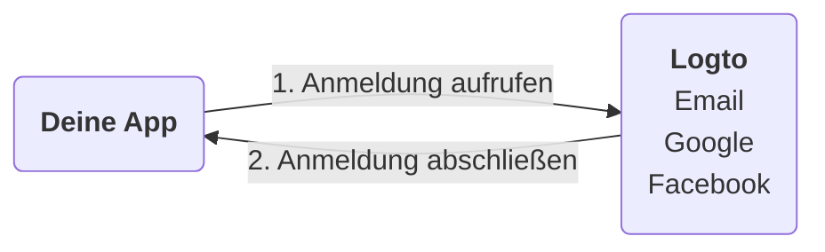
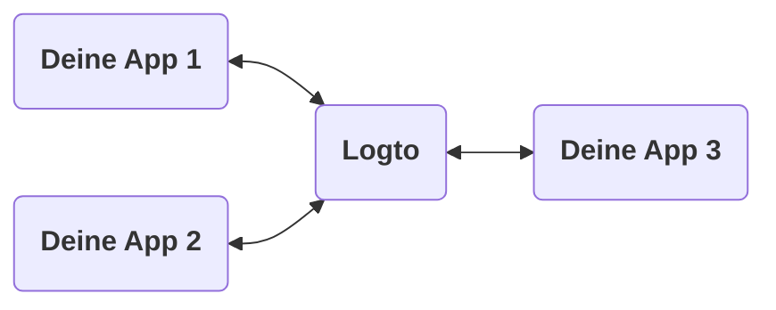
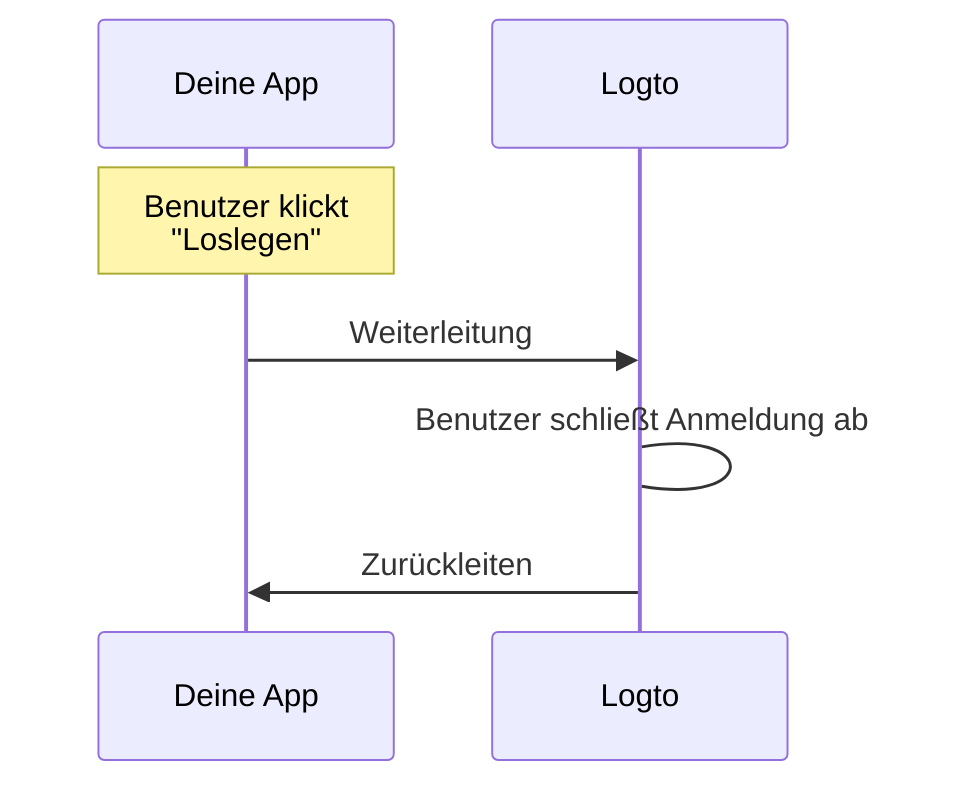
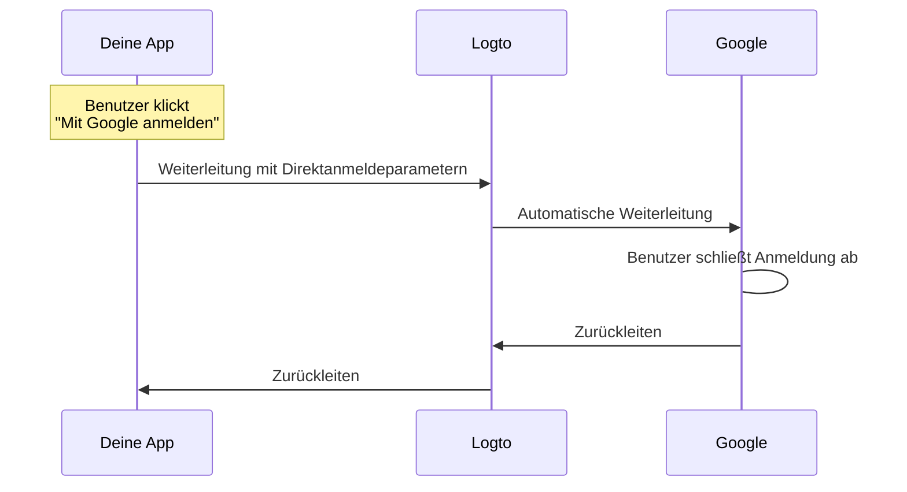

# Anmeldeerfahrung erklärt

Diese Seite erklärt die Anmeldeerfahrung in Logto und warum sie auf diese Weise gestaltet ist.

## Einführung \{#introduction}

Die Anmeldeerfahrung ist der Benutzer-Authentifizierungsprozess in Logto. Der Prozess kann wie folgt vereinfacht werden:



1. Deine App ruft die Anmeldemethode auf.
2. Der Benutzer wird zur Logto-Anmeldeseite weitergeleitet. Bei nativen Apps wird der Systembrowser geöffnet.
3. Der Benutzer meldet sich an und wird zurück zu deiner App weitergeleitet (in Logto als "Redirect URI" konfiguriert).

Obwohl der Prozess einfach ist, kann der Umleitungsanteil manchmal übertrieben erscheinen. Dennoch kann er in vielerlei Hinsicht vorteilhaft und sicher sein. Wir werden die Gründe in den folgenden Abschnitten erläutern.

## Warum umleiten? \{#why-redirect}

### Flexibilität \{#flexibility}

Das Umleiten ermöglicht es dir, den Authentifizierungsprozess von deiner App zu entkoppeln. Wenn dein Geschäft wächst, kannst du den gleichen Authentifizierungsprozess beibehalten, ohne deine App zu ändern. Zum Beispiel kannst du Multi-Faktor-Authentifizierung (MFA) hinzufügen oder die Anmeldemethoden ändern, ohne deine App zu berühren.



### Unterstützung für mehrere Apps \{#multi-app-support}

Wenn du mehrere Apps hast, können sich deine Benutzer einmal anmelden und auf alle Apps zugreifen, ohne sich erneut anmelden zu müssen. Dies ist besonders nützlich für SaaS-Unternehmen oder Unternehmen mit mehreren Diensten.



### Native Apps \{#native-apps}

Für native Apps ist das Umleiten zum Systembrowser eine sichere Möglichkeit, Benutzer zu authentifizieren, und bietet integrierte Unterstützung sowohl für iOS als auch für Android.

- **iOS**: Apple bietet [ASWebAuthenticationSession](https://developer.apple.com/documentation/authenticationservices/aswebauthenticationsession) für sichere Authentifizierung.
- **Android**: Google stellt [Custom Tabs](https://developer.chrome.com/docs/android/custom-tabs) für ein nahtloses Erlebnis bereit.

### Sicherheit \{#security}

Im Hintergrund ist Logto ein [OpenID Connect (OIDC)](https://openid.net/specs/openid-connect-core-1_0.html) Anbieter. OIDC ist ein weit verbreiteter Standard für Benutzer-Authentifizierung.

Logto erzwingt strenge Sicherheitsmaßnahmen, wie [PKCE](https://tools.ietf.org/html/rfc7636), und deaktiviert unsichere Flows wie den impliziten Flow. Das Umleiten ist eine sichere Möglichkeit, Benutzer zu authentifizieren und kann viele gängige Angriffe verhindern.

## Was, wenn ich einige Anmeldekomponenten in meiner App anzeigen muss? \{#what-if-i-need-to-show-some-sign-in-components-in-my-app}

Manchmal möchte dein Team möglicherweise einige Anmeldekomponenten in der App anzeigen, wie z. B. einen "Mit Google anmelden" Button. Dies kann durch die Verwendung der "Direktanmeldung" Funktion in Logto erreicht werden.

### Wie funktioniert es? \{#how-does-it-work}

Angenommen, du hast zwei Call-to-Action-Buttons in deiner App: "Loslegen" und "Mit Google anmelden". Diese Buttons sind so konzipiert:

- "Loslegen": Weiterleitung zur normalen Anmeldeseite.
- "Mit Google anmelden": Weiterleitung zur Google-Anmeldeseite.

Beide Aktionen müssen den Anmeldeprozess abschließen und zurück zu deiner App weiterleiten.

---

#### Prozess des Klickens auf "Loslegen" \{#process-of-clicking-get-started}

In diesem Fall ist die Anmeldeerfahrung dieselbe wie die Standarderfahrung. Der Benutzer wird zur Logto-Anmeldeseite und dann zurück zu deiner App weitergeleitet.



:::note
Wenn du soziale Anmeldemethoden (z. B. Google, Facebook) in Logto konfiguriert hast, kann der Benutzer zur entsprechenden Anmeldeseite weitergeleitet werden. In der Darstellung zeigen wir nur den allgemeinen Ablauf zur Vereinfachung.
:::

---

#### Prozess des Klickens auf "Mit Google anmelden" \{#process-of-clicking-sign-in-with-google}

In diesem Fall wird der Benutzer automatisch zur Google-Anmeldeseite weitergeleitet, ohne mit der Logto-Anmeldeseite zu interagieren. Die Geschwindigkeit dieser automatischen Weiterleitung ist fast sofort, sodass Benutzer die Umleitung möglicherweise nicht bemerken.



---

Zusammenfassend ist die Direktanmeldefunktion eine Möglichkeit, einige Interaktionen in der Anmeldeerfahrung zu automatisieren, ohne das Sicherheitsniveau zu ändern.

### Verwende Direktanmeldung in deiner App \{#use-direct-sign-in-in-your-app}

Um die Direktanmeldung zu verwenden, musst du den Parameter `direct_sign_in` übergeben, wenn du die Anmeldemethode aufrufst. Der Wert sollte in einem bestimmten Format sein, das Logto erkennt. Zum Beispiel sollte der Wert für die Anmeldung mit Google `social:google` sein.

In einigen offiziellen Logto SDKs gibt es eine spezielle Option für die Direktanmeldung. Hier ist ein Beispiel für die Verwendung der Direktanmeldung im `@logto/client` JavaScript SDK:

```ts
client.signIn({
  redirectUri: 'https://some-redirect-uri',
  directSignIn: { method: 'social', target: 'google' },
});
```

Für weitere Details, siehe [Direktanmeldung](/end-user-flows/authentication-parameters/direct-sign-in).

:::info
Wir führen diese Funktion schrittweise in allen offiziellen Logto SDKs ein. Wenn du sie in deinem SDK nicht siehst, kontaktiere uns bitte.
:::

## Ich brauche, dass meine Benutzer ihre Anmeldedaten in meiner App eingeben \{#i-need-my-users-to-fill-in-their-credentials-in-my-app}

Wenn du benötigst, dass deine Benutzer ihre Anmeldedaten (wie E-Mail und Passwort) direkt in deiner App eingeben, anstatt zu Logto weitergeleitet zu werden, können wir dir derzeit nicht helfen. Historisch gab es einen "Resource Owner Password Credentials" Grant, aber er wird jetzt als unsicher angesehen und wurde in OAuth 2.1 [formell veraltet](https://datatracker.ietf.org/doc/html/draft-ietf-oauth-security-topics#name-resource-owner-password-cre).

Um mehr über die Sicherheitsrisiken des ROPC-Grant-Typs zu erfahren, lies unseren Blogbeitrag [Warum du den ROPC-Grant-Typ veralten solltest](https://blog.logto.io/deprecated-ropc-grant-type/).

## Verwandte Ressourcen \{#related-resources}

<Url href="https://blog.logto.io/oauth-2-1/">OAuth 2.1 ist da: Was du wissen musst</Url>
<Url href="https://blog.logto.io/how-pkce-protects-the-authorization-code-flow-for-native-apps">
  Was ist PKCE: von grundlegenden Konzepten bis zum tiefen Verständnis
</Url>
