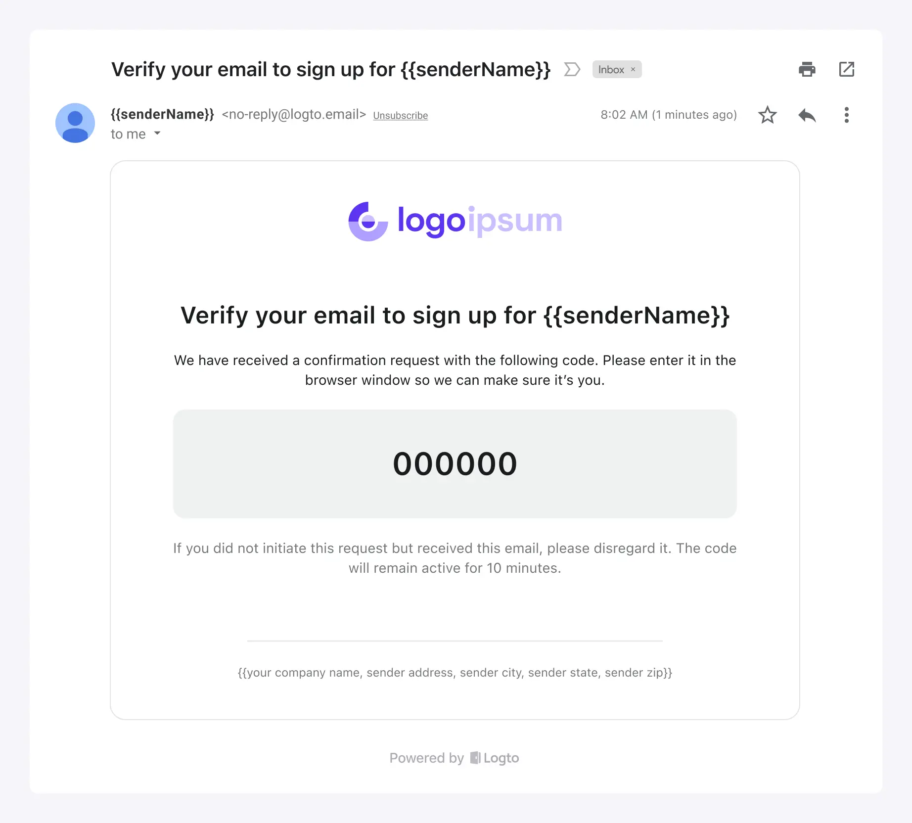

Logto bietet integrierte E-Mail-Dienste für Ihre Bequemlichkeit in den folgenden Szenarien:

1. Schnelles Erkunden oder Testen der E-Mail-Anmeldeerfahrung von Logto.
2. Direkte Nutzung für Ihre Online-Produkte. Es ist hauptsächlich für neue Startups gedacht, die damit einverstanden sind, `logto.email` als ihre Absender-E-Mail-Domain zu verwenden.

Die Merkmale des Logto E-Mail-Dienstes:

- **Kostenlos zu nutzen:** Es ist völlig kostenlos ohne tägliche E-Mail-Nutzungslimits, was Ihre Kosten spart.
- **Mühelos:** Keine Konfiguration mit Drittanbieter-E-Mail-Dienstanbietern erforderlich. Passen Sie einfach die grundlegenden Branding-Informationen für Ihre E-Mail-Vorlage an. Wenn Sie noch keine eigenen Branding-Informationen haben, können Sie mit wenigen Klicks beginnen.
- **Sichere Zustellung:** Basierend auf dem E-Mail-Dienst von Logto können Sie einen stabilen Service und eine zuverlässige E-Mail-Zustellung erhalten, die sicherstellt, dass Benutzer auf Ihr Produkt zugreifen können.

Es gibt jedoch einige Einschränkungen, die zu beachten sind:

1. E-Mails werden von der festen Adresse `no-reply@logto.email` gesendet.
2. Sie können keine Links oder andere benutzerdefinierte Inhalte zu E-Mails hinzufügen.

Je nach Ihren sich entwickelnden Geschäftsanforderungen können Sie später andere E-Mail-Dienstanbieter wählen. Wir bieten eine Reihe von [einsatzbereiten E-Mail-Dienst-Connectors](/connectors/email-connectors#popular-email-providers) und unterstützen auch [SMTP](/integrations/smtp), [HTTP](/integrations/http-email) und [Webhook](/developers/webhooks)-Auslöser zum Senden von E-Mails, sodass Sie immer eine passende Lösung finden werden.

:::note
Der integrierte kostenlose E-Mail-Dienst von Logto ist derzeit nur für [Cloud](https://cloud.logto.io/)-Benutzer verfügbar. Für Benutzer des Open-Source-Dienstes haben Sie die Flexibilität, Ihren E-Mail-Dienstanbieter für die E-Mail-Anmeldung zu konfigurieren.
:::

## Konfigurationsschritte \{#configuration-steps}

Folgen Sie diesen Schritten, um den Logto E-Mail-Dienst zu konfigurieren:

1. Gehen Sie zu <CloudLink to="/connectors/passwordless">Connector > E-Mail- und SMS-Connectors</CloudLink>.
2. Um einen neuen E-Mail-Connector hinzuzufügen, klicken Sie auf die Schaltfläche "**Einrichten**" und wählen Sie den Connector "**Logto E-Mail-Dienst**" aus.
3. Sobald der "Logto E-Mail-Dienst"-Connector erfolgreich erstellt wurde, können Sie die grundlegenden Branding-Informationen anpassen, die in den E-Mail-Vorlagen angezeigt werden.
4. Nachdem Sie diese Änderungen vorgenommen haben, denken Sie daran, eine Test-E-Mail-Vorlage an Ihre E-Mail-Adresse zu senden, bevor Sie die Änderungen speichern.

Anpassungsoptionen:

- **Von E-Mail:** Die Absender-E-Mail ist auf `no-reply@logto.email` gesetzt und kann nicht geändert werden.
- **Absendername:** Setzen Sie Ihren Markennamen als Absendernamen, um die Benutzererkennung sicherzustellen.
- **Unternehmensinformationen:** Zeigen Sie Ihren Firmennamen, Ihre Adresse oder Ihre Postleitzahl an, um das Vertrauen der Benutzer zu stärken und die Compliance-Anforderungen zu erfüllen. _Beachten Sie, dass URLs nicht erlaubt sind._
- **App-Logo:** Laden Sie das Markenlogo Ihrer App hoch, damit der Markenwert der App in den von Benutzern empfangenen E-Mails präsentiert werden kann.

## Einheitliche E-Mail-Vorlagen \{#unified-email-templates}

Der Logto E-Mail-Dienst verwendet einheitliche E-Mail-Vorlagen, die auf spezifische Authentifizierungsszenarien zugeschnitten sind:

| Verwendung                   | Szenario                                                                                                                                                                                                                                                                                                                                                                                                                                                                            |
| ---------------------------- | ----------------------------------------------------------------------------------------------------------------------------------------------------------------------------------------------------------------------------------------------------------------------------------------------------------------------------------------------------------------------------------------------------------------------------------------------------------------------------------- |
| Registrierung                | Benutzer erstellen ein Konto mit ihrer E-Mail und verifizieren es, indem sie einen von Logto an ihre E-Mail gesendeten Bestätigungscode eingeben.                                                                                                                                                                                                                                                                                                                                   |
| Anmeldung                    | Benutzer melden sich mit ihrer E-Mail an und verifizieren sich, indem sie einen Bestätigungscode eingeben, anstatt ein Passwort einzugeben.                                                                                                                                                                                                                                                                                                                                         |
| Passwort vergessen           | Wenn Benutzer ihr Passwort während der Anmeldung vergessen, können sie wählen, ihre Identität mit der E-Mail zu verifizieren, die sie bereits mit Logto verifiziert haben.                                                                                                                                                                                                                                                                                                          |
| Allgemein                    | Diese Vorlage kann als allgemeine Backup-Option für verschiedene Szenarien verwendet werden, einschließlich der Testkonfiguration von Connectors und so weiter.                                                                                                                                                                                                                                                                                                                     |
| Organisationseinladung       | Verwenden Sie diese Vorlage, um Benutzern einen Einladungslink zu senden, um der Organisation beizutreten.                                                                                                                                                                                                                                                                                                                                                                          |
| Benutzerberechtigungsprüfung | Während der Nutzung der App kann es einige risikoreiche Operationen oder Operationen mit einem relativ hohen Risikoniveau geben, die eine zusätzliche Benutzerverifizierung erfordern, wie z. B. Banküberweisungen, das Löschen von in Gebrauch befindlichen Ressourcen und das Kündigen von Mitgliedschaften. Die `UserPermissionValidation`-Vorlage kann verwendet werden, um den Inhalt des E-Mail-Bestätigungscodes zu definieren, den Benutzer in diesen Situationen erhalten. |
| Neues Identifikator binden   | Wenn ein Benutzer sein Profil ändert, kann er eine E-Mail-Adresse an sein aktuelles Konto binden. In diesem Fall kann die `BindNewIdentifier`-Vorlage verwendet werden, um den Inhalt der Bestätigungs-E-Mail anzupassen.                                                                                                                                                                                                                                                           |

Ein Beispiel für E-Mail-Vorlagen für den Verwendungszweck "Registrierung" mit benutzerdefinierten Markeninformationen:

Wenn keine benutzerdefinierten Markeninformationen bereitgestellt werden, kann die E-Mail-Vorlage dennoch mit einer Standardanzeige und einem Standardlayout verwendet werden:

## FAQs \{#faqs}

### Ist es möglich, benutzerdefiniertes CSS oder HTML zum Logto E-Mail-Dienst hinzuzufügen? \{#is-it-possible-to-add-custom-css-or-html-to-logto-email-service}

Der integrierte E-Mail-Dienst von Logto unterstützt kein benutzerdefiniertes CSS oder HTML. Sie können nur generische Branding-Elemente ändern. Diese Einschränkung besteht, um die Stabilität des integrierten E-Mail-Dienstes zu gewährleisten, da alle Mandanten dieselbe IP-Adresse und Absenderadresse teilen. Für weitere Details, siehe bitte "[Faktoren zur Verbesserung der E-Mail-Zustellung](https://blog.logto.io/verification-email-delivery#factors-to-improve-email-delivery)".

Um E-Mail-Vorlagen anzupassen, empfehlen wir die Verwendung eines anderen E-Mail-Connectors, wie AWS Direct Mail, SendGrid, Mailgun, Postmark oder SMTP.

