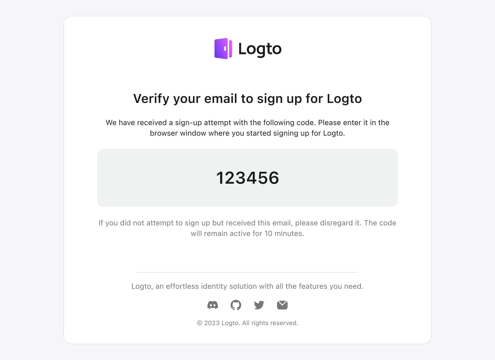

Logto bietet verschiedene Vorlagen zur Anpassung von E-Mail-Inhalten, die basierend auf ihren Anwendungsfällen kategorisiert sind.

Es wird dringend empfohlen, in unterschiedlichen Szenarien unterschiedliche Vorlagen zu verwenden. Andernfalls könnten Benutzer E-Mail-Inhalte erhalten, die nicht zur aktuellen Operation passen, was zu Verwirrung führen kann. Wenn Vorlagen fehlen, die nicht konfiguriert sind, kann dies zu Fehlern in Abläufen führen, die auf diese Vorlage angewiesen sind, und die normale Geschäftsentwicklung beeinträchtigen.

## Arten von E-Mail-Vorlagen

| usageType                | Szenario                                                                                                                                                                                                                                                                                                                                                                                                                                                                            |
| ------------------------ | ----------------------------------------------------------------------------------------------------------------------------------------------------------------------------------------------------------------------------------------------------------------------------------------------------------------------------------------------------------------------------------------------------------------------------------------------------------------------------------- |
| SignIn                   | Benutzer melden sich mit ihrer E-Mail an und verifizieren sich, indem sie einen Bestätigungscode eingeben, anstatt ein Passwort einzugeben.                                                                                                                                                                                                                                                                                                                                         |
| Register                 | Benutzer erstellen ein Konto mit ihrer E-Mail und verifizieren es, indem sie einen von Logto an ihre E-Mail gesendeten Bestätigungscode eingeben.                                                                                                                                                                                                                                                                                                                                   |
| ForgotPassword           | Wenn Benutzer ihr Passwort während der Anmeldung vergessen, können sie ihre Identität mit der E-Mail verifizieren, die sie bereits mit Logto verifiziert haben.                                                                                                                                                                                                                                                                                                                     |
| Generic                  | Diese Vorlage kann als allgemeine Backup-Option für verschiedene Szenarien verwendet werden, einschließlich der Testkonfiguration von Connectors und so weiter.                                                                                                                                                                                                                                                                                                                     |
| OrganizationInvitation   | Verwende diese Vorlage, um Benutzern einen Einladungslink zu senden, um der Organisation beizutreten.                                                                                                                                                                                                                                                                                                                                                                               |
| UserPermissionValidation | Während der Nutzung der App kann es einige risikoreiche Operationen oder Operationen mit einem relativ hohen Risikoniveau geben, die eine zusätzliche Benutzerverifizierung erfordern, wie z. B. Banküberweisungen, das Löschen von in Gebrauch befindlichen Ressourcen und das Kündigen von Mitgliedschaften. Die `UserPermissionValidation`-Vorlage kann verwendet werden, um den Inhalt des E-Mail-Bestätigungscodes zu definieren, den Benutzer in diesen Situationen erhalten. |
| BindNewIdentifier        | Wenn ein Benutzer sein Profil ändert, kann er eine E-Mail-Adresse an sein aktuelles Konto binden. In diesem Fall kann die `BindNewIdentifier`-Vorlage verwendet werden, um den Inhalt der Bestätigungs-E-Mail anzupassen.                                                                                                                                                                                                                                                           |

Es ist wichtig, diese Parameter zu verstehen:

- Bestätigungscodes verfallen nach 10 Minuten. Wir unterstützen derzeit keine Anpassung der Ablaufzeit von Bestätigungscodes.
- Ein `{{code}}` Platzhalter muss in der Vorlage reserviert werden. Beim Senden eines Bestätigungscodes wird ein zufällig generierter Code diesen Platzhalter ersetzen, bevor wir die E-Mail an Benutzer senden.

## Beispiele für E-Mail-Vorlagen

Du kannst die bereitgestellten E-Mail-Vorlagen-Codebeispiele als Ausgangspunkt für die Anpassung deiner Benutzeroberfläche verwenden. Um eine Benutzeroberfläche ähnlich der folgenden zu erstellen:



Da die in verschiedenen Szenarien von Logto verwendeten E-Mail-Vorlagen sehr ähnlich sind, wobei der einzige Unterschied die Beschreibung des aktuellen Szenarios und der Operation ist.

Wir zeigen hier nicht den HTML-Code aller Vorlagen im Detail. Stattdessen nehmen wir nur das **Anmelde**-Szenario als Beispiel. Andere Szenarien, wie Anmeldung und Passwort vergessen, sind dem folgenden Beispiel sehr ähnlich.

Benutzer können sich auf diese Vorlage beziehen und sie entsprechend ihrer tatsächlichen Situation anpassen.

```html
<!doctype html>
<html lang="de">
  <head>
    <meta charset="UTF-8" />
    <meta name="viewport" content="width=device-width, initial-scale=1.0" />
    <title>Verifiziere deine E-Mail zur Anmeldung</title>
    <style>
      .auth-service-by:hover .mini-logo {
        display: none !important;
      }
      .auth-service-by:hover .mini-logo-color {
        display: block !important;
      }
      body {
        font-family:
          'SF Pro Text',
          -apple-system,
          system-ui,
          BlinkMacSystemFont,
          'Segoe UI',
          Roboto,
          Arial,
          sans-serif;
        -webkit-font-smoothing: antialiased;
        -moz-osx-font-smoothing: grayscale;
        font-smooth: always;
        background-color: #fff;
        color: #191c1d;
        max-width: 640px;
        padding: 32px 0;
        font-size: 14px;
        font-weight: 400;
        line-height: 20px;
      }
      h1 {
        font-size: 24px;
        font-weight: 700;
        line-height: 32px;
        margin-top: 32px;
      }
      .verification-code {
        margin: 20px 0;
        background: #eff1f1;
        border-radius: 12px;
        padding: 36px;
        font-size: 32px;
        font-weight: 600;
        line-height: 40px;
      }
      .footer {
        text-align: center;
        color: #a9acac;
        margin-top: 48px;
      }
    </style>
  </head>
  <body>
    <div style="max-width: 698px; border-radius: 16px; border: 1px solid #E0E3E3;">
      <div style="padding: 0 24px;">
        <center>
          
          <h1>Verifiziere deine E-Mail zur Anmeldung</h1>
          <p>
            Wir haben einen Anmeldeversuch mit dem folgenden Code erhalten. Bitte gib ihn auf der
            Seite ein, die du geöffnet hast, um den Anmeldeprozess abzuschließen.
          </p>
          <div class="verification-code">000000</div>
          <p style="color: #747778;">
            Wenn du nicht versucht hast, dich anzumelden, diese E-Mail aber erhalten hast, ignoriere
            sie bitte. Der Code bleibt 10 Minuten lang aktiv.
          </p>
          <hr style="margin: 64px 0 24px; max-width: 420px;" />
          <p style="color: #747778; margin: 16px 0 0;">{{companyInfo}}</p>
        </center>
      </div>
    </div>
    <div class="footer">
      <hr />
      <p style="font-size: 14px; line-height: 20px; margin: 20px 0;">
        <a href="https://logto.io" style="color: #A9ACAC; text-decoration: underline;">Logto</a>:
        Die bessere Identitätsinfrastruktur für Entwickler.
      </p>
      <table style="margin: 0 auto; width: auto; border-spacing: 0;">
        <tbody>
          <tr>
            <td style="vertical-align: middle;">
              <a href="{{discordServerUrl}}" style="display: block; margin: 0 12px;">
                
              </a>
            </td>
            <td style="vertical-align: middle;">
              <a href="{{githubUrl}}" style="display: block; margin: 0 12px;">
                
              </a>
            </td>
            <td style="vertical-align: middle;">
              <a href="{{twitterUrl}}" style="display: block; margin: 0 12px;">
                
              </a>
            </td>
            <td style="vertical-align: middle;">
              <a href="{{mailToUrl}}" style="display: block; margin: 0 12px;">
                
              </a>
            </td>
          </tr>
        </tbody>
      </table>
      <p style="font-size: 12px; line-height: 16px;">
        © Silverhand, Inc., 2810 North Church Street, Wilmington, DE 19802
      </p>
      <p style="color: #A9ACAC; font-size: 12px; line-height: 16px;">
        Hast du Fragen oder benötigst Hilfe?
        <a href="{{mailToUrl}}" style="color: #A9ACAC; text-decoration: underline;"
          >Kontaktiere uns</a
        >
      </p>
    </div>
  </body>
</html>
```

Du kannst dann den obigen HTML-Code escapen und ihn dem "Template"-Feld des Connectors in den Konfigurationen hinzufügen, wie folgt (angenommen, du verwendest den SendGrid-Connector):

```json
{
  "subject": "<sign-in-template-subject>",
  "content": "<table cellpadding=\"0\" cellspacing=\"0\" ...",
  "usageType": "SignIn",
  "type": "text/html"
}
```

## FAQs

<details>
<summary>Wie kann man Drittanbieter-E-Mail-Vorlagen-Dienste nutzen, wenn Vorlagen nicht in Logto konfiguriert sind?</summary>

Du kannst einen neuen Endpunkt zu deinem eigenen Webdienst hinzufügen, um E-Mails zu senden, und dann den [Logto HTTP-E-Mail-Connector](/integrations/http-email) verwenden, um den von dir verwalteten Endpunkt aufzurufen.

Dies ermöglicht es dir, die Logik der E-Mail-Vorlagen auf deinem eigenen Server zu verwalten.

</details>

<details>
<summary>Gibt es eine Möglichkeit, Logto-E-Mail zu verwenden, um unseren Benutzern eine angepasste "Willkommens-E-Mail" zu senden?</summary>

Wir bieten die [Webhook](/developers/webhooks)-Funktionalität an. Du kannst deinen eigenen API-Endpunkt implementieren, um das `User.Created`-Ereignis zu empfangen, das vom Logto Webhook gesendet wird, und Logik hinzufügen, um eine angepasste Willkommens-E-Mail innerhalb des Webhook-Handlers zu senden.

Der Logto-E-Mail-Connector bietet nur E-Mail-Benachrichtigungen für Ereignisse im Zusammenhang mit dem Authentifizierungsablauf. Willkommens-E-Mails sind eine geschäftliche Anforderung und werden vom E-Mail-Connector nicht nativ unterstützt, aber diese Funktionalität kann durch Webhooks erreicht werden.

</details>
