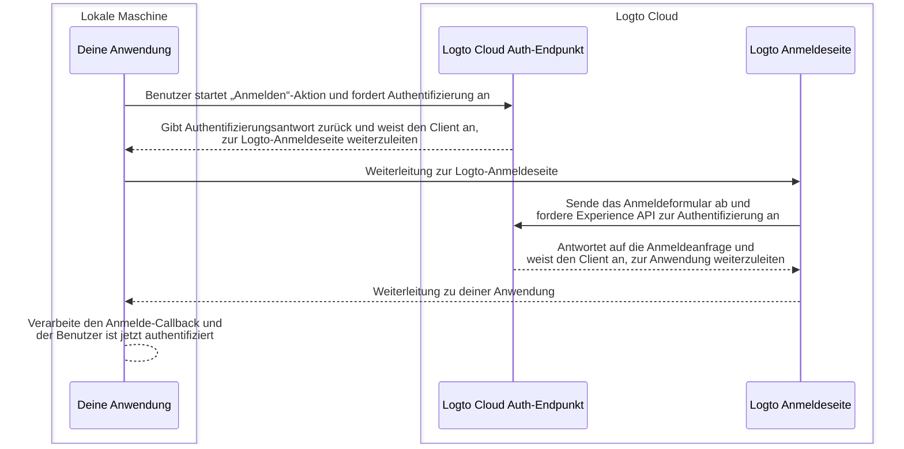
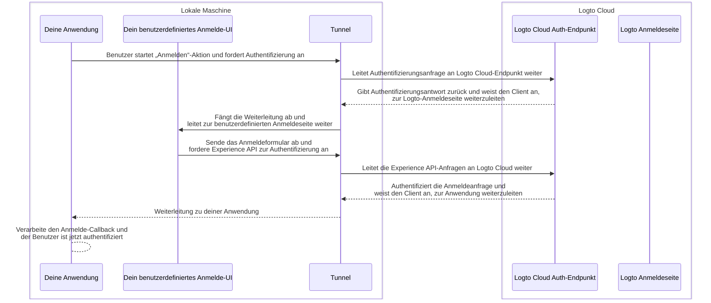

import TabItem from '@theme/TabItem';
import Tabs from '@theme/Tabs';

# Debugge und teste dein benutzerdefiniertes UI lokal

Für Logto Cloud-Nutzer haben wir es einfach gemacht, dein eigenes UI zu Logto zu bringen („Bring your own UI“). Cloud-Nutzer können jetzt eine Zip-Datei mit den benutzerdefinierten UI-Assets in <CloudLink to="/sign-in-experience/branding">Konsole > Anmeldung & Konto > Branding > Bring your UI</CloudLink> hochladen (Siehe die Seite [Bring your UI](/customization/bring-your-ui) für weitere Details.)

Beim Entwickeln solcher benutzerdefinierten UI-Seiten möchten Nutzer jedoch den Code lokal testen und debuggen, bevor sie ihn zu Logto Cloud hochladen. Dieser CLI-Befehl hilft dir, einen lokalen Tunnel einzurichten und die folgenden 3 Entitäten miteinander zu verbinden:
deinen Logto Cloud Auth-Endpunkt, deine Anwendung und dein benutzerdefiniertes Anmelde-UI.

## Warum brauche ich das? \{#why-do-i-need-this}

Standardmäßig wirst du, wenn du in deiner Anwendung auf den „Anmelden“-Button klickst, zur Anmeldeseite weitergeleitet, die am Logto-Endpunkt konfiguriert ist. Ein erfolgreicher Anmeldeablauf kann wie folgt dargestellt werden:


```mermaid
sequenceDiagram
    box Lokale Maschine
    participant A as Deine Anwendung
    end
    box Logto Cloud
    participant B as Logto Cloud Auth-Endpunkt
    participant C as Logto Anmeldeseite
    end
    A ->> B: Benutzer startet „Anmelden“-Aktion und fordert Authentifizierung an
    B -->> A: Gibt Authentifizierungsantwort zurück und weist den Client an,<br/>zur Logto-Anmeldeseite weiterzuleiten
    A ->> C: Weiterleitung zur Logto-Anmeldeseite
    C ->> B: Sende das Anmeldeformular ab und<br/>fordere Experience API zur Authentifizierung an
    B -->> C: Antwortet auf die Anmeldeanfrage und<br/>weist den Client an, zur Anwendung weiterzuleiten
    C -->> A: Weiterleitung zu deiner Anwendung
    A --> A: Verarbeite den Anmelde-Callback und<br/>der Benutzer ist jetzt authentifiziert
```

Da du nun aber dein eigenes benutzerdefiniertes Anmelde-UI entwickelst, benötigst du eine Möglichkeit, zu den auf deiner lokalen Maschine laufenden benutzerdefinierten Anmelde-UI-Seiten zu navigieren.
Dafür ist ein lokaler Tunnel-Service erforderlich, der die ausgehenden Anfragen deiner Anwendung abfängt und sie zu deinen benutzerdefinierten Anmelde-UI-Seiten umleitet.

Zusätzlich musst du mit der [Logto Experience API](https://openapi.logto.io/group/endpoint-experience) interagieren, um Benutzer zu authentifizieren und Sitzungen zu verwalten.
Dieser Service hilft auch dabei, diese Experience API-Anfragen an Logto Cloud weiterzuleiten, um CORS-Probleme zu vermeiden.

Das folgende Sequenzdiagramm zeigt, wie ein erfolgreicher „Anmelden“-Ablauf mit deinem benutzerdefinierten UI und dem Tunnel-Service funktioniert:


```mermaid
sequenceDiagram
    box Lokale Maschine
    participant A as Deine Anwendung
    participant B as Dein benutzerdefiniertes Anmelde-UI
    participant C as Tunnel
    end
    box Logto Cloud
    participant D as Logto Cloud Auth-Endpunkt
    participant E as Logto Anmeldeseite
    end
    A ->> C: Benutzer startet „Anmelden“-Aktion und fordert Authentifizierung an
    C ->> D: Leitet Authentifizierungsanfrage an Logto Cloud-Endpunkt weiter
    D -->> C: Gibt Authentifizierungsantwort zurück und weist den Client an,<br/>zur Logto-Anmeldeseite weiterzuleiten
    C ->> B: Fängt die Weiterleitung ab und<br/>leitet zur benutzerdefinierten Anmeldeseite weiter
    B ->> C: Sende das Anmeldeformular ab und<br/>fordere Experience API zur Authentifizierung an
    C ->> D: Leitet die Experience API-Anfragen an Logto Cloud weiter
    D -->> C: Authentifiziert die Anmeldeanfrage und<br/>weist den Client an, zur Anwendung weiterzuleiten
    C -->> A: Weiterleitung zu deiner Anwendung
    A --> A: Verarbeite den Anmelde-Callback und<br/>der Benutzer ist jetzt authentifiziert
```

Mit dem Tunnel-Service kannst du jetzt dein benutzerdefiniertes Anmelde-UI lokal entwickeln und testen, ohne die Assets jedes Mal zu Logto Cloud hochladen zu müssen, wenn du eine Änderung vornimmst.

## Anleitung \{#instructions}

### Schritt 1: Führe den Befehl aus \{#step-1-execute-the-command}

Angenommen, deine Cloud-Tenant-ID ist `foobar` und du hast eine benutzerdefinierte Anmeldeseite, die auf deinem lokalen Dev-Server unter `http://localhost:4000` läuft, dann kannst du den Befehl so ausführen:

<Tabs groupId="cmd">

  <TabItem value="cli" label="CLI">

```bash
logto-tunnel -p 9000 --experience-uri http://localhost:4000/ --endpoint https://foobar.logto.app/
```

  </TabItem>
  <TabItem value="npx" label="npx">

```bash
npx @logto/tunnel -p 9000 --experience-uri http://localhost:4000/ --endpoint https://foobar.logto.app/
```

  </TabItem>

</Tabs>

Es funktioniert auch, wenn du eine benutzerdefinierte Domain in Logto konfiguriert hast:

<Tabs groupId="cmd">

  <TabItem value="cli" label="CLI">

```bash
logto-tunnel -p 9000 --experience-uri http://localhost:4000/ --endpoint https://your.custom.domain/
```

  </TabItem>
  <TabItem value="npx" label="npx">

```bash
npx @logto/tunnel -p 9000 --experience-uri http://localhost:4000/ --endpoint https://your.custom.domain/
```

  </TabItem>

</Tabs>

Alternativ unterstützt der Befehl auch statische HTML-Assets, ohne dass du sie zuerst auf einem Dev-Server ausführen musst. Stelle einfach sicher, dass sich eine `index.html` im angegebenen Pfad befindet.

<Tabs groupId="cmd">

  <TabItem value="cli" label="CLI">

```bash
logto-tunnel -p 9000 --experience-path /path/to/your/static/files --endpoint https://foobar.logto.app/
```

  </TabItem>
  <TabItem value="npx" label="npx">

```bash
npx @logto/tunnel -p 9000 --experience-path /path/to/your/static/files --endpoint https://foobar.logto.app/
```

  </TabItem>

</Tabs>

### Schritt 2: Aktualisiere die Endpunkt-URI in deiner Anwendung \{#step-2-update-endpoint-uri-in-your-application}

Starte abschließend deine Anwendung und setze deren Logto-Endpunkt stattdessen auf die Tunnel-Service-Adresse `http://localhost:9000/`.

Nehmen wir eine React-Anwendung als Beispiel:

```tsx title=App.tsx
import { LogtoProvider, LogtoConfig } from '@logto/react';

// endpoint: 'https://foobar.logto.app/', // ursprünglicher Logto Cloud-Endpunkt
const config: LogtoConfig = {
  endpoint: 'http://localhost:9000/', // Tunnel-Service-Adresse
  appId: '<your-application-id>',
};

const App = () => (
  <LogtoProvider config={config}>
    <YourAppContent />
  </LogtoProvider>
);
```

Wenn du Social Sign-in verwendest, musst du auch die Redirect-URI in den Einstellungen deines Social-Providers auf die Tunnel-Service-Adresse aktualisieren.

```
http://localhost:9000/callback/<connector-id>
```

Wenn alles korrekt eingerichtet ist, solltest du beim Klick auf den „Anmelden“-Button in deiner Anwendung zu deiner benutzerdefinierten Anmeldeseite weitergeleitet werden, anstatt zur integrierten Logto-UI – zusammen mit einer gültigen Sitzung (Cookies), die dir ermöglicht, weiter mit der Logto Experience API zu interagieren.

Viel Spaß beim Coden!

## Verwandte Ressourcen \{#related-resources}

<Url href="https://blog.logto.io/automate-custom-sign-in-ui-deployment-with-github-actions">
  Automatisiere die Bereitstellung deines benutzerdefinierten Anmelde-UIs mit GitHub Actions
  Workflow
</Url>
