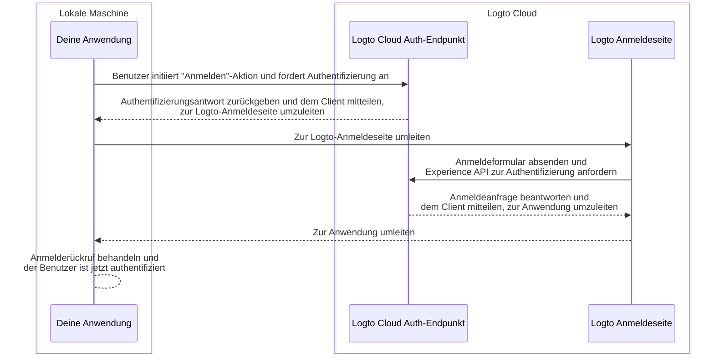
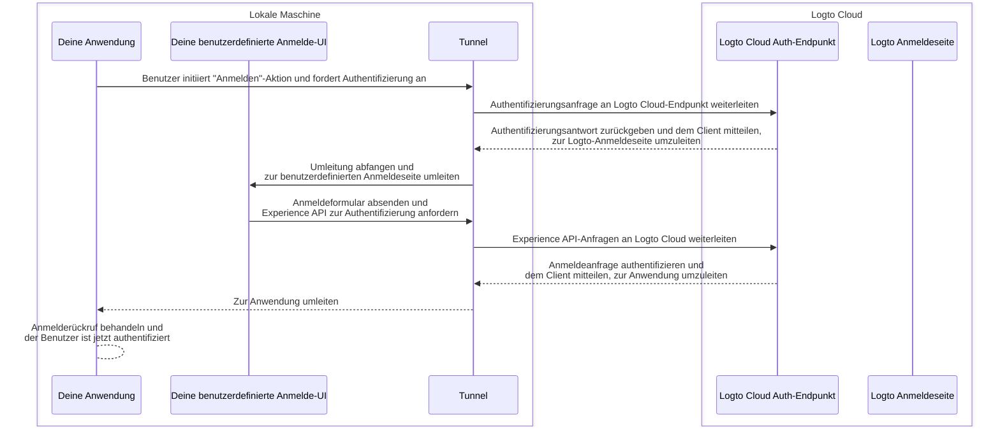

import TabItem from '@theme/TabItem';
import Tabs from '@theme/Tabs';

# Debuggen und Testen deiner benutzerdefinierten UI lokal

Für Logto Cloud-Benutzer haben wir es einfach gemacht, deine eigene UI zu Logto zu bringen. Cloud-Benutzer können jetzt eine ZIP-Datei mit den benutzerdefinierten UI-Assets in <CloudLink to="/sign-in-experience/branding">Konsole > Anmeldeerfahrung > Branding > Bring your UI</CloudLink> hochladen (siehe die Seite [Bring your UI](/customization/bring-your-ui) für weitere Details).

Wenn du jedoch solche benutzerdefinierten UI-Seiten entwickelst, möchtest du den Code lokal testen und debuggen, bevor du ihn zu Logto Cloud hochlädst. Dieser CLI-Befehl hilft dir, einen lokalen Tunnel einzurichten und die folgenden 3 Entitäten miteinander zu verbinden: dein Logto Cloud Auth-Endpunkt, deine Anwendung und deine benutzerdefinierte Anmelde-UI.

## Warum brauche ich das? \{#why-do-i-need-this}

Standardmäßig wirst du, wenn du in deiner Anwendung auf die Schaltfläche "Anmelden" klickst, zur Anmeldeseite navigiert, die am Logto-Endpunkt konfiguriert ist. Ein erfolgreicher Anmeldefluss kann wie folgt veranschaulicht werden:



Da du nun deine eigene benutzerdefinierte Anmelde-UI entwickelst, benötigst du eine Möglichkeit, zu den benutzerdefinierten Anmelde-UI-Seiten zu navigieren, die auf deiner lokalen Maschine laufen.
Dies erfordert einen lokalen Tunneldienst, um die ausgehenden Anfragen von deiner Anwendung abzufangen und sie zu deinen benutzerdefinierten Anmelde-UI-Seiten umzuleiten.

Zusätzlich musst du mit der [Logto Experience API](https://openapi.logto.io/group/endpoint-experience) interagieren, um Benutzer zu authentifizieren und Sitzungen zu verwalten.
Dieser Dienst wird auch helfen, diese Experience API-Anfragen an Logto Cloud weiterzuleiten, um CORS-Probleme zu vermeiden.

Das folgende Sequenzdiagramm zeigt, wie ein erfolgreicher "Anmelden"-Fluss mit deiner benutzerdefinierten UI und dem Tunneldienst funktioniert:



Mit dem Tunneldienst kannst du nun deine benutzerdefinierte Anmelde-UI lokal entwickeln und testen, ohne die Assets jedes Mal zu Logto Cloud hochladen zu müssen, wenn du eine Änderung vornimmst.

## Anweisungen \{#instructions}

### Schritt 1: Befehl ausführen \{#step-1-execute-the-command}

Angenommen, deine Cloud-Tenant-ID ist `foobar`, und du hast eine benutzerdefinierte Anmeldeseite, die auf deinem lokalen Entwicklungsserver unter `http://localhost:4000` läuft, dann kannst du den Befehl so ausführen:

<Tabs groupId="cmd">

  <TabItem value="cli" label="CLI">

```bash
logto-tunnel -p 9000 --experience-uri http://localhost:4000/ --endpoint https://foobar.logto.app/
```

  </TabItem>
  <TabItem value="npx" label="npx">

```bash
npx @logto/tunnel -p 9000 --experience-uri http://localhost:4000/ --endpoint https://foobar.logto.app/
```

  </TabItem>

</Tabs>

Es funktioniert auch, wenn du eine benutzerdefinierte Domain in Logto konfiguriert hast:

<Tabs groupId="cmd">

  <TabItem value="cli" label="CLI">

```bash
logto-tunnel -p 9000 --experience-uri http://localhost:4000/ --endpoint https://your.custom.domain/
```

  </TabItem>
  <TabItem value="npx" label="npx">

```bash
npx @logto/tunnel -p 9000 --experience-uri http://localhost:4000/ --endpoint https://your.custom.domain/
```

  </TabItem>

</Tabs>

Alternativ unterstützt der Befehl auch statische HTML-Assets, ohne dass sie zuerst auf einem Entwicklungsserver ausgeführt werden müssen. Stelle einfach sicher, dass sich eine `index.html` in dem von dir angegebenen Pfad befindet.

<Tabs groupId="cmd">

  <TabItem value="cli" label="CLI">

```bash
logto-tunnel -p 9000 --experience-path /path/to/your/static/files --endpoint https://foobar.logto.app/
```

  </TabItem>
  <TabItem value="npx" label="npx">

```bash
npx @logto/tunnel -p 9000 --experience-path /path/to/your/static/files --endpoint https://foobar.logto.app/
```

  </TabItem>

</Tabs>

### Schritt 2: Endpunkt-URI in deiner Anwendung aktualisieren \{#step-2-update-endpoint-uri-in-your-application}

Führe schließlich deine Anwendung aus und setze ihren Logto-Endpunkt auf die Tunnel-Service-Adresse `http://localhost:9000/`.

Nehmen wir eine React-Anwendung als Beispiel:

```tsx title=App.tsx
import { LogtoProvider, LogtoConfig } from '@logto/react';

const config: LogtoConfig = {
  // endpoint: 'https://foobar.logto.app/', // ursprünglicher Logto Cloud-Endpunkt
  endpoint: 'http://localhost:9000/', // Tunnel-Service-Adresse
  appId: '<your-application-id>',
};

const App = () => (
  <LogtoProvider config={config}>
    <YourAppContent />
  </LogtoProvider>
);
```

Wenn du soziale Anmeldung verwendest, musst du auch die Umleitungs-URI in deinen sozialen Anbieter-Einstellungen auf die Tunnel-Service-Adresse aktualisieren.

```
http://localhost:9000/callback/<connector-id>
```

Wenn alles korrekt eingerichtet ist, solltest du, wenn du in deiner Anwendung auf die Schaltfläche "Anmelden" klickst, zu deiner benutzerdefinierten Anmeldeseite navigiert werden, anstatt zur integrierten UI von Logto, zusammen mit einer gültigen Sitzung (Cookies), die es dir ermöglicht, weiter mit der Logto Experience API zu interagieren.

Viel Spaß beim Programmieren!

## Verwandte Ressourcen \{#related-resources}

<Url href="https://blog.logto.io/automate-custom-sign-in-ui-deployment-with-github-actions">
  Automatisiere die Bereitstellung deiner benutzerdefinierten Anmelde-UI mit dem GitHub
  Actions-Workflow
</Url>
