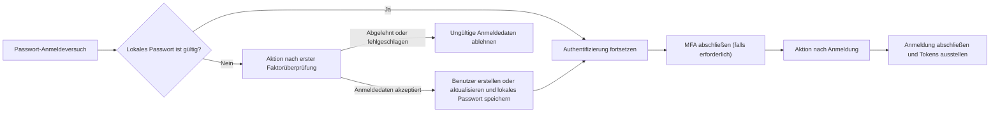

# Aktionen

Logto Aktionen ermöglichen es dir, vertrauenswürdigen JavaScript-Code an bestimmten Punkten im Authentifizierungsablauf auszuführen. Eine Aktion läuft synchron ab: Die Authentifizierungsanfrage wartet auf das Skript, und das Skriptergebnis kann den Benutzer aktualisieren oder bestimmen, ob der Ablauf fortgesetzt wird.

Aktionen sind nützlich, wenn die Entscheidung innerhalb des Authentifizierungsablaufs getroffen werden muss. Häufige Anwendungsfälle sind:

- Migration von Benutzern und Passwörtern aus einem Legacy-Identitätssystem beim erstmaligen Anmelden.
- Aktualisierung des Benutzerprofils oder anwendungsspezifischer Daten, bevor Logto eine Anmeldung abschließt.
- Aufruf eines externen Dienstes und Anwendung seines Ergebnisses auf den Logto-Benutzer.

:::note
Aktionen sind in den Logto Cloud Enterprise-Plänen verfügbar.
:::

:::warning
Aktionsskripte können die Authentifizierung beeinflussen und Benutzerdaten ändern. Nur vertrauenswürdigen Administratoren sollte es erlaubt sein, sie anzusehen, zu erstellen, zu bearbeiten, zu testen, zu aktivieren oder zu löschen.

In selbstgehosteten Umgebungen laufen Aktionsskripte im Logto-Serverprozess mit dessen Berechtigungen. Das Gewähren von Skriptbearbeitungs- oder Testzugriff entspricht der Erlaubnis zur Codeausführung auf dem Logto-Host, daher sollte die Admin-Konsole nicht mit nicht vertrauenswürdigen Benutzern geteilt werden. Behandle Skripte wie vertrauenswürdigen serverseitigen Code; die Laufzeit begrenzt die Zeit und den Speicher eines Skripts, ist aber keine Sicherheitsgrenze für nicht vertrauenswürdigen Code.
:::

## Wie Aktionen in die Anmeldung passen \{#how-actions-fit-into-sign-in}

Logto bietet derzeit zwei Aktionstypen:



| Aktionstyp                                                                                 | Wann sie ausgeführt wird                                                                                                                                                      | Was sie tun kann                                                                                                                                                                                |
| ------------------------------------------------------------------------------------------ | ----------------------------------------------------------------------------------------------------------------------------------------------------------------------------- | ----------------------------------------------------------------------------------------------------------------------------------------------------------------------------------------------- |
| [Aktion nach erster Faktorüberprüfung](/developers/actions/post-first-factor-verification) | Während einer Passwort-Anmeldung, nur nachdem die lokale Passwortüberprüfung von Logto fehlgeschlagen ist. Sie wird nicht ausgeführt, wenn das lokale Passwort gültig ist.    | Die übermittelten Anmeldedaten gegen ein Legacy-System prüfen, dann einen neuen Logto-Benutzer erstellen oder einen bestehenden Benutzer aktualisieren und das übermittelte Passwort migrieren. |
| [Aktion nach Anmeldung](/developers/actions/post-sign-in)                                  | Nachdem der Benutzer alle Authentifizierungsfaktoren abgeschlossen hat, einschließlich MFA falls erforderlich, und bevor Logto die Anmeldung abschließt und Tokens ausstellt. | Den bestehenden Logto-Benutzer mit dem finalen Anmeldekontext aktualisieren und anreichern.                                                                                                     |

Beide Aktionstypen laufen nur für `SignIn`-Interaktionen in der Experience API. Die Aktion nach erster Faktorüberprüfung gilt nur für die Passwort-Anmeldung; die Aktion nach Anmeldung ist unabhängig von der Authentifizierungsmethode.

## Skriptmodell \{#script-model}

Jeder Aktionstyp hat eine Konfiguration und eine JavaScript-Einstiegsfunktion namens `runAction`:

```js
const runAction = async ({ event, environmentVariables = {} }) => {
  // Untersuche das Ereignis, hole optional externe Daten und gib
  // ein Ergebnis zurück, das von diesem Aktionstyp unterstützt wird.
};
```

Die Nutzlast enthält:

- `event`: Das produktive Authentifizierungsereignis. Die Struktur hängt vom Aktionstyp ab.
- `environmentVariables`: Die für diese Aktion konfigurierten Zeichenfolgenwerte. Diese Werte werden durch die Funktionsnutzlast übergeben; sie sind nicht über `process.env` verfügbar.

Der Editor bietet Typinformationen, aber das gespeicherte Skript wird als JavaScript ausgeführt. Das Skript kann asynchron sein und diese Standard-Web-APIs sowohl in Logto Cloud als auch in selbstgehostetem Logto verwenden:

- `fetch`, `Request`, `Response` und `Headers`
- Web Crypto über `crypto` und `crypto.subtle`
- `TextEncoder` und `TextDecoder`
- `URL` und `URLSearchParams`

Skripte können keine Pakete importieren. Vermeide Node.js-spezifische Globals und Module, da sie nicht zwischen selbstgehostetem Logto und Logto Cloud portierbar sind und nicht Teil des unterstützten Skriptvertrags sind.

Das unterstützte Ergebnis ist für jeden Aktionstyp unterschiedlich; siehe die entsprechende Referenzseite, bevor du eine Aktion aktivierst.

## Aktionen und Webhooks \{#actions-and-webhooks}

Aktionen und [Webhooks](/developers/webhooks) dienen unterschiedlichen Zwecken:

|                                                          | Aktionen                                                        | Webhooks                                                             |
| -------------------------------------------------------- | --------------------------------------------------------------- | -------------------------------------------------------------------- |
| Ausführung                                               | Synchron und im Authentifizierungsablauf                        | Asynchron und außerhalb der Authentifizierungsanfrage                |
| Kann den aktuellen Authentifizierungsablauf beeinflussen | Ja                                                              | Nein                                                                 |
| Kann einen Benutzer durch das Ergebnis ändern            | Ja, mit dem unterstützten Benutzer-Patch                        | Nicht direkt; der Empfänger kann die Management API separat aufrufen |
| Ereignisabdeckung                                        | Ausgewählte Authentifizierungspunkte                            | Eine breite Palette von Interaktions- und Datenänderungsereignissen  |
| Typische Verwendung                                      | Anmeldedatenmigration, Profilanreicherung vor Token-Ausstellung | Benachrichtigungen, Downstream-Synchronisation, Analytik             |

Halte asynchrone Arbeiten in Webhooks. Verwende eine Aktion nur, wenn Logto das Ergebnis benötigt, bevor die Authentifizierung fortgesetzt werden kann.

## Nächste Schritte \{#next-steps}

- [Aktionen konfigurieren und testen](/developers/actions/configure-and-test-actions)
- [Benutzer bei Passwort-Anmeldung migrieren](/developers/actions/post-first-factor-verification)
- [Benutzer nach Anmeldung anreichern](/developers/actions/post-sign-in)
