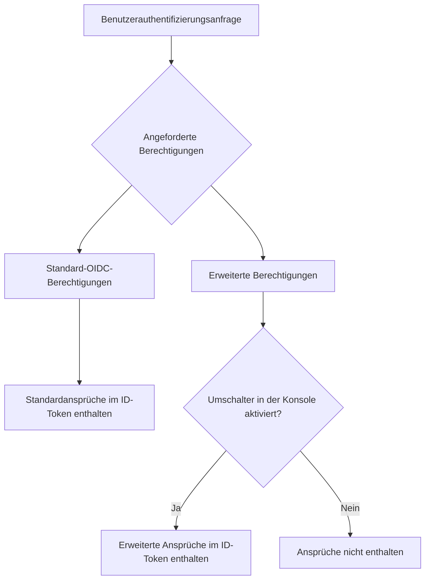

# Benutzerdefinierter ID-Token

## Einführung \{#introduction}

[ID-Token (ID token)](https://auth.wiki/id-token) ist ein spezieller Token-Typ, der durch das [OpenID Connect (OIDC)](https://auth.wiki/openid-connect)-Protokoll definiert ist. Er dient als Identitätsnachweis, der vom Autorisierungsserver (Logto) nach erfolgreicher Authentifizierung eines Benutzers ausgestellt wird und Ansprüche (Claims) über die Identität des authentifizierten Benutzers enthält.

Im Gegensatz zu [Zugangstokens (Access tokens)](/developers/custom-token-claims), die zum Zugriff auf geschützte Ressourcen verwendet werden, sind ID-Token speziell dafür konzipiert, die authentifizierte Benutzeridentität an Client-Anwendungen zu übermitteln. Sie sind [JSON Web Tokens (JWTs)](https://auth.wiki/jwt), die Ansprüche über das Authentifizierungsereignis und den authentifizierten Benutzer enthalten.

## Wie ID-Token-Ansprüche funktionieren \{#how-id-token-claims-work}

In Logto werden ID-Token-Ansprüche in zwei Kategorien unterteilt:

1. **Standard-OIDC-Ansprüche**: Durch die OIDC-Spezifikation definiert, werden diese Ansprüche vollständig durch die während der Authentifizierung angeforderten Berechtigungen (Scopes) bestimmt.
2. **Erweiterte Ansprüche**: Von Logto erweiterte Ansprüche, die zusätzliche Identitätsinformationen transportieren und durch ein **Dual-Bedingungsmodell** (Berechtigung + Umschalter) gesteuert werden.

## Standard-OIDC-Ansprüche \{#standard-oidc-claims}

Standardansprüche werden vollständig durch die OIDC-Spezifikation geregelt. Ihre Aufnahme in den ID-Token hängt ausschließlich von den Berechtigungen ab, die deine Anwendung während der Authentifizierung anfordert. Logto bietet keine Option, einzelne Standardansprüche zu deaktivieren oder selektiv auszuschließen.

Die folgende Tabelle zeigt die Zuordnung zwischen Standardberechtigungen und den entsprechenden Ansprüchen:

| Berechtigung (Scope) | Ansprüche (Claims)                                                                                                                                                               |
| -------------------- | -------------------------------------------------------------------------------------------------------------------------------------------------------------------------------- |
| `openid`             | `sub`                                                                                                                                                                            |
| `profile`            | `name`, `family_name`, `given_name`, `middle_name`, `nickname`, `preferred_username`, `profile`, `picture`, `website`, `gender`, `birthdate`, `zoneinfo`, `locale`, `updated_at` |
| `email`              | `email`, `email_verified`                                                                                                                                                        |
| `phone`              | `phone_number`, `phone_number_verified`                                                                                                                                          |
| `address`            | `address`                                                                                                                                                                        |

Beispiel: Wenn deine Anwendung die Berechtigungen `openid profile email` anfordert, enthält der ID-Token alle Ansprüche aus den Scopes `openid`, `profile` und `email`.

## Erweiterte Ansprüche \{#extended-claims}

Über die Standard-OIDC-Ansprüche hinaus erweitert Logto zusätzliche Ansprüche, die Identitätsinformationen enthalten, die spezifisch für das Logto-Ökosystem sind. Diese erweiterten Ansprüche folgen einem **Dual-Bedingungsmodell**, um im ID-Token enthalten zu sein:

1. **Berechtigungsbedingung**: Die Anwendung muss während der Authentifizierung die entsprechende Berechtigung anfordern.
2. **Umschalter in der Konsole**: Der Administrator muss die Aufnahme des Anspruchs in den ID-Token über die Logto-Konsole aktivieren.

Beide Bedingungen müssen gleichzeitig erfüllt sein. Die Berechtigung dient als Protokoll-Ebene-Zugriffserklärung, während der Umschalter als Produkt-Ebene-Expositionskontrolle dient — ihre Verantwortlichkeiten sind klar und nicht austauschbar.

### Verfügbare erweiterte Berechtigungen und Ansprüche \{#available-extended-scopes-and-claims}

| Berechtigung (Scope)                 | Ansprüche (Claims)             | Beschreibung                                         | Standardmäßig enthalten |
| ------------------------------------ | ------------------------------ | ---------------------------------------------------- | ----------------------- |
| `custom_data`                        | `custom_data`                  | Benutzerdefinierte Daten auf dem Benutzerobjekt      |                         |
| `identities`                         | `identities`, `sso_identities` | Verknüpfte soziale und SSO-Identitäten des Benutzers |                         |
| `roles`                              | `roles`                        | Zugewiesene Rollen des Benutzers (Rollen)            | ✅                      |
| `urn:logto:scope:organizations`      | `organizations`                | Organisations-IDs des Benutzers (Organisationen)     | ✅                      |
| `urn:logto:scope:organizations`      | `organization_data`            | Organisationsdaten des Benutzers                     |                         |
| `urn:logto:scope:organization_roles` | `organization_roles`           | Organisationsrollen-Zuweisungen des Benutzers        | ✅                      |

### Konfiguration in der Logto-Konsole \{#configure-in-logto-console}

So aktivierst du erweiterte Ansprüche im ID-Token:

1. Navigiere zu <CloudLink to="/customize-jwt">Konsole > Benutzerdefiniertes JWT</CloudLink>.
2. Aktiviere die Ansprüche, die du im ID-Token aufnehmen möchtest.
3. Stelle sicher, dass deine Anwendung die entsprechenden Berechtigungen während der Authentifizierung anfordert.

## Verwandte Ressourcen \{#related-resources}

<Url href="/developers/custom-token-claims">Benutzerdefiniertes Zugangstoken</Url>

<Url href="https://openid.net/specs/openid-connect-core-1_0.html#IDToken">
  OpenID Connect Core – ID-Token
</Url>
