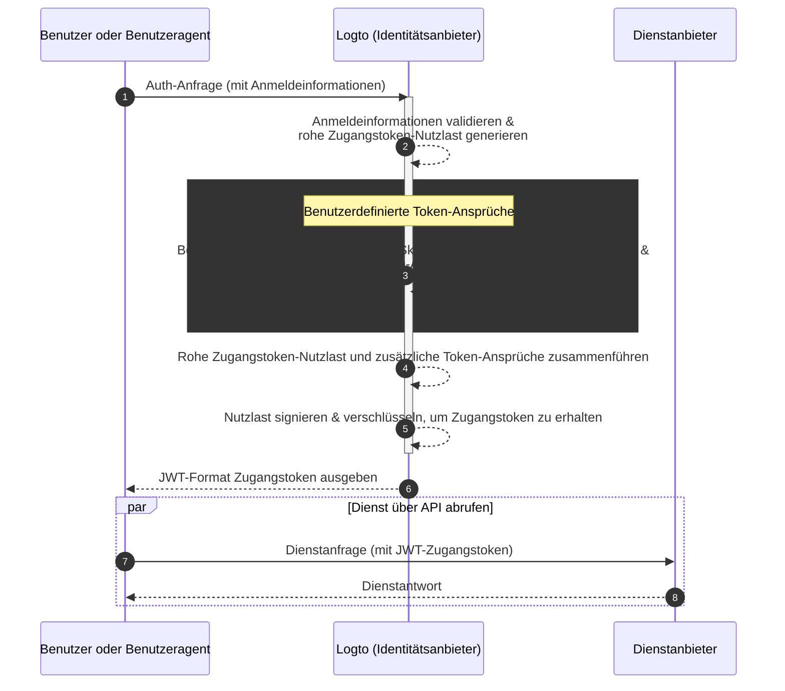

# Benutzerdefinierte Token-Ansprüche

Logto bietet die Flexibilität, benutzerdefinierte Ansprüche innerhalb von Zugangstokens (JWT / Opaker Token) hinzuzufügen. Mit dieser Funktion kannst du zusätzliche Informationen für deine Geschäftslogik einfügen, die alle sicher in den Tokens übertragen und im Fall von opaken Tokens über Introspektion abrufbar sind.

## Einführung \{#introduction}

[Zugangstokens](https://auth.wiki/access-token) spielen eine entscheidende Rolle im Authentifizierungs- und Autorisierungsprozess, indem sie die Identitätsinformationen und Berechtigungen des Subjekts tragen und zwischen dem [Logto-Server](/concepts/core-service) (dient als Auth-Server oder Identitätsanbieter, IdP), deinem Webdienst-Server (Ressourcenanbieter) und Client-Anwendungen (Clients) weitergegeben werden.

[Token-Ansprüche](https://auth.wiki/claim) sind die Schlüssel-Wert-Paare, die Informationen über eine Entität oder das Token selbst bereitstellen. Die Ansprüche können Benutzerinformationen, Token-Ablaufzeit, Berechtigungen und andere Metadaten enthalten, die für den Authentifizierungs- und Autorisierungsprozess relevant sind.

Es gibt zwei Arten von Zugangstokens in Logto:

- **JSON Web Token:** [JSON Web Token (JWT)](https://auth.wiki/jwt) ist ein beliebtes Format, das Ansprüche auf eine Weise kodiert, die sowohl sicher als auch für Clients lesbar ist. Übliche Ansprüche wie `sub`, `iss`, `aud` usw. werden im Einklang mit dem OAuth 2.0-Protokoll verwendet (siehe [diesen Link](https://datatracker.ietf.org/doc/html/rfc7519#section-4) für weitere Details). JWT-Tokens ermöglichen es den Verbrauchern, direkt auf Ansprüche zuzugreifen, ohne zusätzliche Validierungsschritte. In Logto werden Zugangstokens standardmäßig im JWT-Format ausgegeben, wenn ein Client Autorisierungsanfragen für bestimmte Ressourcen oder Organisationen initiiert.
- **Opaker Token:** Ein [opakes Token](http://localhost:3000/concepts/opaque-token) ist nicht eigenständig und erfordert immer einen zusätzlichen Validierungsschritt über den [Token-Introspektions](https://auth.wiki/token-introspection)-Endpunkt. Trotz ihres nicht transparenten Formats können opake Tokens helfen, Ansprüche zu erhalten und sicher zwischen Parteien übertragen zu werden. Token-Ansprüche werden sicher auf dem Logto-Server gespeichert und von den Client-Anwendungen über den Token-Introspektionsendpunkt abgerufen. Zugangstokens werden im opaken Format ausgegeben, wenn keine spezifische Ressource oder Organisation in der Autorisierungsanfrage enthalten ist. Diese Tokens werden hauptsächlich für den Zugriff auf den OIDC `userinfo`-Endpunkt und andere allgemeine Zwecke verwendet.

In vielen Fällen reichen Standardansprüche nicht aus, um die spezifischen Bedürfnisse deiner Anwendungen zu erfüllen, egal ob du JWT oder opake Tokens verwendest. Um dies zu adressieren, bietet Logto die Flexibilität, benutzerdefinierte Ansprüche innerhalb von Zugangstokens hinzuzufügen. Mit dieser Funktion kannst du zusätzliche Informationen für deine Geschäftslogik einfügen, die alle sicher in den Tokens übertragen und im Fall von opaken Tokens über Introspektion abrufbar sind.

## Wie funktionieren benutzerdefinierte Token-Ansprüche? \{#how-do-custom-token-claims-work}

Logto ermöglicht es dir, benutzerdefinierte Ansprüche in das `Zugangstoken` über eine Callback-Funktion `getCustomJwtClaims` einzufügen. Du kannst deine Implementierung der `getCustomJwtClaims`-Funktion bereitstellen, um ein Objekt mit benutzerdefinierten Ansprüchen zurückzugeben. Der Rückgabewert wird mit der ursprünglichen Token-Nutzlast zusammengeführt und signiert, um das endgültige Zugangstoken zu generieren.

:::warning
Logto-eigene Token-Ansprüche können NICHT überschrieben oder geändert werden. Benutzerdefinierte Ansprüche werden dem Token als zusätzliche Ansprüche hinzugefügt. Wenn benutzerdefinierte Ansprüche mit den eingebauten Ansprüchen in Konflikt stehen, werden diese benutzerdefinierten Ansprüche ignoriert.
:::

## Verwandte Ressourcen \{#related-resources}

<Url href="https://blog.logto.io/glance-on-custom-jwt-access-token-claims">
  Benutzerdefinierte Ansprüche für JWT-Zugangstokens mit Logto hinzufügen, um deine Autorisierung zu verbessern
</Url>