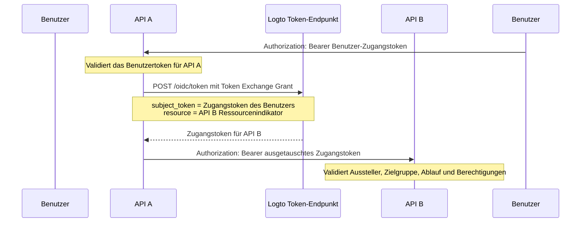

import TokenExchangePrerequisites from './fragments/_token-exchange-prerequisites.mdx';

# Service-to-service delegation

In einigen API-Architekturen erhält ein Backend-Service eine Anfrage von einem angemeldeten Benutzer und muss einen weiteren Backend-Service aufrufen, während die Identität des Benutzers erhalten bleibt.

Zum Beispiel:

```text
Benutzer -> API A -> API B
```

API B muss zwei Dinge wissen:

1. Der Aufrufer ist ein vertrauenswürdiger Service, wie API A.
2. Die Operation wird für den ursprünglichen Benutzer ausgeführt.

Nutze das Token Exchange Grant von Logto, um das Zugangstoken des Benutzers gegen ein neues Zugangstoken auszutauschen, dessen Zielgruppe die nachgelagerte API-Ressource ist. Dies folgt dem OAuth 2.0 Token Exchange Muster und vermeidet es, das ursprüngliche Benutzertoken an nachgelagerte Dienste weiterzuleiten.

## Wann dieser Ablauf verwendet werden sollte \{#when-to-use-this-flow}

Verwende Service-to-service delegation, wenn:

- API A ein Backend-Service ist, der sich sicher beim Token-Endpunkt von Logto authentifizieren kann.
- API A ein von Logto ausgestelltes Benutzer-Zugangstoken erhält.
- API A API B im Namen desselben Benutzers aufrufen muss.
- API B ein Zugangstoken mit seiner eigenen API-Ressource als Zielgruppe validieren sollte.

Verwende diesen Ablauf nicht für reinen Maschine-zu-Maschine-Zugriff ohne Benutzer. In diesem Fall verwende den [Client Credentials Flow](/quick-starts/m2m). Für Support-, Admin- oder Agenten-Szenarien, in denen ein Benutzer vorübergehend als ein anderer Benutzer agiert, verwende [Benutzermimikry](/developers/user-impersonation).

## Wie es funktioniert \{#how-it-works}



Das ausgetauschte Zugangstoken repräsentiert den ursprünglichen Benutzer (`sub`) und ist an die nachgelagerte API-Ressource (`aud`) gebunden. Die nachgelagerte API kann auch den `client_id` Anspruch prüfen, um die Anwendung zu identifizieren, die den Austausch initiiert hat.

## Voraussetzungen \{#prerequisites}

1. Erstelle API-Ressourcen für die beteiligten Dienste. Siehe [Globale API-Ressourcen schützen](/authorization/global-api-resources).
2. Konfiguriere die Berechtigungen von API B und weise sie Benutzern über Rollen oder Organisationsrollen zu.
3. Verwende eine serverseitige Anwendung für API A, wie eine Maschine-zu-Maschine-App oder eine traditionelle Webanwendung, damit sie sich sicher mit einem App-Secret authentifizieren kann.
4. Aktiviere Token Exchange für die Anwendung von API A.

<TokenExchangePrerequisites />

## Zugangstoken für die nachgelagerte API anfordern \{#request-an-access-token-for-the-downstream-api}

Wenn API A API B aufrufen muss, stelle eine Token Exchange Anfrage an den [Token-Endpunkt](/integrate-logto/application-data-structure#token-endpoint) von Logto.

Für traditionelle Webanwendungen oder Maschine-zu-Maschine-Anwendungen mit App-Secret füge die Zugangsdaten in den `Authorization` Header ein:

```bash
POST /oidc/token HTTP/1.1
Host: tenant.logto.app
Content-Type: application/x-www-form-urlencoded
# highlight-next-line
Authorization: Basic <base64(api-a-app-id:api-a-app-secret)>

grant_type=urn:ietf:params:oauth:grant-type:token-exchange
&subject_token=<user_access_token_received_by_api_a>
&subject_token_type=urn:ietf:params:oauth:token-type:access_token
&resource=https://api-b.example.com
&scope=read:orders
```

Parameter:

1. `grant_type`: Verwende `urn:ietf:params:oauth:grant-type:token-exchange`.
2. `subject_token`: Das ursprüngliche, von Logto ausgestellte Benutzer-Zugangstoken, das von API A empfangen wurde.
3. `subject_token_type`: Verwende `urn:ietf:params:oauth:token-type:access_token`.
4. `resource`: Der Ressourcenindikator der API B.
5. `scope`: Die nachgelagerten Berechtigungen, die API A für diesen delegierten Aufruf anfordert. Logto stellt nur die angeforderten Berechtigungen aus, die dem ursprünglichen Benutzer für diese Ressource gemäß den RBAC-Einstellungen zur Verfügung stehen.

Logto gibt ein Zugangstoken für API B zurück:

```json
{
  "access_token": "eyJhbGci...<truncated>",
  "token_type": "Bearer",
  "expires_in": 3600,
  "scope": "read:orders"
}
```

Nach dem Dekodieren enthält das Zugangstoken Ansprüche wie:

```json
{
  "sub": "user_id",
  "client_id": "api_a_app_id",
  "iss": "https://tenant.logto.app/oidc",
  "aud": "https://api-b.example.com",
  "scope": "read:orders",
  "exp": 1760000000
}
```

Dann ruft API A API B mit dem ausgetauschten Token auf:

```bash
GET /orders HTTP/1.1
Host: api-b.example.com
Authorization: Bearer <exchanged_access_token>
```

## Token in API B validieren \{#validate-the-token-in-api-b}

API B sollte das ausgetauschte Token wie jedes von Logto ausgestellte API-Ressourcen-Zugangstoken validieren:

1. Überprüfe die Signatur mit den JWKs von Logto.
2. Prüfe den Aussteller (`iss`).
3. Prüfe, dass die Zielgruppe (`aud`) mit dem Ressourcenindikator von API B übereinstimmt.
4. Prüfe das Ablaufdatum (`exp`).
5. Prüfe die erforderlichen Berechtigungen.
6. Verwende `sub` als ursprüngliche Benutzer-ID.
7. Optional prüfe `client_id`, wenn nur bestimmte Upstream-Services delegierte Aufrufe durchführen dürfen.

Siehe [Zugangstokens in API validieren](/authorization/validate-access-tokens) für Implementierungshinweise.

## Verwandte Ressourcen \{#related-resources}

<Url href="/authorization/global-api-resources">Globale API-Ressourcen schützen</Url>

<Url href="/authorization/validate-access-tokens">Zugangstokens in API validieren</Url>

<Url href="/developers/user-impersonation">Benutzermimikry</Url>
