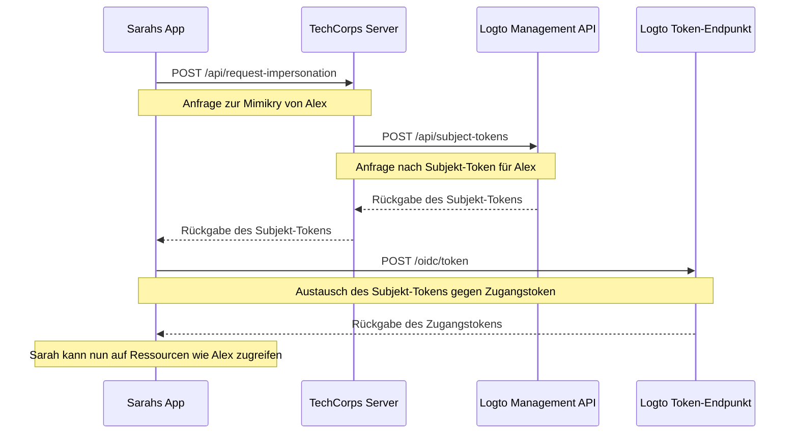

# Benutzermimikry

Stellen Sie sich vor, Sarah, eine Support-Ingenieurin bei TechCorp, erhält ein dringendes Ticket von Alex, einem Kunden, der keinen Zugriff auf eine kritische Ressource hat. Um das Problem effizient zu diagnostizieren und zu lösen, muss Sarah genau das sehen, was Alex im System sieht. Hier kommt die Benutzermimikry-Funktion von Logto ins Spiel.

Die Benutzermimikry ermöglicht es autorisierten Benutzern wie Sarah, vorübergehend im Namen anderer Benutzer wie Alex innerhalb des Systems zu agieren. Diese leistungsstarke Funktion ist von unschätzbarem Wert für die Fehlersuche, die Bereitstellung von Kundensupport und die Durchführung administrativer Aufgaben.

## Wie funktioniert es?



Der Mimikry-Prozess umfasst drei Hauptschritte:

1. Sarah beantragt die Mimikry über den Backend-Server von TechCorp
2. Der Server von TechCorp erhält ein Subjekt-Token von Logtos Management API
3. Sarahs Anwendung tauscht dieses Subjekt-Token gegen ein Zugangstoken aus

Lassen Sie uns durchgehen, wie Sarah diese Funktion nutzen kann, um Alex zu helfen.

### Schritt 1: Mimikry anfordern

Zuerst muss Sarahs Support-Anwendung die Mimikry beim Backend-Server von TechCorp anfordern.

**Anfrage (Sarahs Anwendung an TechCorps Server)**

```bash
POST /api/request-impersonation HTTP/1.1
Host: api.techcorp.com
Authorization: Bearer <Sarahs_access_token>
Content-Type: application/json

{
  "userId": "alex123",
  "reason": "Untersuchung des Zugriffsproblems auf Ressourcen",
  "ticketId": "TECH-1234"
}
```

In dieser API sollte das Backend ordnungsgemäße Autorisierungsprüfungen durchführen, um sicherzustellen, dass Sarah die erforderlichen Berechtigungen hat, um Alex zu imitieren.

### Schritt 2: Erhalt eines Subjekt-Tokens

Der Server von TechCorp ruft nach der Validierung von Sarahs Anfrage die [Management API](/integrate-logto/interact-with-management-api) von Logto auf, um ein Subjekt-Token zu erhalten.

**Anfrage (TechCorps Server an Logtos Management API)**

```bash
POST /api/subject-tokens HTTP/1.1
Host: techcorp.logto.app
Authorization: Bearer <TechCorp_m2m_access_token>
Content-Type: application/json

{
  "userId": "alex123",
  "context": {
    "ticketId": "TECH-1234",
    "reason": "Zugriffsproblem auf Ressourcen",
    "supportEngineerId": "sarah789"
  }
}
```

**Antwort (Logto an TechCorps Server)**

```json
{
  "subjectToken": "sub_7h32jf8sK3j2",
  "expiresIn": 600
}
```

Der Server von TechCorp sollte dann dieses Subjekt-Token an Sarahs Anwendung zurückgeben.

**Antwort (TechCorps Server an Sarahs Anwendung)**

```json
{
  "subjectToken": "sub_7h32jf8sK3j2",
  "expiresIn": 600
}
```

### Schritt 3: Austausch des Subjekt-Tokens gegen ein Zugangstoken

Nun tauscht Sarahs Anwendung dieses Subjekt-Token gegen ein Zugangstoken aus, das Alex repräsentiert, und gibt die Ressource an, bei der das Token verwendet wird.

**Anfrage (Sarahs Anwendung an Logtos Token-Endpunkt)**

```bash
POST /oidc/token HTTP/1.1
Host: techcorp.logto.app
Content-Type: application/x-www-form-urlencoded

grant_type=urn:ietf:params:oauth:grant-type:token-exchange
&client_id=techcorp_support_app
&scope=resource:read
&subject_token=alx_7h32jf8sK3j2
&subject_token_type=urn:ietf:params:oauth:token-type:access_token
&resource=https://api.techcorp.com/customer-data
```

**Antwort (Logto an Sarahs Anwendung)**

```json
{
  "access_token": "eyJhbG...<truncated>",
  "issued_token_type": "urn:ietf:params:oauth:token-type:access_token",
  "token_type": "Bearer",
  "expires_in": 3600,
  "scope": "resource:read"
}
```

Das zurückgegebene `access_token` wird an die angegebene Ressource gebunden, wodurch sichergestellt wird, dass es nur mit der Kunden-Daten-API von TechCorp verwendet werden kann.

## Beispielverwendung

So könnte Sarah dies in einer Node.js-Support-Anwendung verwenden:

```jsx
interface ImpersonationResponse {
  subjectToken: string;
  expiresIn: number;
}

interface TokenExchangeResponse {
  access_token: string;
  issued_token_type: string;
  token_type: string;
  expires_in: number;
  scope: string;
}

async function impersonateUser(
  userId: string,
  clientId: string,
  ticketId: string,
  resource: string
): Promise<string> {
  try {
    // Schritt 1 & 2: Mimikry anfordern und Subjekt-Token erhalten
    const impersonationResponse = await fetch(
      'https://api.techcorp.com/api/request-impersonation',
      {
        method: 'POST',
        headers: {
          Authorization: "Bearer <Sarahs_access_token>",
          'Content-Type': 'application/json',
        },
        body: JSON.stringify({
          userId,
          reason: 'Untersuchung des Zugriffsproblems auf Ressourcen',
          ticketId,
        }),
      }
    );

    if (!impersonationResponse.ok) {
      throw new Error(`HTTP-Fehler aufgetreten. Status: ${impersonationResponse.status}`);
    }

    const { subjectToken } = (await impersonationResponse.json()) as ImpersonationResponse;

    // Schritt 3: Austausch des Subjekt-Tokens gegen Zugangstoken
    const tokenExchangeBody = new URLSearchParams({
      grant_type: 'urn:ietf:params:oauth:grant-type:token-exchange',
      client_id: clientId,
      scope: 'openid profile resource.read',
      subject_token: subjectToken,
      subject_token_type: 'urn:ietf:params:oauth:token-type:access_token',
      resource: resource,
    });

    const tokenExchangeResponse = await fetch('https://techcorp.logto.app/oidc/token', {
      method: 'POST',
      headers: { 'Content-Type': 'application/x-www-form-urlencoded' },
      body: tokenExchangeBody,
    });

    if (!tokenExchangeResponse.ok) {
      throw new Error(`HTTP-Fehler! Status: ${tokenExchangeResponse.status}`);
    }

    const tokenData = (await tokenExchangeResponse.json()) as TokenExchangeResponse;
    return tokenData.access_token;
  } catch (error) {
    console.error('Mimikry fehlgeschlagen:', error);
    throw error;
  }
}

// Sarah verwendet diese Funktion, um Alex zu imitieren
async function performImpersonation(): Promise<void> {
  try {
    const accessToken = await impersonateUser(
      'alex123',
      'techcorp_support_app',
      'TECH-1234',
      'https://api.techcorp.com/customer-data'
    );
    console.log('Mimikry-Zugangstoken für Alex:', accessToken);
  } catch (error) {
    console.error('Mimikry fehlgeschlagen:', error);
  }
}

// Führe die Mimikry aus
void performImpersonation()
```

:::note

1. Das Subjekt-Token ist kurzlebig und für den einmaligen Gebrauch bestimmt.
2. Das Mimikry-Zugangstoken wird nicht mit einem Auffrischungstoken geliefert. Sarah muss diesen Prozess wiederholen, wenn das Token abläuft, bevor sie Alex' Problem löst.
3. Der Backend-Server von TechCorp muss ordnungsgemäße Autorisierungsprüfungen implementieren, um sicherzustellen, dass nur autorisierte Support-Mitarbeiter wie Sarah die Mimikry anfordern können.
   :::

## `act` Anspruch

Beim Verwenden des Token-Austausch-Flows für die Mimikry kann das ausgegebene Zugangstoken einen zusätzlichen `act` (Akteur) Anspruch enthalten. Dieser Anspruch repräsentiert die Identität der "handelnden Partei" - in unserem Beispiel Sarah, die die Mimikry durchführt.

Um den `act` Anspruch einzuschließen, muss Sarahs Anwendung ein `actor_token` in der Token-Austauschanfrage bereitstellen. Dieses Token sollte ein gültiges Zugangstoken für Sarah mit dem `openid` Scope sein. So wird es in der Token-Austauschanfrage eingeschlossen:

```bash
POST /oidc/token HTTP/1.1
Host: techcorp.logto.app
Content-Type: application/x-www-form-urlencoded

grant_type=urn:ietf:params:oauth:grant-type:token-exchange
&client_id=techcorp_support_app
&scope=resource:read
&subject_token=alx_7h32jf8sK3j2
&subject_token_type=urn:ietf:params:oauth:token-type:access_token
&actor_token=sarah_access_token
&actor_token_type=urn:ietf:params:oauth:token-type:access_token
&resource=https://api.techcorp.com/customer-data
```

Wenn ein `actor_token` bereitgestellt wird, enthält das resultierende Zugangstoken einen `act` Anspruch wie diesen:

```json
{
  "aud": "https://api.techcorp.com",
  "iss": "https://techcorp.logto.app",
  "exp": 1443904177,
  "sub": "alex123",
  "act": {
    "sub": "sarah789"
  }
}
```

Dieser `act` Anspruch zeigt deutlich an, dass Sarah (sarah789) im Namen von Alex (alex123) handelt. Der `act` Anspruch kann nützlich für die Überprüfung und Nachverfolgung von Mimikry-Aktionen sein.

## Anpassung der Token-Ansprüche

Logto ermöglicht es Ihnen, die Token-Ansprüche ~~JWT-Ansprüche~~ für Mimikry-Tokens anzupassen. Dies kann nützlich sein, um zusätzlichen Kontext oder Metadaten zum Mimikry-Prozess hinzuzufügen, wie z. B. den Grund für die Mimikry oder das zugehörige Support-Ticket.

Wenn der Server von TechCorp ein Subjekt-Token von Logtos Management API anfordert, kann er ein `context` Objekt einschließen:

```json
{
  "userId": "alex123",
  "context": {
    "ticketId": "TECH-1234",
    "reason": "Zugriffsproblem auf Ressourcen",
    "supportEngineerId": "sarah789"
  }
}
```

Dieser Kontext kann dann in einer `getCustomJwtClaims()` Funktion verwendet werden, um spezifische Ansprüche zum endgültigen Zugangstoken hinzuzufügen. Hier ist ein Beispiel, wie dies implementiert werden könnte:

```tsx
const getCustomJwtClaims = async ({ token, context, environmentVariables }) => {
  if (context.grant?.type === 'urn:ietf:params:oauth:grant-type:token-exchange') {
    const { ticketId, reason, supportEngineerId } = context.grant.subjectTokenContext;
    return {
      impersonation_context: {
        ticket_id: ticketId,
        reason: reason,
        support_engineer: supportEngineerId,
      },
    };
  }
  return {};
};
```

Das resultierende Zugangstoken, das Sarah erhält, könnte so aussehen:

```json
{
  "sub": "alex123",
  "aud": "https://api.techcorp.com/customer-data",
  "impersonation_context": {
    "ticket_id": "TECH-1234",
    "reason": "Zugriffsproblem auf Ressourcen",
    "support_engineer": "sarah789"
  }
  // ... andere Standardansprüche
}
```

Durch die Anpassung der Zugangstoken-Ansprüche auf diese Weise kann TechCorp wertvolle Informationen über den Mimikry-Kontext einfügen, was es einfacher macht, Mimikry-Aktivitäten in ihrem System zu überprüfen und zu verstehen.

:::note
Seien Sie vorsichtig, wenn Sie benutzerdefinierte Ansprüche zu Ihren Tokens hinzufügen. Vermeiden Sie es, sensible Informationen einzuschließen, die Sicherheitsrisiken darstellen könnten, wenn das Token abgefangen oder geleakt wird. Die JWTs sind signiert, aber nicht verschlüsselt, sodass die Ansprüche für jeden sichtbar sind, der Zugriff auf das Token hat.
:::
