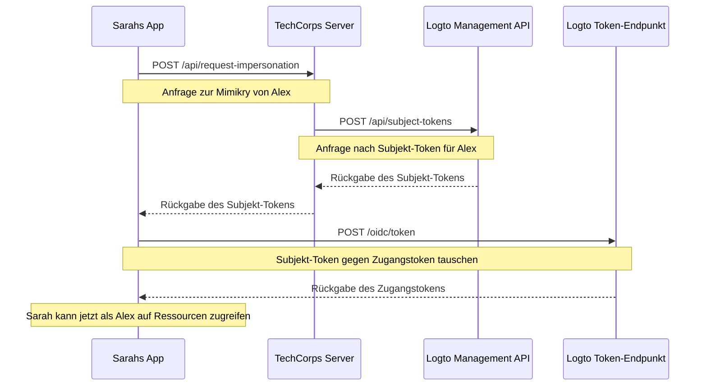

# Benutzermimikry (User impersonation)

Stell dir vor, Sarah, eine Support-Ingenieurin bei TechCorp, erhält ein dringendes Ticket von Alex, einem Kunden, der keinen Zugriff auf eine kritische Ressource hat. Um das Problem effizient zu diagnostizieren und zu lösen, muss Sarah genau das sehen, was Alex im System sieht. Hier kommt die Benutzermimikry-Funktion von Logto ins Spiel.

Benutzermimikry ermöglicht es autorisierten Benutzern wie Sarah, vorübergehend im System im Namen anderer Benutzer wie Alex zu agieren. Diese leistungsstarke Funktion ist unschätzbar für die Fehlerbehebung, den Kundensupport und die Durchführung administrativer Aufgaben.

## Wie funktioniert das? \{#how-it-works}



Der Mimikry-Prozess umfasst drei Hauptschritte:

1. Sarah beantragt die Mimikry über den Backend-Server von TechCorp
2. Der Server von TechCorp erhält ein Subjekt-Token von der Logto Management API
3. Sarahs Anwendung tauscht dieses Subjekt-Token gegen ein Zugangstoken ein

Schauen wir uns an, wie Sarah diese Funktion nutzen kann, um Alex zu helfen.

### Schritt 1: Mimikry anfordern \{#step-1-requesting-impersonation}

Zuerst muss Sarahs Support-Anwendung die Mimikry beim Backend-Server von TechCorp anfordern.

**Anfrage (Sarahs Anwendung an TechCorps Server)**

```bash
POST /api/request-impersonation HTTP/1.1
Host: api.techcorp.com
Authorization: Bearer <Sarah's_access_token>
Content-Type: application/json

{
  "userId": "alex123",
  "reason": "Investigating resource access issue",
  "ticketId": "TECH-1234"
}
```

In dieser API sollte das Backend ordnungsgemäße Autorisierungsprüfungen durchführen, um sicherzustellen, dass Sarah die erforderlichen Berechtigungen zur Mimikry von Alex hat.

### Schritt 2: Subjekt-Token erhalten \{#step-2-obtaining-a-subject-token}

Nachdem Sarahs Anfrage validiert wurde, ruft der Server von TechCorp die [Management API](/integrate-logto/interact-with-management-api) von Logto auf, um ein Subjekt-Token zu erhalten.

**Anfrage (TechCorps Server an Logto Management API)**

```bash
POST /api/subject-tokens HTTP/1.1
Host: techcorp.logto.app
Authorization: Bearer <TechCorp_m2m_access_token>
Content-Type: application/json

{
  "userId": "alex123",
  "context": {
    "ticketId": "TECH-1234",
    "reason": "Resource access issue",
    "supportEngineerId": "sarah789"
  }
}
```

**Antwort (Logto an TechCorps Server)**

```json
{
  "subjectToken": "sub_7h32jf8sK3j2",
  "expiresIn": 600
}
```

Der Server von TechCorp sollte dieses Subjekt-Token dann an Sarahs Anwendung zurückgeben.

**Antwort (TechCorps Server an Sarahs Anwendung)**

```json
{
  "subjectToken": "sub_7h32jf8sK3j2",
  "expiresIn": 600
}
```

### Schritt 3: Subjekt-Token gegen Zugangstoken tauschen \{#step-3-exchanging-the-subject-token-for-an-access-token}

Nun tauscht Sarahs Anwendung dieses Subjekt-Token gegen ein Zugangstoken ein, das Alex repräsentiert, und gibt die Ressource an, für die das Token verwendet wird.

**Anfrage (Sarahs Anwendung an Logtos Token-Endpunkt)**

```bash
POST /oidc/token HTTP/1.1
Host: techcorp.logto.app
Content-Type: application/x-www-form-urlencoded

grant_type=urn:ietf:params:oauth:grant-type:token-exchange
&client_id=techcorp_support_app
&scope=resource:read
&subject_token=alx_7h32jf8sK3j2
&subject_token_type=urn:ietf:params:oauth:token-type:access_token
&resource=https://api.techcorp.com/customer-data
```

**Antwort (Logto an Sarahs Anwendung)**

```json
{
  "access_token": "eyJhbG...<truncated>",
  "issued_token_type": "urn:ietf:params:oauth:token-type:access_token",
  "token_type": "Bearer",
  "expires_in": 3600,
  "scope": "resource:read"
}
```

Das zurückgegebene `access_token` ist an die angegebene Ressource gebunden und kann somit nur mit der Customer Data API von TechCorp verwendet werden.

**Hinweis**: Für traditionelle Webanwendungen sollten `client_id` und `client_secret` im Header der Token-Anfrage enthalten sein, um einen 401 invalid_client Fehler zu vermeiden.

Hier ein Node.js-Beispiel:

```json
Authorization: `Basic ${Buffer.from(`${client_id}:${client_secret}`, 'utf8').toString('base64')}`
```

## Beispielanwendung \{#example-usage}

So könnte Sarah dies in einer Node.js-Support-Anwendung nutzen:

```jsx
interface ImpersonationResponse {
  subjectToken: string;
  expiresIn: number;
}

interface TokenExchangeResponse {
  access_token: string;
  issued_token_type: string;
  token_type: string;
  expires_in: number;
  scope: string;
}

async function impersonateUser(
  userId: string,
  clientId: string,
  ticketId: string,
  resource: string
): Promise<string> {
  try {
    // Schritt 1 & 2: Mimikry anfordern und Subjekt-Token erhalten
    const impersonationResponse = await fetch(
      'https://api.techcorp.com/api/request-impersonation',
      {
        method: 'POST',
        headers: {
          Authorization: "Bearer <Sarah's_access_token>",
          'Content-Type': 'application/json',
        },
        body: JSON.stringify({
          userId,
          reason: 'Investigating resource access issue',
          ticketId,
        }),
      }
    );

    if (!impersonationResponse.ok) {
      throw new Error(`HTTP error occurred. Status: ${impersonationResponse.status}`);
    }

    const { subjectToken } = (await impersonationResponse.json()) as ImpersonationResponse;

    // Schritt 3: Subjekt-Token gegen Zugangstoken tauschen
    const tokenExchangeBody = new URLSearchParams({
      grant_type: 'urn:ietf:params:oauth:grant-type:token-exchange',
      client_id: clientId,
      scope: 'openid profile resource.read',
      subject_token: subjectToken,
      subject_token_type: 'urn:ietf:params:oauth:token-type:access_token',
      resource: resource,
    });

    const tokenExchangeResponse = await fetch('https://techcorp.logto.app/oidc/token', {
      method: 'POST',
      headers: { 'Content-Type': 'application/x-www-form-urlencoded' },
      body: tokenExchangeBody,
    });

    if (!tokenExchangeResponse.ok) {
      throw new Error(`HTTP error! status: ${tokenExchangeResponse.status}`);
    }

    const tokenData = (await tokenExchangeResponse.json()) as TokenExchangeResponse;
    return tokenData.access_token;
  } catch (error) {
    console.error('Impersonation failed:', error);
    throw error;
  }
}

// Sarah nutzt diese Funktion, um Alex zu imitieren
async function performImpersonation(): Promise<void> {
  try {
    const accessToken = await impersonateUser(
      'alex123',
      'techcorp_support_app',
      'TECH-1234',
      'https://api.techcorp.com/customer-data'
    );
    console.log('Impersonation access token for Alex:', accessToken);
  } catch (error) {
    console.error('Failed to perform impersonation:', error);
  }
}

// Führe die Mimikry aus
void performImpersonation()
```

:::note

1. Das Subjekt-Token ist kurzlebig und nur einmal verwendbar.
2. Das Mimikry-Zugangstoken wird nicht mit einem [Auffrischungstoken (Refresh token)](https://auth.wiki/refresh-token) geliefert. Sarah muss den Vorgang wiederholen, falls das Token abläuft, bevor sie Alex' Problem gelöst hat.
3. Der Backend-Server von TechCorp muss ordnungsgemäße Autorisierungsprüfungen implementieren, um sicherzustellen, dass nur autorisiertes Support-Personal wie Sarah die Mimikry anfordern kann.

:::

## `act` Anspruch (Claim) \{#act-claim}

Beim Einsatz des Token-Austausch-Flows für die Mimikry kann das ausgegebene Zugangstoken einen zusätzlichen `act` (actor) Anspruch enthalten. Dieser Anspruch repräsentiert die Identität der „handelnden Partei“ – in unserem Beispiel Sarah, die die Mimikry durchführt.

Um den `act` Anspruch einzuschließen, muss Sarahs Anwendung ein `actor_token` in der Token-Austauschanfrage bereitstellen. Dieses Token sollte ein gültiges Zugangstoken für Sarah mit dem `openid` Scope sein. So wird es in die Anfrage eingebunden:

```bash
POST /oidc/token HTTP/1.1
Host: techcorp.logto.app
Content-Type: application/x-www-form-urlencoded

grant_type=urn:ietf:params:oauth:grant-type:token-exchange
&client_id=techcorp_support_app
&scope=resource:read
&subject_token=alx_7h32jf8sK3j2
&subject_token_type=urn:ietf:params:oauth:token-type:access_token
&actor_token=sarah_access_token
&actor_token_type=urn:ietf:params:oauth:token-type:access_token
&resource=https://api.techcorp.com/customer-data
```

Wenn ein `actor_token` bereitgestellt wird, enthält das resultierende Zugangstoken einen `act` Anspruch wie folgt:

```json
{
  "aud": "https://api.techcorp.com",
  "iss": "https://techcorp.logto.app",
  "exp": 1443904177,
  "sub": "alex123",
  "act": {
    "sub": "sarah789"
  }
}
```

Dieser `act` Anspruch zeigt klar an, dass Sarah (sarah789) im Namen von Alex (alex123) handelt. Der `act` Anspruch ist nützlich für Auditing und Nachverfolgung von Mimikry-Aktionen.

## Token-Ansprüche anpassen \{#customizing-token-claims}

Logto ermöglicht es dir, [die Token-Ansprüche anzupassen](/developers/custom-token-claims) für Mimikry-Tokens. Das ist nützlich, um zusätzlichen Kontext oder Metadaten zum Mimikry-Prozess hinzuzufügen, wie z. B. den Grund für die Mimikry oder das zugehörige Support-Ticket.

Wenn der Server von TechCorp ein Subjekt-Token von der Logto Management API anfordert, kann er ein `context`-Objekt übergeben:

```json
{
  "userId": "alex123",
  "context": {
    "ticketId": "TECH-1234",
    "reason": "Resource access issue",
    "supportEngineerId": "sarah789"
  }
}
```

Dieser [Kontext](/developers/custom-token-claims/create-script#context-only-available-for-user-access-token) kann dann in einer `getCustomJwtClaims()` Funktion verwendet werden, um spezifische Ansprüche zum finalen Zugangstoken hinzuzufügen. Hier ein Beispiel, wie das umgesetzt werden kann:

```tsx
const getCustomJwtClaims = async ({ token, context, environmentVariables }) => {
  if (context.grant?.type === 'urn:ietf:params:oauth:grant-type:token-exchange') {
    const { ticketId, reason, supportEngineerId } = context.grant.subjectTokenContext;
    return {
      impersonation_context: {
        ticket_id: ticketId,
        reason: reason,
        support_engineer: supportEngineerId,
      },
    };
  }
  return {};
};
```

Das resultierende Zugangstoken, das Sarah erhält, könnte so aussehen:

```json
{
  "sub": "alex123",
  "aud": "https://api.techcorp.com/customer-data",
  "impersonation_context": {
    "ticket_id": "TECH-1234",
    "reason": "Resource access issue",
    "support_engineer": "sarah789"
  }
  // ... weitere Standardansprüche
}
```

Durch die Anpassung der Zugangstoken-Ansprüche auf diese Weise kann TechCorp wertvolle Informationen über den Mimikry-Kontext einbinden, was die Nachvollziehbarkeit und das Verständnis von Mimikry-Aktivitäten im System erleichtert.

:::note
Sei vorsichtig beim Hinzufügen benutzerdefinierter Ansprüche zu deinen Tokens. Vermeide es, sensible Informationen einzubinden, die ein Sicherheitsrisiko darstellen könnten, falls das Token abgefangen oder geleakt wird. Die JWTs sind signiert, aber nicht verschlüsselt, daher sind die Ansprüche für jeden mit Zugriff auf das Token sichtbar.
:::

## Verwandte Ressourcen \{#related-resources}

<Url href="https://blog.logto.io/impersonation">
  Was ist Mimikry in Cybersecurity und Identitätsmanagement? Wie können KI-Agenten sie nutzen?
</Url>
