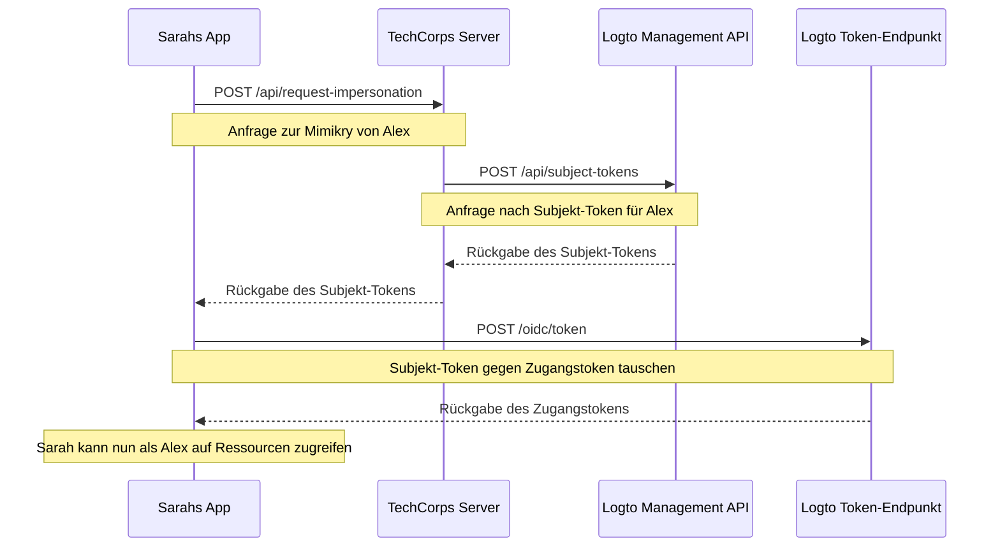

import TokenExchangePrerequisites from './fragments/_token-exchange-prerequisites.mdx';

# Benutzermimikry (User impersonation)

Stell dir vor, Sarah, eine Support-Ingenieurin bei TechCorp, erhält ein dringendes Ticket von Alex, einem Kunden, der keinen Zugriff auf eine kritische Ressource hat. Um das Problem effizient zu diagnostizieren und zu lösen, muss Sarah genau das sehen, was Alex im System sieht. Hier kommt die Benutzermimikry-Funktion von Logto ins Spiel.

Benutzermimikry ermöglicht es autorisierten Benutzern wie Sarah, vorübergehend im System im Namen anderer Benutzer wie Alex zu agieren. Diese leistungsstarke Funktion ist unschätzbar für Fehlerbehebung, Kundensupport und administrative Aufgaben.

## Wie funktioniert das? \{#how-it-works}


```mermaid
sequenceDiagram
    participant Sarah as Sarahs App
    participant TechCorp as TechCorps Server
    participant Logto as Logto Management API
    participant LogtoToken as Logto Token-Endpunkt

    Sarah->>TechCorp: POST /api/request-impersonation
    Note over Sarah,TechCorp: Anfrage zur Mimikry von Alex

    TechCorp->>Logto: POST /api/subject-tokens
    Note over TechCorp,Logto: Anfrage nach Subjekt-Token für Alex

    Logto-->>TechCorp: Rückgabe des Subjekt-Tokens
    TechCorp-->>Sarah: Rückgabe des Subjekt-Tokens

    Sarah->>LogtoToken: POST /oidc/token
    Note over Sarah,LogtoToken: Subjekt-Token gegen Zugangstoken tauschen

    LogtoToken-->>Sarah: Rückgabe des Zugangstokens
    Note over Sarah: Sarah kann nun als Alex auf Ressourcen zugreifen
```

Der Mimikry-Prozess umfasst drei Hauptschritte:

1. Sarah beantragt die Mimikry über den Backend-Server von TechCorp
2. Der Server von TechCorp erhält ein Subjekt-Token von Logtos Management API
3. Sarahs Anwendung tauscht dieses Subjekt-Token gegen ein Zugangstoken aus

Schauen wir uns an, wie Sarah diese Funktion nutzen kann, um Alex zu helfen.

### Schritt 1: Mimikry anfordern \{#step-1-requesting-impersonation}

Zuerst muss Sarahs Support-Anwendung die Mimikry beim Backend-Server von TechCorp anfordern.

**Anfrage (Sarahs Anwendung an TechCorps Server)**

```bash
POST /api/request-impersonation HTTP/1.1
Host: api.techcorp.com
Authorization: Bearer <Sarah's_access_token>
Content-Type: application/json

{
  "userId": "alex123",
  "reason": "Untersuchung eines Zugriffsproblems auf eine Ressource",
  "ticketId": "TECH-1234"
}
```

In dieser API sollte das Backend ordnungsgemäße Autorisierungsprüfungen durchführen, um sicherzustellen, dass Sarah die erforderlichen Berechtigungen zur Mimikry von Alex hat.

### Schritt 2: Subjekt-Token erhalten \{#step-2-obtaining-a-subject-token}

Nachdem Sarahs Anfrage validiert wurde, ruft der Server von TechCorp die [Management API](/integrate-logto/interact-with-management-api) von Logto auf, um ein Subjekt-Token zu erhalten.

**Anfrage (TechCorps Server an Logtos Management API)**

```bash
POST /api/subject-tokens HTTP/1.1
Host: techcorp.logto.app
Authorization: Bearer <TechCorp_m2m_access_token>
Content-Type: application/json

{
  "userId": "alex123",
  "context": {
    "ticketId": "TECH-1234",
    "reason": "Zugriffsproblem auf Ressource",
    "supportEngineerId": "sarah789"
  }
}
```

**Antwort (Logto an TechCorps Server)**

```json
{
  "subjectToken": "sub_7h32jf8sK3j2",
  "expiresIn": 600
}
```

Der Server von TechCorp sollte dieses Subjekt-Token dann an Sarahs Anwendung zurückgeben.

**Antwort (TechCorps Server an Sarahs Anwendung)**

```json
{
  "subjectToken": "sub_7h32jf8sK3j2",
  "expiresIn": 600
}
```

### Schritt 3: Subjekt-Token gegen Zugangstoken tauschen \{#step-3-exchanging-the-subject-token-for-an-access-token}

<TokenExchangePrerequisites />

Nun tauscht Sarahs Anwendung dieses Subjekt-Token gegen ein Zugangstoken aus, das Alex repräsentiert, und gibt dabei die Ressource an, für die das Token verwendet werden soll.

**Anfrage (Sarahs Anwendung an Logtos Token-Endpunkt)**

Für traditionelle Webanwendungen oder Maschine-zu-Maschine-Anwendungen mit App-Secret, gib die Zugangsdaten im `Authorization`-Header an:

```bash
POST /oidc/token HTTP/1.1
Host: techcorp.logto.app
Content-Type: application/x-www-form-urlencoded
# highlight-next-line
Authorization: Basic <base64(client_id:client_secret)>

grant_type=urn:ietf:params:oauth:grant-type:token-exchange
&scope=resource:read
&subject_token=alx_7h32jf8sK3j2
&subject_token_type=urn:ietf:params:oauth:token-type:access_token
&resource=https://api.techcorp.com/customer-data
```

Für Single-Page-Anwendungen (SPA) oder native Anwendungen ohne App-Secret, gib `client_id` im Request-Body an:

```bash
POST /oidc/token HTTP/1.1
Host: techcorp.logto.app
Content-Type: application/x-www-form-urlencoded

grant_type=urn:ietf:params:oauth:grant-type:token-exchange
# highlight-next-line
&client_id=techcorp_support_app
&scope=resource:read
&subject_token=alx_7h32jf8sK3j2
&subject_token_type=urn:ietf:params:oauth:token-type:access_token
&resource=https://api.techcorp.com/customer-data
```

**Antwort (Logto an Sarahs Anwendung)**

```json
{
  "access_token": "eyJhbG...<truncated>",
  "issued_token_type": "urn:ietf:params:oauth:token-type:access_token",
  "token_type": "Bearer",
  "expires_in": 3600,
  "scope": "resource:read"
}
```

Das zurückgegebene `access_token` ist an die angegebene Ressource gebunden und kann somit nur mit der Customer Data API von TechCorp verwendet werden.

## Anwendungsbeispiel \{#example-usage}

So könnte Sarah dies in einer Node.js-Support-Anwendung nutzen:

```tsx
interface ImpersonationResponse {
  subjectToken: string;
  expiresIn: number;
}

interface TokenExchangeResponse {
  access_token: string;
  issued_token_type: string;
  token_type: string;
  expires_in: number;
  scope: string;
}

async function impersonateUser(
  userId: string,
  clientId: string,
  ticketId: string,
  resource: string,
  // highlight-next-line
  clientSecret?: string // Erforderlich für traditionelle Web- oder Maschine-zu-Maschine-Apps
): Promise<string> {
  try {
    // Schritt 1 & 2: Mimikry anfordern und Subjekt-Token erhalten
    const impersonationResponse = await fetch(
      'https://api.techcorp.com/api/request-impersonation',
      {
        method: 'POST',
        headers: {
          Authorization: "Bearer <Sarah's_access_token>",
          'Content-Type': 'application/json',
        },
        body: JSON.stringify({
          userId,
          reason: 'Untersuchung eines Zugriffsproblems auf eine Ressource',
          ticketId,
        }),
      }
    );

    if (!impersonationResponse.ok) {
      throw new Error(`HTTP-Fehler aufgetreten. Status: ${impersonationResponse.status}`);
    }

    const { subjectToken } = (await impersonationResponse.json()) as ImpersonationResponse;

    // Schritt 3: Subjekt-Token gegen Zugangstoken tauschen
    // highlight-start
    // Für traditionelle Web- oder M2M-Apps: Basic Auth mit Client-Secret verwenden
    // Für SPA oder native Apps: client_id im Request-Body angeben
    const headers: Record<string, string> = {
      'Content-Type': 'application/x-www-form-urlencoded',
    };

    const tokenExchangeBody = new URLSearchParams({
      grant_type: 'urn:ietf:params:oauth:grant-type:token-exchange',
      scope: 'openid profile resource.read',
      subject_token: subjectToken,
      subject_token_type: 'urn:ietf:params:oauth:token-type:access_token',
      resource: resource,
    });

    if (clientSecret) {
      // Vertraulicher Client: Basic Auth verwenden
      headers['Authorization'] =
        `Basic ${Buffer.from(`${clientId}:${clientSecret}`).toString('base64')}`;
    } else {
      // Öffentlicher Client: client_id im Body angeben
      tokenExchangeBody.append('client_id', clientId);
    }
    // highlight-end

    const tokenExchangeResponse = await fetch('https://techcorp.logto.app/oidc/token', {
      method: 'POST',
      headers,
      body: tokenExchangeBody,
    });

    if (!tokenExchangeResponse.ok) {
      throw new Error(`HTTP-Fehler! Status: ${tokenExchangeResponse.status}`);
    }

    const tokenData = (await tokenExchangeResponse.json()) as TokenExchangeResponse;
    return tokenData.access_token;
  } catch (error) {
    console.error('Mimikry fehlgeschlagen:', error);
    throw error;
  }
}

// Sarah verwendet diese Funktion, um Alex zu imitieren
async function performImpersonation(): Promise<void> {
  try {
    // highlight-start
    // Für traditionelle Web- oder M2M-Apps: Client-Secret übergeben
    const accessToken = await impersonateUser(
      'alex123',
      'techcorp_support_app',
      'TECH-1234',
      'https://api.techcorp.com/customer-data',
      'your-client-secret' // Für SPA oder native Apps weglassen
    );
    // highlight-end
    console.log('Mimikry-Zugangstoken für Alex:', accessToken);
  } catch (error) {
    console.error('Mimikry konnte nicht durchgeführt werden:', error);
  }
}

// Mimikry ausführen
void performImpersonation();
```

:::note

1. Das Subjekt-Token ist kurzlebig und nur einmal verwendbar.
2. Das Mimikry-Zugangstoken wird nicht mit einem [Auffrischungstoken (Refresh token)](https://auth.wiki/refresh-token) geliefert. Sarah muss den Vorgang wiederholen, falls das Token abläuft, bevor sie Alex' Problem gelöst hat.
3. Der Backend-Server von TechCorp muss ordnungsgemäße Autorisierungsprüfungen implementieren, um sicherzustellen, dass nur autorisiertes Support-Personal wie Sarah eine Mimikry anfordern kann.

:::

## `act`-Anspruch \{#act-claim}

Beim Einsatz des Token-Austausch-Flows für Mimikry kann das ausgegebene Zugangstoken einen zusätzlichen `act` (actor)-Anspruch enthalten. Dieser Anspruch repräsentiert die Identität der „handelnden Partei“ – in unserem Beispiel Sarah, die die Mimikry durchführt.

Um den `act`-Anspruch einzuschließen, muss Sarahs Anwendung ein `actor_token` im Token-Austausch-Request bereitstellen. Dieses Token sollte ein gültiges Zugangstoken für Sarah mit dem `openid`-Scope sein. So wird es im Token-Austausch-Request angegeben:

Für traditionelle Webanwendungen oder Maschine-zu-Maschine-Anwendungen:

```bash
POST /oidc/token HTTP/1.1
Host: techcorp.logto.app
Content-Type: application/x-www-form-urlencoded
# highlight-next-line
Authorization: Basic <base64(client_id:client_secret)>

grant_type=urn:ietf:params:oauth:grant-type:token-exchange
&scope=resource:read
&subject_token=alx_7h32jf8sK3j2
&subject_token_type=urn:ietf:params:oauth:token-type:access_token
&actor_token=sarah_access_token
&actor_token_type=urn:ietf:params:oauth:token-type:access_token
&resource=https://api.techcorp.com/customer-data
```

Für SPA oder native Anwendungen gib stattdessen `client_id` im Request-Body an:

```bash
POST /oidc/token HTTP/1.1
Host: techcorp.logto.app
Content-Type: application/x-www-form-urlencoded

grant_type=urn:ietf:params:oauth:grant-type:token-exchange
# highlight-next-line
&client_id=techcorp_support_app
&scope=resource:read
&subject_token=alx_7h32jf8sK3j2
&subject_token_type=urn:ietf:params:oauth:token-type:access_token
&actor_token=sarah_access_token
&actor_token_type=urn:ietf:params:oauth:token-type:access_token
&resource=https://api.techcorp.com/customer-data
```

Wenn ein `actor_token` bereitgestellt wird, enthält das resultierende Zugangstoken einen `act`-Anspruch wie folgt:

```json
{
  "aud": "https://api.techcorp.com",
  "iss": "https://techcorp.logto.app",
  "exp": 1443904177,
  "sub": "alex123",
  "act": {
    "sub": "sarah789"
  }
}
```

Dieser `act`-Anspruch zeigt klar an, dass Sarah (sarah789) im Namen von Alex (alex123) handelt. Der `act`-Anspruch ist nützlich für Auditing und Nachverfolgung von Mimikry-Aktionen.

## Token-Claims anpassen \{#customizing-token-claims}

Logto ermöglicht es dir, [die Token-Claims anzupassen](/developers/custom-token-claims) für Mimikry-Tokens. Das ist nützlich, um zusätzlichen Kontext oder Metadaten zum Mimikry-Prozess hinzuzufügen, wie z. B. den Grund für die Mimikry oder das zugehörige Support-Ticket.

Wenn der Server von TechCorp ein Subjekt-Token von Logtos Management API anfordert, kann er ein `context`-Objekt angeben:

```json
{
  "userId": "alex123",
  "context": {
    "ticketId": "TECH-1234",
    "reason": "Zugriffsproblem auf Ressource",
    "supportEngineerId": "sarah789"
  }
}
```

Dieser [Kontext](/developers/custom-token-claims/create-script#context-only-available-for-user-access-token) kann dann in einer `getCustomJwtClaims()`-Funktion verwendet werden, um spezifische Ansprüche zum finalen Zugangstoken hinzuzufügen. Hier ein Beispiel, wie das implementiert werden könnte:

```tsx
const getCustomJwtClaims = async ({ token, context, environmentVariables }) => {
  if (context.grant?.type === 'urn:ietf:params:oauth:grant-type:token-exchange') {
    const { ticketId, reason, supportEngineerId } = context.grant.subjectTokenContext;
    return {
      impersonation_context: {
        ticket_id: ticketId,
        reason: reason,
        support_engineer: supportEngineerId,
      },
    };
  }
  return {};
};
```

Das resultierende Zugangstoken, das Sarah erhält, könnte so aussehen:

```json
{
  "sub": "alex123",
  "aud": "https://api.techcorp.com/customer-data",
  "impersonation_context": {
    "ticket_id": "TECH-1234",
    "reason": "Zugriffsproblem auf Ressource",
    "support_engineer": "sarah789"
  }
  // ... weitere Standardansprüche
}
```

Durch die Anpassung der Zugangstoken-Claims auf diese Weise kann TechCorp wertvolle Informationen über den Mimikry-Kontext einfügen, was die Nachvollziehbarkeit und das Verständnis von Mimikry-Aktivitäten im System erleichtert.

:::note
Sei vorsichtig beim Hinzufügen von benutzerdefinierten Ansprüchen zu deinen Tokens. Vermeide es, sensible Informationen einzufügen, die ein Sicherheitsrisiko darstellen könnten, falls das Token abgefangen oder geleakt wird. Die JWTs sind signiert, aber nicht verschlüsselt, daher sind die Ansprüche für jeden sichtbar, der Zugriff auf das Token hat.
:::

## Verwandte Ressourcen \{#related-resources}

<Url href="https://blog.logto.io/impersonation">
  Was ist Mimikry in der Cybersicherheit und im Identitätsmanagement? Wie können KI-Agenten sie
  nutzen?
</Url>
