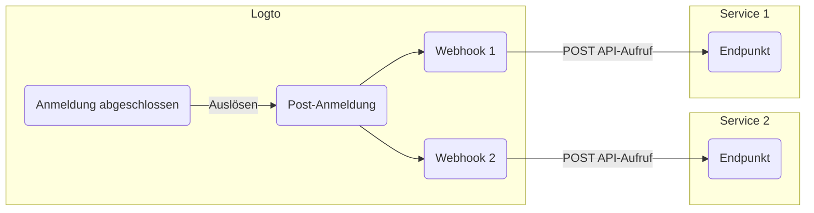

# Webhooks

Logto [Webhook](https://auth.wiki/webhook) bieten Echtzeit-Benachrichtigungen für verschiedene Ereignisse, einschließlich Änderungen an Benutzerkonten, Rollen, Berechtigungen, Organisationen, Organisationsrollen, Organisationsberechtigungen und [Benutzerinteraktionen](/end-user-flows).

Wenn ein Ereignis ausgelöst wird, sendet Logto eine HTTP-Anfrage an die von dir angegebene Endpoint-URL, die detaillierte Informationen über das Ereignis enthält, wie Benutzer-ID, Benutzername, E-Mail und andere relevante Details (für mehr Informationen über die im Payload und Header enthaltenen Daten siehe [Webhook-Anfrage](/developers/webhooks/webhooks-request)). Deine Anwendung kann diese Anfrage verarbeiten und individuelle Aktionen ausführen, wie z. B. das Versenden einer E-Mail oder das Aktualisieren von Daten in einer Datenbank.

Wir fügen kontinuierlich weitere Ereignisse basierend auf den Bedürfnissen der Nutzer hinzu. Wenn du spezifische Anforderungen für dein Unternehmen hast, lass es uns bitte wissen.

## Warum Webhook verwenden? \{#why-use-webhook}

Webhooks bieten eine Echtzeit-Kommunikation zwischen Anwendungen, eliminieren die Notwendigkeit für Polling und ermöglichen sofortige Datenaktualisierungen. Sie vereinfachen die Integration von Anwendungen und die Automatisierung von Workflows ohne komplexen Code oder proprietäre APIs.

Hier sind einige Beispiele für häufige Webhook-Anwendungsfälle im CIAM-Bereich:

- **E-Mails versenden:** Konfiguriere einen Webhook, um eine Willkommens-E-Mail an neue Benutzer nach der Registrierung zu senden oder Administratoren zu benachrichtigen, wenn sich ein Benutzer von einem neuen Gerät oder Standort anmeldet.
- **Benachrichtigungen senden:** Konfiguriere einen Webhook, um einen virtuellen Assistenten mit deinem CRM-System auszulösen, um Echtzeit-Kundensupport zu bieten, wenn sich Benutzer anmelden.
- **Zusätzliche API-Aufrufe durchführen**: Konfiguriere einen Webhook, um den Benutzerzugriff zu überprüfen, indem du deren E-Mail-Domain oder IP-Adresse prüfst und dann die Logto Management API verwendest, um entsprechende Rollen mit Ressourcenberechtigungen zuzuweisen.
- **Daten-Synchronisation:** Konfiguriere einen Webhook, um die Anwendung über Änderungen wie Sperrungen oder Löschungen von Benutzerkonten auf dem Laufenden zu halten.
- **Berichte generieren**: Richte einen Webhook ein, um Daten zur Benutzeranmeldeaktivität zu erhalten und diese zur Erstellung von Berichten über Benutzerengagement oder Nutzungsmuster zu nutzen.

## Begriffe \{#terms}

| Item                                                                                                                                                                           | Description                                                                                                                                                                                              |
| ------------------------------------------------------------------------------------------------------------------------------------------------------------------------------ | -------------------------------------------------------------------------------------------------------------------------------------------------------------------------------------------------------- |
| Event                                                                                                                                                                          | Wenn eine bestimmte Aktion ausgeführt wird, löst sie ein Hook-Ereignis mit einem bestimmten Typ aus. Z. B. sendet Logto ein PostRegister-Hook-Ereignis, wenn der Benutzer den Anmeldeprozess abgeschlossen und ein neues Konto erstellt hat. |
| Hook                                                                                                                                                                           | Eine einzelne oder eine Reihe von Aktionen, die an ein bestimmtes Ereignis angehängt sind. Die Aktion kann ein API-Aufruf, das Ausführen von Code-Snippets usw. sein.                                    |
| Webhook                                                                                                                                                                        | Ein Subtyp von Hook, der das Aufrufen einer API mit dem Ereignis-Payload bezeichnet.                                                                                                                     |
| Angenommen, ein Entwickler möchte eine Benachrichtigung senden, wenn sich ein Benutzer über ein neues Gerät anmeldet, kann der Entwickler einen Webhook hinzufügen, der seine Sicherheitsdienst-API zum PostSignIn-Ereignis aufruft. |

Hier ist ein Beispiel für das Aktivieren von zwei Webhooks für das `PostSignIn`-Ereignis in Logto:

## FAQs \{#faqs}

### Unterstützt Logto synchrone Webhooks? \{#does-logto-support-synced-webhooks}

Obwohl synchrone Webhooks den Benutzeranmeldeprozess reibungsloser machen würden, unterstützen wir sie derzeit noch nicht (werden wir aber in Zukunft). Daher erfordern Szenarien, die auf synchronen Webhooks basieren, aktuell unterschiedliche Workarounds. Wenn du Fragen hast, zögere nicht, uns zu kontaktieren.

### Wie gehe ich mit Änderungen der Benutzerberechtigungen um? \{#how-to-deal-with-user-permission-change}

Siehe [Benutzerberechtigungsänderung verwalten](/authorization/global-api-resources/#optional-handle-user-permission-change) Anleitung.

### Wie kann ich einen Webhook-Timeout debuggen? \{#how-to-debug-webhook-timeout}

Der Endpunkt, der Webhooks empfängt, sollte so schnell wie möglich eine 2xx-Antwort zurückgeben, um Logto mitzuteilen, dass der Webhook erfolgreich empfangen wurde. Da verschiedene Nutzer sehr unterschiedliche Verarbeitungslogiken für Webhooks haben, können übermäßig komplexe Aufgaben mehrere Sekunden dauern, was dazu führt, dass der Logto Webhook in einen Timeout läuft. Best Practice ist es, eine eigene Ereigniswarteschlange zu pflegen; nach Empfang des Logto Webhooks wird das Ereignis in die Warteschlange eingefügt und eine 2xx-Antwort an Logto zurückgegeben. Dann kann dein eigener Worker die Aufgaben in der Warteschlange Schritt für Schritt abarbeiten. Wenn der Worker auf einen Fehler stößt, sollte dieser auf deinem eigenen Server behandelt werden.

### Kann ich die Client-IP-Adresse aus `PostSignIn`-Webhooks erhalten? \{#can-i-get-the-client-ip-address-from-postsignin-webhooks}

Ja, du kannst IP-Adresse, User Agents usw. im Webhook-Payload erhalten. Wenn du Informationen benötigst, die derzeit nicht unterstützt werden, kannst du Feature-Requests auf GitHub Issues erstellen oder uns kontaktieren.

## Verwandte Ressourcen \{#related-resources}

<Url href="https://blog.logto.io/webhooks-vs-polling">Webhooks vs. Polling</Url>
