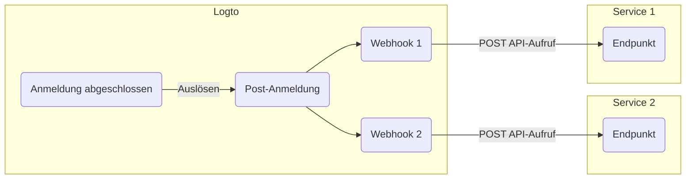

# Webhooks

Logto [Webhooks](https://auth.wiki/webhook) bieten Echtzeit-Benachrichtigungen für verschiedene Ereignisse, einschließlich Änderungen an Benutzerkonten, Rollen, Berechtigungen, Organisationen, Organisationsrollen, Organisationsberechtigungen und [Benutzerinteraktionen](/end-user-flows).

Wenn ein Ereignis ausgelöst wird, sendet Logto asynchron eine HTTP-Anfrage an die von dir bereitgestellte Endpunkt-URL. Die Anfrage enthält Details zum Ereignis, wie den Benutzer, die Anwendung und den Anfragekontext. Siehe [Webhook-Anfrage](/developers/webhooks/webhooks-request) für Referenzen zu Payload und Header.

Die Zustellung des Webhooks erfolgt außerhalb der Authentifizierungsanfrage und kann das Ergebnis des aktuellen Ablaufs nicht ändern. Für synchronen Code, der vor der Fortsetzung der Anmeldung abgeschlossen sein muss, verwende [Actions](/developers/actions).

Wir fügen kontinuierlich weitere Ereignisse basierend auf den Bedürfnissen der Nutzer hinzu. Wenn du spezifische Anforderungen für dein Unternehmen hast, lass es uns bitte wissen.

## Warum Webhook verwenden? \{#why-use-webhook}

Webhooks bieten eine Echtzeit-Kommunikation zwischen Anwendungen, eliminieren die Notwendigkeit für Polling und ermöglichen sofortige Datenaktualisierungen. Sie vereinfachen die Integration von Anwendungen und die Automatisierung von Workflows ohne komplexen Code oder proprietäre APIs.

Hier sind einige Beispiele für gängige Webhook-Anwendungsfälle im CIAM-Bereich:

- **E-Mails versenden:** Konfiguriere einen Webhook, um eine Willkommens-E-Mail an neue Benutzer nach der Registrierung zu senden oder Administratoren zu benachrichtigen, wenn sich ein Benutzer von einem neuen Gerät oder Standort anmeldet.
- **Benachrichtigungen senden:** Konfiguriere einen Webhook, um einen virtuellen Assistenten mit deinem CRM-System auszulösen, um bei der Anmeldung von Benutzern einen Echtzeit-Kundensupport zu bieten.
- **Zusätzliche API-Aufrufe durchführen:** Konfiguriere einen Webhook, um den Benutzerzugriff zu überprüfen, indem du deren E-Mail-Domain oder IP-Adresse prüfst und anschließend die Logto Management API verwendest, um entsprechende Rollen mit Ressourcenberechtigungen zuzuweisen.
- **Daten-Synchronisation:** Konfiguriere einen Webhook, um die Anwendung über Änderungen wie Kontosperrungen oder -löschungen auf dem Laufenden zu halten.
- **Berichte generieren:** Richte einen Webhook ein, um Daten zur Benutzeranmeldeaktivität zu erhalten und diese zur Erstellung von Berichten über Benutzerengagement oder Nutzungsmuster zu nutzen.

## Begriffe \{#terms}

| Item             | Beschreibung                                                                                                             |
| ---------------- | ------------------------------------------------------------------------------------------------------------------------ |
| Webhook-Ereignis | Ein unterstützter Ereignistyp, den Logto liefern kann, wie z. B. `PostSignIn` oder `User.Created`.                       |
| Webhook          | Eine Konfiguration, die sich auf ein oder mehrere Ereignisse abonniert und deren Payloads an einen HTTP-Endpunkt sendet. |

Zum Beispiel: Um einen Sicherheitsdienst nach der Anmeldung eines Benutzers zu benachrichtigen, erstelle einen Webhook, der sich auf `PostSignIn` abonniert.

Hier ist ein Beispiel, wie zwei Webhooks für das `PostSignIn`-Ereignis in Logto aktiviert werden:

```mermaid
graph LR
  subgraph Logto
    SF(Anmeldung abgeschlossen)
    PS(Post-Anmeldung)
    WH2(Webhook 2)
    WH1(Webhook 1)
  end

  subgraph Service 2
    E2(Endpunkt)
  end

  subgraph Service 1
    E1(Endpunkt)
  end

  SF -->|Auslösen| PS
  PS --> WH1
  PS --> WH2
  WH1 --->|POST API-Aufruf| E1
  WH2 --->|POST API-Aufruf| E2

```

## FAQs \{#faqs}

### Können Webhooks eine synchrone Authentifizierungsentscheidung treffen? \{#does-logto-support-synced-webhooks}

Nein. Webhooks sind asynchrone Benachrichtigungen, daher kann ihre Antwort den aktuellen Authentifizierungsablauf nicht erlauben, blockieren oder ändern.

Verwende [Actions](/developers/actions), wenn Logto benutzerdefinierten Code ausführen, eine externe API aufrufen oder einen Benutzer aktualisieren muss, bevor die Anmeldung fortgesetzt wird. Da Actions synchron sind, halte deren externe Abhängigkeiten schnell und zuverlässig.

### Wie gehe ich mit einer Änderung der Benutzerberechtigung um? \{#how-to-deal-with-user-permission-change}

Siehe [Benutzerberechtigungsänderung verwalten](/authorization/global-api-resources/#optional-handle-user-permission-change) Anleitung.

### Wie kann ich einen Webhook-Timeout debuggen? \{#how-to-debug-webhook-timeout}

Für den Endpunkt, der Webhooks empfängt, sollte so schnell wie möglich eine 2xx-Antwort zurückgegeben werden, um Logto mitzuteilen, dass der Webhook erfolgreich empfangen wurde. Da verschiedene Nutzer sehr unterschiedliche Verarbeitungslogiken für Webhooks haben, können übermäßig komplexe Aufgaben mehrere Sekunden dauern, was dazu führt, dass der Logto Webhook in einen Timeout läuft. Die beste Praxis ist, eine eigene Ereigniswarteschlange zu pflegen: Nach dem Empfang des Logto Webhooks das Ereignis in die Warteschlange einfügen und eine 2xx-Antwort an Logto zurückgeben. Anschließend kann dein eigener Worker die Aufgaben in der Warteschlange Schritt für Schritt abarbeiten. Wenn der Worker auf einen Fehler stößt, sollte dieser auf deinem eigenen Server behandelt werden.

### Kann ich die Client-IP-Adresse aus `PostSignIn`-Webhooks erhalten? \{#can-i-get-the-client-ip-address-from-postsignin-webhooks}

Ja, du kannst IP-Adresse, User Agents usw. im Webhook-Payload erhalten. Falls du Informationen benötigst, die derzeit nicht unterstützt werden, kannst du Feature-Requests auf GitHub Issues erstellen oder uns kontaktieren.

## Verwandte Ressourcen \{#related-resources}

<Url href="https://blog.logto.io/webhooks-vs-polling">Webhooks vs. Polling</Url>
