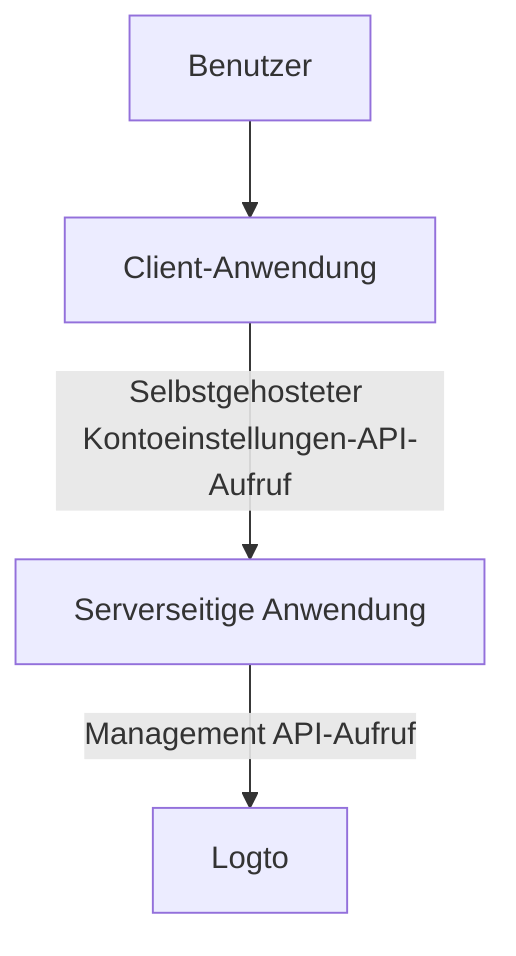
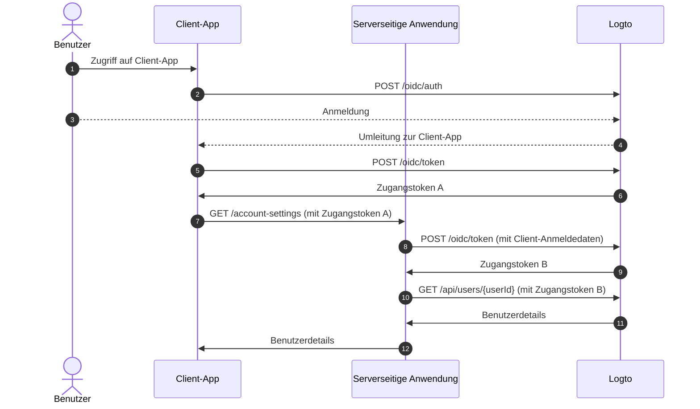
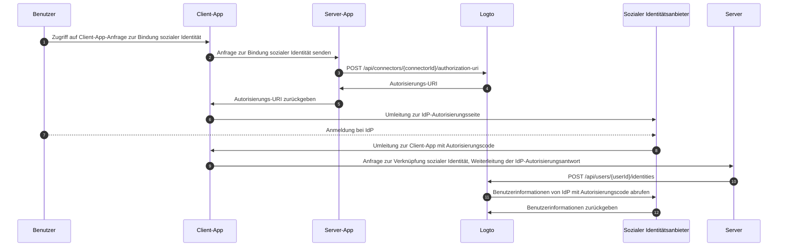

# Kontoeinstellungen über Management API

## Integrationen \{#integrations}

Logto bietet verschiedene Management API, um Benutzerkonten zu verwalten. Du kannst diese APIs verwenden, um eine Selbstbedienungs-Kontoeinstellungsseite für Endbenutzer zu erstellen.

### Architektur \{#architecture}

1. **Benutzer**: Authentifizierter Endbenutzer, der auf seine Kontoeinstellungen zugreifen und diese verwalten muss.
2. **Client-Anwendung**: Deine Client-Anwendung, die dem Benutzer die Kontoeinstellungsseite bereitstellt.
3. **Serverseitige Anwendung**: Serverseitige Anwendung, die die Kontoeinstellungen-API für den Client bereitstellt. Interagiert mit der Logto Management API.
4. **Logto**: Logto als Authentifizierungs- und Autorisierungsdienst. Bietet die Management API zur Verwaltung von Benutzerkonten.

### Sequenzdiagramm \{#sequence-diagram}

1. Der Benutzer greift auf die Client-Anwendung zu.
2. Die Client-Anwendung sendet die Authentifizierungsanfrage an Logto und leitet den Benutzer zur Logto-Anmeldeseite um.
3. Der Benutzer meldet sich bei Logto an.
4. Der authentifizierte Benutzer wird mit dem Autorisierungscode zurück zur Client-Anwendung umgeleitet.
5. Die Client-Anwendung fordert das Zugangstoken von Logto für den Zugriff auf die selbstgehostete Kontoeinstellungen-API an.
6. Logto gewährt der Client-Anwendung das Zugangstoken.
7. Die Client-Anwendung sendet die Anfrage für die Kontoeinstellungen an die serverseitige Anwendung mit dem Benutzer-Zugangstoken.
8. Die serverseitige Anwendung überprüft die Identität und Berechtigung des Anfragenden aus dem Benutzer-Zugangstoken. Dann fordert sie ein Management API-Zugangstoken von Logto an.
9. Logto gewährt der serverseitigen Anwendung das Management API-Zugangstoken.
10. Die serverseitige Anwendung fordert die Benutzerdaten von Logto mit dem Management API-Zugangstoken an.
11. Logto überprüft die Identität des Servers und die Management API-Berechtigung und gibt die Benutzerdaten zurück.
12. Die serverseitige Anwendung verarbeitet die Benutzerdaten basierend auf der Berechtigung des Anfragenden und gibt die Benutzerdetails an die Client-Anwendung zurück.

### Management API in serverseitige Anwendung integrieren \{#integrate-management-api-to-server-side-application}

Sieh dir den Abschnitt [Management API](/integrate-logto/interact-with-management-api/) an, um zu erfahren, wie du die Management APIs in serverseitige Anwendungen integrieren kannst.

## Benutzerverwaltungs-APIs \{#user-management-apis}

### Benutzerdaten-Schema \{#user-data-schema}

Sieh dir den Abschnitt [Benutzerdaten und benutzerdefinierte Daten](/user-management/user-data/) an, um mehr über das Benutzerdaten-Schema in Logto zu erfahren.

### Benutzerprofil- und Identifikatoren-Management-APIs \{#user-profile-and-identifiers-management-apis}

Das Profil und die Identifikatoren eines Benutzers sind entscheidend für die Benutzerverwaltung. Du kannst die folgenden APIs verwenden, um Benutzerprofile und Identifikatoren zu verwalten.

| Methode | Pfad                                                                                                     | Beschreibung                                                  |
| ------- | -------------------------------------------------------------------------------------------------------- | ------------------------------------------------------------- |
| GET     | [/api/users/\{userId\}](https://openapi.logto.io/operation/operation-getuser)                            | Benutzerdetails nach Benutzer-ID abrufen.                     |
| PATCH   | [/api/users/\{userId\}](https://openapi.logto.io/operation/operation-updateuser)                         | Benutzerdetails aktualisieren.                                |
| PATCH   | [/api/users/\{userId\}/profile](https://openapi.logto.io/operation/operation-updateuserprofile)          | Benutzerprofilfelder nach Benutzer-ID aktualisieren.          |
| GET     | [/api/users/\{userId\}/custom-data](https://openapi.logto.io/operation/operation-listusercustomdata)     | Benutzerdefinierte Daten nach Benutzer-ID abrufen.            |
| PATCH   | [/api/users/\{userId\}/custom-data](https://openapi.logto.io/operation/operation-updateusercustomdata)   | Benutzerdefinierte Daten nach Benutzer-ID aktualisieren.      |
| PATCH   | [/api/users/\{userId\}/is-suspended](https://openapi.logto.io/operation/operation-updateuserissuspended) | Benutzer-Suspendierungsstatus nach Benutzer-ID aktualisieren. |

### E-Mail- und Telefonnummernverifizierung \{#email-and-phone-number-verification}

Im Logto-System können sowohl E-Mail-Adressen als auch Telefonnummern als Benutzeridentifikatoren dienen, weshalb ihre Verifizierung unerlässlich ist. Dazu bieten wir eine Reihe von Verifizierungscode-APIs an, um die angegebene E-Mail oder Telefonnummer zu verifizieren.

:::note
Stelle sicher, dass du die E-Mail oder Telefonnummer verifizierst, bevor du das Benutzerprofil mit einer neuen E-Mail oder Telefonnummer aktualisierst.
:::

| Methode | Pfad                                                                                                               | Beschreibung                                                   |
| ------- | ------------------------------------------------------------------------------------------------------------------ | -------------------------------------------------------------- |
| POST    | [/api/verification/verification-codes](https://openapi.logto.io/operation/operation-createverificationcode)        | Verifizierungscode für E-Mail oder Telefonnummer senden.       |
| POST    | [/api/verification/verification-codes/verify](https://openapi.logto.io/operation/operation-verifyverificationcode) | E-Mail oder Telefonnummer mit Verifizierungscode verifizieren. |

### Benutzerpasswortverwaltung \{#user-password-management}

| Methode | Pfad                                                                                                     | Beschreibung                                                    |
| ------- | -------------------------------------------------------------------------------------------------------- | --------------------------------------------------------------- |
| POST    | [/api/users/\{userId\}/password/verify](https://openapi.logto.io/operation/operation-verifyuserpassword) | Aktuelles Benutzerpasswort nach Benutzer-ID verifizieren.       |
| PATCH   | [/api/users/\{userId\}/password](https://openapi.logto.io/operation/operation-updateuserpassword)        | Benutzerpasswort nach Benutzer-ID aktualisieren.                |
| GET     | [/api/users/\{userId\}/has-password](https://openapi.logto.io/operation/operation-getuserhaspassword)    | Überprüfen, ob der Benutzer ein Passwort hat, nach Benutzer-ID. |

:::note
Stelle sicher, dass du das aktuelle Passwort des Benutzers verifizierst, bevor du das Benutzerpasswort aktualisierst.
:::

### Verwaltung von sozialen Identitäten des Benutzers \{#user-social-identities-management}

| Methode | Pfad                                                                                                                              | Beschreibung                                                                                                                                       |
| ------- | --------------------------------------------------------------------------------------------------------------------------------- | -------------------------------------------------------------------------------------------------------------------------------------------------- |
| GET     | [/api/users/\{userId\}](https://openapi.logto.io/operation/operation-getuser)                                                     | Benutzerdetails nach Benutzer-ID abrufen. Die sozialen Identitäten sind im Feld `identities` zu finden.                                            |
| POST    | [/api/users/\{userId\}/identities](https://openapi.logto.io/operation/operation-createuseridentity)                               | Eine authentifizierte soziale Identität mit dem Benutzer nach Benutzer-ID verknüpfen.                                                              |
| DELETE  | [/api/users/\{userId\}/identities](https://openapi.logto.io/operation/operation-deleteuseridentity)                               | Eine soziale Identität vom Benutzer nach Benutzer-ID trennen.                                                                                      |
| PUT     | [/api/users/\{userId\}/identities](https://openapi.logto.io/operation/operation-replaceuseridentity)                              | Eine mit dem Benutzer verknüpfte soziale Identität direkt nach Benutzer-ID aktualisieren.                                                          |
| POST    | [/api/connectors/\{connectorId\}/authorization-uri](https://openapi.logto.io/operation/operation-createconnectorauthorizationuri) | Die Autorisierungs-URI für einen sozialen Identitätsanbieter abrufen. Verwende diese URI, um eine neue soziale Identitätsverbindung zu initiieren. |

1. Der Benutzer greift auf die Client-Anwendung zu und fordert die Bindung einer sozialen Identität an.
2. Die Client-Anwendung sendet eine Anfrage an den Server, um eine soziale Identität zu binden.
3. Der Server sendet eine Anfrage an Logto, um die Autorisierungs-URI für den sozialen Identitätsanbieter zu erhalten. Du musst deinen eigenen `state`-Parameter und `redirect_uri` in der Anfrage angeben. Stelle sicher, dass du die `redirect_uri` beim sozialen Identitätsanbieter registrierst.
4. Logto gibt die Autorisierungs-URI an den Server zurück.
5. Der Server gibt die Autorisierungs-URI an die Client-Anwendung zurück.
6. Die Client-Anwendung leitet den Benutzer zur IdP-Autorisierungs-URI um.
7. Der Benutzer meldet sich beim IdP an.
8. Der IdP leitet den Benutzer mit dem Autorisierungscode zurück zur Client-Anwendung um, unter Verwendung der `redirect_uri`.
9. Die Client-Anwendung validiert den `state` und leitet die IdP-Autorisierungsantwort an den Server weiter.
10. Der Server sendet eine Anfrage an Logto, um die soziale Identität mit dem Benutzer zu verknüpfen.
11. Logto ruft die Benutzerinformationen vom IdP mit dem Autorisierungscode ab.
12. Der IdP gibt die Benutzerinformationen an Logto zurück und Logto verknüpft die soziale Identität mit dem Benutzer.

:::note
Es gibt einige Einschränkungen, die bei der Verknüpfung neuer sozialer Identitäten mit einem Benutzer zu beachten sind:

- Die Management API hat keinen Sitzungs-Kontext. Jeder soziale Connector, der eine aktive Sitzung erfordert, um den sozialen Authentifizierungsstatus sicher zu verwalten, kann nicht über die Management API verknüpft werden. Nicht unterstützte Connectoren sind Apple, Standard-OIDC und Standard-OAuth 2.0 Connector.
- Aus demselben Grund kann Logto den `state`-Parameter in der Autorisierungsantwort nicht verifizieren. Stelle sicher, dass du den `state`-Parameter in deiner Client-App speicherst und ihn validierst, wenn die Autorisierungsantwort empfangen wird.
- Du musst die `redirect_uri` im Voraus beim sozialen Identitätsanbieter registrieren. Andernfalls wird der soziale IdP den Benutzer nicht zurück zu deiner Client-App umleiten. Dein sozialer IdP muss mehr als eine Callback-`redirect_uri` akzeptieren, eine für die Benutzeranmeldung, eine für deine eigene Profilbindungsseite.

:::

### Verwaltung von Unternehmensidentitäten des Benutzers \{#user-enterprise-identities-management}

| Methode | Pfad                                                                                                    | Beschreibung                                                                                                                                                                                                              |
| ------- | ------------------------------------------------------------------------------------------------------- | ------------------------------------------------------------------------------------------------------------------------------------------------------------------------------------------------------------------------- |
| GET     | [/api/users/\{userId\}?includeSsoIdentities=true](https://openapi.logto.io/operation/operation-getuser) | Benutzerdetails nach Benutzer-ID abrufen. Die Unternehmensidentitäten sind im Feld `ssoIdentities` zu finden. Füge den Abfrageparameter `includeSsoIdentities=true` zur Benutzerdetails-API hinzu, um sie einzuschließen. |

Derzeit unterstützt die Management API nicht das Verknüpfen oder Trennen von Unternehmensidentitäten mit einem Benutzer. Du kannst nur die mit einem Benutzer verknüpften Unternehmensidentitäten anzeigen.

### Persönliches Zugangstoken \{#personal-access-token}

| Methode | Pfad                                                                                                                                 | Beschreibung                                                     |
| ------- | ------------------------------------------------------------------------------------------------------------------------------------ | ---------------------------------------------------------------- |
| GET     | [/api/users/\{userId\}/personal-access-tokens](https://openapi.logto.io/operation/operation-listuserpersonalaccesstokens)            | Alle persönlichen Zugangstokens für den Benutzer abrufen.        |
| POST    | [/api/users/\{userId\}/personal-access-tokens](https://openapi.logto.io/operation/operation-createuserpersonalaccesstoken)           | Ein neues persönliches Zugangstoken für den Benutzer hinzufügen. |
| DELETE  | [/api/users/\{userId\}/personal-access-tokens/\{name\}](https://openapi.logto.io/operation/operation-deleteuserpersonalaccesstoken)  | Ein Token für den Benutzer nach Name löschen.                    |
| PATCH   | [/api/users/\{userId\s}/personal-access-tokens/\{name\}](https://openapi.logto.io/operation/operation-updateuserpersonalaccesstoken) | Ein Token für den Benutzer nach Name aktualisieren.              |

Persönliche Zugangstokens bieten eine sichere Möglichkeit für Benutzer, [Zugangstoken](https://auth.wiki/access-token) zu gewähren, ohne ihre Anmeldedaten und interaktive Anmeldung zu verwenden. Erfahre mehr über [die Verwendung persönlicher Zugangstokens](/user-management/personal-access-token).

### Verwaltung der MFA-Einstellungen des Benutzers \{#user-mfa-settings-management}

| Methode | Pfad                                                                                                                                 | Beschreibung                                                         |
| ------- | ------------------------------------------------------------------------------------------------------------------------------------ | -------------------------------------------------------------------- |
| GET     | [/api/users/\{userId\}/mfa-verifications](https://openapi.logto.io/operation/operation-listusermfaverifications)                     | MFA-Einstellungen des Benutzers nach Benutzer-ID abrufen.            |
| POST    | [/api/users/\{userId\}/mfa-verifications](https://openapi.logto.io/operation/operation-createusermfaverification)                    | Eine MFA-Verifizierung für den Benutzer nach Benutzer-ID einrichten. |
| DELETE  | [/api/users/\{userId\}/mfa-verifications/\{verificationId\}](https://openapi.logto.io/operation/operation-deleteusermfaverification) | Eine MFA-Verifizierung des Benutzers nach ID löschen.                |

### Benutzerkontolöschung \{#user-account-deletion}

| Methode | Pfad                                                                             | Beschreibung                             |
| ------- | -------------------------------------------------------------------------------- | ---------------------------------------- |
| DELETE  | [/api/users/\{userId\}](https://openapi.logto.io/operation/operation-deleteuser) | Einen Benutzer nach Benutzer-ID löschen. |
