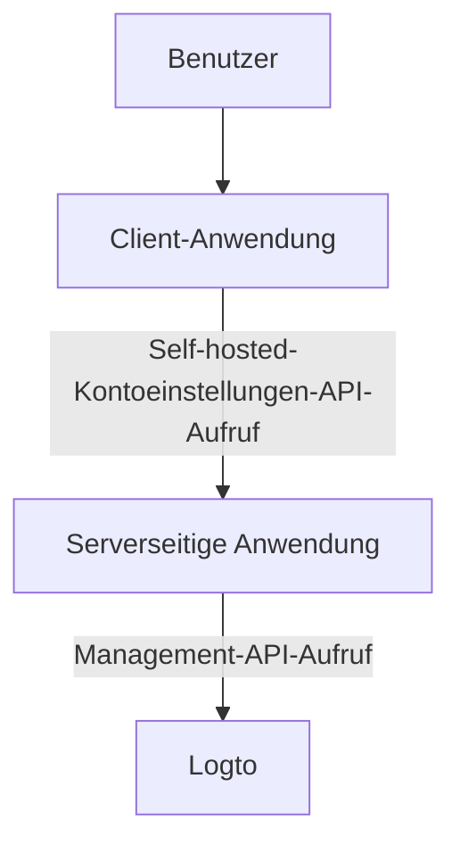
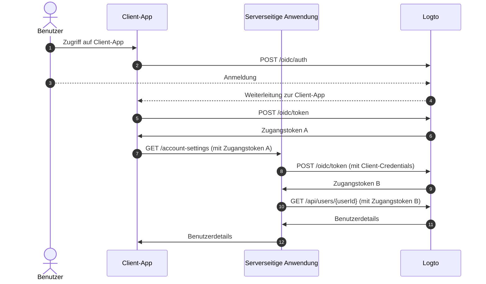
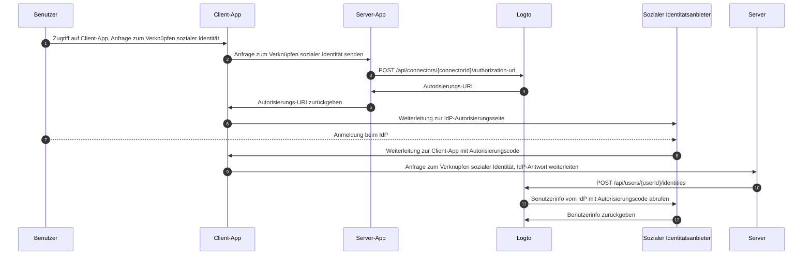

# Kontoeinstellungen über Management API

## Integrationen \{#integrations}

Logto stellt verschiedene Management API zur Verfügung, um Benutzerkonten zu verwalten. Du kannst diese APIs nutzen, um eine Self-Service-Kontoeinstellungsseite für Endbenutzer zu erstellen.

### Architektur \{#architecture}

1. **Benutzer**: Authentifizierter Endbenutzer, der auf seine Kontoeinstellungen zugreifen und diese verwalten möchte.
2. **Client-Anwendung**: Deine Client-Anwendung, die dem Benutzer die Kontoeinstellungsseite bereitstellt.
3. **Serverseitige Anwendung**: Serverseitige Anwendung, die die Kontoeinstellungen-API für den Client bereitstellt. Interagiert mit der Logto Management API.
4. **Logto**: Logto als Authentifizierungs- und Autorisierungsdienst. Stellt die Management API zur Verwaltung von Benutzerkonten bereit.

### Sequenzdiagramm \{#sequence-diagram}

1. Der Benutzer greift auf die Client-Anwendung zu.
2. Die Client-Anwendung sendet die Authentifizierungsanfrage an Logto und leitet den Benutzer zur Logto-Anmeldeseite weiter.
3. Der Benutzer meldet sich bei Logto an.
4. Der authentifizierte Benutzer wird mit dem Autorisierungscode zurück zur Client-Anwendung geleitet.
5. Die Client-Anwendung fordert das Zugangstoken von Logto für den Zugriff auf die Self-hosted-Kontoeinstellungen-API an.
6. Logto gewährt das Zugangstoken an die Client-Anwendung.
7. Die Client-Anwendung sendet die Kontoeinstellungen-Anfrage an die serverseitige Anwendung mit dem Benutzer-Zugangstoken.
8. Die serverseitige Anwendung prüft die Identität und Berechtigung des Anfragenden anhand des Benutzer-Zugangstokens. Dann fordert sie ein Management API Zugangstoken von Logto an.
9. Logto gewährt das Management API Zugangstoken an die serverseitige Anwendung.
10. Die serverseitige Anwendung fordert die Benutzerdaten von Logto mit dem Management API Zugangstoken an.
11. Logto prüft die Identität des Servers und die Management API Berechtigung und gibt die Benutzerdaten zurück.
12. Die serverseitige Anwendung verarbeitet die Benutzerdaten basierend auf der Berechtigung des Anfragenden und gibt die Kontodetails an die Client-Anwendung zurück.

### Management API in serverseitige Anwendung integrieren \{#integrate-management-api-to-server-side-application}

Siehe den Abschnitt [Management API](/integrate-logto/interact-with-management-api/), um zu erfahren, wie du die Management APIs mit serverseitigen Anwendungen integrierst.

## Benutzerverwaltungs-APIs \{#user-management-apis}

### Benutzerdaten-Schema \{#user-data-schema}

Siehe den Abschnitt [Benutzerdaten und benutzerdefinierte Daten](/user-management/user-data/), um mehr über das Benutzerschema in Logto zu erfahren.

### Benutzerprofil- und Identifikatoren-Management-APIs \{#user-profile-and-identifiers-management-apis}

Das Profil und die Identifikatoren eines Benutzers sind essenziell für die Benutzerverwaltung. Du kannst die folgenden APIs verwenden, um Benutzerprofile und Identifikatoren zu verwalten.

| Methode | Pfad                                                                                                     | Beschreibung                                              |
| ------- | -------------------------------------------------------------------------------------------------------- | --------------------------------------------------------- |
| GET     | [/api/users/\{userId\}](https://openapi.logto.io/operation/operation-getuser)                            | Benutzerdetails nach Benutzer-ID abrufen.                 |
| PATCH   | [/api/users/\{userId\}](https://openapi.logto.io/operation/operation-updateuser)                         | Benutzerdetails aktualisieren.                            |
| PATCH   | [/api/users/\{userId\}/profile](https://openapi.logto.io/operation/operation-updateuserprofile)          | Benutzerprofilfelder nach Benutzer-ID ändern.             |
| GET     | [/api/users/\{userId\}/custom-data](https://openapi.logto.io/operation/operation-listusercustomdata)     | Benutzerdefinierte Daten nach Benutzer-ID abrufen.        |
| PATCH   | [/api/users/\{userId\}/custom-data](https://openapi.logto.io/operation/operation-updateusercustomdata)   | Benutzerdefinierte Daten nach Benutzer-ID aktualisieren.  |
| PATCH   | [/api/users/\{userId\}/is-suspended](https://openapi.logto.io/operation/operation-updateuserissuspended) | Sperrstatus des Benutzers nach Benutzer-ID aktualisieren. |

### E-Mail- und Telefonnummer-Verifizierung \{#email-and-phone-number-verification}

Im Logto-System können sowohl E-Mail-Adressen als auch Telefonnummern als Benutzeridentifikatoren dienen, weshalb deren Verifizierung unerlässlich ist. Dafür stellen wir eine Reihe von Verifizierungscode-APIs bereit, um die angegebene E-Mail oder Telefonnummer zu verifizieren.

:::note
Stelle sicher, dass du die E-Mail oder Telefonnummer verifizierst, bevor du das Benutzerprofil mit einer neuen E-Mail oder Telefonnummer aktualisierst.
:::

| Methode | Pfad                                                                                                                             | Beschreibung                                             |
| ------- | -------------------------------------------------------------------------------------------------------------------------------- | -------------------------------------------------------- |
| POST    | [/api/verifications/verification-code](https://openapi.logto.io/operation/operation-createverificationbyverificationcode)        | Verifizierungscode für E-Mail oder Telefonnummer senden. |
| POST    | [/api/verifications/verification-code/verify](https://openapi.logto.io/operation/operation-verifyverificationbyverificationcode) | E-Mail oder Telefonnummer mit Verifizierungscode prüfen. |

### Benutzerpasswort-Verwaltung \{#user-password-management}

| Methode | Pfad                                                                                                     | Beschreibung                                        |
| ------- | -------------------------------------------------------------------------------------------------------- | --------------------------------------------------- |
| POST    | [/api/users/\{userId\}/password/verify](https://openapi.logto.io/operation/operation-verifyuserpassword) | Aktuelles Benutzerpasswort nach Benutzer-ID prüfen. |
| PATCH   | [/api/users/\{userId\}/password](https://openapi.logto.io/operation/operation-updateuserpassword)        | Benutzerpasswort nach Benutzer-ID aktualisieren.    |
| GET     | [/api/users/\{userId\}/has-password](https://openapi.logto.io/operation/operation-getuserhaspassword)    | Prüfen, ob der Benutzer ein Passwort hat.           |

:::note
Stelle sicher, dass du das aktuelle Passwort des Benutzers prüfst, bevor du das Passwort aktualisierst.
:::

### Verwaltung sozialer Identitäten des Benutzers \{#user-social-identities-management}

| Methode | Pfad                                                                                                                              | Beschreibung                                                                                                                     |
| ------- | --------------------------------------------------------------------------------------------------------------------------------- | -------------------------------------------------------------------------------------------------------------------------------- |
| GET     | [/api/users/\{userId\}](https://openapi.logto.io/operation/operation-getuser)                                                     | Benutzerdetails nach Benutzer-ID abrufen. Die sozialen Identitäten findest du im Feld `identities`.                              |
| POST    | [/api/users/\{userId\}/identities](https://openapi.logto.io/operation/operation-createuseridentity)                               | Eine authentifizierte soziale Identität mit dem Benutzer nach Benutzer-ID verknüpfen.                                            |
| DELETE  | [/api/users/\{userId\}/identities](https://openapi.logto.io/operation/operation-deleteuseridentity)                               | Eine soziale Identität vom Benutzer nach Benutzer-ID trennen.                                                                    |
| PUT     | [/api/users/\{userId\}/identities](https://openapi.logto.io/operation/operation-replaceuseridentity)                              | Eine mit dem Benutzer verknüpfte soziale Identität direkt aktualisieren.                                                         |
| POST    | [/api/connectors/\{connectorId\}/authorization-uri](https://openapi.logto.io/operation/operation-createconnectorauthorizationuri) | Die Autorisierungs-URI für einen sozialen Identitätsanbieter abrufen. Verwende diese URI, um eine neue Verbindung zu initiieren. |

1. Der Benutzer greift auf die Client-Anwendung zu und fordert das Verknüpfen einer sozialen Identität an.
2. Die Client-Anwendung sendet eine Anfrage an den Server, um eine soziale Identität zu verknüpfen.
3. Der Server sendet eine Anfrage an Logto, um die Autorisierungs-URI für den sozialen Identitätsanbieter zu erhalten. Du musst deinen eigenen `state`-Parameter und `redirect_uri` in der Anfrage angeben. Stelle sicher, dass du die `redirect_uri` beim sozialen Identitätsanbieter registrierst.
4. Logto gibt die Autorisierungs-URI an den Server zurück.
5. Der Server gibt die Autorisierungs-URI an die Client-Anwendung zurück.
6. Die Client-Anwendung leitet den Benutzer zur IdP-Autorisierungs-URI weiter.
7. Der Benutzer meldet sich beim IdP an.
8. Der IdP leitet den Benutzer mit dem Autorisierungscode und der `redirect_uri` zurück zur Client-Anwendung.
9. Die Client-Anwendung validiert den `state` und leitet die IdP-Antwort an den Server weiter.
10. Der Server sendet eine Anfrage an Logto, um die soziale Identität mit dem Benutzer zu verknüpfen.
11. Logto ruft die Benutzerinformationen vom IdP mit dem Autorisierungscode ab.
12. Der IdP gibt die Benutzerinformationen an Logto zurück und Logto verknüpft die soziale Identität mit dem Benutzer.

:::note
Es gibt einige Einschränkungen, die beim Verknüpfen neuer sozialer Identitäten mit einem Benutzer zu beachten sind:

- Die Management API hat keinen Sitzungs-Kontext. Jeder Social Connector, der eine aktive Sitzung benötigt, um den Status der sozialen Authentifizierung sicher zu halten, kann nicht über die Management API verknüpft werden. Nicht unterstützte Connectoren sind unter anderem Apple, Standard OIDC und Standard OAuth 2.0 Connector.
- Aus demselben Grund kann Logto den `state`-Parameter in der Autorisierungsantwort nicht prüfen. Stelle sicher, dass du den `state`-Parameter in deiner Client-App speicherst und prüfst, wenn die Autorisierungsantwort empfangen wird.
- Du musst die `redirect_uri` im Voraus beim sozialen Identitätsanbieter registrieren. Andernfalls wird der soziale IdP den Benutzer nicht zurück zu deiner Client-App weiterleiten. Dein sozialer IdP muss mehr als eine Callback-`redirect_uri` akzeptieren, eine für die Benutzeranmeldung, eine für deine eigene Profilbindungsseite.

:::

### Verwaltung von Enterprise-Identitäten des Benutzers \{#user-enterprise-identities-management}

| Methode | Pfad                                                                                                    | Beschreibung                                                                                                                                                                                |
| ------- | ------------------------------------------------------------------------------------------------------- | ------------------------------------------------------------------------------------------------------------------------------------------------------------------------------------------- |
| GET     | [/api/users/\{userId\}?includeSsoIdentities=true](https://openapi.logto.io/operation/operation-getuser) | Benutzerdetails nach Benutzer-ID abrufen. Die Enterprise-Identitäten findest du im Feld `ssoIdentities`. Füge den Query-Parameter `includeSsoIdentities=true` hinzu, um sie einzuschließen. |

Derzeit unterstützt die Management API nicht das Verknüpfen oder Trennen von Enterprise-Identitäten mit einem Benutzer. Du kannst nur die mit einem Benutzer verknüpften Enterprise-Identitäten anzeigen.

### Persönlicher Zugriffstoken \{#personal-access-token}

| Methode | Pfad                                                                                                                                 | Beschreibung                                                        |
| ------- | ------------------------------------------------------------------------------------------------------------------------------------ | ------------------------------------------------------------------- |
| GET     | [/api/users/\{userId\}/personal-access-tokens](https://openapi.logto.io/operation/operation-listuserpersonalaccesstokens)            | Alle persönlichen Zugriffstokens des Benutzers abrufen.             |
| POST    | [/api/users/\{userId\}/personal-access-tokens](https://openapi.logto.io/operation/operation-createuserpersonalaccesstoken)           | Einen neuen persönlichen Zugriffstoken für den Benutzer hinzufügen. |
| DELETE  | [/api/users/\{userId\}/personal-access-tokens/\{name\}](https://openapi.logto.io/operation/operation-deleteuserpersonalaccesstoken)  | Einen Token für den Benutzer nach Name löschen.                     |
| PATCH   | [/api/users/\{userId\s}/personal-access-tokens/\{name\}](https://openapi.logto.io/operation/operation-updateuserpersonalaccesstoken) | Einen Token für den Benutzer nach Name aktualisieren.               |

Persönliche Zugriffstokens bieten eine sichere Möglichkeit für Benutzer, [Zugangstoken (Access token)](https://auth.wiki/access-token) zu gewähren, ohne ihre Zugangsdaten und eine interaktive Anmeldung zu verwenden. Erfahre mehr über [die Verwendung persönlicher Zugriffstokens](/user-management/personal-access-token).

### Verwaltung der MFA-Einstellungen des Benutzers \{#user-mfa-settings-management}

| Methode | Pfad                                                                                                                                 | Beschreibung                                              |
| ------- | ------------------------------------------------------------------------------------------------------------------------------------ | --------------------------------------------------------- |
| GET     | [/api/users/\{userId\}/mfa-verifications](https://openapi.logto.io/operation/operation-listusermfaverifications)                     | MFA-Einstellungen des Benutzers nach Benutzer-ID abrufen. |
| POST    | [/api/users/\{userId\}/mfa-verifications](https://openapi.logto.io/operation/operation-createusermfaverification)                    | MFA-Verifizierung für den Benutzer einrichten.            |
| DELETE  | [/api/users/\{userId\}/mfa-verifications/\{verificationId\}](https://openapi.logto.io/operation/operation-deleteusermfaverification) | MFA-Verifizierung des Benutzers nach ID löschen.          |

### Benutzerkonto löschen \{#user-account-deletion}

| Methode | Pfad                                                                             | Beschreibung                       |
| ------- | -------------------------------------------------------------------------------- | ---------------------------------- |
| DELETE  | [/api/users/\{userId\}](https://openapi.logto.io/operation/operation-deleteuser) | Benutzer nach Benutzer-ID löschen. |
