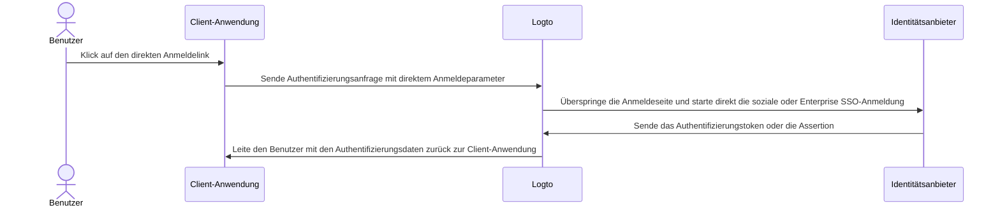

import directSignInEnterpriseSsoImage from '@site/docs/end-user-flows/authentication-parameters/assets/direct-sign-in-enterprise-sso.png';
import directSignInSocialNameImage from '@site/docs/end-user-flows/authentication-parameters/assets/direct-sign-in-social-name.png';

# Direkte Anmeldung

Die direkte Anmeldung ist ein Logto-spezifischer [Authentifizierungsparameter](/end-user-flows/authentication-parameters), der es ermöglicht, die soziale Anmeldung oder Enterprise SSO direkt zu starten und die standardmäßige universelle Logto-Anmeldeseite zu umgehen.

Diese Funktion ist besonders nützlich, wenn du eine benutzerdefinierte Anmeldeseite oder einen IdP-Anmeldeeintragspunkt auf deiner Website eingebettet hast (Anwendungsfälle anzeigen). Durch die Verwendung der direkten Anmeldung kannst du Benutzer direkt zur Anmeldeseite des IdP weiterleiten.



## Soziale Anmeldung \{#social-sign-in}

Übergebe den `direct_sign_in` Parameter mit dem Wert `social:<idp-name>`, um den sozialen Anmeldeprozess direkt zu starten.

### Wo finde ich den Connector IdP-Namen \{#where-to-find-the-connector-idp-name}

1. Navigiere zu <CloudLink to="/connectors/social">Konsole > Connectors > Soziale Connectors</CloudLink>
2. Klicke auf den [sozialen Connector](/connectors/social-connectors), den du verwenden möchtest.
3. Finde den Namen des Identitätsanbieters oben auf der Connector-Einstellungsseite.


### Beispiel \{#example}

Erstelle deine eigene Authentifizierungsanfrage-URL mit dem `direct_sign_in` Parameter:

```sh
curl --location \
  --request GET 'https://[tenant-id].logto.app/oidc/auth?client_id=1234567890&...&direct_sign_in=social:google'
```

In unterstützten Logto SDKs kannst du den `directSignIn` Parameter beim Aufruf der `signIn` Methode festlegen:

```javascript
const authResult = await logto.signIn({
  redirectUri: 'https://your-app.com/callback',
  directSignIn: 'social:google',
});
```

## Enterprise SSO \{#enterprise-sso}

Übergebe den `direct_sign_in` Parameter mit dem Wert `sso:<connector-id>`, um den Enterprise SSO-Anmeldeprozess direkt zu starten.

### Wo finde ich die Enterprise SSO Connector-ID \{#where-to-find-the-enterprise-sso-connector-id}

1. Navigiere zu <CloudLink to="/enterprise-sso">Konsole > Enterprise SSO</CloudLink>
2. Klicke auf den [Enterprise Connector](/connectors/enterprise-connectors), den du verwenden möchtest.
3. Finde die Connector-ID oben auf der Connector-Einstellungsseite.


### Beispiel \{#example-1}

Erstelle deine eigene Authentifizierungsanfrage-URL mit dem `direct_sign_in` Parameter:

```sh
curl --location \
  --request GET 'https://[tenant-id].logto.app/oidc/auth?client_id=1234567890&...&direct_sign_in=sso:1234567890'
```

In unterstützten Logto SDKs kannst du den `directSignIn` Parameter beim Aufruf der `signIn` Methode festlegen:

```javascript
logtoClient.signIn({
  redirectUri: 'https://your-app.com/callback',
  directSignIn: 'sso:1234567890',
});
```

## Rückfall auf die Anmeldeseite \{#fallback-to-the-sign-in-page}

Wenn der direkte Anmeldeprozess fehlschlägt, z. B. der Connector nicht gefunden oder aktiviert wird, wird der Benutzer zur Standard-Anmeldeseite weitergeleitet.

:::note
Wir fügen nach und nach Unterstützung für den `direct_sign_in` Parameter in allen Logto SDKs hinzu. Wenn du ihn in deinem SDK nicht siehst, öffne bitte ein Issue oder kontaktiere uns.
:::

## FAQs \{#faqs}

<details>
  <summary>

### Ist die direkte Anmeldung dasselbe wie API-Authentifizierung? \{#is-direct-sign-in-the-same-as-api-authentication}

</summary>

Nein, die direkte Anmeldung ist ein Benutzerflussparameter, der es ermöglicht, die standardmäßige Logto-Anmeldeseite zu überspringen und Benutzer direkt zur Anmeldeseite des sozialen oder Enterprise SSO-Anbieters weiterzuleiten. Im Gegensatz zur API-basierten Authentifizierung muss der Benutzer jedoch zuerst zum Logto-Authentifizierungsendpunkt weitergeleitet werden, um den Anmeldeprozess zu starten.

</details>
