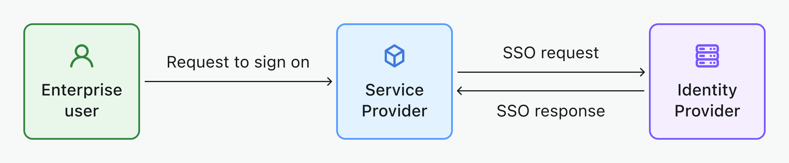

# Enterprise SSO

[Single Sign-On (SSO)](https://auth.wiki/single-sign-on) ermöglicht es Benutzern, sich mit einem einzigen Satz von Anmeldedaten bei mehreren Anwendungen anzumelden. Es vereinfacht den Authentifizierungsprozess für Unternehmensbenutzer, insbesondere für die heutigen SaaS-Plattformen für die Arbeitswelt.

Logto verbessert das SSO-Erlebnis, indem es eine breite Palette von Enterprise SSO-Connectors bietet, die du einfach einrichten und in deine Anwendungen integrieren kannst, zum Beispiel [Google Workspace](/integrations/google-workspace), [Microsoft Azure AD](/integrations/entra-id-saml), [Okta](/integrations/okta) und mehr.

## Wichtige Komponenten von Enterprise SSO

- **Identitätsanbieter (IdP)**: Ein Dienst, der Benutzeridentitäten überprüft und ihre Anmeldedaten verwaltet. Nach der Bestätigung der Identität eines Benutzers generiert der IdP Authentifizierungstokens oder -aussagen und ermöglicht dem Benutzer den Zugriff auf verschiedene Anwendungen oder Dienste, ohne sich erneut anmelden zu müssen. Im Wesentlichen ist es das zentrale System zur Verwaltung von Mitarbeiteridentitäten und Berechtigungen in deinem Unternehmen. Beispiele: Okta, Azure AD, Google Workspace, LastPass, OneLogin, Ping Identity, Cyberark, etc. [Erfahre mehr über IdP](https://auth.wiki/identity-provider).
- **Dienstanbieter (SP)**: Ein System oder eine Anwendung, die eine Benutzerauthentifizierung erfordert und sich auf den Identitätsanbieter (IdP) für die Authentifizierung verlässt. Der SP erhält Authentifizierungstokens oder -aussagen vom IdP und gewährt den Zugriff auf seine Ressourcen, ohne separate Anmeldedaten zu benötigen. Beispiele: Slack, Shopify, Dropbox, Figma, Notion, etc. ... und dein Dienst. [Erfahre mehr über SP](https://auth.wiki/service-provider).
- **Unternehmensidentität**: Typischerweise identifiziert durch die Verwendung einer Unternehmens-E-Mail-Domain für die Anmeldung. Dieses Unternehmens-E-Mail-Konto gehört letztendlich dem Unternehmen.

## Unterstützter SSO-Workflow

- [**IdP-initiiertes SSO**](/end-user-flows/enterprise-sso/idp-initiated-sso): Beim IdP-initiierten SSO kontrolliert der Identitätsanbieter (IdP) hauptsächlich den Single Sign-On-Prozess. Dieser Prozess beginnt, wenn sich ein Benutzer auf der Plattform des IdP anmeldet, wie z. B. einem Unternehmensportal oder einem zentralen Identitäts-Dashboard. Nach der Authentifizierung generiert der IdP ein Authentifizierungstoken oder eine Aussage, die dann verwendet wird, um dem Benutzer nahtlos Zugriff auf mehrere verbundene Dienste oder Anwendungen (SPs) zu gewähren, ohne zusätzliche Anmeldungen zu erfordern.
  
- [**SP-initiiertes SSO**](/end-user-flows/enterprise-sso/sp-initiated-sso): Beim SP-initiierten SSO übernimmt der Dienstanbieter (SP) die Führung bei der Initiierung und Verwaltung des Single Sign-On-Prozesses, was oft in B2B-Szenarien bevorzugt wird. Dieses Szenario tritt auf, wenn ein Benutzer versucht, auf einen bestimmten Dienst oder eine Anwendung (den SP) zuzugreifen und zur Authentifizierung an seinen IdP weitergeleitet wird. Nach erfolgreicher Anmeldung beim IdP wird ein Authentifizierungstoken an den SP zurückgesendet, das dem Benutzer den Zugriff gewährt. Logto unterstützt SP-initiiertes SSO für deine B2B-Dienste.
  

## Unterstützte SSO-Protokolle

- [**SAML**](/integrations/saml-sso): [Security Assertion Markup Language (SAML)](https://auth.wiki/saml) ist ein XML-basiertes offenes Standardprotokoll für den Austausch von Authentifizierungs- und Autorisierungsdaten zwischen einem IdP und SP. Dieses Protokoll ist besonders geeignet für die Bewältigung komplexer Sicherheitsanforderungen auf Unternehmensebene.
- [**OIDC**](/integrations/oidc-sso): [OpenID Connect (OIDC)](https://auth.wiki/openid-connect) ist eine einfache Identitätsschicht, die auf dem OAuth 2.0-Protokoll aufbaut. Es verwendet JSON/REST für die Kommunikation, was es leichter und besser geeignet für moderne Anwendungsarchitekturen macht, einschließlich mobiler und Single-Page-Anwendungen (SPAs).

## FAQs

  
Wie füge ich SSO-Connector-Buttons hinzu und melde mich direkt mit dem SSO-Anbieter auf meiner Website an?

Logto ermöglicht es dir, soziale Anmeldebuttons zu deiner Website hinzuzufügen und den SSO-Anmeldeprozess direkt zu starten, ohne das Standard-Anmeldeformular anzuzeigen. Sieh dir unseren [Direkte Anmeldung](/end-user-flows/authentication-parameters/direct-sign-in/) Leitfaden für detaillierte Anweisungen an.

## Verwandte Ressourcen

<Url href="https://www.youtube.com/watch?v=-mD8Sfab7sI&t=12s"> Enterprise SSO-Erfahrung</Url>

<Url href="https://blog.logto.io/idp-vs-sp-initiated-sso">
  IdP-initiiertes SSO vs SP-initiiertes SSO
</Url>

<Url href="https://blog.logto.io/enterprise-sso">
  Enterprise SSO: Was es ist, wie es funktioniert und warum es wichtig ist
</Url>

<Url href="https://blog.logto.io/single-sign-on">Die Kunst des Single Sign-On</Url>
