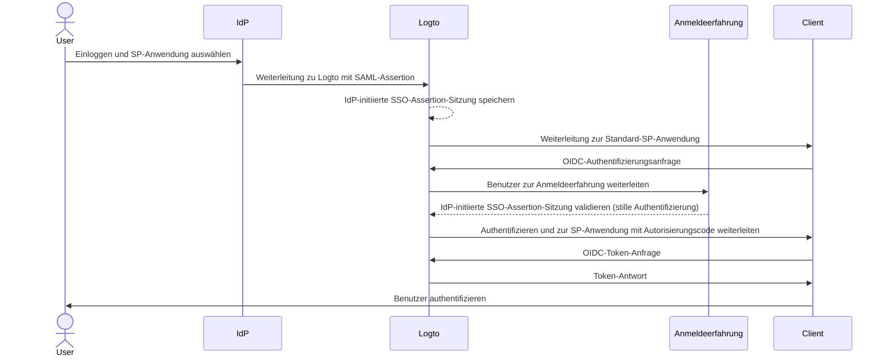
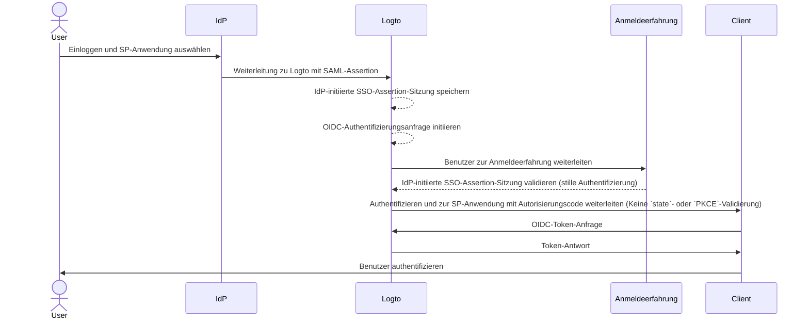

import Availability from '@components/Availability';
import idpInitiatedSsoPortalImage from '@site/docs/end-user-flows/enterprise-sso/assets/idp-initiated-sso-portal.png';
import idpInitiatedSsoRedirectImage from '@site/docs/end-user-flows/enterprise-sso/assets/idp-initiated-sso-redirect.png';
import idpInitiatedSsoSignInImage from '@site/docs/end-user-flows/enterprise-sso/assets/idp-initiated-sso-sign-in.png';

<Availability cloud="comingSoon" oss={false} />

# IdP-initiiertes SSO (nur SAML)

IdP-initiiertes SSO ist ein Single Sign-On-Prozess, bei dem der Identitätsanbieter (IdP) hauptsächlich den Authentifizierungsablauf steuert. Dieser Prozess beginnt, wenn sich ein Benutzer in die Plattform des IdP einloggt, wie z. B. ein Unternehmensportal oder ein zentrales Identitäts-Dashboard. Nach der Authentifizierung generiert der IdP eine SAML-Assertion und leitet den Benutzer zum Dienstanbieter (SP) weiter, um auf die Anwendung oder den Dienst zuzugreifen.


## Risiken und Überlegungen \{#risks-and-considerations}

IdP-initiiertes SSO kann mehrere Sicherheitslücken einführen, derer sich Organisationen bewusst sein sollten. Da der Authentifizierungsprozess vom IdP ohne direkte Anfrage des Benutzers initiiert wird, kann er anfällig für verschiedene Angriffe sein, einschließlich [Cross-Site Request Forgery](https://blog.logto.io/csrf) (CSRF).

Dieses Fehlen einer benutzerinitiierten Authentifizierung kann zu unbefugtem Zugriff führen, wenn keine geeigneten Schutzmaßnahmen vorhanden sind. Darüber hinaus erhöht die Abhängigkeit von einem einzigen Authentifizierungspunkt das Risiko eines Sicherheitsvorfalls, da das Kompromittieren des IdP alle verbundenen Anwendungen gefährden könnte.

Daher wird dringend empfohlen, SP-initiiertes SSO zu verwenden, das einen sichereren und kontrollierteren Authentifizierungsablauf bietet und sicherstellt, dass Benutzer explizit Zugriff auf Dienste anfordern.

## IdP-initiiertes SSO mit Logto OIDC-Anwendungen verbinden \{#connect-idp-initiated-sso-with-logto-oidc-applications}

Logto als OpenID Connect (OIDC) Anbieter unterstützt kein IdP-initiiertes SSO. Du kannst jedoch Logto als SP konfigurieren, um IdP-initiiertes SSO mit deinem Unternehmens-IdP unter Verwendung von SAML zu unterstützen. Diese Konfiguration ermöglicht es dir, die Authentifizierungsfähigkeiten von Logto zu nutzen, während der IdP die Kontrolle über den Authentifizierungsablauf behält.

:::note
Standardmäßig ist diese Funktion in Logto nicht aktiviert. Wenn du IdP-initiiertes SSO für deinen Mandanten aktiviert haben möchtest, kontaktiere bitte unser [Support-Team](https://logto.io/contact?src=docs.sso).
:::

### Voraussetzungen \{#prerequisites}

Bevor du IdP-initiiertes SSO konfigurierst, musst du zuerst einen SAML-Connector erstellen. Navigiere zur <CloudLink to="/enterprise-sso">Konsole > Enterprise SSO</CloudLink> und folge der Schritt-für-Schritt-Anleitung, um einen [SAML](/integrations/saml-sso/) Connector mit deinem IdP einzurichten.

Sobald der SAML-Connector eingerichtet ist, kannst du die SSO-Anmeldemethode im Abschnitt <CloudLink to="/sign-in-experience">Anmeldeerfahrung</CloudLink> aktivieren und den SP-initiierten SSO-Ablauf testen, um sicherzustellen, dass die Konfiguration korrekt ist. Stelle sicher, dass das SP-initiierte SSO wie erwartet funktioniert, bevor du mit dem IdP-initiierten SSO fortfährst.

### IdP-initiiertes SSO aktivieren \{#enable-idp-initiated-sso}

Sobald die IdP-initiiertes SSO-Funktion für deinen Mandanten aktiviert ist, solltest du einen zusätzlichen Tab auf der Einstellungsseite deines SAML-Connectors sehen, der **IdP-initiiertes SSO** genannt wird. Aktiviere den **IdP-initiiertes SSO**-Schalter, um die Funktion für den Connector zu aktivieren.

### Wähle die SP-Anwendung \{#select-the-sp-application}

Im Gegensatz zu SP-initiiertem SSO, bei dem der Authentifizierungsablauf vom SP ausgeht, erfordert IdP-initiiertes SSO eine clientseitige SP-Anwendung, um Benutzer nach dem Authentifizierungsprozess weiterzuleiten. Du kannst die SP-Anwendung aus der Liste der registrierten Anwendungen im Dropdown-Menü **Standardanwendung** auswählen.

Nur **Traditionelle Web-App** und **Single Page App** Anwendungen werden für IdP-initiiertes SSO unterstützt. Stelle sicher, dass du den geeigneten Anwendungstyp basierend auf deinem Anwendungsfall auswählst.

:::note
Auf der Seite deines IdP lasse den `RelayState`-Parameter für den IdP-initiierten SSO-Ablauf **LEER**, damit er korrekt funktioniert. Logto wird die Weiterleitung basierend auf der ausgewählten Standard-SP-Anwendung handhaben.
:::

## IdP-initiierten Authentifizierungsablauf konfigurieren \{#configure-idp-initiated-authentication-flow}

Um IdP-initiiertes SAML SSO mit OIDC zu verbinden, bietet Logto zwei Konfigurationsoptionen, um die Authentifizierungsanfrage zu bearbeiten.

### Option A: Weiterleitung zur Standard-SP-Anwendung (Empfohlen) \{#option-a-redirect-to-the-default-sp-application-recommended}

Wenn der IdP den SSO-Ablauf initiiert und die SAML-Assertion an Logto sendet, wird eine IdP-initiierte SSO-Assertion-Sitzung erstellt. Logto leitet den Benutzer zur Standard-SP-Anwendung weiter, um eine standardmäßige OIDC-Authentifizierungsanfrage auf der Clientseite zu initiieren.



Um diese Option einzurichten, wähle die **Weiterleitung zum Client für SP-initiierte Authentifizierung**-Karte im **IdP-initiiertes SSO**-Tab der SAML-Connector-Einstellungen.


1. Gib eine **Client-Weiterleitungs-URL** an, um den Benutzer nach dem IdP-initiierten SSO-Ablauf zur Standard-SP-Anwendung weiterzuleiten. Logto wird den Benutzer zu dieser URL mit dem `?ssoConnectorId={connectorId}`-Abfrageparameter weiterleiten. Die Client-Anwendung sollte die Weiterleitung handhaben und die OIDC-Authentifizierungsanfrage initiieren. (Wir empfehlen, eine dedizierte Route oder Seite in deiner Client-Anwendung zu verwenden, um die IdP-initiierte SSO-Authentifizierungsanfrage zu bearbeiten.)

2. Bearbeite die OIDC-Authentifizierungsanfrage auf der Clientseite unter Verwendung des `ssoConnectorId`-Abfrageparameters, um den SAML-Connector zu identifizieren, der den IdP-initiierten SSO-Authentifizierungsablauf initiiert hat.

3. Übermittle den [direkten Anmelde](/end-user-flows/authentication-parameters/direct-sign-in/)-Authentifizierungsparameter in der Anmeldeanfrage an Logto, um den SSO-Authentifizierungsablauf abzuschließen.

```typescript
// React-Beispiel
import { Prompt, useLogto } from '@logto/react';
import { useEffect } from 'react';
import { useNavigate, useSearchParams } from 'react-router-dom';

const SsoDirectSignIn = () => {
  const { signIn } = useLogto();
  const [searchParams] = useSearchParams();

  useEffect(() => {
    const ssoConnectorId = searchParams.get('ssoConnectorId');
    if (ssoConnectorId) {
      void signIn({
        redirectUri,
        prompt: Prompt.Login,
        directSignIn: {
          method: 'sso',
          target: ssoConnectorId,
        },
      });
    }
  }, [searchParams, signIn]);
};
```

- `redirectUri`: Die `redirect_uri`, um den Benutzer nach Abschluss des OIDC-Authentifizierungsablaufs weiterzuleiten.
- `prompt=login`: Erzwingt, dass der Benutzer sich mit der IdP-initiierten SSO-Identität anmeldet.
- `directSignIn=sso:{connectorId}`: Gibt die direkte Anmeldemethode als `sso` und die Ziel-SAML-Connector-ID an. Dieser Parameter wird den SSO-Authentifizierungsablauf direkt auslösen, ohne die Anmeldeseite anzuzeigen. Der Benutzer wird automatisch authentifiziert, indem die gespeicherte IdP-initiierte SSO-Assertion-Sitzung verwendet wird, wenn die Connector-ID übereinstimmt und die Sitzung gültig ist.

Diese Methode stellt sicher, dass der Authentifizierungsablauf sicher ist und dem Standard-OIDC-Protokoll folgt, während die Kontrolle des IdP über den Authentifizierungsprozess beibehalten wird. Die Client-App kann die IdP-initiierte SSO-Assertion-Sitzung nutzen, um den Benutzer ohne zusätzliche Anmeldeschritte zu authentifizieren, während der Authentifizierungsablauf sicher und kontrolliert bleibt. Die Client-App kann weiterhin die `state`- und `PKCE`-Parameter validieren, um sicherzustellen, dass die Authentifizierungsanfrage sicher ist.

:::note
Diese Methode ist sowohl für **Traditionelle Web-App** als auch für **Single Page App** Anwendungen verfügbar. Und sie wird für alle Anwendungsfälle empfohlen.
:::

### Option B: Benutzer direkt mit IdP-initiiertem SSO authentifizieren \{#option-b-directly-authenticate-the-user-with-idp-initiated-sso}

In bestimmten Fällen kann der SP möglicherweise den IdP-initiierten SSO-Callback nicht bearbeiten und die OIDC-Authentifizierungsanfrage initiieren. In diesem Fall bietet Logto eine alternative Option, um den Benutzer direkt mit der IdP-initiierten SSO-Assertion-Sitzung zu authentifizieren.

Diese Option wird als weniger sicher angesehen und nicht empfohlen. Der Authentifizierungsablauf umgeht das Standard-OIDC-Protokoll. Da die Authentifizierungsanfrage vom IdP initiiert wird, kann die Client-App möglicherweise die Authentifizierungsanfrage nicht sicher validieren. Zum Beispiel kann die Client-App die `state`- und `PKCE`-Parameter nicht validieren, um sicherzustellen, dass die Authentifizierungsanfrage sicher ist.

:::warning
Diese Methode ist nicht für **Single Page App** Anwendungen verfügbar, da sie erfordert, dass die Client-App die Authentifizierungsanfrage sicher mit dem `PKCE`-Parameter bearbeitet. Wenn du IdP-initiiertes SSO für eine SPA-Anwendung implementieren musst, verwende bitte die obige Option.
:::



Um diese Option zu konfigurieren, wähle die **Direkt anmelden mit IdP-initiiertem SSO**-Option im **IdP-initiiertes SSO**-Tab der SAML-Connector-Einstellungen.


1. Wähle die **Post-Anmelde-Weiterleitungs-URI**, um den Benutzer nach erfolgreicher Authentifizierung zurück zur Client-Anwendung weiterzuleiten. Diese URL wird als `redirect_uri` in der OIDC-Authentifizierungsanfrage verwendet. Die URI muss eine der erlaubten Weiterleitungs-URIs sein, die in der Client-Anwendung registriert sind.

   :::note
   Es wird dringend empfohlen, eine dedizierte **Weiterleitungs-URI** für IdP-initiiertes SSO zu verwenden. Da die Authentifizierungsanfrage unaufgefordert ist, sollte die Client-Anwendung die Antwort unabhängig verwalten, getrennt vom Standard-SP-initiierten Authentifizierungsablauf.
   :::

2. Passe die Autorisierungsanfrageparameter bei Bedarf mit dem **Zusätzliche Authentifizierungsparameter** JSON-Editor an (nach dem Typ `Map<string,string>`).

   Zum Beispiel fordert Logto standardmäßig nur die `openid`- und `profile`-Berechtigungen an. Du kannst zusätzliche Berechtigungen oder Parameter zur Authentifizierungsanfrage hinzufügen.

   ```json
   {
     "scope": "email offline_access"
   }
   ```

   - zusätzliche `email`-Berechtigung hinzufügen, um die E-Mail-Adresse des Benutzers anzufordern.
   - `offline_access`-Berechtigung hinzufügen, um das Auffrischungstoken anzufordern.

   Wir empfehlen dir auch, einen benutzerdefinierten `state`-Parameter bereitzustellen, um die Authentifizierungsantwort sicher zu validieren.

   ```json
   {
     "state": "custom-state-value"
   }
   ```

   Die Client-App sollte den `state`-Parameter in der Autorisierungscode-Antwort validieren, um sicherzustellen, dass die Authentifizierungsanfrage gültig ist.
