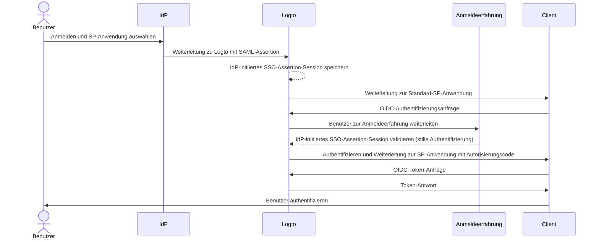
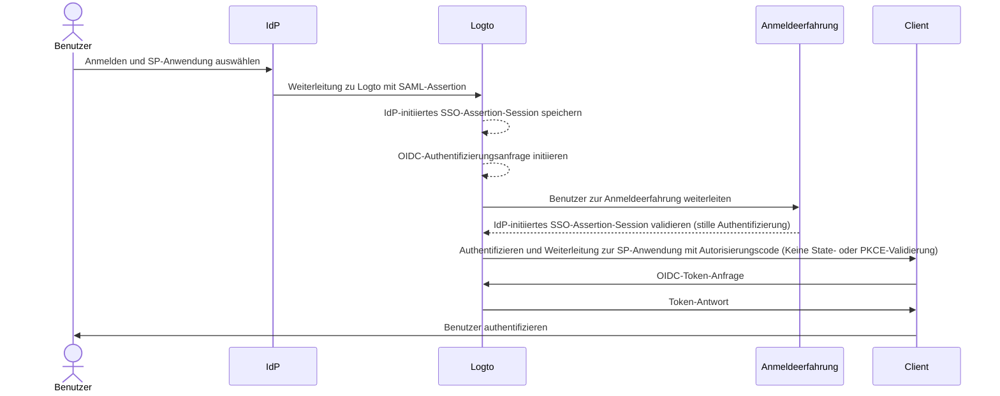

import Availability from '@components/Availability';

<Availability cloud="comingSoon" oss={false} />

# IdP-initiiertes SSO (nur SAML)

IdP-initiiertes SSO ist ein Single Sign-On-Prozess, bei dem der Identitätsanbieter (Identity Provider, IdP) hauptsächlich den Authentifizierungsablauf steuert. Dieser Prozess beginnt, wenn sich ein Benutzer auf der Plattform des IdP anmeldet, wie z. B. einem Unternehmensportal oder einem zentralen Identitäts-Dashboard. Nach erfolgreicher Authentifizierung generiert der IdP eine SAML-Assertion und leitet den Benutzer zum Dienstanbieter (Service Provider, SP) weiter, um auf die Anwendung oder den Dienst zuzugreifen.


## Risiken und Überlegungen \{#risks-and-considerations}

IdP-initiiertes SSO kann verschiedene Sicherheitslücken mit sich bringen, über die sich Organisationen im Klaren sein sollten. Da der Authentifizierungsprozess vom IdP ohne eine direkte Anfrage des Benutzers initiiert wird, kann er anfällig für verschiedene Angriffe sein, einschließlich [Cross-Site Request Forgery](https://blog.logto.io/csrf) (CSRF).

Das Fehlen einer benutzerinitiierten Authentifizierung kann zu unbefugtem Zugriff führen, wenn keine geeigneten Schutzmaßnahmen vorhanden sind. Darüber hinaus erhöht die Abhängigkeit von einem einzigen Authentifizierungspunkt das Risiko einer Sicherheitsverletzung, da bei einer Kompromittierung des IdP alle verbundenen Anwendungen gefährdet sind.

Daher wird dringend empfohlen, SP-initiiertes SSO zu verwenden, das einen sichereren und kontrollierteren Authentifizierungsablauf bietet und sicherstellt, dass Benutzer explizit Zugriff auf Dienste anfordern.

## IdP-initiiertes SSO mit Logto OIDC-Anwendungen verbinden \{#connect-idp-initiated-sso-with-logto-oidc-applications}

Logto als OpenID Connect (OIDC) Anbieter unterstützt kein IdP-initiiertes SSO. Du kannst jedoch Logto als SP konfigurieren, um IdP-initiiertes SSO mit deinem Unternehmens-IdP über SAML zu unterstützen. Mit dieser Einrichtung kannst du die Authentifizierungsfunktionen von Logto nutzen, während der IdP weiterhin die Kontrolle über den Authentifizierungsablauf behält.

:::note
Standardmäßig ist diese Funktion in Logto nicht aktiviert. Wenn du IdP-initiiertes SSO für deinen Mandanten aktivieren möchtest, kontaktiere bitte unser [Support-Team](https://logto.io/contact?src=docs.sso).
:::

### Voraussetzungen \{#prerequisites}

Bevor du IdP-initiiertes SSO konfigurierst, musst du zunächst einen SAML-Connector erstellen. Navigiere zu <CloudLink to="/enterprise-sso">Konsole > Enterprise SSO</CloudLink> und folge der Schritt-für-Schritt-Anleitung, um einen [SAML](/integrations/saml-sso/) Connector mit deinem IdP einzurichten.

Sobald der SAML-Connector eingerichtet ist, kannst du die SSO-Anmeldemethode im Bereich <CloudLink to="/sign-in-experience/sign-up-and-sign-in">Sign-in & account > Sign-up and sign-in</CloudLink> aktivieren und den SP-initiierten SSO-Ablauf testen, um sicherzustellen, dass die Konfiguration korrekt ist. Stelle sicher, dass das SP-initiiertes SSO wie erwartet funktioniert, bevor du mit IdP-initiiertem SSO fortfährst.

### IdP-initiiertes SSO aktivieren \{#enable-idp-initiated-sso}

Sobald die IdP-initiiertes SSO-Funktion für deinen Mandanten aktiviert ist, solltest du einen zusätzlichen Tab auf der Einstellungsseite deines SAML-Connectors sehen, der **IdP-initiiertes SSO** heißt. Aktiviere den **IdP-initiiertes SSO**-Schalter, um die Funktion für den Connector zu aktivieren.

### Die SP-Anwendung auswählen \{#select-the-sp-application}

Im Gegensatz zum SP-initiierten SSO, bei dem der Authentifizierungsablauf vom SP ausgeht, erfordert IdP-initiiertes SSO eine clientseitige SP-Anwendung, um Benutzer nach dem Authentifizierungsprozess weiterzuleiten. Du kannst die SP-Anwendung aus der Liste der registrierten Anwendungen im Dropdown-Menü **Standardanwendung** auswählen.

Nur **Traditionelle Web-App** und **Single Page App** Anwendungen werden für IdP-initiiertes SSO unterstützt. Stelle sicher, dass du den passenden Anwendungstyp entsprechend deinem Anwendungsfall auswählst.

:::note
Auf der IdP-Seite lasse den Parameter `RelayState` für den IdP-initiierten SSO-Ablauf **LEER**. Logto übernimmt die Weiterleitung basierend auf der ausgewählten Standard-SP-Anwendung.
:::

## IdP-initiierten Authentifizierungsablauf konfigurieren \{#configure-idp-initiated-authentication-flow}

Um IdP-initiiertes SAML SSO mit OIDC zu verbinden, bietet Logto zwei Konfigurationsoptionen zur Handhabung der Authentifizierungsanfrage.

### Option A: Weiterleitung zur Standard-SP-Anwendung (Empfohlen) \{#option-a-redirect-to-the-default-sp-application-recommended}

Wenn der IdP den SSO-Ablauf initiiert und die SAML-Assertion an Logto sendet, wird eine IdP-initiiertes SSO-Assertion-Session erstellt. Logto leitet den Benutzer zur Standard-SP-Anwendung weiter, um eine Standard-OIDC-Authentifizierungsanfrage clientseitig zu starten.


```mermaid
sequenceDiagram
    actor Benutzer
    participant IdP as IdP
    participant Logto as Logto
    participant Experience as Anmeldeerfahrung
    participant SP as Client

    Benutzer->>IdP: Anmelden und SP-Anwendung auswählen
    IdP->>Logto: Weiterleitung zu Logto mit SAML-Assertion
    Logto-->>Logto: IdP-initiiertes SSO-Assertion-Session speichern
    Logto->>SP: Weiterleitung zur Standard-SP-Anwendung
    SP->>Logto: OIDC-Authentifizierungsanfrage
    Logto->>Experience: Benutzer zur Anmeldeerfahrung weiterleiten
    Experience-->>Logto: IdP-initiiertes SSO-Assertion-Session validieren (stille Authentifizierung)
    Logto->>SP: Authentifizieren und Weiterleitung zur SP-Anwendung mit Autorisierungscode
    SP->>Logto: OIDC-Token-Anfrage
    Logto->>SP: Token-Antwort
    SP->>Benutzer: Benutzer authentifizieren
```

Um diese Option einzurichten, wähle die Karte **Weiterleitung zum Client für SP-initiierten Authentifizierungsablauf** im Tab **IdP-initiiertes SSO** der SAML-Connector-Einstellungen aus.


1. Gib eine **Client-Weiterleitungs-URL** an, um den Benutzer nach dem IdP-initiierten SSO-Ablauf zur Standard-SP-Anwendung weiterzuleiten. Logto leitet den Benutzer zu dieser URL weiter und hängt den Parameter `?ssoConnectorId={connectorId}` an die URL an. Die Client-Anwendung sollte die Weiterleitung verarbeiten und die OIDC-Authentifizierungsanfrage initiieren. (Wir empfehlen, eine dedizierte Route oder Seite in deiner Client-Anwendung zu verwenden, um die IdP-initiierten SSO-Authentifizierungsanfragen zu verarbeiten.)

2. Verarbeite die OIDC-Authentifizierungsanfrage clientseitig unter Verwendung des `ssoConnectorId`-Query-Parameters, um den SAML-Connector zu identifizieren, der den IdP-initiierten SSO-Authentifizierungsablauf gestartet hat.

3. Übergebe den [Direct Sign-in](/end-user-flows/authentication-parameters/direct-sign-in/) Authentifizierungsparameter in der Anmeldeanfrage an Logto, um den SSO-Authentifizierungsablauf abzuschließen.

```typescript
// React-Beispiel
import { Prompt, useLogto } from '@logto/react';
import { useEffect } from 'react';
import { useNavigate, useSearchParams } from 'react-router-dom';

const SsoDirectSignIn = () => {
  const { signIn } = useLogto();
  const [searchParams] = useSearchParams();

  useEffect(() => {
    const ssoConnectorId = searchParams.get('ssoConnectorId');
    if (ssoConnectorId) {
      void signIn({
        redirectUri,
        prompt: Prompt.Login,
        directSignIn: {
          method: 'sso',
          target: ssoConnectorId,
        },
      });
    }
  }, [searchParams, signIn]);
};
```

- `redirectUri`: Die `redirect_uri`, zu der der Benutzer nach Abschluss des OIDC-Authentifizierungsablaufs weitergeleitet wird.
- `prompt=login`: Erzwingt die Anmeldung des Benutzers mit der IdP-initiierten SSO-Identität.
- `directSignIn=sso:{connectorId}`: Gibt die Direct Sign-in-Methode als `sso` und die Ziel-SAML-Connector-ID an. Dieser Parameter löst den SSO-Authentifizierungsablauf direkt aus, ohne die Anmeldeseite anzuzeigen. Der Benutzer wird automatisch authentifiziert, wenn die Connector-ID übereinstimmt und die Session gültig ist.

Diese Methode stellt sicher, dass der Authentifizierungsablauf sicher ist und dem Standard-OIDC-Protokoll folgt, während die Kontrolle des IdP über den Authentifizierungsprozess erhalten bleibt. Die Client-App kann die IdP-initiiertes SSO-Assertion-Session nutzen, um den Benutzer ohne zusätzliche Anmeldeschritte zu authentifizieren, während der Authentifizierungsablauf sicher und kontrolliert bleibt. Die Client-App kann weiterhin die Parameter `state` und `PKCE` validieren, um die Sicherheit der Authentifizierungsanfrage zu gewährleisten.

:::note
Diese Methode ist sowohl für **Traditionelle Web-App** als auch für **Single Page App** Anwendungen verfügbar und wird für alle Anwendungsfälle empfohlen.
:::

### Option B: Benutzer direkt mit IdP-initiiertem SSO authentifizieren \{#option-b-directly-authenticate-the-user-with-idp-initiated-sso}

In bestimmten Fällen kann der SP die IdP-initiierten SSO-Callbacks nicht verarbeiten und keine OIDC-Authentifizierungsanfrage initiieren. In diesem Fall bietet Logto eine alternative Option, um den Benutzer direkt mit der IdP-initiiertes SSO-Assertion-Session zu authentifizieren.

Diese Option gilt als weniger sicher und wird nicht empfohlen. Der Authentifizierungsablauf umgeht das Standard-OIDC-Protokoll. Da die Authentifizierungsanfrage vom IdP initiiert wird, kann die Client-App die Authentifizierungsanfrage möglicherweise nicht sicher validieren. Zum Beispiel kann die Client-App die Parameter `state` und `PKCE` nicht validieren, um die Sicherheit der Authentifizierungsanfrage zu gewährleisten.

:::warning
Diese Methode ist nicht für **Single Page App** Anwendungen verfügbar, da die Client-App die Authentifizierungsanfrage sicher mit dem `PKCE`-Parameter verarbeiten muss. Wenn du IdP-initiiertes SSO für eine SPA-Anwendung implementieren möchtest, verwende bitte die oben genannte Option.
:::


```mermaid
  sequenceDiagram

  actor Benutzer
  participant IdP as IdP
  participant Logto as Logto
  participant Experience as Anmeldeerfahrung
  participant SP as Client

  Benutzer->>IdP: Anmelden und SP-Anwendung auswählen
  IdP->>Logto: Weiterleitung zu Logto mit SAML-Assertion
  Logto-->>Logto: IdP-initiiertes SSO-Assertion-Session speichern
  Logto-->>Logto: OIDC-Authentifizierungsanfrage initiieren
  Logto->>Experience: Benutzer zur Anmeldeerfahrung weiterleiten
  Experience-->>Logto: IdP-initiiertes SSO-Assertion-Session validieren (stille Authentifizierung)
  Logto->>SP: Authentifizieren und Weiterleitung zur SP-Anwendung mit Autorisierungscode (Keine State- oder PKCE-Validierung)
  SP->>Logto: OIDC-Token-Anfrage
  Logto->>SP: Token-Antwort
  SP->>Benutzer: Benutzer authentifizieren
```

Um diese Option zu konfigurieren, wähle die Option **Direkte Anmeldung mit IdP-initiiertem SSO** im Tab **IdP-initiiertes SSO** der SAML-Connector-Einstellungen aus.


1. Wähle die **Post-Sign-in-Redirect-URI** aus, um den Benutzer nach erfolgreicher Authentifizierung zurück zur Client-Anwendung weiterzuleiten. Diese URL wird als `redirect_uri` in der OIDC-Authentifizierungsanfrage verwendet. Die URI muss eine der erlaubten Redirect-URIs sein, die in der Client-Anwendung registriert sind.

   :::note
   Es wird dringend empfohlen, eine dedizierte **Redirect-URI** für IdP-initiiertes SSO zu verwenden. Da die Authentifizierungsanfrage unaufgefordert ist, sollte die Client-Anwendung die Antwort unabhängig vom Standard-SP-initiierten Authentifizierungsablauf verarbeiten.
   :::

2. Passe die Autorisierungsanfrage-Parameter bei Bedarf mit dem **Zusätzliche Authentifizierungsparameter** JSON-Editor an (Typ `Map<string,string>`).

   Zum Beispiel fordert Logto standardmäßig nur die `openid` und `profile` Berechtigungen an. Du kannst zusätzliche Berechtigungen oder Parameter zur Authentifizierungsanfrage hinzufügen.

   ```json
   {
     "scope": "email offline_access"
   }
   ```

   - zusätzliche `email` Berechtigung hinzufügen, um die E-Mail-Adresse des Benutzers anzufordern.
   - `offline_access` Berechtigung hinzufügen, um das Auffrischungstoken anzufordern.

   Wir empfehlen außerdem, einen eigenen `state` Parameter bereitzustellen, um die Authentifizierungsantwort sicher zu validieren.

   ```json
   {
     "state": "custom-state-value"
   }
   ```

   Die Client-App sollte den `state` Parameter in der Autorisierungscode-Antwort validieren, um sicherzustellen, dass die Authentifizierungsanfrage gültig ist.
