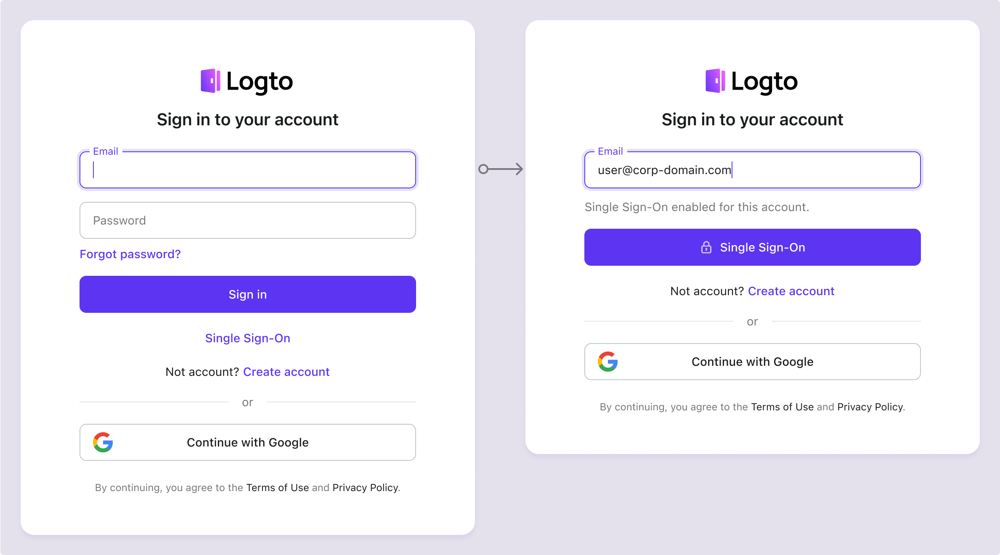

# SP-initiiertes SSO

SP-initiiertes SSO, die Standard- und sicherere Methode als [IdP-initiiertes SSO](/end-user-flows/enterprise-sso/idp-initiated-sso), ermöglicht es Unternehmensbenutzern, den SSO-Anmeldeprozess von der Logto-Anmeldeseite aus zu starten. Logto unterstützt sowohl [E-Mail-Domain-Prompt-SSO](#sp-initiated-sso-experience) als auch [direkten Anmeldeparameter für SSO](/end-user-flows/authentication-parameters/direct-sign-in#enterprise-sso).

## SP-initiiertes SSO einrichten \{#set-up-sp-initiated-sso}

1. **Enterprise SSO aktivieren** in deinem Identitätssystem

   Um Enterprise SSO zu aktivieren, navigiere zu <CloudLink to="/sign-in-experience/sign-up-and-sign-in">Konsole > Anmeldeerfahrung > Anmeldung und Registrierung</CloudLink> und aktiviere die Einstellung "Enterprise SSO aktivieren". Sobald aktiviert, erscheint ein "Single Sign-On"-Button auf deiner Anmeldeseite. Unternehmensbenutzer mit SSO-aktivierten E-Mail-Domains können über ihre Unternehmensidentitätsanbieter auf deine Dienste zugreifen.

2. **Enterprise-Connectors erstellen** für verschiedene Kunden

   Als Nächstes musst du jeden Unternehmensidentitätsanbieter für deine Kunden integrieren. Ähnlich wie bei der sozialen Anmeldung, erstelle einen neuen Enterprise-Connector in Logto und konfiguriere die erforderlichen Einstellungen. Navigiere zu <CloudLink to="/enterprise-sso">Konsole > Enterprise SSO</CloudLink>, klicke auf den Button "Enterprise-Connector hinzufügen" und folge den Anweisungen, um den Connector einzurichten. Siehe [Enterprise SSO Connector Einrichtung](/connectors/enterprise-connectors/).

3. **E-Mail-Domains einrichten** für den Enterprise-Connector

   Enterprise SSO-Identitäten werden typischerweise durch eine Unternehmens-E-Mail-Domain erkannt. Im SSO-Erfahrung-Tab der Detailseite jedes Enterprise-Connectors kannst du die zugehörigen E-Mail-Domains angeben.

   Benutzer mit den angegebenen E-Mail-Domains werden darauf beschränkt, sich ausschließlich über diesen Enterprise SSO-Connector anzumelden, während andere Anmeldemethoden – wie E-Mail-Verifizierungscodes, E-Mail-Passwort-Authentifizierung oder soziale Anmeldung – für diese Benutzer deaktiviert werden. Der SSO-Connector wird nur für Benutzer mit den angegebenen E-Mail-Domains sichtbar sein.

   :::note
   Öffentliche E-Mail-Domains (z. B. gmail.com, yahoo.com) können nicht mit einem Enterprise-Connector verknüpft werden.
   :::

## SP-initiiertes SSO-Erlebnis \{#sp-initiated-sso-experience}

SSO wird aktiviert, wenn Benutzer versuchen, sich mit einer für SSO konfigurierten Unternehmens-E-Mail-Domain anzumelden. Dieser Prozess umgeht Standard-Verifizierungsmethoden wie Passwörter.

1. **Single Sign-On Button**:

   Wenn die Enterprise SSO-Anmeldemethode aktiviert ist, erscheint ein "Single Sign-On"-Button als alternative Anmeldeoption auf der Anmeldeseite. Durch Klicken auf diesen Link werden Benutzer aufgefordert, ihre Unternehmens-E-Mail-Adresse einzugeben, um den SSO-Prozess zu starten.

   - Einzelner Connector: Wenn nur ein Enterprise SSO-Connector mit der E-Mail-Domain des Benutzers verknüpft ist, wird der Benutzer direkt zur IdP-Anmeldeseite weitergeleitet.
   - Mehrere Connectors: Wenn mehrere Enterprise SSO-Connectors mit der E-Mail-Domain des Benutzers verknüpft sind, wählt der Benutzer zunächst den gewünschten IdP aus einer Liste aus, bevor er zur IdP-Anmeldeseite weitergeleitet wird.

   

2. **Universelle E-Mail-Anmeldung**:

   Im universellen Identifikator-Anmeldeformular (mit aktivierter E-Mail-Anmeldemethode) ist die Erkennung von Enterprise SSO-E-Mail-Domains standardmäßig aktiviert. Wenn Benutzer ihre E-Mail-Adresse eingeben, erkennt Logto automatisch, ob ein Enterprise SSO-Connector mit dieser Domain verknüpft ist. Wenn eine Übereinstimmung gefunden wird, aktualisiert sich das Standard-Anmeldeformular: Der "Anmelden"-Button ändert sich in einen "Single Sign-On"-Button, der den Benutzer darauf beschränkt, sich mit dem/den Enterprise SSO-Connector(en) anzumelden.

   

## FAQs \{#faqs}

  

### Kann ich Organisationsname / Domain anstelle von E-Mail-Domain verwenden, um zum IdP weiterzuleiten? \{#can-i-use-organization-namedomain-instead-of-email-domain-to-redirect-to-the-idp}

Derzeit unterstützt die vorgefertigte Anmeldeerfahrung von Logto nur **E-Mail-Domain-Prompt-SSO**, nicht **Organisations-Domain-Prompt-SSO**.

Du kannst eine benutzerdefinierte Routing-Seite auf deiner Client-Seite erstellen, indem du die Authentifizierungsparameter mit `directSignIn:'sso:{connectorId}` verwendest. Diese Seite leitet große Unternehmenskunden basierend auf ihrer Organisationsdomain zum entsprechenden IdP weiter. Erfahre mehr über den [direkten Anmeldeparameter](/end-user-flows/authentication-parameters/direct-sign-in/).

  

### Kann ich einen bestimmten Enterprise-Connector-Button auf der Anmeldeseite anzeigen? \{#can-i-display-a-specific-enterprise-connector-button-on-the-sign-in-page}

Verschiedene Unternehmenskunden verwenden unterschiedliche Identitätsanbieter, um ihre Mitarbeiter zu verwalten, und fordern unterschiedliche Berechtigungen (OIDC) oder Attribute (SAML) an. Daher wird nicht empfohlen, einen Enterprise-Connector-Button, der für einen bestimmten Kunden bestimmt ist, auf einer generischen Anmeldeseite anzuzeigen.

Wenn du jedoch ein B2E-Produkt entwickelst und einen Button für einen bestimmten Unternehmenskunden anzeigen möchtest, kannst du eine benutzerdefinierte Anmeldeseite erstellen und `directSignIn:sso` verwenden, um den Button entsprechend zu leiten. Erfahre mehr über den [direkten Anmeldeparameter](/end-user-flows/authentication-parameters/direct-sign-in/).

### Wie aktiviere ich die ausschließliche SSO-Anmeldung und -Registrierung? \{#how-to-enable-sso-only-sign-in-and-registration}

Um die ausschließliche SSO-Anmeldung und -Registrierung zu aktivieren, folge diesen Schritten:

1. Konfiguriere in <CloudLink to="/sign-in-experience/sign-up-and-sign-in">Konsole > Anmeldeerfahrung > Anmeldung und Registrierung</CloudLink>
   - Registrierung: Nicht anwendbar
   - Anmeldung: Keine
   - Soziale Anmeldung: Keine
   - Enterprise SSO: Aktiviert
   - Benutzerregistrierung: Deaktiviert
2. Füge Benutzer manuell hinzu, indem du ihre Unternehmens-E-Mail-Adresse in <CloudLink to="/users">Konsole > Benutzerverwaltung</CloudLink> eingibst oder importiere sie über die [Management API](https://openapi.logto.io/operation/operation-createuser).
3. Wenn Benutzer sich zum ersten Mal über SSO anmelden, wird Logto ihre bestehende E-Mail-Adresse automatisch mit ihrem SSO-Konto [verknüpfen](/end-user-flows/enterprise-sso/enterprise-sso-identity#enterprise-sso-account-linking).

