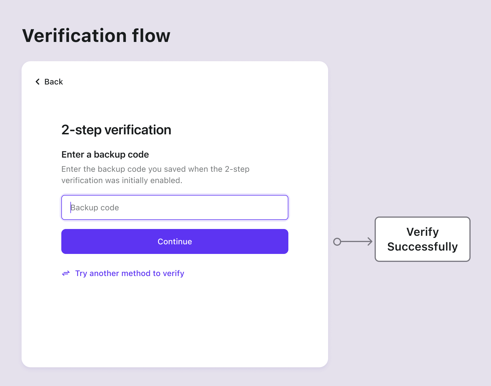

# Backup-Codes

## Konzepte

Backup-Codes, auch bekannt als Wiederherstellungscode, sind Einmalcodes für die Multi-Faktor-Authentifizierung (MFA), die als Backup dienen, falls die primären Authentifizierungsfaktoren des Benutzers (z. B. Authentifizierungs-App oder Hardware-Token) nicht verfügbar sind.

Der Verlust dieser Codes kann zu Herausforderungen bei der Kontowiederherstellung führen. Daher wird empfohlen, einen zusätzlichen primären Faktor einzurichten, bevor Backup-Codes aktiviert werden, und diesem Priorität zu geben.

Logto generiert automatisch 10 Backup-Codes für Benutzer, sobald sie einen zusätzlichen Faktor konfigurieren. Jeder Code ist nur einmal verwendbar. Benutzern wird geraten, in den Benutzereinstellungen (zugänglich über die [Management API](/integrate-logto/interact-with-management-api/)) ein neues Set von Codes zu regenerieren, bevor alle vorhandenen Codes aufgebraucht sind.

## Authentifizierungsabläufe

- **Backup-Codes Einrichtungsabläufe**

- **Backup-Codes Verifizierungsablauf**

