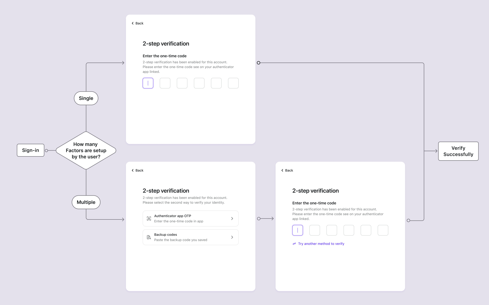

# MFA konfigurieren

## MFA-Einstellungen in Logto konfigurieren \{#configure-mfa-settings-in-logto}

Folge diesen Schritten, um MFAs im Anmeldefluss der Benutzer in Logto zu aktivieren:

1. Navigiere zu: <CloudLink to="/mfa">Konsole > Multi-Faktor-Authentifizierung</CloudLink>.
2. Aktiviere die unterstützten Verifizierungsfaktoren für deine Benutzer.
   1. Primäre Faktoren:
      - [Authenticator App OTP](/end-user-flows/mfa/authenticator-app-otp): Die gebräuchlichste und weit verbreitete Methode. Verwende ein zeitbasiertes Einmalpasswort (TOTP), das von einer Authenticator-App wie Google Authenticator oder Authy generiert wird.
      - [Passkeys (WebAuthn)](/end-user-flows/mfa/webauthn): Eine hochsichere Option, geeignet für Webprodukte, die Gerätebiometrie oder Sicherheitsschlüssel unterstützen und somit einen robusten Schutz gewährleisten.
   2. Backup-Faktoren:
      - [Backup-Codes](/end-user-flows/mfa/backup-codes): Dies dient als Backup-Option, wenn Benutzer keinen der oben genannten primären Faktoren verifizieren können. Die Aktivierung dieser Option reduziert die Reibung für den erfolgreichen Zugriff der Benutzer.
3. Wähle, ob du **MFA erforderlich** aktivieren möchtest:
   - **Aktivieren**: Benutzer werden aufgefordert, MFA während des Anmeldeprozesses einzurichten, was nicht übersprungen werden kann. Wenn der Benutzer es versäumt, MFA einzurichten oder seine MFA-Einstellungen löscht, wird er von seinem Konto ausgesperrt, bis er MFA erneut einrichtet.
   - **Deaktivieren**: Benutzer können den MFA-Einrichtungsprozess während des Anmeldeflusses überspringen. Sie können MFA später über deine Selbstbedienungs-Kontoeinstellungsseite einrichten. [Erfahre mehr](/end-user-flows/account-settings/) über die Implementierung einer Benutzerkontoeinstellungsseite. Und wähle weiterhin die Richtlinie für die MFA-Einrichtungsaufforderung:
     - **Benutzer nicht zur MFA-Einrichtung auffordern**: Benutzer werden nicht aufgefordert, MFA während der Anmeldung einzurichten.
     - **Benutzer zur MFA-Einrichtung während der Registrierung auffordern**: Neue Benutzer werden während der Registrierung zur MFA-Einrichtung aufgefordert, und bestehende Benutzer sehen die Aufforderung bei ihrer nächsten Anmeldung. Benutzer können diesen Schritt überspringen, und er wird nicht erneut angezeigt.
     - **Benutzer zur MFA-Einrichtung bei ihrer Anmeldung nach der Registrierung auffordern**: Neue Benutzer werden bei ihrer zweiten Anmeldung nach der Registrierung zur MFA-Einrichtung aufgefordert, und bestehende Benutzer sehen die Aufforderung bei ihrer nächsten Anmeldung. Benutzer können diesen Schritt überspringen, und er wird nicht erneut angezeigt.

## MFA-Benutzerfluss \{#mfa-user-flow}

### MFA-Einrichtungsfluss \{#mfa-set-up-flow}

Sobald MFA aktiviert ist, werden Benutzer während des Anmelde- und Registrierungsprozesses aufgefordert, MFA einzurichten. Benutzer können diesen Einrichtungsprozess nur dann überspringen, wenn die „Benutzerkontrollierte MFA“-Richtlinie aktiviert ist.

1. **Anmelde- oder Registrierungsseite besuchen**: Der Benutzer navigiert zur Anmelde- oder Registrierungsseite.
2. **Anmeldung oder Registrierung abschließen**: Der Benutzer schließt den Identitätsüberprüfungsprozess innerhalb des Anmelde- oder Registrierungsflusses ab.
3. **Primären MFA-Faktor einrichten**: Der Benutzer wird aufgefordert, seinen primären MFA-Faktor einzurichten (entweder Authenticator App OTP oder WebAuthn). Wenn mehrere primäre Faktoren aktiviert sind, können sie ihre bevorzugte Option wählen. Wenn die „Benutzerkontrollierte MFA“-Richtlinie aktiviert ist, können sie diesen Schritt auch überspringen, indem sie die Schaltfläche "Überspringen" auswählen.
4. **Backup-MFA-Faktor einrichten**: Wenn **Backup-Codes** aktiviert sind, wird der Benutzer aufgefordert, Backup-Codes einzurichten, nachdem er seinen primären Authentifizierungsfaktor erfolgreich konfiguriert hat. Automatisch generierte Backup-Codes werden dem Benutzer angezeigt, die er herunterladen und sicher speichern kann. Der Benutzer muss die Backup-Codes manuell bestätigen, um den MFA-Einrichtungsprozess abzuschließen.

### MFA-Verifizierungsfluss \{#mfa-verification-flow}

Benutzer, die MFA eingerichtet haben, werden während der Anmeldung aufgefordert, ihre Identität mit den konfigurierten MFA-Faktoren zu verifizieren. Der Verifizierungsfaktor hängt von der MFA-Konfiguration in Logto und den Benutzereinstellungen ab.

- Wenn ein Benutzer nur einen Faktor eingerichtet hat, wird er diesen direkt verifizieren.
- Wenn ein Benutzer mehrere Faktoren als 2FA eingerichtet hat, muss er einen zur Verifizierung auswählen.
- Wenn alle aktivierten primären Faktoren dem Benutzer nicht zur Verfügung stehen und Backup-Codes aktiviert sind, kann er den einmaligen Backup-Code verwenden, um seine Identität zu verifizieren.

