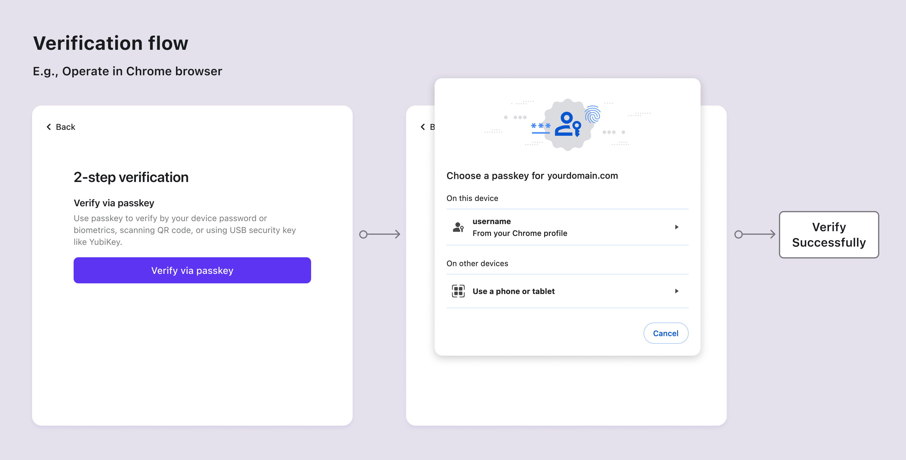

# Passkeys (WebAuthn)

[Passkey](https://auth.wiki/passkey) bietet eine sicherere und benutzerfreundlichere Alternative zu traditionellen Passwörtern. Durch die Verwendung von Public-Key-Kryptographie verbessert Passkey die Sicherheit, indem es das Gerät des Benutzers, die Dienstdomäne und die Benutzer-ID verknüpft und so Phishing- und Passwortangriffe effektiv abwehrt. Es ist mit verschiedenen Geräten oder Browsern kompatibel und ermöglicht es Benutzern, biometrische und hardwarebasierte Sicherheitsfunktionen für eine bequeme Authentifizierung zu nutzen. [WebAuthn](https://auth.wiki/webauthn) bietet die API, die es Websites ermöglicht, Passkeys zu implementieren.

Logto unterstützt jetzt Passkey (Webauthn) für Multi-Faktor-Authentifizierung (MFA). Die Passkey-Anmeldefunktion wird bald verfügbar sein. Bitte bleib für Updates dran.

## Konzepte

Kunden kennen immer Passkeys eher als WebAuthn, also was ist die Beziehung zwischen ihnen und wie verwendet man sie? Lass uns diese Konzepte erkunden:

- **Passkeys**: Ein Passkey ist ein FIDO-basiertes, phishing-resistentes Anmeldedaten, das Passwörter ersetzt. Es nutzt asymmetrische Public-Key-Kryptographie für erhöhte Sicherheit. Es kann Hardware-Token oder Sicherheitsschlüssel sein, wie USB- oder Bluetooth-Geräte. Da "Passkeys" die Authentifizierungsmethode ist, die den Benutzern angezeigt wird, sollte es innerhalb deines Produktclients verwendet werden.
- **WebAuthn**: Es ist eine JavaScript-API, die von der W3C und der FIDO-Allianz entwickelt wurde und Webanwendungen mit FIDO2-Standards zur Authentifizierung befähigt. Passkeys ist eine der Authentifizierungsmethoden, die WebAuthn unterstützt. In der Logto-Konsole bezeichnen wir diese Integration professionell als "WebAuthn".

WebAuthn bietet verschiedene Authentifikatoren, aus denen Benutzer wählen können, verfügbar in zwei Typen für lokale und Cloud-Nutzung:

- **Plattform-Authentifikator (Interner Authentifikator)**: Er ist an ein einzelnes und spezifisches Gerätebetriebssystem gebunden, wie einen Computer, Laptop, ein Telefon oder Tablet, mit dem sich der Benutzer anmeldet. Er funktioniert ausschließlich auf dem Gerät zur Autorisierung mit Methoden wie Biometrie oder einem Gerätepasscode, sodass es eine schnelle Möglichkeit zur Authentifizierung ist. Zum Beispiel iCloud-Schlüsselbund, verifiziert durch Touch ID, Face ID oder Gerätepasscode auf macOS oder iOS; Windows Hello, verifiziert durch Gesichtserkennung, Fingerabdruck oder freundliche PIN.
- **Roaming-Authentifikator (Externer Authentifikator, Plattformübergreifender Authentifikator)**: Es ist ein separates, tragbares Gerät oder eine Softwareanwendung, wie ein Hardware-Sicherheitsschlüssel oder ein Smartphone. Es sollte das Gerät über USB verbinden oder NFC oder Bluetooth eingeschaltet lassen. Der Roaming-Authentifikator ist nicht auf ein einzelnes Gerät oder einen Browser beschränkt und bietet größere Flexibilität.

Um tiefer in die Prinzipien und Prozesse von WebAuthn einzutauchen, kannst du auf unsere Blogbeiträge verweisen: [WebAuthn und Passkeys 101](https://blog.logto.io/web-authn-and-passkey-101/) und [Dinge, die du wissen solltest, bevor du WebAuthn integrierst](https://blog.logto.io/webauthn-base-knowledge/).

## Achte auf Einschränkungen

Es ist wichtig, sich einiger Einschränkungen bei der Implementierung von WebAuthn bewusst zu sein:

1. **Plattform- und Browser-Einschränkung**: Es ist wichtig zu beachten, dass Logto derzeit keine WebAuthn-Unterstützung für native Anwendungen bietet. Darüber hinaus hängt die Verfügbarkeit von WebAuthn-Authentifikatoren von den Fähigkeiten des Browsers und des Geräts ab ([Liste überprüfen](https://caniuse.com/?search=webauthn)). Daher ist WebAuthn nicht immer die einzige Option zur Implementierung von Multi-Faktor-Authentifizierung (MFA), andernfalls kannst du steuern, welche Browser und Geräte auf dein Produkt zugreifen können.
2. **Domänen-Einschränkung**: Das Ändern der Domäne kann die Benutzerverifizierung über ihre bestehenden WebAuthn-Konten behindern. Passkeys sind an die spezifische Domäne der aktuellen Webseite gebunden und können nicht über verschiedene Domänen hinweg verwendet werden.
3. **Geräte-Einschränkung**: Der Verlust des Geräts kann zu einem Verlust des Zugangs zu ihren Konten führen, insbesondere für diejenigen, die sich auf "Dieses Gerät" Plattform-Authentifikatoren verlassen. Um den Authentifizierungszugang zu verbessern, ist es ratsam, den Benutzern mehr als einen Authentifizierungsfaktor bereitzustellen.

## Authentifizierungsabläufe

Die Passkeys-Spezifikation erfordert, dass Benutzer aktiv auf die Schaltfläche auf der aktuellen Seite klicken, um die Authentifizierungskomponente zu starten. Das bedeutet, dass Benutzer sowohl im Einrichtungs- als auch im Verifizierungsablauf zur Landingpage weitergeleitet werden sollten, um WebAuthn zu starten.

- **Passkey-Einrichtungsabläufe**

- **Passkey-Verifizierungsabläufe**

