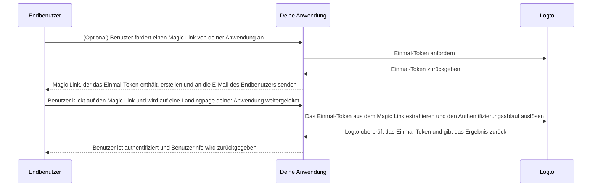

# Magic Link (Einmal-Token)

import Availability from '@components/Availability';

<Availability cloud oss={{ major: 1, minor: 27 }} />

Ähnlich wie das Einmalpasswort (OTP) ist ein Einmal-Token eine weitere passwortlose Authentifizierungsmethode, mit der die Identität eines Benutzers verifiziert werden kann.
Das Token ist für einen begrenzten Zeitraum gültig und mit einer E-Mail-Adresse des Endbenutzers verknüpft.

Manchmal möchtest du neue Benutzer zu deiner Anwendung / Organisation einladen, ohne dass sie zuerst ein Konto erstellen müssen.
Oder du hast dein Passwort vergessen und möchtest dich anmelden / dein Passwort zurücksetzen, indem du deine Identität schnell per E-Mail verifizierst.
In solchen Fällen kann die Anwendung einen "Magic Link" an deine E-Mail senden. Und du wirst sofort authentifiziert, wenn du auf den Link klickst.

Anwendungsentwickler können das Einmal-Token verwenden, um einen Magic Link zu erstellen und ihn an die E-Mail-Adresse des Endbenutzers zu senden.

## Einmal-Token-Ablauf \{#one-time-token-flow}

Hier ist das Sequenzdiagramm des Authentifizierungsablaufs mit Einmal-Token:



## Implementierungsanleitung \{#implementation-guide}

Logto bietet eine Reihe von Management APIs und Experience APIs, um die Implementierung deines Magic Links zu erleichtern.

Bevor du beginnst, stelle sicher, dass du eine Logto-Instanz bereit hast und die Maschine-zu-Maschine-Verbindung zwischen deinem Anwendungsserver
und dem Logto-Endpunkt hergestellt ist (erforderlich für die Management APIs). Erfahre mehr über [Logto Management API](/integrate-logto/interact-with-management-api).

### Schritt 1: Einmal-Token anfordern \{#step-1-request-one-time-token}

Verwende die Logto Management API, um ein Einmal-Token zu erstellen.

```bash
POST /api/one-time-tokens
```

Beispiel für den Anfrage-Body:

```json
{
  "email": "user@example.com",
  // Optional. Standardwert ist 600 (10 Minuten).
  "expiresIn": 3600,
  // Optional. Der Benutzer wird nach erfolgreicher Verifizierung den angegebenen Organisationen zugeordnet.
  "context": {
    "jitOrganizationIds": ["abcdefgh1234"]
  }
}
```

### Schritt 2: Magic Link erstellen \{#step-2-compose-your-magic-link}

Nachdem du das Einmal-Token erhalten hast, kannst du einen Magic Link erstellen und ihn an die E-Mail-Adresse des Endbenutzers senden.
Der Magic Link sollte mindestens das Token und die Benutzer-E-Mail als Parameter enthalten und auf eine Landingpage in deiner eigenen Anwendung führen.
Z. B. `https://yourapp.com/landing-page`.

Hier ist ein einfaches Beispiel, wie der Magic Link aussehen könnte:

```
https://yourapp.com/landing-page?token=YHwbXSXxQfL02IoxFqr1hGvkB13uTqcd&email=user@example.com
```

:::note

Die Parameternamen im Magic Link können vollständig angepasst werden.
Du kannst dem Magic Link zusätzliche Informationen hinzufügen, je nach den Anforderungen deiner Anwendung,
sowie alle URL-Parameter kodieren.

:::

### Schritt 3: Authentifizierungsablauf über Logto SDK auslösen \{#step-3-trigger-the-authentication-flow-via-logto-sdk}

Nachdem der Endbenutzer auf den Magic Link geklickt und deine Anwendung aufgerufen hat, kannst du die Parameter `token` und `email` aus der URL extrahieren und dann die Funktion `signIn()` aus dem Logto SDK aufrufen, um den Authentifizierungsablauf zu starten.

```typescript title="TokenLandingPage.tsx"
// React-Beispiel
import { useLogto } from '@logto/react';
import { useEffect } from 'react';
import { useSearchParams } from 'react-router-dom';

const TokenLandingPage = () => {
  const { signIn } = useLogto();
  const [searchParams] = useSearchParams();

  useEffect(() => {
    // Token und E-Mail aus dem Magic Link extrahieren
    const oneTimeToken = searchParams.get('token');
    const email = searchParams.get('email');

    // Dies ist deine sign-in redirect URI
    const redirectUri = 'https://yourapp.com/callback';

    if (oneTimeToken && email) {
      signIn({
        redirectUri,
        clearTokens: false, // Optional. Siehe Warnhinweis unten
        extraParams: {
          'one_time_token': oneTimeToken,
          'login_hint': email,
        },
      });
    }
  }, [searchParams, signIn]);

  return <>Bitte warten...</>;
};
```

:::warning

Wenn ein Benutzer bereits angemeldet ist, löscht der Aufruf der Funktion `signIn()` aus dem SDK automatisch alle zwischengespeicherten Tokens (ID-Token, Zugangstoken und Auffrischungstoken) aus dem Client-Speicher,
was dazu führt, dass der aktuelle Authentifizierungsstatus verloren geht.

Daher solltest du einen zusätzlichen sign-in Parameter `clearTokens: false` angeben, um das Löschen der bestehenden Tokens zu vermeiden.
Wenn dies angegeben ist, musst du die Tokens auf der sign-in Callback-Seite manuell löschen.

Ignoriere dies, wenn deine Magic Links nicht für authentifizierte Benutzer gedacht sind.

:::

### Schritt 4: (Optional) Zwischengespeicherte Tokens auf der sign-in Callback-Seite löschen \{#step-4-clear-cached-tokens-in-sign-in-callback-page}

Wenn du `clearTokens: false` in der sign-in Funktion angibst, musst du die Tokens auf der sign-in Callback-Seite manuell löschen.

```typescript title="Callback.tsx"
// React-Beispiel
import { useHandleSignInCallback, useLogto } from '@logto/react';
import { useEffect } from 'react';

const Callback = () => {
  const { clearAllTokens } = useLogto();

  useEffect(() => {
    void clearAllTokens();
  }, [clearAllTokens]);

  useHandleSignInCallback(() => {
    // Navigiere zu deiner Startseite
  });

  return <>Bitte warten...</>;
};
```

## FAQs \{#faqs}

<details>

<summary>

### Kann ich den Magic Link verwenden, um neue Benutzer zu meinen Organisationen einzuladen? \{#can-i-use-the-magic-link-to-invite-new-users-to-my-organizations}

</summary>

Ja, du kannst den Magic Link verwenden, um neue Benutzer zu deiner Anwendung sowie zu Organisationen einzuladen.
Wenn du neue Benutzer zu deiner Organisation einladen möchtest, gib einfach die `jitOrganizationIds` im Anfrage-Body an.

Der Benutzer tritt nach erfolgreicher Verifizierung automatisch den Organisationen bei, und Standardrollen werden zugewiesen.
Sieh dir den Abschnitt "Just-in-time-Bereitstellung" auf der Detailseite deiner Organisation an und konfiguriere die Standardrollen für deine Organisationen.

</details>

<details>

<summary>

### Läuft das Einmal-Token ab? \{#does-the-one-time-token-expire}

</summary>

Ja, das Einmal-Token läuft nach der angegebenen `expiresIn`-Zeit (in Sekunden) ab. Die Standardablaufzeit beträgt 10 Minuten.

</details>

<details>

<summary>

### Kann ich weiterhin Magic Links zum Einladen von Benutzern verwenden, wenn ich die Benutzerregistrierung in der "Anmeldeerfahrung" deaktiviere? \{#if-i-disable-user-registration-in-sign-in-experience-can-i-still-use-magic-link-to-invite-users}

</summary>

Ja, du kannst weiterhin Magic Links zum Einladen von Benutzern verwenden, auch wenn du die Benutzerregistrierung in der "Anmeldeerfahrung" deaktivierst.

</details>

<details>

<summary>

### Was passiert, wenn ein Benutzer bereits angemeldet ist und dann auf einen weiteren Magic Link klickt? \{#what-will-happen-if-a-user-already-signed-in-and-then-click-another-magic-link}

</summary>

Es gibt mehrere mögliche Szenarien:

1. Der Benutzer ist bereits angemeldet und klickt dann auf einen Magic Link, der mit dem aktuellen Benutzerkonto verknüpft ist. In diesem Fall überprüft Logto dennoch das Einmal-Token und weist den Benutzer ggf. den angegebenen Organisationen zu.
2. Der Benutzer ist bereits angemeldet und klickt dann auf einen Magic Link, der mit einem anderen Konto verknüpft ist. In diesem Fall fordert Logto den Benutzer auf, entweder als neues Konto fortzufahren oder mit dem aktuellen Konto zur Anwendung zurückzukehren.
   1. Wenn der Benutzer sich entscheidet, als neues Konto fortzufahren, wechselt Logto nach erfolgreicher Token-Verifizierung zum neuen Konto.
   2. Wenn der Benutzer beim aktuellen Konto bleiben möchte, wird das Token nicht überprüft und zur Anwendung mit dem aktuellen Konto zurückgekehrt.
3. Wenn deine sign-in Aufforderung auf "login" gesetzt ist oder "login" enthält, meldet Logto das mit dem Einmal-Token verknüpfte Konto automatisch an, ohne einen Wechsel abzufragen.

</details>
