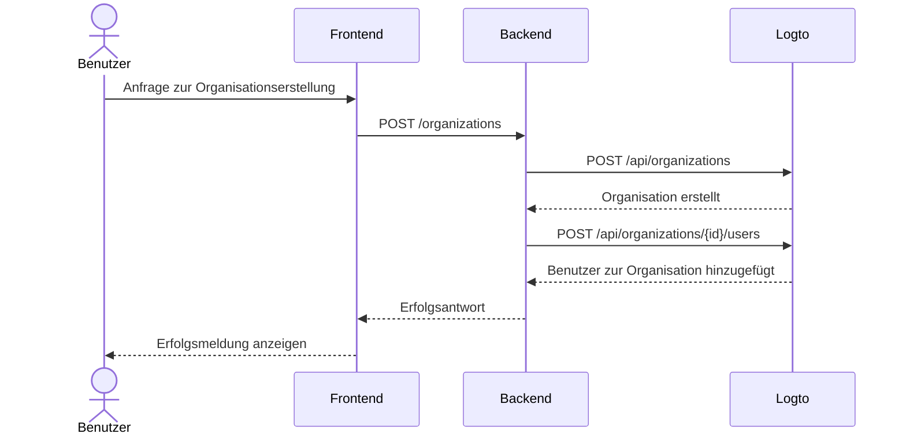

import GearIcon from '@site/src/assets/gear.svg';
import OrganizationIcon from '@site/src/assets/organization.svg';

# Organisationserfahrung

Die [Organisation](/organizations) Erfahrung ist die Gesamtheit der Benutzeroberflächen und Abläufe, die deine Geschäftskunden und deren Mitarbeitende nutzen – insbesondere in [Multi-Tenant-Anwendungen](https://auth.wiki/multi-tenancy). Dieser Leitfaden zeigt, wie du sie mit der Logto Management API in deine App integrierst.

Dieser Abschnitt hilft dir, die **Organisationserfahrung** für deine Endbenutzer zu gestalten – zum Beispiel:

1. Admins können eigene Organisationen erstellen.
2. Admins können Organisationsmitglieder verwalten.
3. Admins können Mitglieder einladen, ihren Organisationen beizutreten.
4. und mehr.

  

## Authentifizierungsablauf verstehen \{#understand-the-authentication-flow}

Um die Logto Management API zu integrieren, solltest du zunächst den grundlegenden Authentifizierungsablauf verstehen. Er hat zwei zentrale Anforderungen:

### Schütze deine Backend-API \{#protect-your-backend-api}

- Aufrufe vom Frontend an deine Backend-API erfordern Authentifizierung.
- Schütze API-Endpunkte, indem du das Logto Zugangstoken (Access token) des Benutzers validierst.
- Stelle sicher, dass nur authentifizierte Benutzer auf deine Dienste zugreifen können.

### Zugriff auf die Logto Management API \{#access-the-logto-management-api}

- Dein Backend-Service ruft die Logto Management API sicher auf.
- Folge dem Leitfaden [Mit der Management API interagieren](/integrate-logto/interact-with-management-api) für die Einrichtung.
- Verwende Maschine-zu-Maschine Authentifizierung, um Zugangsdaten zu erhalten.

Die nächsten Kapitel erklären, wie du die Logto Management API einrichtest und führen durch gängige Anwendungsfälle zum Aufbau deiner Organisationserfahrung.

## Funktionen für die Organisationserfahrung \{#features-for-organization-experience}

<DocCardList
  items={[
    {
      type: 'link',
      label: 'Organisation erstellen',
      href: '/end-user-flows/organization-experience/create-organization',
      description:
        'Nutze die Logto Management API, damit Endbenutzer selbst Organisationen im Produkt erstellen können.',
      customProps: {
        icon: <OrganizationIcon />,
      },
    },
    {
      type: 'link',
      label: 'Mitglieder zur Organisation einladen',
      href: '/end-user-flows/organization-experience/invite-organization-members',
      description:
        'Nutze die Logto Management API, damit Organisations-Admins Mitglieder zu ihren Organisationen einladen können.',
      customProps: {
        icon: <OrganizationIcon />,
      },
    },
    {
      type: 'link',
      label: 'Organisationsverwaltung',
      href: '/end-user-flows/organization-experience/organization-management',
      description:
        'Nutze die Logto Management API, damit Organisations-Admins ihre Mitglieder innerhalb der Organisation verwalten können.',
      customProps: {
        icon: <GearIcon />,
      },
    },
  ]}
/>

Für eine ausführliche Erklärung zu Organisationsdefinitionen, Mitgliederkonzepten und Organisationstemplates siehe [Verstehe, wie Organisationen funktionieren](/organizations/understand-how-organizations-work).

## Verwandte Ressourcen \{#related-resources}

<Url href="https://blog.logto.io/build-multi-tenant-saas-application">
  Baue eine Multi-Tenant-SaaS-Anwendung: Ein vollständiger Leitfaden von Design bis Implementierung
</Url>
