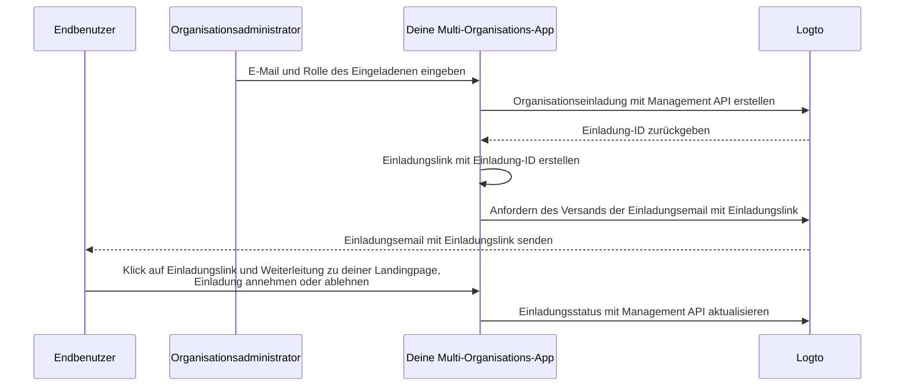

# Organisationsmitglieder einladen

In Multi-Tenancy-Anwendungen ist es eine häufige Anforderung, Mitglieder zu einer Organisation einzuladen. Diese Anleitung führt durch die Schritte und technischen Details zur Implementierung dieser Funktion.

## Ablaufübersicht \{#flow-overview}

Der gesamte Prozess wird im folgenden Diagramm veranschaulicht:



## Organisationsrollen erstellen \{#create-organization-roles}

Bevor Mitglieder eingeladen werden, erstelle Organisationsrollen. Siehe die [Organisationstemplate](/authorization/organization-template), um mehr über Rollen und Berechtigungen zu erfahren.

In dieser Anleitung erstellen wir zwei typische Organisationsrollen: `admin` und `member`.

Die `admin`-Rolle hat vollen Zugriff auf alle Ressourcen der Organisation, während die `member`-Rolle eingeschränkten Zugriff hat. Zum Beispiel:

- `admin`-Rolle:
  - `read:data` – Lesezugriff auf alle Organisationsdatenressourcen.
  - `write:data` – Schreibzugriff auf alle Organisationsdatenressourcen.
  - `delete:data` – Löschzugriff auf alle Organisationsdatenressourcen.
  - `invite:member` – Mitglieder zur Organisation einladen.
  - `manage:member` – Mitglieder in der Organisation verwalten.
  - `delete:member` – Mitglieder aus der Organisation entfernen.
- `member`-Rolle:
  - `read:data` – Lesezugriff auf alle Organisationsdatenressourcen.
  - `write:data` – Schreibzugriff auf alle Organisationsdatenressourcen.
  - `invite:member` – Mitglieder zur Organisation einladen.

Dies kann einfach in der [Logto Console](https://cloud.logto.io/) erledigt werden. Du kannst auch die [Logto Management API](https://openapi.logto.io/operation/operation-createorganizationrole) verwenden, um Organisationsrollen programmatisch zu erstellen.

## E-Mail-Connector konfigurieren \{#configure-your-email-connector}

Da Einladungen per E-Mail versendet werden, stelle sicher, dass dein [E-Mail-Connector](/connectors/email-connectors) korrekt konfiguriert ist. Um Einladungen zu versenden, konfiguriere eine [E-Mail-Vorlage](/connectors/email-connectors/email-templates#email-template-types) mit dem Verwendungstyp `OrganizationInvitation`. Du kannst Organisations- (z. B. Name, Logo) und Einladenden- (z. B. E-Mail, Name) [Variablen](/connectors/email-connectors/email-templates#email-template-variables) im Inhalt verwenden und [lokalisierte Vorlagen](/connectors/email-connectors/email-templates#email-template-localization) nach Bedarf anpassen.

Eine Beispiel-E-Mail-Vorlage für den Verwendungstyp `OrganizationInvitation` ist unten dargestellt:

```json
{
  "subject": "Willkommen in meiner Organisation",
  "content": "<p>Tritt {{organization.name}} über diesen <a href=\"{{link}}\" target=\"_blank\">Link</a> bei.</p>",
  "usageType": "OrganizationInvitation",
  "type": "text/html"
}
```

Der Platzhalter `{{link}}` im E-Mail-Inhalt wird beim Versand der E-Mail durch den tatsächlichen Einladungslink ersetzt.

:::note

Der integrierte „Logto-E-Mail-Service“ von Logto Cloud unterstützt derzeit nicht den Verwendungstyp `OrganizationInvitation`. Konfiguriere stattdessen deinen eigenen E-Mail-Connector (z. B. SendGrid) und richte die `OrganizationInvitation`-Vorlage ein.

:::

## Einladungen mit Logto Management API verwalten \{#handle-invitations-with-logto-management-api}

:::note

Falls du die Logto Management API noch nicht eingerichtet hast, siehe [Mit Management API interagieren](/integrate-logto/interact-with-management-api) für Details.

:::

### Organisationseinladung mit Logto Management API erstellen \{#create-an-organization-invitation-with-logto-management-api}

Im Organisations-Feature gibt es eine Reihe von einladungsbezogenen Management APIs. Mit diesen APIs kannst du:

- `POST /api/organization-invitations`: Eine Organisationseinladung mit zugewiesener Organisationsrolle erstellen.
- `POST /api/one-time-tokens`: Ein Einmal-Token für den Eingeladenen erstellen, um sich zu authentifizieren, wenn er die Einladung annimmt. [Mehr erfahren](/end-user-flows/one-time-token)
- `POST /api/organization-invitations/{id}/message`: Die Organisationseinladung per E-Mail an den Eingeladenen senden.

:::note

Das Payload unterstützt eine `link`-Eigenschaft, sodass du deinen eigenen Einladungslink basierend auf der Einladung-ID erstellen kannst. Zum Beispiel:

:::

```json
{
  "link": "https://your-app.com/invitation/join?id=your-invitation-id&token=your-one-time-token&email=invitee-email"
}
```
