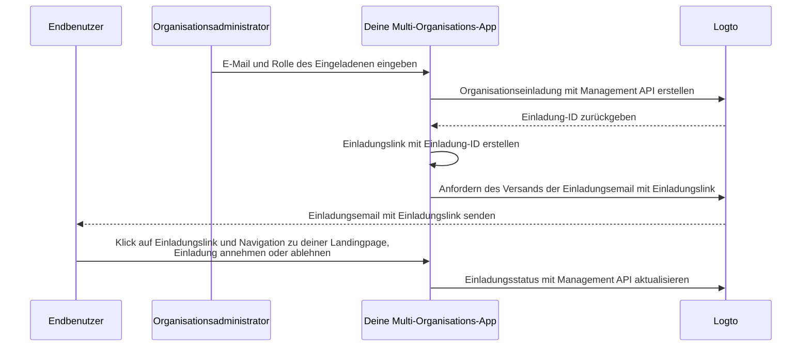

# Organisationsmitglieder einladen

Als Multi-Organisations-Anwendung ist es eine häufige Anforderung, Mitglieder zu deiner Organisation einzuladen. In dieser Anleitung führen wir dich durch die Schritte und technischen Details, um dieses Feature in deiner Anwendung zu implementieren.

## Ablaufübersicht \{#flow-overview}

Der gesamte Prozess wird im folgenden Diagramm dargestellt:



## Organisationsrollen erstellen \{#create-organization-roles}

Bevor du Mitglieder zu deiner Organisation einlädst, musst du Organisationsrollen erstellen. Sieh dir die [Organisationstemplate](/authorization/organization-template) an, um mehr über Organisationsrollen und Berechtigungen zu erfahren.

In dieser Anleitung erstellen wir zwei typische Organisationsrollen: `admin` und `member`.

Die `admin`-Rolle hat vollen Zugriff auf alle Ressourcen der Organisation, während die `member`-Rolle eingeschränkten Zugriff hat. Zum Beispiel kann jede Rolle einen Satz von Berechtigungen wie folgt haben:

- `admin`-Rolle:
  - `read:data` – Lesezugriff auf alle Organisationsdatenressourcen.
  - `write:data` – Schreibzugriff auf alle Organisationsdatenressourcen.
  - `delete:data` – Löschzugriff auf alle Organisationsdatenressourcen.
  - `invite:member` – Mitglieder zur Organisation einladen.
  - `manage:member` – Mitglieder in der Organisation verwalten.
  - `delete:member` – Mitglieder aus der Organisation entfernen.
- `member`-Rolle:
  - `read:data` – Lesezugriff auf alle Organisationsdatenressourcen.
  - `write:data` – Schreibzugriff auf alle Organisationsdatenressourcen.
  - `invite:member` – Mitglieder zur Organisation einladen.

Dies kann einfach in der [Logto Console](https://cloud.logto.io/) erledigt werden. Du kannst auch die [Logto Management API](https://openapi.logto.io/operation/operation-createorganizationrole) verwenden, um Organisationsrollen programmatisch zu erstellen.

## E-Mail-Connector konfigurieren \{#configure-your-email-connector}

Da Einladungen per E-Mail versendet werden, stelle sicher, dass dein [E-Mail-Connector](/connectors/email-connectors) korrekt konfiguriert ist. Um Einladungen zu versenden, musst du einen [E-Mail-Template](/connectors/email-connectors/email-templates#email-template-types) Nutzungstyp konfigurieren – `OrganizationInvitation`. Du kannst auch Organisations- (z. B. Organisationsname, Logo) und Einladenden- (z. B. E-Mail, Name des Einladenden) [Variablen](/connectors/email-connectors/email-templates#email-template-variables) im Inhalt verwenden oder [mehrsprachige Templates](/connectors/email-connectors/email-templates#email-template-localization) nach Bedarf anpassen.

Ein Beispiel für ein E-Mail-Template für den Nutzungstyp `OrganizationInvitation` ist unten dargestellt:

```json
{
  "subject": "Willkommen in meiner Organisation",
  "content": "<p>Tritt {{organization.name}} über diesen <a href=\"{{link}}\" target=\"_blank\">Link</a> bei.</p>",
  "usageType": "OrganizationInvitation",
  "type": "text/html"
}
```

Der Platzhalter `{{link}}` im E-Mail-Inhalt wird beim Versand der E-Mail durch den tatsächlichen Einladungslink ersetzt. In dieser Anleitung nehmen wir an, dass es `https://your-app.com/invitation/accept/{your-invitation-id}` wäre.

:::note

Der integrierte „Logto E-Mail-Service“ von Logto Cloud unterstützt derzeit nicht den Nutzungstyp `OrganizationInvitation`. Stattdessen musst du deinen eigenen E-Mail-Connector (z. B. Sendgrid) konfigurieren und das `OrganizationInvitation`-Template einrichten.

:::

## Einladungen mit Logto Management API verwalten \{#handle-invitations-with-logto-management-api}

:::note

Falls du die Logto Management API noch nicht eingerichtet hast, sieh dir [Mit Management API interagieren](/integrate-logto/interact-with-management-api) für Details an.

:::

### Für Cloud- und OSS v1.27.0+ Nutzer \{#for-cloud-and-oss-v1-27-0-users}

Wir können jetzt das [Magic Link (Einmal-Token)](/end-user-flows/one-time-token) Feature verwenden, um den Einladungsablauf zu handhaben.

Rufe einfach die Management API auf, um ein Einmal-Token zu erstellen, und erstelle einen Einladungs-Magic-Link mit dem Token und der E-Mail des Eingeladenen.
Füge den Link in den `{{link}}`-Platzhalter im obigen E-Mail-Template ein und sende die E-Mail an den Eingeladenen.
Du kannst einen Link wie `https://your-app.com/landing-page?token={your-one-time-token}&email={invitee-email}` anstelle eines Links mit der Einladung-ID erstellen.

Dies ist der empfohlene Ansatz, da der Eingeladene mit dem Magic Link automatisch registriert wird, falls er noch kein Konto hat.

Sieh dir die Seite [Magic Link (Einmal-Token)](/end-user-flows/one-time-token) für weitere Details an.

### Für OSS v1.26.0- Nutzer \{#for-oss-v1-26-0--users}

Wir haben eine Reihe von einladungsbezogenen Management APIs im Organisations-Feature bereitgestellt. Mit diesen APIs kannst du:

- `POST /api/organization-invitations` eine Organisationseinladung mit zugewiesener Organisationsrolle erstellen.
- `POST /api/organization-invitations/{id}/message` die Organisationseinladung per E-Mail an den Eingeladenen senden.
  Hinweis: Diese API-Payload unterstützt eine `link`-Eigenschaft, du kannst deinen Einladungslink basierend auf der Einladung-ID erstellen. Zum Beispiel:

  ```json
  {
    "link": "https://your-app.com/invitation/accept/{your-invitation-id}"
  }
  ```

  Dementsprechend musst du eine Landingpage implementieren, wenn dein Eingeladener über den Einladungslink zu deiner Anwendung navigiert.

- `GET /api/organization-invitations` & `GET /api/organization-invitations/{id}` alle deine Einladungen oder eine bestimmte Einladung per ID abrufen.
  Auf deiner Landingpage kannst du diese APIs verwenden, um alle Einladungen oder Details einer Einladung anzuzeigen, die ein Benutzer erhalten hat.
- `PUT /api/organization-invitations/{id}/status` die Einladung annehmen oder ablehnen, indem du den Einladungsstatus aktualisierst.
  Verwende diese API, um auf die Antwort des Benutzers auf die Einladung zu reagieren.

## Organisation rollenbasierte Zugangskontrolle (RBAC) zur Verwaltung von Benutzerberechtigungen verwenden \{#use-organization-role-based-access-control-rbac-to-manage-user-permissions}

Mit den obigen Einstellungen kannst du nun Einladungen per E-Mail versenden, und Eingeladene können der Organisation mit der zugewiesenen Rolle beitreten.

Benutzer mit unterschiedlichen Organisationsrollen haben unterschiedliche Berechtigungen (Scopes) in ihren Organisationstokens. Daher sollten sowohl deine Client-App als auch Backend-Services diese Berechtigungen prüfen, um sichtbare Funktionen und erlaubte Aktionen zu bestimmen.

## Scope-Updates in Organisationstokens verwalten \{#handle-scope-updates-in-organization-tokens}

:::note
Dieser Abschnitt behandelt fortgeschrittene Themen zur Verwaltung von Organisationstemplates und Autorisierungsszenarien. Wenn du mit diesen Konzepten nicht vertraut bist, lies bitte zuerst [Autorisierung](/authorization) und [Organisationstemplate](/authorization/organization-template).
:::

Die Verwaltung von Scope-Updates in Organisationstokens umfasst:

### Bestehende Berechtigungen entziehen \{#revoking-existing-scopes}

Wenn z. B. ein Admin zu einem Nicht-Admin-Mitglied herabgestuft wird, sollten Berechtigungen vom Benutzer entfernt werden. In diesem Fall kannst du einfach das zwischengespeicherte Organisationstoken löschen und ein neues mit dem Auffrischungstoken abrufen. Die reduzierten Berechtigungen werden sofort im neu ausgestellten Organisationstoken reflektiert.

### Neue Berechtigungen gewähren \{#granting-new-scopes}

Dies kann weiter in zwei Szenarien unterteilt werden:

#### Neue Berechtigungen gewähren, die bereits im Auth-System definiert sind \{#grant-new-scopes-that-already-defined-in-your-auth-system}

Ähnlich wie beim Entziehen von Berechtigungen kannst du, wenn die neu gewährte Berechtigung bereits beim Auth-Server registriert ist, einfach ein neues Organisationstoken ausstellen, und die neuen Berechtigungen werden sofort reflektiert.

#### Neue Berechtigungen gewähren, die neu im Auth-System eingeführt wurden \{#grant-new-scopes-that-are-newly-introduced-your-auth-system}

In diesem Fall musst du einen erneuten Login- oder Zustimmungsprozess auslösen, um das Organisationstoken des Benutzers zu aktualisieren. Z. B. durch Aufruf der `signIn`-Methode im Logto SDK.

### Echtzeit-Berechtigungsprüfung implementieren und Organisationstoken aktualisieren \{#implement-real-time-permission-check-and-update-organization-token}

Logto stellt eine Management API bereit, um die Echtzeit-Benutzerberechtigungen in der Organisation abzurufen.

- `GET /api/organizations/{id}/users/{userId}/scopes` ([API-Referenzen](https://openapi.logto.io/operation/operation-listorganizationuserscopes))

Du kannst dann die Berechtigungen im Organisationstoken des Benutzers mit den Echtzeit-Berechtigungen vergleichen, um festzustellen, ob der Benutzer befördert oder herabgestuft wurde.

- Wenn herabgestuft, kannst du einfach das zwischengespeicherte Organisationstoken löschen und das SDK stellt automatisch ein neues mit den aktualisierten Berechtigungen aus.

  ```ts
  const { clearAccessToken } = useLogto();

  ...
  // Wenn die abgerufenen Echtzeit-Berechtigungen weniger Berechtigungen als das Organisationstoken haben
  await clearAccessToken();
  ```

  Dies erfordert keinen erneuten Login- oder Zustimmungsprozess. Neue Organisationstokens werden automatisch vom Logto SDK ausgestellt.

- Wenn eine neue Berechtigung in dein Auth-System eingeführt wird, löse einen erneuten Login- oder Zustimmungsprozess aus, um das Organisationstoken des Benutzers zu aktualisieren. Zum Beispiel mit dem React SDK:

  ```ts
  const { clearAllTokens, signIn } = useLogto();

  ...
  // Wenn die abgerufenen Echtzeit-Berechtigungen neu zugewiesene Berechtigungen enthalten, die das Organisationstoken nicht hat
  await clearAllTokens();
  signIn({
    redirectUri: '<your-sign-in-redirect-uri>',
    prompt: 'consent',
  });
  ```

  Der obige Code löst eine Seitennavigation zum Zustimmungsbildschirm aus und leitet automatisch zurück zu deiner App, mit aktualisierten Berechtigungen im Organisationstoken des Benutzers.

## Verwandte Ressourcen \{#related-resources}

<Url href="https://blog.logto.io/implement-user-collaboration-in-your-app">
  Wie wir Benutzerzusammenarbeit in einer Multi-Tenant-App implementieren
</Url>
