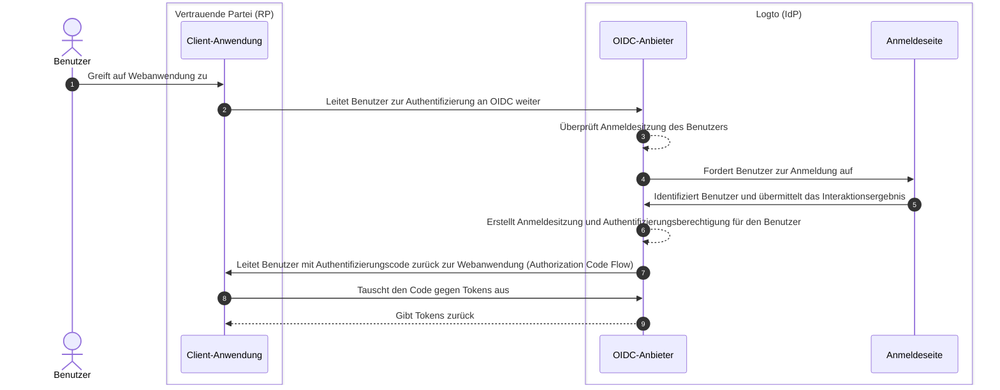

# Abmelden

Der Abmeldeprozess in Logto (als OIDC-basierter Identitätsanbieter) ist ein vielschichtiges Konzept, da sowohl die zentralisierte Anmeldesitzung, die von Logto verwaltet wird, als auch der verteilte Authentifizierungsstatus, der von den Client-Anwendungen verwaltet wird, beteiligt sind.

## Anmeldesitzung \{#sign-in-session}

Um den Abmeldeprozess besser zu verstehen, ist es wichtig, zunächst zu verstehen, wie Benutzersitzungen und deren Authentifizierungsstatus in Logto verwaltet werden.



1. Der Benutzer greift auf die Webanwendung (RP) zu.
2. Die Client-Anwendung leitet den Benutzer zu Logto (IdP) zur [Authentifizierung (Authentication)](https://auth.wiki/authentication) weiter.
3. Der OIDC-Anbieter prüft den Status der Anmeldesitzung des Benutzers. Falls keine Sitzung existiert oder die Sitzung abgelaufen ist, wird der Benutzer zur Anmeldung aufgefordert.
4. Der Benutzer interagiert mit der Anmeldeseite, um sich zu authentifizieren.
5. Nach erfolgreicher Anmeldung erstellt Logto eine neue Sitzung für den Benutzer und leitet mit einem Autorisierungscode zurück zur Client-Anwendung.
6. Der OIDC-Anbieter erstellt eine neue Anmeldesitzung und Authentifizierungsberechtigung für den Benutzer.
7. Der OIDC-Anbieter leitet den Benutzer mit einem Authentifizierungscode ([Authorization Code Flow](https://auth.wiki/authorization-code-flow)) zurück zum Client.
8. Der Client erhält den Authentifizierungscode und tauscht ihn gegen Tokens aus, um Benutzerinformationen zu erhalten.
9. Tokens werden an die Client-Anwendung ausgegeben.

## Komponenten \{#components}

### Zentralisierte Anmeldesitzung, verwaltet von Logto \{#centralized-sign-in-session-managed-by-logto}

Im obigen Ablauf wird die zentralisierte Anmeldesitzung von Logto verwaltet. Die Sitzung wird erstellt, wenn sich der Benutzer erfolgreich anmeldet, und zerstört, wenn sich der Benutzer abmeldet. Die Sitzung wird ebenfalls zerstört, wenn die Sitzung des Benutzers abläuft.

Die Logto-Anmeldesitzung wird mit Session-Cookies verwaltet. Das Session-Cookie wird gesetzt, wenn sich der Benutzer anmeldet. Alle Authentifizierungsanfragen werden gegen das Session-Cookie validiert. Ist das Session-Cookie vorhanden und gültig, wird der Benutzer automatisch authentifiziert und direkt mit dem Autorisierungscode zur Client-Anwendung weitergeleitet. Andernfalls wird der Benutzer zur Anmeldung aufgefordert.

1. Geteiltes Logto-Session-Cookie  
   Für einen Benutzer, der sich von demselben User-Agent (z. B. Browser) bei mehreren Client-Anwendungen anmeldet, gibt es ein geteiltes Session-Cookie unter der Logto-Domain. Das bedeutet, dass sich der Benutzer nur einmal anmelden muss und automatisch für andere Client-Anwendungen authentifiziert wird.

   ```mermaid
    flowchart TD
    subgraph Benutzer [User Agent A]
      U[Benutzer]

      subgraph Layer1 [Client-Domain A]
        A[Client-Anwendung A]
      end

      subgraph Layer1 [Client-Domain B]
        B[Client-Anwendung B]
      end

      subgraph Layer2 [Logto-Domain]
          C{{Logto-Anmeldesitzung?}}
          D[Anmeldeseite]
      end
    end

    U --> |Anmelden| A
    A --> |Weiterleitung zu Logto| C
    U --> |Anmelden| B
    B --> |Weiterleitung zu Logto| C
    C --> |Nein| D
    D --> |Sitzung erstellen| C
   ```

2. Isoliertes Logto-Session-Cookie  
   Für einen Benutzer, der sich von verschiedenen Geräten oder Browsern bei unterschiedlichen Client-Anwendungen anmeldet, gibt es isolierte Session-Cookies unter der Logto-Domain. Das bedeutet, dass sich der Benutzer für jede Client-Anwendung separat anmelden muss.

   ```mermaid
    flowchart TD
    U[Benutzer]

    subgraph DeviceA [User Agent A]
      subgraph Layer1 [Client-Domain A]
        A[Client-Anwendung A]
      end

      subgraph Layer2 [Logto-Domain]
          C{{Logto-Anmeldesitzung?}}
          D[Anmeldeseite]
      end
    end

    subgraph DeviceB [User Agent B]
      subgraph Layer3 [Client-Domain B]
        B[Client-Anwendung B]
      end

      subgraph Layer4 [Logto-Domain]
          E{{Logto-Anmeldesitzung?}}
          F[Anmeldeseite]
      end
    end

    U --> |Anmelden| A
    A --> |Weiterleitung zu Logto| C
    U --> |Anmelden| B
    B --> |Weiterleitung zu Logto| E
    C --> |Nein| D
    E --> |Nein| F
    D --> |Sitzung erstellen| C
    F --> |Sitzung erstellen| E
   ```

## Verteilter Authentifizierungsstatus, verwaltet von den Client-Anwendungen \{#distributed-authentication-status-managed-by-the-client-applications}

Jede Client-Anwendung verwaltet ihren eigenen Authentifizierungsstatus. Egal ob Native-, SPA- oder Webanwendung – alle haben ihre eigene Methode, den Authentifizierungsstatus des Benutzers zu verwalten.

Nach erfolgreicher Anmeldung kann die Client-Anwendung ein [ID-Token](https://auth.wiki/id-token) und ein [Zugangstoken (Access token)](https://auth.wiki/access-token) erhalten. Die Client-Anwendung kann das ID-Token verwenden, um die Identität des Benutzers zu bestimmen, und das Zugangstoken, um auf die Ressourcen des Benutzers zuzugreifen. Der Authentifizierungsstatus des Benutzers wird durch die Ablaufzeit des Zugangstokens repräsentiert.

- Native- und SPA-Anwendungen:  
  Die Client-Anwendung muss diese Tokens sicher speichern und verwalten, um den Authentifizierungsstatus des Benutzers aufrechtzuerhalten. Zum Beispiel können die Tokens im Local Storage oder Session Storage gespeichert und beim Abmelden gelöscht werden.
- Webanwendungen:  
  Webanwendungen, wie sie mit Frameworks wie Next.js gebaut werden, verwalten oft ihre eigene Sitzung für angemeldete Benutzer zusätzlich zu den von Logto ausgegebenen Tokens. Nach der Anmeldung und dem Empfang der Tokens von Logto kann die Webanwendung die Tokens clientseitig wie SPA-Anwendungen speichern oder serverseitig speichern und die Sitzung mit Cookies oder anderen Mechanismen verwalten.

## Abmeldemechanismen \{#sign-out-mechanisms}

### Tokens und lokale Sitzung auf Client-Seite löschen \{#clear-tokens-and-local-session-at-the-client-side}

Auf der Client-Seite beinhaltet eine einfache Abmeldung das Löschen der lokalen Sitzung und das Entfernen der Tokens (ID-Token, Zugangstoken, Auffrischungstoken) aus dem Local Storage oder Session Storage. Dies führt zu einer reinen Client-seitigen Abmeldung, bei der die zentralisierte Sitzung bestehen bleibt. Benutzer, die sich auf diese Weise abmelden, können möglicherweise weiterhin auf andere Anwendungen unter derselben Autorisierungsserver-Sitzung zugreifen, bis die zentralisierte Sitzung abläuft oder aktiv zerstört wird.

### Anmeldesitzung bei Logto löschen \{#clear-sign-in-session-at-logto}

Um den Benutzer explizit abzumelden und die Sitzung bei Logto zu löschen, muss die Client-Anwendung den Benutzer zum **End-Session-Endpunkt** von Logto weiterleiten.

Z. B. `https://{your-logto-domain}/oidc/session/end`

Der **End-Session-Endpunkt** ist ein standardisierter OIDC-Endpunkt, der es der Client-Anwendung ermöglicht, dem Autorisierungsserver mitzuteilen, dass sich der Benutzer abgemeldet hat. Der Endpunkt löscht die zentralisierte Anmeldesitzung bei Logto.

Sobald die Sitzung gelöscht ist, erfordern alle nachfolgenden Autorisierungsanfragen, dass sich der Benutzer erneut anmeldet.

Wenn eine **Post-Logout-Redirect-URI** angegeben wird, wird der Benutzer nach dem Löschen der Sitzung zur angegebenen URI weitergeleitet. Andernfalls wird der Benutzer auf die Standard-Post-Logout-Seite von Logto weitergeleitet.

## Föderierte Abmeldung: Back-Channel-Logout \{#federated-sign-out-back-channel-logout}

Für ein konsistenteres Abmeldemanagement unterstützt Logto [Back-Channel-Logout](https://openid.net/specs/openid-connect-backchannel-1_0-final.html). Back-Channel-Logout ist ein Mechanismus, der es Logto ermöglicht, alle Client-Anwendungen unter derselben Anmeldesitzung zu benachrichtigen, wenn sich der Benutzer abmeldet.

Dies ist besonders nützlich in Szenarien, in denen sich der Benutzer von einer Client-Anwendung abmeldet und erwartet, dass er auch bei allen anderen Client-Anwendungen unter derselben Logto-Anmeldesitzung abgemeldet wird.

Um Back-Channel-Logout für deine Client-Anwendungen zu aktivieren, gehe auf die Anwendungsdetailseite im Logto-Dashboard und registriere eine Back-Channel-Logout-URI. Logto sendet ein Logout-Token an alle registrierten URIs, wenn der Benutzer eine Abmeldeanfrage von einer beliebigen Client-Anwendung auslöst.

Wenn deine Client-Anwendung erfordert, dass die Anmeldesitzung im Logout-Token enthalten ist, aktiviere die Einstellung `Is session required` in der Back-Channel-Logout-Konfiguration. Ein `sid`-Anspruch wird dann im Logout-Token enthalten sein, um die Anmeldesitzung des Benutzers bei Logto zu identifizieren.

1. Der Benutzer initiiert eine Abmeldeanfrage von einer Client-Anwendung.
2. Logto erhält die End-Session-Anfrage, generiert ein Logout-Token und sendet das Logout-Token an alle registrierten Back-Channel-Logout-URIs.
3. Jede Client-Anwendung empfängt das Logout-Token und führt Abmeldeaktionen durch.

Abmeldeaktionen für jede Client-Anwendung beim Empfang des Logout-Tokens:

- Das Logout-Token validieren.
- Die lokale Sitzung löschen und Tokens aus Local Storage oder Session Storage entfernen.

## Abmeldemethoden in Logto SDKs \{#sign-out-methods-in-logto-sdks}

Wenn du Logto mit deiner Client-Anwendung über die Logto-SDKs integrierst:

- Für SPA- und Webanwendungen löscht die Methode `client.signOut()` den lokalen Token-Speicher und leitet den Benutzer zum End-Session-Endpunkt von Logto weiter. Du kannst eine **Post-Logout-Redirect-URI** angeben, um den Benutzer nach dem Löschen der Sitzung weiterzuleiten.
- Für native Anwendungen (einschließlich hybrider Apps wie **React Native** und **Flutter**) wird nur der lokale Token-Speicher gelöscht. Das liegt daran, dass in nativen Anwendungen der Anmeldeprozess über eine sessionlose Webview abgewickelt wird. Es werden keine Session-Cookies im nativen Browser gespeichert, daher muss die Anmeldesitzung bei Logto nicht gelöscht werden. Jede Authentifizierungsanfrage ist eine eigenständige Anfrage, die keine Session-Cookies überträgt.

:::note
Für native Anwendungen, die keine sessionlose Webview unterstützen oder die `emphasized`-Einstellungen nicht erkennen (Android-App mit **React Native** oder **Flutter** SDK), kannst du den Benutzer zwingen, sich erneut anzumelden, indem du den Parameter `prompt=login` in der Autorisierungsanfrage übergibst.
:::

## Erzwinge erneute Authentifizierung bei jedem Zugriff \{#enforce-re-authentication-on-every-access}

In Hochsicherheits-Szenarien – wie der Überprüfung der Identität eines Benutzers vor sensiblen Aktionen – möchtest du möglicherweise verlangen, dass sich der Benutzer bei jedem Zugriff erneut authentifiziert. Um dieses Verhalten zu erzwingen, füge `prompt=login` in deine Authentifizierungsanfrage ein.

Das Setzen von `prompt=login` zwingt Logto dazu, immer die Anmeldeseite anzuzeigen, unabhängig davon, ob der Benutzer eine aktive Sitzung hat oder sich kürzlich angemeldet hat. Dies umgeht das Single Sign-On (SSO)-Verhalten und stellt sicher, dass der Benutzer jedes Mal zur Eingabe seiner Zugangsdaten aufgefordert wird.

Wenn deine App den Scope offline_access (um ein Auffrischungstoken zu erhalten) anfordert, verlangt die OpenID Connect-Spezifikation, dass du auch `prompt=consent` einschließt.  
In den meisten Fällen, um sowohl die erneute Authentifizierung zu erzwingen als auch die Ausgabe eines Auffrischungstokens sicherzustellen, setze:

```
prompt=login consent
```

Dies garantiert, dass der Benutzer erneut authentifiziert wird und ausdrücklich dem Offline-Zugriff zustimmt.

## FAQs \{#faqs}

<details>
  <summary>

### Ich erhalte keine Back-Channel-Logout-Benachrichtigungen. \{#im-not-receiving-the-back-channel-logout-notifications}

</summary>

- Stelle sicher, dass die Back-Channel-Logout-URI korrekt im Logto-Dashboard registriert ist.
- Stelle sicher, dass deine Client-Anwendung eine gültige aktive Anmeldesitzung hat und es sich um dieselbe Sitzung handelt, die die Abmeldeanfrage initiiert hat.

</details>

## Verwandte Ressourcen \{#related-resources}

<Url href="https://blog.logto.io/oidc-back-channel-logout/">
  OIDC Back-Channel-Logout verstehen.
</Url>
