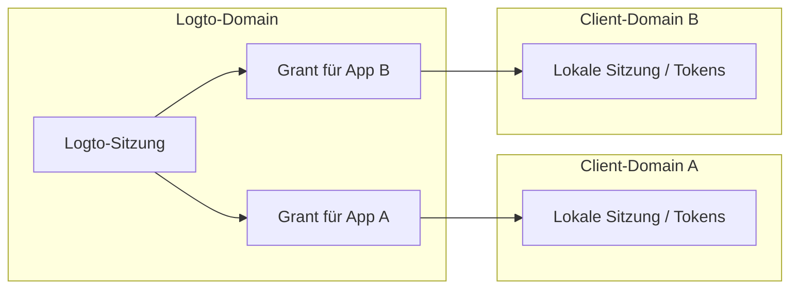
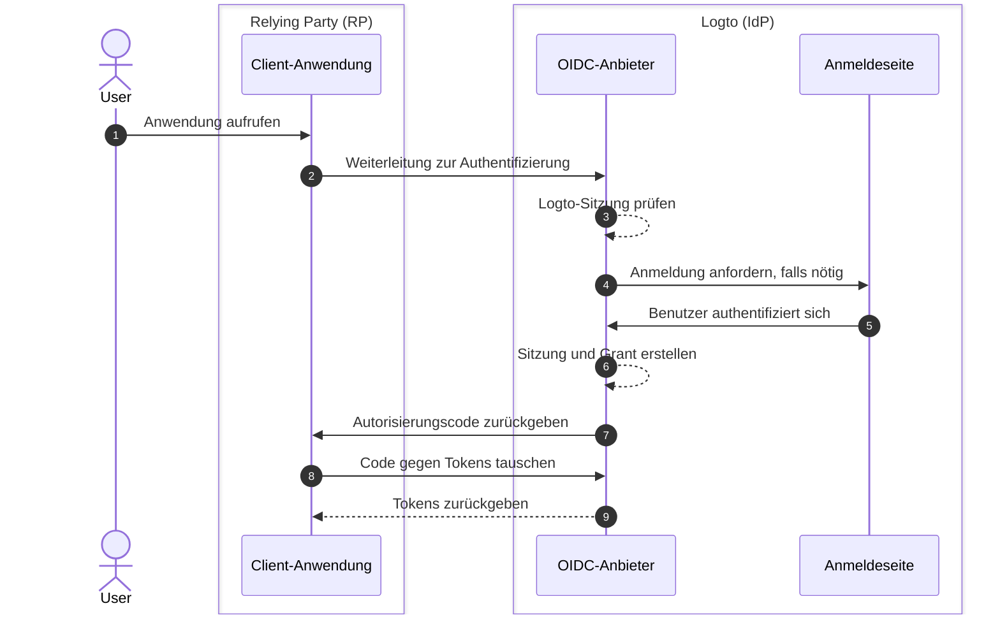
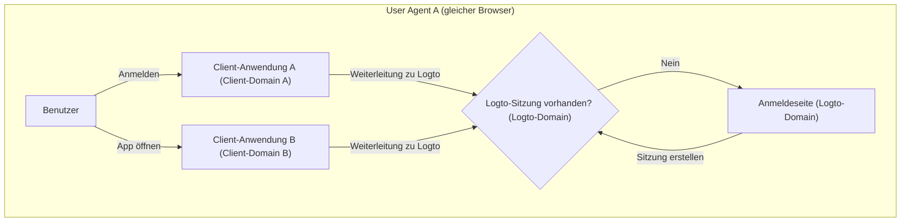
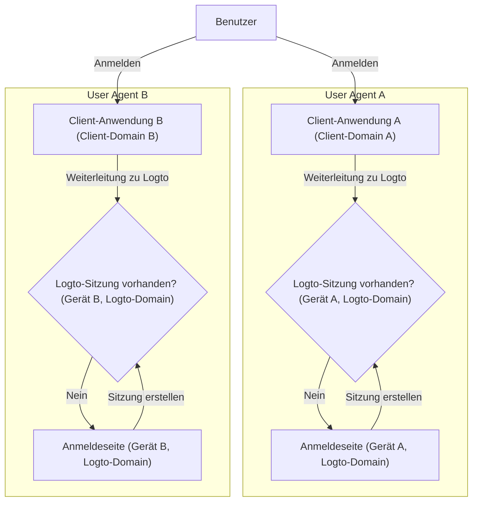
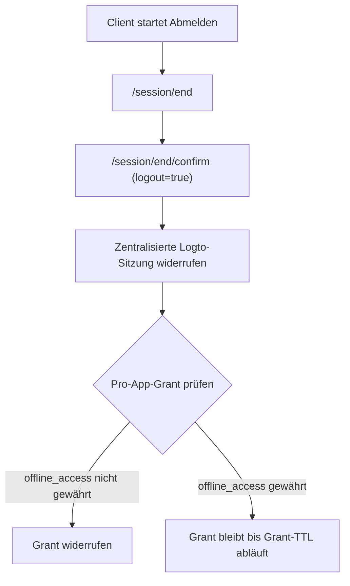

# Abmelden

Das Abmelden in Logto (als OIDC-Identitätsanbieter) umfasst sowohl:

- Eine **zentralisierte Logto-Sitzung** (Browser-Cookie unter der Logto-Domain) als auch
- **Verteilten clientseitigen Auth-Status** (Tokens und lokale App-Sitzung in jeder App).

Um das Abmeldeverhalten zu verstehen, hilft es, diese beiden Ebenen zu trennen und dann zu sehen, wie **Grants** sie verbinden.

## Zentrale Konzepte \{#core-concepts}

### Was ist eine Logto-Sitzung? \{#what-is-a-logto-session}

Eine Logto-Sitzung ist der zentralisierte Anmeldestatus, der von Logto verwaltet wird. Sie wird nach erfolgreicher Authentifizierung erstellt und durch Cookies unter der Logto-Domain repräsentiert.

Wenn das Sitzungs-Cookie gültig ist, kann der Benutzer stillschweigend (SSO) über mehrere Apps hinweg authentifiziert werden, die demselben Logto-Tenant vertrauen.

Wenn keine gültige Sitzung existiert, zeigt Logto die Anmeldeseite an.

### Was sind Grants? \{#what-are-grants}

Ein **Grant** repräsentiert den Autorisierungsstatus für eine bestimmte Kombination aus Benutzer + Client-Anwendung.

- Eine Logto-Sitzung kann Grants für mehrere Client-Apps haben.
- Ein Grant ist das, womit ausgegebene Tokens verknüpft sind.
- In dieser Dokumentation wird **Grant** als die bereichsübergreifende Autorisierungseinheit verwendet.

### Wie hängen Sitzung, Grants und Client-Auth-Status zusammen? \{#how-session-grants-and-client-auth-status-relate}


```mermaid
flowchart LR
  subgraph Logto [Logto-Domain]
    S[Logto-Sitzung]
    G1[Grant für App A]
    G2[Grant für App B]
  end

  subgraph AppA [Client-Domain A]
    A[Lokale Sitzung / Tokens]
  end

  subgraph AppB [Client-Domain B]
    B[Lokale Sitzung / Tokens]
  end

  S --> G1
  S --> G2
  G1 --> A
  G2 --> B
```

- **Logto-Sitzung** steuert die zentralisierte SSO-Erfahrung.
- **Lokale Client-Sitzung / Tokens** steuern, ob jede App den Benutzer aktuell als angemeldet behandelt.
- **Grants** verbinden diese beiden Welten, indem sie den app-spezifischen Autorisierungsstatus repräsentieren.

## Sign-in Rückblick (warum Sign-out mehrschichtig ist) \{#sign-in-recap-why-sign-out-is-multi-layered}


```mermaid
sequenceDiagram
  autonumber
  actor User

  box Relying Party (RP)
    participant Client as Client-Anwendung
  end

  box Logto (IdP)
    participant OIDC as OIDC-Anbieter
    participant SignIn as Anmeldeseite
  end

  User ->> Client: Anwendung aufrufen
  Client ->> OIDC: Weiterleitung zur Authentifizierung
  OIDC -->> OIDC: Logto-Sitzung prüfen
  OIDC ->> SignIn: Anmeldung anfordern, falls nötig
  SignIn ->> OIDC: Benutzer authentifiziert sich
  OIDC -->> OIDC: Sitzung und Grant erstellen
  OIDC ->> Client: Autorisierungscode zurückgeben
  Client ->> OIDC: Code gegen Tokens tauschen
  OIDC -->> Client: Tokens zurückgeben
```

## Sitzungs-Topologie über Apps / Geräte hinweg \{#session-topology-across-apps-devices}

### Geteiltes Sitzungs-Cookie (gleicher Browser / User Agent) \{#shared-session-cookie-same-browser-user-agent}

Wenn sich ein Benutzer in mehreren Apps im selben Browser anmeldet, können diese Apps dasselbe Logto-Sitzungs-Cookie wiederverwenden und SSO-Verhalten gilt.


```mermaid
flowchart TD
  U[Benutzer]
  A["Client-Anwendung A (Client-Domain A)"]
  B["Client-Anwendung B (Client-Domain B)"]
  C{"Logto-Sitzung vorhanden? (Logto-Domain)"}
  D["Anmeldeseite (Logto-Domain)"]

  subgraph UA["User Agent A (gleicher Browser)"]
    U
    A
    B
    C
    D
  end

  U -->|Anmelden| A
  A -->|Weiterleitung zu Logto| C
  U -->|App öffnen| B
  B -->|Weiterleitung zu Logto| C
  C -->|Nein| D
  D -->|Sitzung erstellen| C
```

### Isolierte Sitzungs-Cookies (verschiedene Geräte / Browser) \{#isolated-session-cookies-different-devices-browsers}

Verschiedene Browser / Geräte halten unterschiedliche Logto-Cookies, daher ist der Anmeldestatus isoliert.


```mermaid
flowchart TD
  U[Benutzer]
  A["Client-Anwendung A (Client-Domain A)"]
  C{"Logto-Sitzung vorhanden? (Gerät A, Logto-Domain)"}
  D["Anmeldeseite (Gerät A, Logto-Domain)"]

  subgraph DeviceA["User Agent A"]
    A
    C
    D
  end

  B["Client-Anwendung B (Client-Domain B)"]
  E{"Logto-Sitzung vorhanden? (Gerät B, Logto-Domain)"}
  F["Anmeldeseite (Gerät B, Logto-Domain)"]

  subgraph DeviceB["User Agent B"]
    B
    E
    F
  end

  U -->|Anmelden| A
  A -->|Weiterleitung zu Logto| C
  U -->|Anmelden| B
  B -->|Weiterleitung zu Logto| E
  C -->|Nein| D
  E -->|Nein| F
  D -->|Sitzung erstellen| C
  F -->|Sitzung erstellen| E
```

## Abmelde-Mechanismen \{#sign-out-mechanisms}

### 1) Nur clientseitiges Abmelden \{#1-client-side-only-sign-out}

Die Client-App löscht ihre eigene lokale Sitzung und Tokens (ID- / Zugangstoken / Auffrischungstoken). Dadurch wird der Benutzer nur aus dem lokalen Zustand dieser App abgemeldet.

- Die Logto-Sitzung kann weiterhin aktiv sein.
- Andere Apps unter derselben Logto-Sitzung können weiterhin SSO nutzen.

### 2) End-Sitzung bei Logto (globales Abmelden in aktueller Logto-Implementierung) \{#2-end-session-at-logto-global-sign-out-in-current-logto-implementation}

Um die zentralisierte Logto-Sitzung zu löschen, leitet die App den Benutzer zum End-Sitzung-Endpunkt weiter, zum Beispiel:

`https://{your-logto-domain}/oidc/session/end`

Im aktuellen Logto SDK-Verhalten:

1. `signOut()` leitet zu `/session/end` weiter.
2. Dann geht es zu `/session/end/confirm`.
3. Das Standard-Bestätigungsformular sendet automatisch `logout=true`.

Dadurch wird das aktuelle SDK-Abmelden als **globales Abmelden** behandelt.

### Was passiert beim globalen Abmelden \{#what-happens-during-global-sign-out}


```mermaid
flowchart TD
  A["Client startet Abmelden"] --> B["/session/end"]
  B --> C["/session/end/confirm (logout=true)"]
  C --> D["Zentralisierte Logto-Sitzung widerrufen"]
  D --> E{"Pro-App-Grant prüfen"}
  E -->|"offline_access nicht gewährt"| F["Grant widerrufen"]
  E -->|"offline_access gewährt"| G["Grant bleibt bis Grant-TTL abläuft"]
```

Beim globalen Abmelden gilt:

- Die zentralisierte Logto-Sitzung wird widerrufen.
- Zugehörige App-Grants werden je nach Autorisierungsstatus der App behandelt:
  - Wenn `offline_access` **nicht** gewährt ist, werden die zugehörigen Grants widerrufen.
  - Wenn `offline_access` **gewährt** ist, werden Grants durch End-Sitzung nicht widerrufen.
- Bei `offline_access`-Fällen bleiben Auffrischungstoken und Grants bis zum Ablauf des Grants gültig.

## Grant-Lebensdauer und Auswirkung von `offline_access` \{#grant-lifetime-and-offline-access-impact}

- Die Standard-Grant-TTL in Logto beträgt **180 Tage**.
- Wenn `offline_access` gewährt ist, wird der App-Grant durch End-Sitzung standardmäßig nicht widerrufen.
- Die mit diesem Grant verknüpfte Auffrischungstoken-Kette kann weiterlaufen, bis der Grant abläuft (oder explizit widerrufen wird).

## Föderiertes Abmelden: Back-Channel-Logout \{#federated-sign-out-back-channel-logout}

Für bereichsübergreifende Konsistenz unterstützt Logto [Back-Channel-Logout](https://openid.net/specs/openid-connect-backchannel-1_0-final.html).

Wenn sich ein Benutzer von einer App abmeldet, kann Logto alle Apps, die an derselben Sitzung teilnehmen, benachrichtigen, indem ein Logout-Token an jede registrierte Back-Channel-Logout-URI gesendet wird.

Wenn `Is session required` in den Back-Channel-Einstellungen der App aktiviert ist, enthält das Logout-Token `sid`, um die Logto-Sitzung zu identifizieren.

Typischer Ablauf:

1. Benutzer startet Abmelden in einer App.
2. Logto verarbeitet End-Sitzung und sendet Logout-Token(s) an registrierte Back-Channel-Logout-URI(s).
3. Jede App validiert das Logout-Token und löscht ihre eigene lokale Sitzung / Tokens.

## Abmelde-Methoden in Logto SDKs \{#sign-out-methods-in-logto-sdks}

- **SPA und Web**: `client.signOut()` löscht den lokalen Token-Speicher und leitet zum Logto-End-Sitzung-Endpunkt weiter. Du kannst eine Post-Logout-Redirect-URI angeben.
- **Native (einschließlich React Native / Flutter)**: löscht in der Regel nur den lokalen Token-Speicher. Sitzungslose Webviews bedeuten, dass kein persistentes Logto-Browser-Cookie gelöscht werden muss.

:::note
Für native Anwendungen, die keine sitzungslose Webview unterstützen oder die `emphasized` Einstellungen nicht erkennen (Android-App mit **React Native** oder **Flutter** SDK), kannst du den Benutzer zwingen, sich erneut anzumelden, indem du den Parameter `prompt=login` in der Authentifizierungsanfrage übergibst.
:::

## Erzwinge Re-Authentifizierung bei jedem Zugriff \{#enforce-re-authentication-on-every-access}

Für sicherheitskritische Aktionen füge `prompt=login` in Auth-Anfragen ein, um SSO zu umgehen und jedes Mal die Eingabe der Zugangsdaten zu erzwingen.

Wenn du `offline_access` anforderst (um Auffrischungstoken zu erhalten), füge auch `consent`, `prompt=login consent` hinzu.

Typische kombinierte Einstellung:

```txt
prompt=login consent
```

## FAQs \{#faqs}

<details>
  <summary>

### Ich erhalte keine Back-Channel-Logout-Benachrichtigungen. \{#im-not-receiving-the-back-channel-logout-notifications}

</summary>

- Stelle sicher, dass die Back-Channel-Logout-URI korrekt im Logto-Dashboard registriert ist.
- Stelle sicher, dass deine App einen aktiven Anmeldestatus für denselben Benutzer / Sitzungs-Kontext hat.

</details>

## Verwandte Ressourcen \{#related-resources}

<Url href="https://blog.logto.io/oidc-back-channel-logout/">
  OIDC Back-Channel-Logout verstehen.
</Url>
