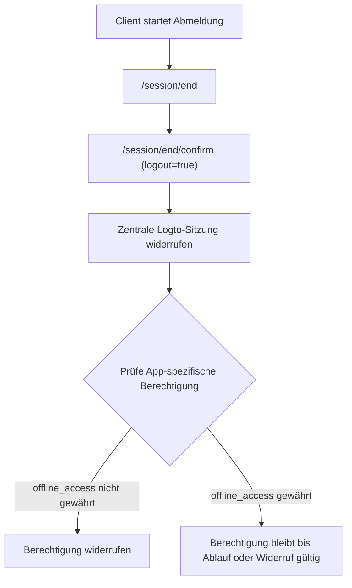

# Abmelden

Das Abmelden in Logto umfasst zwei Ebenen:

- **Logto-Sitzungsabmeldung**: Beendet die zentrale Anmeldesitzung unter der Logto-Domain.
- **App-Abmeldung**: Löscht den lokalen Sitzungsstatus und die Tokens in deiner Client-Anwendung.

Um besser zu verstehen, wie Sitzungen in Logto funktionieren, siehe [Sitzungen](/sessions).

## Abmelde-Mechanismen \{#sign-out-mechanisms}

### 1) Nur clientseitige Abmeldung \{#1-client-side-only-sign-out}

Die Client-App löscht ihren eigenen lokalen Sitzungsstatus und Tokens (ID- / Zugangs- / Auffrischungstokens). Dadurch wird der Benutzer nur aus dem lokalen Zustand dieser App abgemeldet.

- Die Logto-Sitzung kann weiterhin aktiv sein.
- Andere Apps unter derselben Logto-Sitzung können weiterhin SSO nutzen.

### 2) Sitzung bei Logto beenden (globale Abmeldung in aktueller Logto-Implementierung) \{#2-end-session-at-logto-global-sign-out-in-current-logto-implementation}

Um die zentrale Logto-Sitzung zu löschen, leitet die App den Benutzer zum End-Session-Endpunkt weiter, zum Beispiel:

`https://{your-logto-domain}/oidc/session/end`

Im aktuellen Verhalten des Logto SDK:

1. `signOut()` leitet zu `/session/end` weiter.
2. Dann geht es zu `/session/end/confirm`.
3. Das Standard-Bestätigungsformular sendet automatisch `logout=true`.

Dadurch wird die aktuelle SDK-Abmeldung als **globale Abmeldung** behandelt.

:::note

- **Globale Abmeldung**: Widerruft die zentrale Logto-Sitzung.

:::

### Was passiert während der globalen Abmeldung \{#what-happens-during-global-sign-out}


```mermaid
flowchart TD
  A["Client startet Abmeldung"] --> B["/session/end"]
  B --> C["/session/end/confirm (logout=true)"]
  C --> D["Zentrale Logto-Sitzung widerrufen"]
  D --> E{"Prüfe App-spezifische Berechtigung"}
  E -->|"offline_access nicht gewährt"| F["Berechtigung widerrufen"]
  E -->|"offline_access gewährt"| G["Berechtigung bleibt bis Ablauf oder Widerruf gültig"]
```

Während der globalen Abmeldung:

- Die zentrale Logto-Sitzung wird widerrufen.
- Zugehörige App-Berechtigungen werden je nach Autorisierungsstatus der App behandelt:
  - Wenn `offline_access` **nicht** gewährt ist, werden die zugehörigen Berechtigungen widerrufen.
  - Wenn `offline_access` **gewährt** ist, werden die Berechtigungen durch die End-Session nicht widerrufen.
- Bei `offline_access`-Fällen bleiben Auffrischungstokens und Berechtigungen gültig, bis entweder die Berechtigung abläuft, das Auffrischungstoken abläuft oder ein expliziter Widerruf erfolgt.

## Lebensdauer der Berechtigung und Auswirkung von `offline_access` \{#grant-lifetime-and-offline-access-impact}

- Die Standard-Lebensdauer (TTL) einer Logto-Berechtigung beträgt **180 Tage**.
- Wenn `offline_access` gewährt ist, wird die App-Berechtigung durch die End-Session standardmäßig nicht widerrufen.
- Auffrischungstoken-Ketten, die mit dieser Berechtigung verbunden sind, können weiter genutzt werden, bis die Berechtigung abläuft, das Auffrischungstoken abläuft oder die Berechtigung explizit widerrufen wird.
- Bei Single Page Applications (SPAs) verlängert die Auffrischung des Tokens nicht die TTL des Auffrischungstokens, sodass das Auffrischungstoken möglicherweise vor der Berechtigung abläuft.

## Föderierte Abmeldung: Back-Channel-Logout \{#federated-sign-out-back-channel-logout}

Für konsistentes Verhalten über mehrere Apps hinweg unterstützt Logto [Back-Channel-Logout](https://openid.net/specs/openid-connect-backchannel-1_0-final.html).

Wenn sich ein Benutzer von einer App abmeldet, kann Logto alle Apps, die an derselben Sitzung teilnehmen, benachrichtigen, indem ein Logout-Token an die registrierte Back-Channel-Logout-URI jeder App gesendet wird.

Wenn `Is session required` in den Back-Channel-Einstellungen der App aktiviert ist, enthält das Logout-Token `sid`, um die Logto-Sitzung zu identifizieren.

Typischer Ablauf:

1. Benutzer startet die Abmeldung in einer App.
2. Logto verarbeitet die End-Session und sendet Logout-Token(s) an die registrierte(n) Back-Channel-Logout-URI(s).
3. Jede App validiert das Logout-Token und löscht ihren eigenen lokalen Sitzungsstatus / Tokens.

## Abmeldemethoden in Logto SDKs \{#sign-out-methods-in-logto-sdks}

- **SPA und Web**: `client.signOut()` löscht den lokalen Token-Speicher und leitet zum Logto-End-Session-Endpunkt weiter. Du kannst eine Redirect-URI nach dem Logout angeben.
- **Native (einschließlich React Native / Flutter)**: löscht in der Regel nur den lokalen Token-Speicher. Sitzungslose Webviews bedeuten, dass kein persistentes Logto-Browser-Cookie gelöscht werden muss.

:::note
Für native Anwendungen, die keine sitzungslose Webview unterstützen oder die `emphasized`-Einstellungen nicht erkennen (Android-App mit **React Native** oder **Flutter** SDK), kannst du den Benutzer zwingen, sich erneut anzumelden, indem du den Parameter `prompt=login` in der Autorisierungsanfrage übergibst.
:::

## Erzwinge erneute Authentifizierung bei jedem Zugriff \{#enforce-re-authentication-on-every-access}

Für besonders sicherheitsrelevante Aktionen füge `prompt=login` in die Authentifizierungsanfrage ein, um SSO zu umgehen und die erneute Eingabe der Zugangsdaten zu erzwingen.

Wenn du `offline_access` anforderst (um Auffrischungstokens zu erhalten), füge außerdem `consent`, `prompt=login consent` hinzu.

Typische kombinierte Einstellung:

```txt
prompt=login consent
```

## FAQs \{#faqs}

<details>
  <summary>

### Ich erhalte keine Back-Channel-Logout-Benachrichtigungen. \{#im-not-receiving-the-back-channel-logout-notifications}

</summary>

- Stelle sicher, dass die Back-Channel-Logout-URI korrekt im Logto-Dashboard registriert ist.
- Stelle sicher, dass deine App einen aktiven Anmeldestatus für denselben Benutzer- / Sitzungs-Kontext hat.

</details>

## Verwandte Ressourcen \{#related-resources}

<Url href="https://blog.logto.io/oidc-back-channel-logout/">
  OIDC Back-Channel-Logout verstehen.
</Url>
