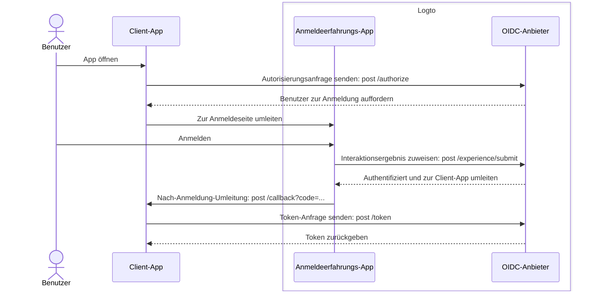
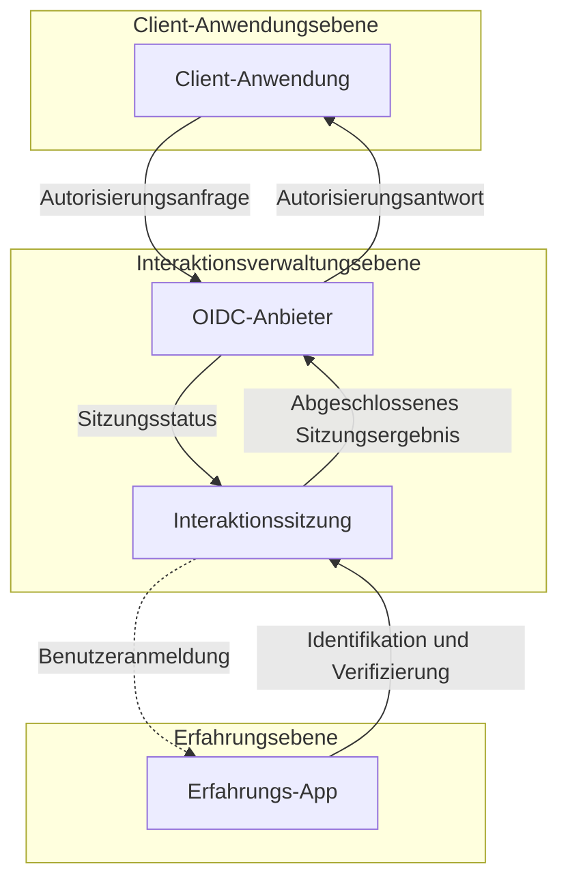

# Registrierung und Anmeldung

Registrierung und Anmeldung sind der Kernprozess für Endbenutzer, um sich zu authentifizieren und den Zugriff auf Client-Anwendungen zu autorisieren. Als zentralisierte, OIDC-basierte [CIAM](https://auth.wiki/iam)-Plattform bietet Logto eine universelle Anmeldungserfahrung für Benutzer über mehrere Client-Anwendungen und Plattformen hinweg.

## Benutzerfluss \{#user-flow}

In einem typischen [OIDC](https://auth.wiki/openid-connect)-Authentifizierungsfluss beginnt der Benutzer mit dem Öffnen der Client-App. Die Client-App sendet eine [Autorisierungsanfrage](https://auth.wiki/authorization-request) an den Logto OIDC-Anbieter. Wenn der Benutzer keine aktive Sitzung hat, wird Logto den Benutzer zur von Logto gehosteten Anmeldeseite weiterleiten. Der Benutzer interagiert mit der Logto-Erfahrungsseite und wird durch die Bereitstellung der erforderlichen Anmeldeinformationen authentifiziert. Sobald der Benutzer erfolgreich authentifiziert ist, leitet Logto den Benutzer mit dem [Autorisierungscode](https://auth.wiki/authorization-code-flow#how-does-authorization-code-flow-work) zurück zur Client-App. Die Client-App sendet dann eine [Token-Anfrage](https://auth.wiki/token-request) an den Logto OIDC-Anbieter mit dem Autorisierungscode, um die Tokens zu erhalten.

## Benutzerinteraktion \{#user-interaction}

Eine **Interaktionssitzung** wird für jede Benutzerinteraktion erstellt, wenn eine Client-App eine Autorisierungsanfrage initiiert. Diese Sitzung zentralisiert den Benutzerinteraktionsstatus über mehrere Client-Anwendungen hinweg und ermöglicht es Logto, eine kohärente Anmeldungserfahrung zu bieten. Wenn Benutzer zwischen Client-Apps wechseln, bleibt die Interaktionssitzung konsistent, behält den Authentifizierungsstatus des Benutzers bei und reduziert die Notwendigkeit für wiederholte Anmeldungen über Plattformen hinweg. Sobald die **Interaktionssitzung** eingerichtet ist, wird der Benutzer aufgefordert, sich bei Logto anzumelden.

Die **Erfahrungs-App** in Logto ist eine dedizierte, gehostete Anwendung, die die Anmeldungserfahrung erleichtert. Wenn Benutzer sich authentifizieren müssen, werden sie zur **Erfahrungs-App** geleitet, wo sie ihre Anmeldung abschließen und mit Logto interagieren. Die **Erfahrungs-App** nutzt die aktive Interaktionssitzung, um den Fortschritt der Benutzerinteraktion zu verfolgen und zu unterstützen.

Um diesen Benutzerweg zu unterstützen und zu steuern, stellt Logto eine Reihe von sitzungsbasierten **Experience APIs** bereit. Diese APIs ermöglichen es der **Erfahrungs-App**, eine Vielzahl von Benutzeridentifikations- und Verifizierungsmethoden zu handhaben, indem sie den Status der Interaktionssitzung in Echtzeit aktualisieren und darauf zugreifen.

Sobald der Benutzer alle Validierungs- und Verifizierungsanforderungen erfüllt hat, endet die Interaktionssitzung mit einer Ergebniseinreichung beim OIDC-Anbieter, wo der Benutzer vollständig authentifiziert ist und seine Zustimmung gegeben hat, wodurch der sichere Anmeldeprozess abgeschlossen wird.

## Anpassung der Anmeldungserfahrung \{#sign-in-experience-customization}

Logto bietet eine flexible und anpassbare Benutzererfahrung für verschiedene geschäftliche Anforderungen, einschließlich benutzerdefiniertem Branding, Benutzeroberfläche und Benutzerinteraktionsflüssen. Die **Erfahrungs-App** kann an die Branding- und Sicherheitsanforderungen der Client-Anwendung angepasst werden.

Lerne mehr über die Einrichtung der Anmeldungserfahrung [Setup](/end-user-flows/sign-up-and-sign-in/sign-up) und [Anpassung](/customization) in Logto.

## FAQs \{#faqs}

  

### Pro-App-Anmeldungserfahrungsmethode oder Branding \{#per-app-sign-in-experience-method-or-branding}

Für Anwendungen, die unterschiedliche Anmeldungserfahrungen oder Branding erfordern, unterstützt Logto auch
eine Anpassung pro App. Sieh dir die [Anwendungseinstellungen](/customization/match-your-brand/#app-specific-branding) für weitere Details an.

  

### E-Mail-Domain / IP-Adresse / Region einschränken \{#limit-email-domain--ip-address--region}

Für attributbasierte Zugangskontrolle, zum Beispiel die Einschränkung der Anmeldung basierend auf der E-Mail-Domain, IP-Adresse oder Region, kannst du die [Benutzerdefinierten Token-Ansprüche](/developers/custom-token-claims/) in Logto verwenden, um Autorisierungsanfragen basierend auf den Benutzerattributen abzulehnen oder zuzulassen.

  

### Headless API für Anmeldung und Registrierung \{#headless-api-for-sign-in-and-sign-up}

Derzeit bietet Logto keine Headless API für Anmeldung und Registrierung. Du kannst jedoch deine eigene Anmelde-UI mit der [Bring your own UI](/customization/bring-your-ui/) verwenden, um die Anmeldung und Registrierungserfahrung anzupassen.

## Verwandte Ressourcen \{#related-resources}

<Url href="https://blog.logto.io/deprecated-ropc-grant-type">
  Warum du den Resource Owner Password Credentials (ROPC) Grant-Typ verwerfen solltest
</Url>

<Url href="https://blog.logto.io/implicit-flow-is-dead">
  Warum du den Autorisierungscodefluss anstelle des impliziten Flusses verwenden solltest?
</Url>

<Url href="https://blog.logto.io/token-based-authentication-vs-session-based-authentication">
  Vergleich von tokenbasierter Authentifizierung und sitzungsbasierter Authentifizierung
</Url>
