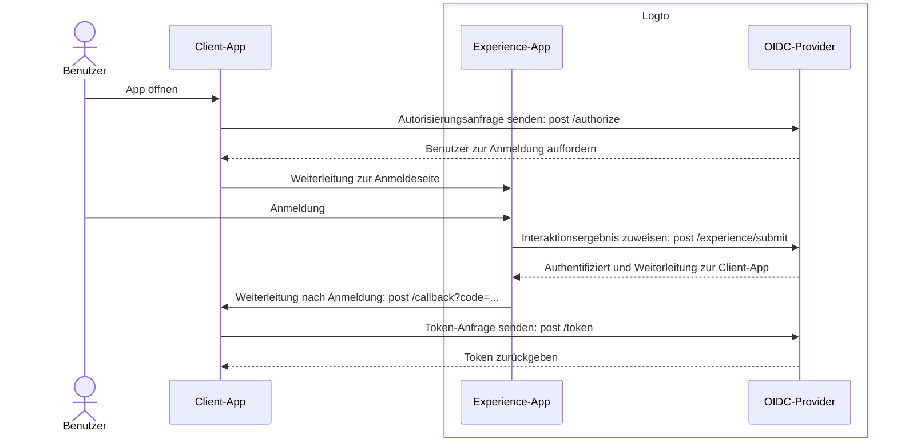
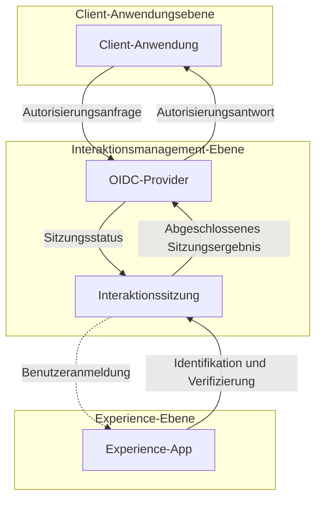

# Registrierung und Anmeldung

Registrierung und Anmeldung sind der zentrale Interaktionsprozess für Endbenutzer, um sich zu authentifizieren und den Zugriff auf Client-Anwendungen zu autorisieren. Als zentralisierte, OIDC-basierte [CIAM](https://auth.wiki/iam)-Plattform bietet Logto eine universelle Anmeldeerfahrung für Benutzer über mehrere Client-Anwendungen und Plattformen hinweg.

## Benutzerfluss \{#user-flow}

In einem typischen [OIDC](https://auth.wiki/openid-connect) Authentifizierungsfluss beginnt der Benutzer damit, die Client-App zu öffnen. Die Client-App sendet eine [Autorisierungsanfrage (Authorization request)](https://auth.wiki/authorization-request) an den Logto OIDC-Provider. Wenn der Benutzer keine aktive Sitzung hat, fordert Logto den Benutzer auf, zur von Logto gehosteten Anmeldeseite zu wechseln. Der Benutzer interagiert mit der Logto-Erfahrungsseite und wird durch die Angabe der erforderlichen Anmeldedaten authentifiziert. Sobald der Benutzer erfolgreich authentifiziert ist, leitet Logto den Benutzer mit dem [Autorisierungscode (Authorization code)](https://auth.wiki/authorization-code-flow#how-does-authorization-code-flow-work) zurück zur Client-App. Die Client-App sendet dann eine [Token-Anfrage (Token request)](https://auth.wiki/token-request) an den Logto OIDC-Provider mit dem Autorisierungscode, um die Tokens zu erhalten.

```mermaid
sequenceDiagram
  actor user as Benutzer
  participant client as Client-App

  box Logto
    participant experience as Experience-App
    participant oidc as OIDC-Provider
  end

  user ->> client: App öffnen
  client ->> oidc: Autorisierungsanfrage senden: post /authorize
  oidc -->> client: Benutzer zur Anmeldung auffordern
  client ->> experience: Weiterleitung zur Anmeldeseite
  user ->> experience: Anmeldung
  experience ->> oidc: Interaktionsergebnis zuweisen: post /experience/submit
  oidc -->> experience: Authentifiziert und Weiterleitung zur Client-App
  experience ->> client: Weiterleitung nach Anmeldung: post /callback?code=...
  client ->> oidc: Token-Anfrage senden: post /token
  oidc -->> client: Token zurückgeben
```

## Benutzerinteraktion \{#user-interaction}

Für jede Benutzerinteraktion wird eine **Interaktionssitzung (interaction session)** erstellt, wenn eine Client-App eine Autorisierungsanfrage initiiert. Diese Sitzung zentralisiert den Status der Benutzerinteraktion über mehrere Client-Anwendungen hinweg und ermöglicht es Logto, eine konsistente Anmeldeerfahrung zu bieten. Während Benutzer zwischen Client-Apps wechseln, bleibt die Interaktionssitzung konsistent, wodurch der Authentifizierungsstatus des Benutzers erhalten bleibt und wiederholte Anmeldungen über Plattformen hinweg reduziert werden. Sobald die **Interaktionssitzung** eingerichtet ist, wird der Benutzer zur Anmeldung bei Logto aufgefordert.

Die **Experience-App** in Logto ist eine dedizierte, gehostete Anwendung, die die Anmeldeerfahrung ermöglicht. Wenn Benutzer sich authentifizieren müssen, werden sie zur **Experience-App** weitergeleitet, wo sie ihre Anmeldung abschließen und mit Logto interagieren. Die **Experience-App** nutzt die aktive Interaktionssitzung, um den Fortschritt der Benutzerinteraktion zu verfolgen und zu unterstützen.

Um diese Benutzerreise zu unterstützen und zu steuern, stellt Logto eine Reihe von sitzungsbasierten **Experience APIs** bereit. Diese APIs ermöglichen es der **Experience-App**, eine Vielzahl von Methoden zur Benutzeridentifikation und -verifizierung zu handhaben, indem sie den Status der Interaktionssitzung in Echtzeit aktualisiert und abruft.

Sobald der Benutzer alle Validierungs- und Verifizierungsanforderungen erfüllt hat, wird die Interaktionssitzung mit einer Ergebniseinreichung an den OIDC-Provider abgeschlossen, wobei der Benutzer vollständig authentifiziert ist und seine Zustimmung erteilt hat, wodurch der sichere Anmeldeprozess abgeschlossen wird.

```mermaid
flowchart TD
  %% Ebenen
  subgraph Layer1 [Client-Anwendungsebene]
      A[Client-Anwendung]
  end

  subgraph Layer2 [Interaktionsmanagement-Ebene]
      B[OIDC-Provider]
      C[Interaktionssitzung]
  end

  subgraph Layer3 [Experience-Ebene]
      D[Experience-App]
  end

  %% Verbindungen
  A --> |Autorisierungsanfrage| B
  B --> |Sitzungsstatus| C
  C -.-> |Benutzeranmeldung| D
  D --> |Identifikation und Verifizierung| C
  C --> |Abgeschlossenes Sitzungsergebnis| B
  B --> |Autorisierungsantwort| A
```

:::note
Experience-Seiten sind so konzipiert, dass sie nur über den Authentifizierungsfluss aufgerufen werden können. Um zu verhindern, dass Suchmaschinen diese Seiten indexieren, und um direkten Zugriff zu vermeiden, fügt Logto automatisch `<meta name="robots" content="noindex, nofollow" />` zur Experience-HTML-Seite hinzu.
:::

## Anpassung der Anmeldeerfahrung \{#sign-in-experience-customization}

Logto bietet eine flexible und anpassbare Benutzererfahrung für verschiedene geschäftliche Anforderungen, einschließlich individuellem Branding, Benutzeroberfläche und Benutzerinteraktionsflüssen. Die **Experience-App** kann an die Branding- und Sicherheitsanforderungen der Client-Anwendung angepasst werden.

Lerne mehr über die Einrichtung der Anmeldeerfahrung [Setup](/end-user-flows/sign-up-and-sign-in/sign-up) und [Anpassung](/customization) in Logto.

## Häufige Anmeldemethoden \{#common-sign-in-methods}

Abhängig von deinen Produktanforderungen kannst du mehrere Anmeldemethoden in derselben von Logto gehosteten Experience kombinieren:

- [E-Mail / Telefon / Benutzername Anmeldung](/end-user-flows/sign-up-and-sign-in/sign-in): Klassische Identifier-First-Anmeldung mit Passwort oder Verifizierungscode.
- [Soziale Anmeldung](/end-user-flows/sign-up-and-sign-in/social-sign-in): Anmeldung mit Google, GitHub, Facebook und anderen sozialen Anbietern.
- [Passkey-Anmeldung](/end-user-flows/sign-up-and-sign-in/passkey-sign-in): Passwortlose Anmeldung mit WebAuthn-Passkeys, einschließlich Direktbutton, Identifier-First-Passkey-Verifizierung und Autofill-basierter Anmeldung.

## FAQs \{#faqs}

  

### Anmeldemethode oder Branding pro App \{#per-app-sign-in-experience-method-or-branding}

Für Anwendungen oder Organisationen, die unterschiedliche **Anmelde-UIs** benötigen, unterstützt Logto [App-spezifisches Branding](/customization/match-your-brand#app-specific-branding) und [Organisationsspezifisches Branding](/customization/match-your-brand#organization-specific-branding).

Wenn du je nach Benutzertyp oder Seite verschiedene **Anmeldemethoden** anbieten möchtest, verwende einfach [Authentifizierungsparameter](/end-user-flows/authentication-parameters) (z. B. `first_screen` und `direct_sign_in`), um Benutzer auf eine Endbenutzerseite mit maßgeschneiderten Anmeldeoptionen zu leiten.

  

### E-Mail-Domain / IP-Adresse / Region einschränken \{#limit-email-domain--ip-address--region}

Für attributbasierte Zugangskontrolle, z. B. um die Anmeldung basierend auf E-Mail-Domain, IP-Adresse oder Region zu beschränken, kannst du die Funktion [Benutzerdefinierte Token-Ansprüche (Custom token claims)](/developers/custom-token-claims/) in Logto verwenden, um Autorisierungsanfragen basierend auf den Attributen des Benutzers abzulehnen oder zuzulassen.

  

### Headless API für Anmeldung und Registrierung \{#headless-api-for-sign-in-and-sign-up}

Derzeit bietet Logto keine Headless API für Anmeldung und Registrierung. Du kannst jedoch deine eigene Anmelde-UI mit [Bring your own UI](/customization/bring-your-ui/) verwenden, um die Anmelde- und Registrierungserfahrung anzupassen.

## Verwandte Ressourcen \{#related-resources}

<Url href="https://blog.logto.io/deprecated-ropc-grant-type">
  Warum du den Resource Owner Password Credentials (ROPC) Grant-Typ nicht mehr verwenden solltest
</Url>

<Url href="https://blog.logto.io/implicit-flow-is-dead">
  Warum du den Autorisierungscode-Fluss anstelle des Implicit-Flows verwenden solltest
</Url>

<Url href="https://blog.logto.io/token-based-authentication-vs-session-based-authentication">
  Vergleich von tokenbasierter Authentifizierung und sitzungsbasierter Authentifizierung
</Url>
