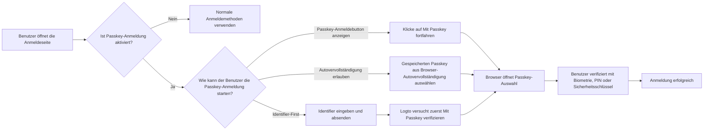
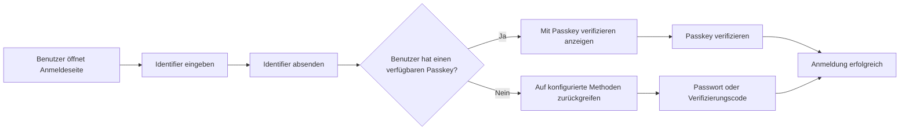
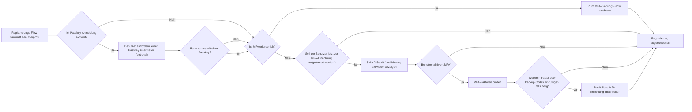

# Passkey-Anmeldung

Die Passkey-Anmeldung ermöglicht es Benutzern, sich direkt mit einem WebAuthn-Zugang während der Anmeldung zu authentifizieren, ohne zuerst ein Passwort oder einen Verifizierungscode eingeben zu müssen. In Logto ist das für die Passkey-Anmeldung verwendete Zugangsdatenmodell dasselbe WebAuthn-Zugangsdatenmodell wie bei der Multi-Faktor-Authentifizierung (MFA), sodass die Anmelde- und MFA-Erfahrungen eng miteinander verbunden sind.

Dieses Dokument erklärt, wie die Passkey-Anmeldung in der integrierten Anmeldeerfahrung von Logto funktioniert, wie die verschiedenen Einstiegspfade für Endbenutzer aussehen und wie sie mit MFA interagiert.

## Wie die Passkey-Anmeldung funktioniert \{#how-passkey-sign-in-works}

Um die Passkey-Anmeldung zu nutzen, musst du sie zunächst in der <CloudLink to="/sign-in-experience/sign-up-and-sign-in">Anmeldeerfahrung</CloudLink>-Konfiguration aktivieren. Nach der Aktivierung kann Logto die Passkey-Anmeldung auf der Anmeldeseite auf bis zu drei Arten anbieten:

- Eine eigene Schaltfläche `Mit Passkey fortfahren` auf dem ersten Anmeldebildschirm.
- Ein Identifier-First-Flow, der nach Eingabe der E-Mail, Telefonnummer oder des Benutzernamens des Benutzers `Mit Passkey verifizieren` versucht.
- Browser-Autovervollständigung im Identifier-Eingabefeld, sodass der Browser direkt vom aktuellen Gerät aus verfügbare Passkeys vorschlagen kann.

Auf hoher Ebene sieht die Erfahrung so aus:

## Drei Passkey-Anmeldepfade \{#three-passkey-sign-in-paths}

### 1. "Mit Passkey fortfahren"-Button aktiviert anzeigen \{#1-show-continue-with-passkey-button-enabled}

Wenn die Option `Mit Passkey fortfahren-Button anzeigen` aktiviert ist, zeigt die Anmeldeseite unten auf dem ersten Bildschirm einen `Mit Passkey fortfahren`-Button an.

Der Benutzerfluss ist:

1. Die Anmeldeseite öffnen.
2. Auf `Mit Passkey fortfahren` klicken.
3. Einen Passkey aus dem Browser- oder Betriebssystem-Prompt auswählen.
4. Biometrische, PIN- oder Hardware-Schlüssel-Verifizierung abschließen.
5. Erfolgreich anmelden.

Dies ist der direkteste Pfad. Er eignet sich am besten für Benutzer, die bereits wissen, dass sie einen gespeicherten Passkey haben und ein einstufiges Login-Erlebnis wünschen.

### 2. "Mit Passkey fortfahren"-Button deaktiviert anzeigen \{#2-show-continue-with-passkey-button-disabled}

Wenn die Option `Mit Passkey fortfahren-Button anzeigen` deaktiviert ist, wechselt Logto auf dem ersten Bildschirm zu einer Identifier-First-Erfahrung. Die Seite fragt zunächst nur nach dem Identifier des Benutzers.

Nachdem der Benutzer den Identifier abgesendet hat:

1. Logto prüft, ob die Passkey-Anmeldung aktiviert ist und ob der identifizierte Benutzer einen verwendbaren Passkey hat.
2. Wenn ein Passkey verfügbar ist, startet Logto zuerst den "Mit Passkey verifizieren"-Flow.
3. Der Benutzer kann die Passkey-Verifizierung abschließen und sich sofort anmelden.
4. Wenn kein Passkey verfügbar ist oder der Benutzer eine andere Methode bevorzugt, greift Logto auf andere konfigurierte Verifizierungsmethoden zurück.

Die verfügbaren Fallback-Methoden hängen von der aktuellen Konfiguration der Anmeldeerfahrung des Tenants ab. Beispielsweise kann der Benutzer je nach aktivierten Faktoren für diesen Identifier zu Passwort, E-Mail-Verifizierungscode oder Telefon-Verifizierungscode wechseln.

### 3. Prompting und Autovervollständigung erlauben \{#3-allow-prompting-and-autofill}

Wenn die Option `Prompting und Autovervollständigung erlauben` aktiviert ist, können kompatible Browser die zuvor gespeicherten Passkeys direkt im Identifier-Eingabefeld anzeigen.

Der Benutzerfluss ist:

1. Das Identifier-Eingabefeld auf der Anmeldeseite fokussieren.
2. Der Browser schlägt gespeicherte Passkeys für die aktuelle Origin vor.
3. Der Benutzer wählt einen Passkey aus der Autovervollständigungs-Liste aus.
4. Der Browser fordert den Benutzer zur Verifizierung mit Biometrie, PIN oder Hardware-Schlüssel auf.
5. Anmeldung erfolgreich.

Dieser Flow ist besonders nützlich auf Geräten, auf denen Passkeys bereits plattformseitig synchronisiert sind, da sich Benutzer anmelden können, ohne manuell auf eine zweite Seite zu wechseln oder einen speziellen Passkey-Button zu tippen.

## Registrierungs- und Passkey-Bindungs-Flow \{#sign-up-and-passkey-binding-flow}

Die Passkey-Anmeldung ist nicht nur ein Einstiegspunkt für die Anmeldung. Sie beeinflusst auch, was nach der Registrierung passiert, da dasselbe WebAuthn-Zugangsdatenmodell später sowohl für die Anmeldung als auch für MFA wiederverwendet werden kann.

Nachdem der Benutzer die regulären Registrierungsschritte abgeschlossen hat, kann Logto den Benutzer auffordern, einen Passkey zu erstellen. Diese Aufforderung ist für Endbenutzer optional, aber sobald sie den Passkey erstellen, hängt der nächste Schritt von der MFA-Richtlinie des Tenants und dem eigenen MFA-Status des Benutzers ab.

Die Hauptlogik ist:

## Beziehung zwischen Passkey-Anmeldung und MFA \{#relationship-between-passkey-sign-in-and-mfa}

### Passkey-Anmeldung überspringt MFA-Verifizierung automatisch \{#passkey-sign-in-automatically-skips-mfa-verification}

Ein für die Passkey-Anmeldung verwendeter Passkey basiert auf einem WebAuthn-Zugang, und dieser Zugang wird auch als WebAuthn-MFA-Faktor behandelt. Daher sind Passkey-Anmeldung und WebAuthn-MFA aus Sicht der Zugangsdaten im Wesentlichen gleichwertig.

Das führt zu zwei wichtigen Verhaltensweisen:

- Wenn sich der Benutzer mit einem Passkey anmeldet, überspringt Logto den separaten MFA-Verifizierungsschritt.
- Wenn der Benutzer bereits zuvor WebAuthn als MFA-Faktor verknüpft hatte, bevor die Passkey-Anmeldung aktiviert wurde, kann dieser bestehende Zugang als Passkey-Anmeldezugang des Benutzers wiederverwendet werden. Der Benutzer muss ihn nicht erneut binden.

Mit anderen Worten: Eine erfolgreiche Passkey-Anmeldung erfüllt bereits die WebAuthn-basierte Identitätsprüfung, die sonst während der MFA erforderlich wäre.

### Das Binden eines Passkeys erzwingt nicht automatisch MFA für benutzerverwaltete Tenants \{#binding-a-passkey-does-not-automatically-force-mfa-for-user-controlled-tenants}

Für Benutzer in Tenants, in denen MFA nicht verpflichtend ist, aktiviert das Binden eines Passkeys während der Registrierung oder Kontoeinrichtung nicht automatisch MFA für das Konto.

Stattdessen zeigt Logto nach der Erstellung des Passkeys eine Bestätigungsseite mit dem Titel "2-Schritt-Verifizierung aktivieren" an.

Auf dieser Seite kann der Benutzer:

- Auf die Schaltfläche "2-Schritt-Verifizierung aktivieren" klicken, um MFA explizit zu aktivieren und mit den nächsten Bindungsschritten fortzufahren.
- Die Aufforderung überspringen und den aktuellen Flow ohne Aktivierung von MFA abschließen.

Wenn der Benutzer sich entscheidet, MFA zu aktivieren, setzt Logto den normalen MFA-Einrichtungs-Flow fort und kann den Benutzer auffordern, je nach MFA-Konfiguration des Tenants weitere Faktoren zu binden. Wenn beispielsweise andere MFA-Faktoren für den Tenant aktiviert sind, kann Logto mit der Bindung eines weiteren Faktors oder Backup-Codes fortfahren.

### Was passiert, wenn die Passkey-Anmeldung später deaktiviert wird \{#what-happens-when-passkey-sign-in-is-disabled-later}

Wenn die Passkey-Anmeldung später deaktiviert wird, bleibt der zuvor gebundene Passkey weiterhin ein WebAuthn-Zugang. Das bedeutet, er kann weiterhin als MFA-Faktor verwendet werden, solange WebAuthn-MFA für den Tenant verfügbar bleibt.

Das Deaktivieren der Passkey-Anmeldung entfernt den Passkey als direkten Anmeldeeinstieg, macht aber den zugrundeliegenden WebAuthn-MFA-Zugang nicht ungültig.

## Einschränkungen und Kompatibilität \{#limitations-and-compatibility}

- Passkey-Anmeldung ist nicht für Enterprise SSO-Benutzer verfügbar.
- Passkey-Anmeldung ist abhängig von Browser- und Plattform-WebAuthn-Unterstützung.
- "Prompting und Autovervollständigung erlauben" funktioniert nur in Browsern und Umgebungen, die Passkey-Autovervollständigung / Conditional UI unterstützen.
- Passkeys sind origin-gebunden. Ein für eine Domain registrierter Passkey kann nicht auf einer anderen Domain verwendet werden.

## Fragen & Antworten \{#q-a}

  

### Erfordert die Passkey-Anmeldung weiterhin eine MFA-Verifizierung? \{#does-passkey-sign-in-still-require-mfa-verification}

  

Nein. Eine erfolgreiche Passkey-Anmeldung erfüllt bereits die WebAuthn-basierte Verifizierungsanforderung, sodass Logto den separaten MFA-Verifizierungsschritt überspringt.

  

### Kann ein für die Passkey-Anmeldung gebundener Passkey weiterhin als MFA-Faktor verwendet werden, nachdem die Passkey-Anmeldung deaktiviert wurde? \{#can-a-passkey-bound-for-passkey-sign-in-still-be-used-as-an-mfa-factor-after-passkey-sign-in-is-disabled}

  

Ja. Passkey-Anmeldung und WebAuthn-MFA basieren auf demselben zugrundeliegenden Zugangsdatenmodell. Wenn die Passkey-Anmeldung später deaktiviert wird, kann der gebundene Passkey weiterhin als WebAuthn-MFA-Faktor verwendet werden.

  

### Können Enterprise SSO-Benutzer die Passkey-Anmeldung nutzen? \{#can-enterprise-sso-users-use-passkey-sign-in}

  

Nein. Enterprise SSO-Benutzer sind nicht für die Passkey-Anmeldung berechtigt.

  

### Erfordert die Passkey-Anmeldung weiterhin CAPTCHA? \{#does-passkey-sign-in-still-require-captcha}

  

Nein. Die Passkey-Anmeldung selbst erfordert keinen zusätzlichen CAPTCHA-Schritt. CAPTCHA kann weiterhin für andere Anmeldeaktionen auf der Seite gelten, wie z. B. passwort- oder verifizierungscodebasierte Übermittlungen, jedoch nicht für den Passkey-Verifizierungs-Flow selbst.

