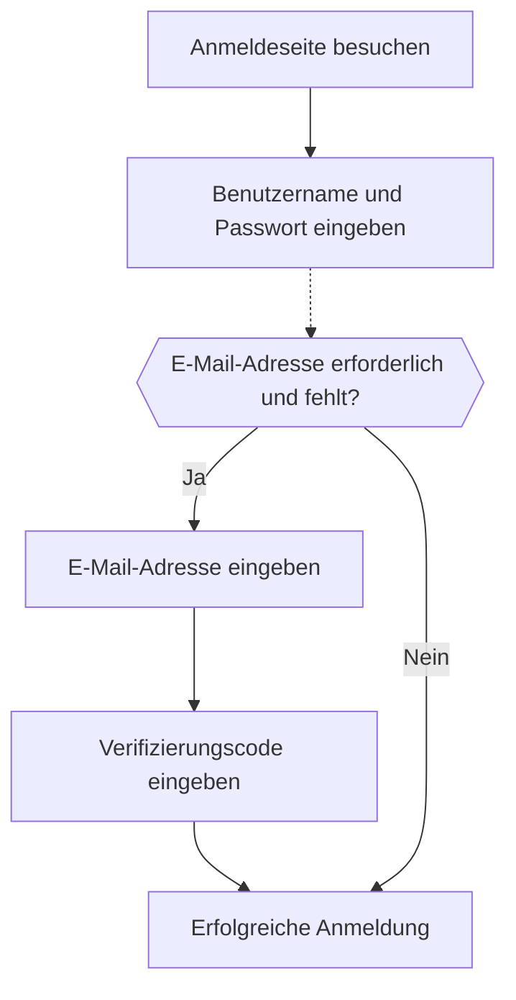

# Anmeldung mit E-Mail / Telefonnummer / Benutzername

## Den Identifier-Anmeldefluss konfigurieren \{#configure-the-identifier-sign-in-flow}

Wie bereits erwähnt, können verschiedene Identifikatortypen von Benutzern während des [Registrierungsprozesses](/end-user-flows/sign-up-and-sign-in/sign-up) oder bei der [direkten Kontoerstellung in Logto](/user-management/manage-users#add-users) erfasst werden. Zusätzlich können Benutzer weitere Informationen eingeben und vervollständigen, während sie das Produkt erkunden und nutzen. Diese Identifier können verwendet werden, um Benutzer im System von Logto eindeutig zu identifizieren und ihnen die Authentifizierung sowie die Anmeldung bei den mit Logto integrierten Anwendungen zu ermöglichen.

Egal, ob du die von Logto gehostete vorgefertigte Anmeldeseite verwendest oder planst, [deine eigene benutzerdefinierte Anmeldeoberfläche zu erstellen](/customization#custom-ui), musst du die verfügbaren Anmeldemethoden und Verifizierungseinstellungen für deine Endbenutzer konfigurieren.

## Identifier- und Authentifizierungseinstellungen festlegen \{#set-up-the-identifier-and-authentication-settings}

### 1. Unterstützte Anmelde-Identifier festlegen \{#1-set-the-supported-sign-in-identifiers}

Du kannst mehrere unterstützte Identifier aus der Dropdown-Liste als aktivierte Anmeldemethoden für Endbenutzer hinzufügen. Die verfügbaren Optionen sind:

- **Benutzername**
- **E-Mail-Adresse**
- **Telefonnummer**

Durch das Umordnen der Identifier änderst du die Reihenfolge, in der sie auf der Anmeldeseite angezeigt werden. Der erste Identifier ist die primäre Anmeldemethode für Benutzer.

### 2. Authentifizierungseinstellungen festlegen \{#2-set-the-authentication-settings}

Für jeden Anmelde-Identifier musst du mindestens einen effektiven Verifizierungsfaktor konfigurieren, um die Identität des Benutzers zu überprüfen. Es stehen zwei Faktoren zur Auswahl:

- **Passwort**: Verfügbar für alle Arten von Anmelde-Identifiern. Nach der Aktivierung müssen Benutzer ein Passwort angeben, um den Anmeldevorgang abzuschließen.
- **Verifizierungscode**: Nur verfügbar für **E-Mail-Adresse** und **Telefonnummer** Identifier. Nach der Aktivierung müssen Benutzer einen Verifizierungscode eingeben, der an ihre E-Mail-Adresse oder Telefonnummer gesendet wird, um den Anmeldevorgang abzuschließen.

Wenn beide Faktoren aktiviert sind, können Benutzer eine der beiden Methoden wählen, um den Anmeldevorgang abzuschließen. Du kannst die Faktoren auch umsortieren, um die Reihenfolge zu ändern, in der sie auf der Anmeldeseite angezeigt werden. Der erste Faktor wird als primäre Verifizierungsmethode für Benutzer verwendet und der zweite als alternative Option angezeigt.

## Benutzererlebnis beim Identifier-Anmeldefluss \{#identifier-sign-in-flow-user-experience}

Das Anmeldeerlebnis passt sich je nach gewähltem Identifier und verfügbaren Authentifizierungsfaktoren an.

- **Intelligente Eingabe für mehrere Identifier:**
  Wenn mehr als eine Identifier-Anmeldemethode aktiviert ist, erkennt die integrierte Anmeldeseite von Logto automatisch den vom Benutzer eingegebenen Identifikatortyp und zeigt die entsprechenden Verifizierungsoptionen an. Wenn beispielsweise sowohl **E-Mail-Adresse** als auch **Telefonnummer** aktiviert sind, erkennt die Anmeldeseite automatisch den vom Benutzer eingegebenen Identifikatortyp und zeigt die entsprechenden Verifizierungsoptionen an. Sie wechselt zu einem Telefonnummernformat mit Regionscode, wenn Zahlen hintereinander eingegeben werden, oder zu einem E-Mail-Format, wenn ein "@"-Symbol verwendet wird.
  - Die Ländervorwahl der Telefonnummer wird standardmäßig anhand der Browsersprache des Benutzers gesetzt; Benutzer können sie manuell ändern. Du kannst den [`ui_locales`](/end-user-flows/authentication-parameters/ui-locales) Parameter verwenden, um einen bestimmten Standard-Ländercode festzulegen. Siehe [Lokalisierte Sprachen](/customization/localized-languages#how-can-i-set-a-default-phone-number-country-code-for-the-sign-in-experience) für weitere Details.
- **Aktivierte Verifizierungsfaktoren:**
  - **Nur Passwort:** Sowohl das Identifier- als auch das Passwortfeld werden auf dem ersten Bildschirm angezeigt.
  - **Nur Verifizierungscode:** Das Identifierfeld erscheint auf dem ersten Bildschirm, gefolgt vom Verifizierungscodefeld auf dem zweiten Bildschirm.
  - **Passwort und Verifizierungscode:** Das Identifierfeld wird zunächst auf dem ersten Bildschirm eingegeben, gefolgt von Schritten zur Eingabe des Passworts oder Verifizierungscodes auf dem zweiten Bildschirm, je nach Verifizierungsreihenfolge. Ein Umschaltlink ermöglicht es Benutzern, zwischen den beiden Verifizierungsmethoden zu wechseln.

### Beispiele \{#examples}

  

### Beispiel 1: E-Mail-Adresse mit Passwortverifizierung \{#example-1-email-address-with-password-verification}

Füge die **E-Mail-Adresse** als Anmelde-Identifier hinzu und aktiviere den **Passwort**-Faktor zur Verifizierung.

  

### Beispiel 2: E-Mail/Telefon mit Passwort (primär) und Verifizierungscode (alternativ) aktiviert \{#example-2-emailphone-with-passwordprimary-and-verification-code-alternative-verification-enabled}

Füge sowohl **E-Mail-Adresse** als auch **Telefonnummer** als Anmelde-Identifier hinzu.
Aktiviere die Faktoren **Passwort** und **Verifizierungscode** für beide Identifier.

## Zusätzliche Benutzerprofile beim Anmelden erfassen \{#collect-additional-user-profile-on-sign-in}

Im Anmeldefluss von Logto kann ein Profil-Vervollständigungsprozess ausgelöst werden, wenn die Einstellungen für die Registrierungs-Identifier aktualisiert werden. Dies stellt sicher, dass alle Benutzer, einschließlich bestehender, alle neu erforderlichen Identifier angeben.

Wenn ein Entwickler einen neuen Identifier (wie eine E-Mail-Adresse) hinzufügt, wird dieser für alle Benutzer verpflichtend. Meldet sich ein zurückkehrender Benutzer mit einem bestehenden Identifier (z. B. einem Benutzernamen) an, wird er aufgefordert, den neuen Identifier anzugeben und zu verifizieren, falls dieser in seinem Profil fehlt. Erst nach Abschluss dieses Schritts erhält er Zugriff auf die Anwendung, was einen reibungslosen und konsistenten Übergang zu den aktualisierten Anforderungen gewährleistet.

Der Prozess im Überblick:

1. **Benutzername** wurde zuvor als Registrierungs-Identifier mit automatisch aktivierter **Passwort erstellen**-Einstellung festgelegt.
2. **E-Mail-Adresse** wird später als Registrierungs-Identifier festgelegt. Der **E-Mail-Adresse** Identifier wird automatisch als aktivierte Anmeldeoption hinzugefügt.
3. Ein zurückkehrender Benutzer meldet sich mit seinem Benutzernamen und Passwort an.
4. Der Benutzer wird nach dem ersten Anmeldeschritt aufgefordert, eine E-Mail-Adresse anzugeben und zu verifizieren.

Der gleiche Prozess gilt auch für die **Passwort erstellen**-Einstellungen bei der Registrierung. Wenn die **Passwort erstellen**-Einstellung im Registrierungsprozess neu aktiviert wird, wird der **Passwort**-Faktor automatisch für alle von dir gewählten Anmelde-Identifier aktiviert. Alle zurückkehrenden Benutzer ohne Passwort werden während des Anmeldevorgangs aufgefordert, eines zu erstellen.

:::note
Hinweis: Für benutzerdefinierte Anmeldeflüsse siehe die Funktion [Bring your UI](/customization/bring-your-ui/).
:::

## FAQs \{#faqs}

  

### Self-hosted Anmeldeerlebnis (eingebettete Anmeldung) \{#self-hosted-sign-in-experience-embedded-sign-in}

Logto unterstützt derzeit keine Headless-API für Anmeldung und Registrierung. Du kannst jedoch unsere [Bring your UI](/customization/bring-your-ui/) Funktion nutzen, um dein eigenes Anmeldeformular bei Logto hochzuladen. Wir unterstützen außerdem mehrere Anmeldeparameter, mit denen du das Anmeldeformular mit einem in deiner Anwendung erfassten Benutzer-Identifier vorausfüllen oder dich direkt mit einem Drittanbieter für soziale oder Enterprise SSO anmelden kannst. Mehr dazu unter [Authentifizierungsparameter](/end-user-flows/authentication-parameters/).

## Verwandte Ressourcen \{#related-resources}

<Url href="https://www.youtube.com/watch?v=64rBXpWbScc">
  E-Mail-Registrierungs- und Anmeldeerlebnis
</Url>

<Url href="https://www.youtube.com/watch?v=chQxCJX6e6w">
  Benutzername-Registrierungs- und Anmeldeerlebnis
</Url>
